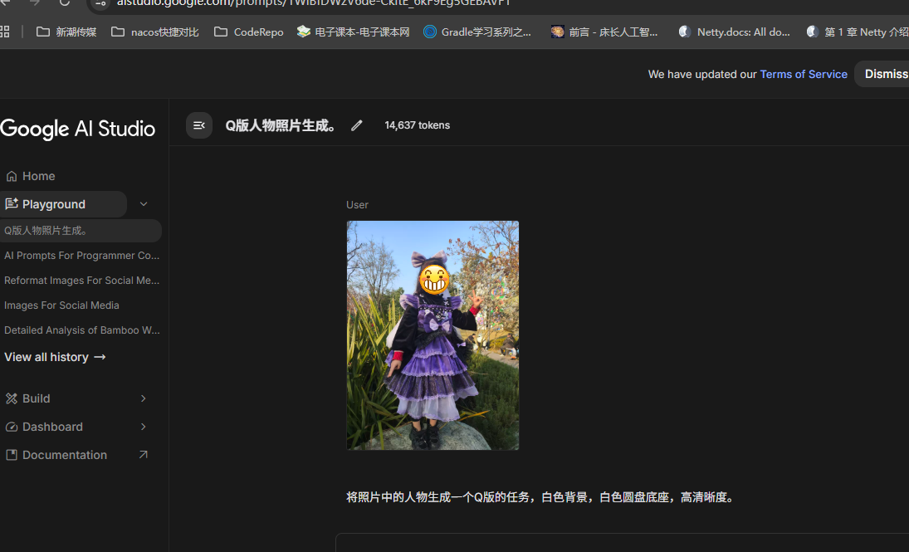
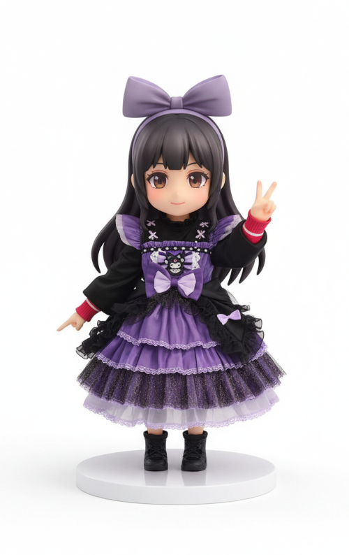
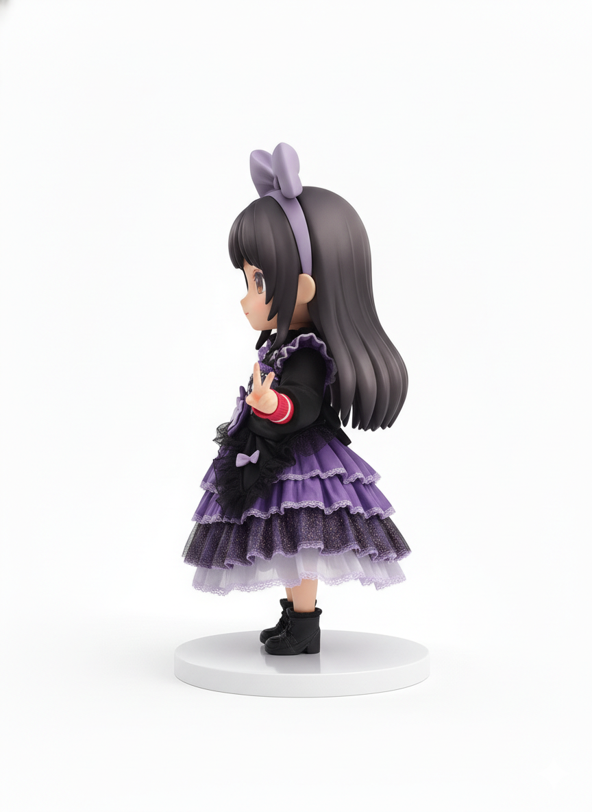
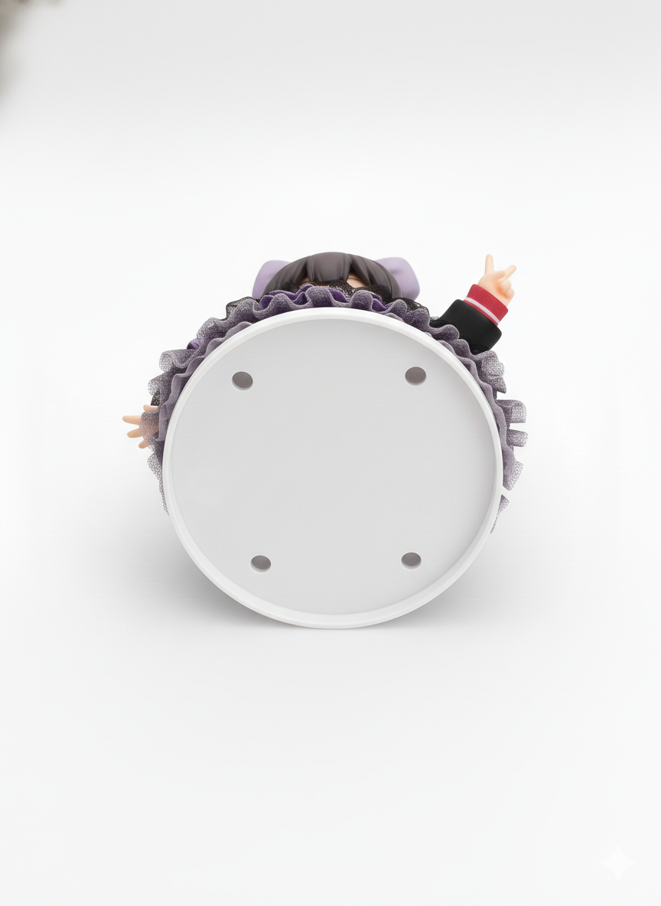
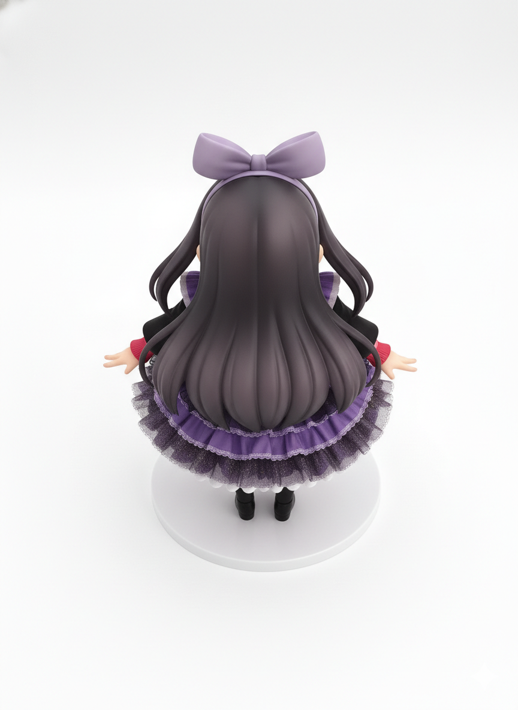
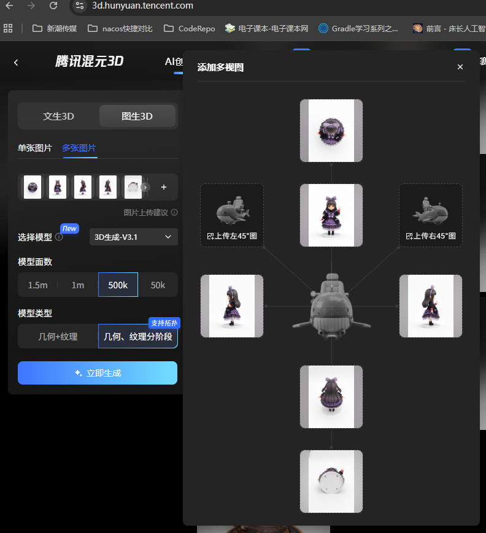
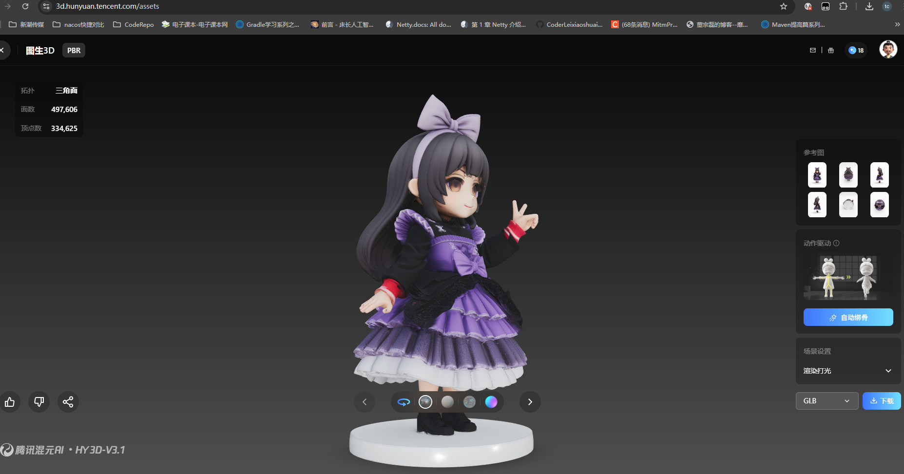

# 3D模型篇

## 真人Q版人物3D模型

使用Nano Banana将真人图片生成Q版多个视图的图片

### 生成Q版人物图片

#### 正视图

**ai提示词**

> 将照片中的人物生成一个Q版的人物，白色背景，白色圆盘底座。
>
> 正视图，相机正对物体正面，物体朝向镜头，无旋转，左右完全对称，居中构图，高清晰度

结果：

#### 左视图

**ai提示词**

> 左视图，
> 相机正对物体左侧，
> 物体向右旋转 90 度，
> 标准侧面轮廓，
> 无透视变形，
> 高清晰度。

####  右视图

**ai提示词**

> 右视图，
> 相机正对物体右侧，
> 物体向左旋转 90 度，
> 标准侧面轮廓，
> 无透视变形，
> 高清晰度。

####  后视图

**ai提示词**

> 后视图，
> 相机正对物体背面，
> 物体背对镜头，
> 无透视，
> 居中构图，
> 高清晰度。

####  顶视图

**ai提示词**

> 顶视图，
> 相机在物体正上方，
> 垂直向下拍摄，
> 正交视角，
> 无透视畸变，
> 高清晰度。

####  底视图

**ai提示词**

> 底视图，
> 相机在物体正下方，
> 垂直向上拍摄，
> 正交视角，
> 无透视畸变，
> 高清晰度。

####  后视图

**ai提示词**

> 后视图，
> 相机正对物体背面，
> 物体背对镜头，
> 无透视，
> 居中构图，
> 高清晰度。

### 生成3D模型

可以选择[腾讯混元3D](https://3d.hunyuan.tencent.com/)或者[tripo3d](https://studio.tripo3d.ai/)，或者Meshy，这里是用的腾讯的。

**得到模型：**

白模：

加了纹理的：

> 白模可以下载glb格式，加了纹理的可以下载很多格式GLB、OBJ、FBX、STL、USDZ、mp4、gif。