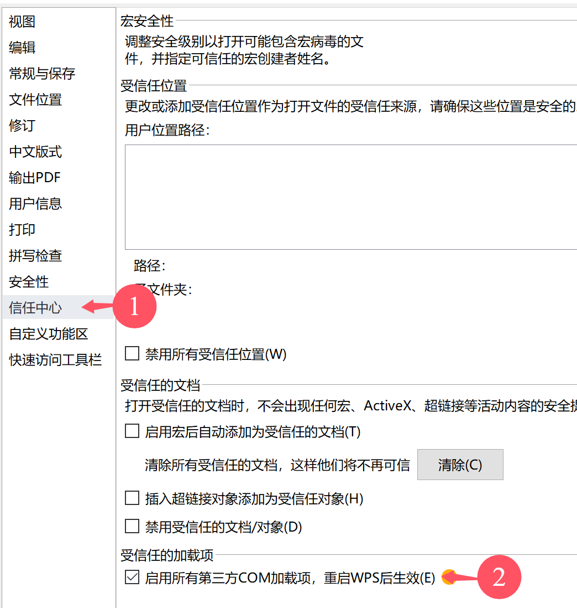
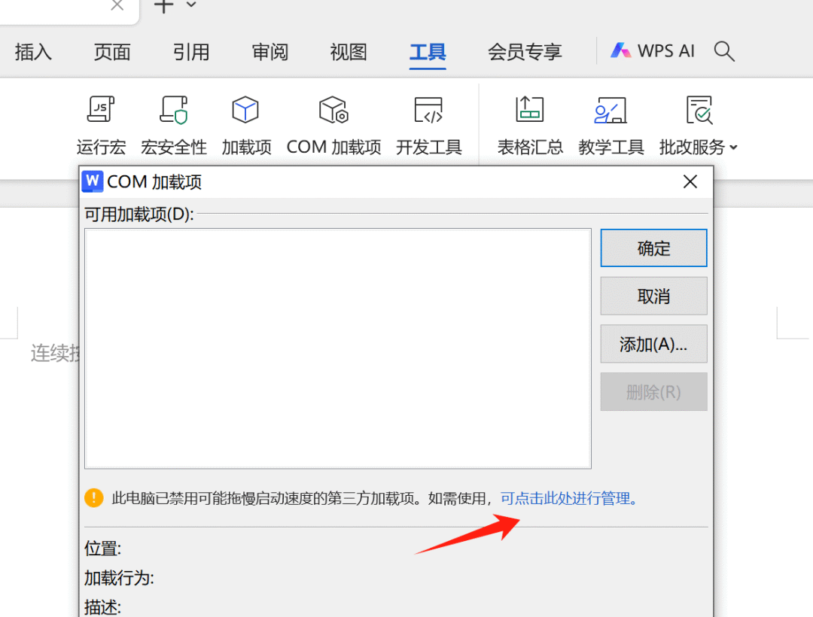
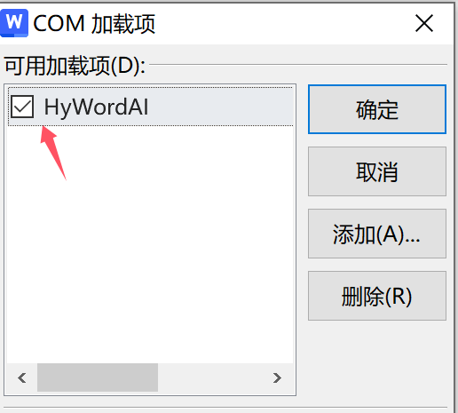

# OfficeAI

## 安装 OfficeAI 插件

首先，咱们要做的第一步就是下载并安装 **OfficeAI 插件**。这个插件是专门为 WPS 和 Office 用户设计的，可以让你在文档、表格等各种办公软件中，轻松实现 DeepSeek 的功能。

[点击这里下载 OfficeAI 插件](https://pan.quark.cn/s/c2cc5dae80dd)

### 配置 OfficeAI 插件：AI 功能启动！

获取了 API Key 后，接下来就是配置插件，连接 DeepSeek，让 AI 功能瞬间生效。配置起来也很简单，照着步骤来就行。

#### 打开 WPS 配置

1. 安装并启动 **OfficeAI 插件** 后，打开 WPS。你会在 WPS 的顶部看到多了一个 **“OfficeAI”** 的选项卡。

2. 点击 **“OfficeAI”**，然后点击 **“设置”**。

   

#### 配置大模型设置

1. 进入设置界面后，点击 **“大模型设置”**，打开 **“本地部署”**，然后选择 **APIKey** 标签。
2. 在 **大模型** 下拉菜单中，你会看到两个模型选项：
   - **deepseek-chat**：适合日常对话、简单查询。
   - **deepseek-reasoner**：适合需要深度推理、决策支持等复杂任务。

**小贴士**：如果你不确定用哪个模型，先选择 **deepseek-chat** 试试。如果觉得以后需要更强的推理能力，再切换成 **deepseek-reasoner**。需要注意的是，**reasoner** 模型的费用比 **chat** 模型高。

1. 在 DeepSeek 官网，你可以查看模型的使用费用。比如，**chat 模型每输入 1 百万个汉字大约需要 2 元，输出 1 百万个汉字大约需要 8 元**。另外，DeepSeek 会送你 **10 元的 tokens**，有效期为 30 天。

   

#### 输入 API Key

1. 在 **API_KEY** 输入框中，粘贴你从官网复制的 API Key，点击 **“保存”**，就可以完成配置了。

**补充说明**：

- 如果你选择了 **豆包模型**，无需启用本地部署，直接选择 **默认** 标签即可。
- 配置完成后，你无需重启 WPS，设置会立即生效。
- 在 WPS 界面右侧，你可以看到当前正在使用的 AI 模型，如果有疑问，可以在聊天栏输入 **“你是谁？”** 来确认是否切换成功。

------

## 开始使用 DeepSeek：AI 助手上线

配置好了 DeepSeek 后，你就可以在 WPS 中轻松享受强大的 AI 助手啦！无论是写文案、翻译校对，还是深度推理，DeepSeek 都能助你高效完成。

### 使用 DeepSeek 校对和文案生成

1. 配置完成后，点击 WPS 中的 **“OfficeAI”** 选项卡，然后选中需要处理的文本，点击 **“生成”**，DeepSeek 就会自动处理并生成相关内容，直接导入到文档中，简直不费吹灰之力！

   

### 使用聊天、文生图、创作功能

在 WPS 界面的右侧，你可以看到 **OfficeAI 助手** 提供了三个板块：

- **聊天**：可以直接和 DeepSeek 聊天，解答各种问题，提供建议。
- **文生图**：可以将文字转化为图像，帮助你创作各种有趣的图文内容。
- **创作**：生成文章、报告、邮件等创作内容，轻松搞定写作任务。

点击 **“导出到左侧”** 按钮，你可以把生成的内容直接插入文档。

### 在 WPS 表格中使用 DeepSeek

在 WPS 表格中，你也可以使用 **DeepSeek** 来进行公式计算、数据分析等。无论是整理数据还是分析趋势，DeepSeek 都能帮助你节省大量时间，让办公效率爆棚！

------

## 常见问题

### **Q1：WPS 中看不到 OfficeAI 选项怎么办？**

如果你在 WPS 中没有看到 **OfficeAI** 选项，试试以下操作：

1. 运行WPS,打开或新建任意文档；

2. 左上找到文件菜单 -> 选项 ,在选项页面中找到信任中心:

3. 勾上受信任的加载项, 如没找到下图的选项:

   WPS开启COM加载

4. 点确定保存对应设置后重开WPS一般会显示

如以上方式尝试还是没显示，请在按如下操作：

1. 在WPS的菜单中找到工具–> COM加载项-> 点击此处管理 (如果没有这项则忽略)

   启

2. 在COM加载项中找到HyWordAI、HyExcelAI,然后勾上/启用

   

