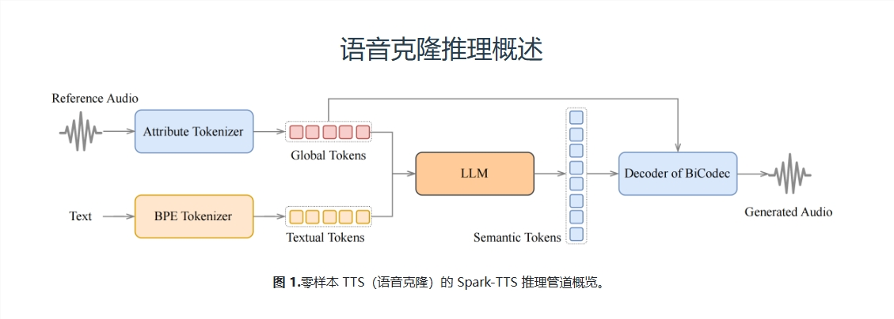
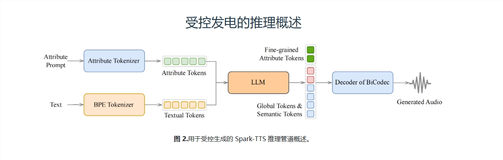

# SparkTTS

项目及演示:https://sparkaudio.github.io/spark-tts/

GitHub:https://github.com/SparkAudio/Spark-TTS

论文:https://arxiv.org/pdf/2503.01710

模型：https://huggingface.co/SparkAudio/Spark-TTS-0.5B

## 简介

在科技飞速发展的今天，人工智能已经渗透到我们生活的方方面面，从智能语音助手到各种自动化服务，AI正在以一种前所未有的方式改变我们的生活。今天，我要给大家介绍一项超级酷炫的技术——Spark-TTS，一个基于Qwen2.5模型的高效文本转语音系统。它不仅能“克隆”你的声音，还能根据你的需求“定制”出全新的声音!是不是听起来很神奇?



**什么是Spark-TTS?**

Spark-TTS是一种新型的文本转语音（TTS）系统，它的核心是BiCodec——一种单流语音编解码器。这个编解码器可以把语音分解成两种互补的“语音令牌”:一种是低比特率的语义令牌，用来捕捉语言内容;另一种是固定长度的全局令牌，用来捕捉说话者的属性，比如音色、音调等。这种分离式的表示方法，结合了强大的Qwen2.5语言模型和一种叫做“思维链”(CoT)的生成方法，让Spark-TTS能够实现从粗粒度(比如性别、说话风格)到细粒度(比如精确的音高值、说话速度)的控制。换句话说，你可以通过简单的指令，让Spark-TTS生成一个完全符合你想象的声音!



**Spark-TTS的“超能力”**

Spark-TTS的厉害之处在于它的“超能力”——能够实现零样本（zero-shot）的声音克隆。这意味着，你只需要提供一段参考音频，Spark-TTS就能直接生成一个全新的声音，而且这个声音可以完全按照你的要求进行调整。比如，你可以要求生成一个“男性、低音、慢速”的声音，Spark-TTS就能精准地完成任务。这在以前几乎是不可能的，但Spark-TTS做到了!

此外，Spark-TTS还有一个“秘密武器”——VoxBox。这是一个精心策划的包含10万小时语音数据的开源数据集，涵盖了各种属性的标注，比如性别、音高和说话速度。这个数据集为语音合成的研究提供了一个标准化的基准，让研究人员可以更好地进行实验和比较。

**技术细节**

Spark-TTS的技术细节听起来可能有点复杂，但我会用最通俗的方式来解释。首先，BiCodec是Spark-TTS的核心，它通过一种叫做“矢量量化”（VQ）的技术，将语音信号转换成离散的令牌。这些令牌就像是语音的“数字指纹”，能够被语言模型理解和生成。然后，Spark-TTS利用Qwen2.5语言模型的强大能力，通过“思维链”生成方法，将这些令牌组合成完整的语音信号。

在实际应用中，Spark-TTS有两种工作模式:零样本模式和可控生成模式。在零样本模式下，Spark-TTS可以根据参考音频生成一个全新的声音;而在可控生成模式下，你可以通过指定属性标签或具体的数值，让Spark-TTS生成完全符合你要求的声音。比如，你可以要求生成一个“女性、高音、快速”的声音，Spark-TTS就能精准地完成任务。

**实际应用**

Spark-TTS的应用场景非常广泛。比如，在智能语音助手领域，Spark-TTS可以根据用户的偏好生成个性化的语音，让用户感觉像是在和一个真正的人交流。在有声读物领域，Spark-TTS可以根据文本内容生成不同风格的声音，让听众有更丰富的听觉体验。此外，Spark-TTS还可以用于语音合成研究，帮助研究人员更好地理解和改进语音合成技术。

**未来展望**

虽然Spark-TTS已经取得了很大的突破，但它仍然有一些需要改进的地方。比如，在零样本声音克隆中，Spark-TTS的说话者相似度还有待提高。此外，Spark-TTS目前还没有对全局令牌和语义令牌之间的解耦进行额外的约束，这可能会影响声音的多样性和自然度。不过，研究人员已经在探索新的方法来解决这些问题，比如通过引入音色的扰动来提高声音的多样性和自然度。

Spark-TTS是一项非常有前景的技术，它不仅能够实现零样本的声音克隆，还能根据用户的需求生成全新的声音。它的出现，让我们看到了语音合成技术的无限可能。未来，随着技术的不断进步，Spark-TTS有望在更多的领域得到应用，为我们的生活带来更多的便利和乐趣。

最后，如果你对Spark-TTS感兴趣，可以访问它的开源代码和音频样本，亲自感受一下这项神奇的技术。相信我，这将是一次非常有趣的体验!

## Linux搭建部署

参见官网的值指南：https://github.com/SparkAudio/Spark-TTS 可以翻译过来看

## windows搭建部署

**Spark-TTS 安装（Windows 指南）**

### **1. 安装 Conda（如果还没有安装）**

- 下载**[Miniconda](https://docs.conda.io/en/latest/miniconda.html)**并安装。
- 确保在安装过程中检查**“将 Conda 添加到 PATH”**。

**下载 Spark-TTS**

您有**两种方式**可以获取文件：

**选项 1（推荐用于 Windows）：** **手动下载 ZIP**

- 前往**[Spark-TTS GitHub](https://github.com/SparkAudio/Spark-TTS)**
- 单击**“代码”>“下载 ZIP”**，然后解压。

**选项 2：使用 Git（可选）**

- 如果您更喜欢使用 Git，请安装

  [Git](https://git-scm.com/downloads)

  并运行：

  ```
  git clone https://github.com/SparkAudio/Spark-TTS.git
  ```

### **2.创建 Conda 环境**

打开**命令提示符（cmd）**并运行：

```
conda create -n sparktts python=3.12 -y
conda activate sparktts
```

这将为 Spark-TTS 创建并激活 Python 3.12 环境。

### **3.安装依赖项**

**在Spark-TTS 文件夹**中（无论是来自 ZIP 还是 Git），运行：

```
pip install -r requirements.txt
```


### **4.安装PyTorch（自动检测CUDA或CPU）**

```
pip install torch torchvision torchaudio --index-url https://pytorch.org/get-started/previous-versions/
-- 这里我遇到过问题，我就把--index-url去掉安装就可以完成

# OR Manually install a specific CUDA version (if needed)
# pip install torch torchvision torchaudio --index-url https://download.pytorch.org/whl/cu121
# pip install torch torchvision torchaudio --index-url https://download.pytorch.org/whl/cu118  # Older GPUs
```


### **5.下载模型**

有**两种方法**可以获取模型文件。请选择一种：

**选项 1（推荐）：使用 Python在****Spark-TTS 文件夹**中创建一个名为
的新文件，将其粘贴到里面，然后运行它：**`download_model.py`**

```
from huggingface_hub import snapshot_download
import os

# Set download path
model_dir = "pretrained_models/Spark-TTS-0.5B"

# Check if model already exists
if os.path.exists(model_dir) and len(os.listdir(model_dir)) > 0:
    print("Model files already exist. Skipping download.")
else:
    print("Downloading model files...")
    snapshot_download(
        repo_id="SparkAudio/Spark-TTS-0.5B",
        local_dir=model_dir,
        resume_download=True  # Resumes partial downloads
    )
    print("Download complete!")
```


运行它：

```
python download_model.py
```


✅**选项 2：使用 Git（如果你安装了它）**

```
mkdir pretrained_models
git clone https://huggingface.co/SparkAudio/Spark-TTS-0.5B pretrained_models/Spark-TTS-0.5B
```


两种方法都可以 —**选择对您来说更简单的方法**。


### **6. 运行 Spark-TTS**

### **Web 用户界面（推荐）**

对于**基于浏览器的交互式界面**，请运行：

```
python webui.py
```


这将启动一个本地网络服务器，您可以在其中输入文本、生成语音或克隆声音。

### **7. 故障排除和常见问题**

🔎**寻求帮助之前，**
许多常见问题已在现有讨论、文档或在线资源中涵盖。请：

- **首先搜索 GitHub 问题**🕵️‍♂️
- **查看文档**📖
- **谷歌或使用人工智能工具（ChatGPT、DeepSeek 等）**

如果您**仍然**需要帮助，请**解释您已经尝试过的方法，**以便我们更好地为您提供帮助！


现在您就可以出发了！🚀🔥

祝您 TTS 愉快。