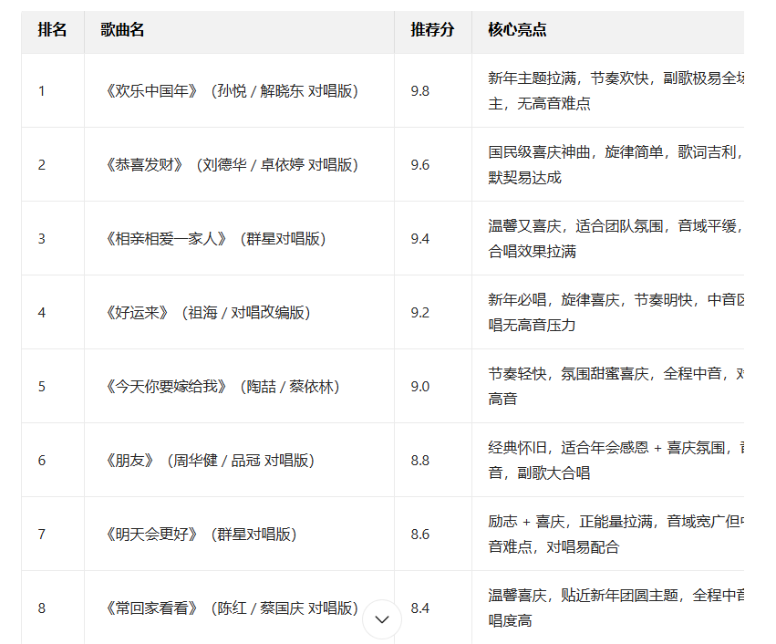

# 其他技巧


## AI+视频字幕总结

1. 先获取到视频的字母文件，比如srt文件。

   在哔哩哔哩我使用了这个提取字幕的插件：

   

2. 如果使用ai工具不识别srt格式文件，可以将扩展名加一个.txt就可以读取了，然后就可以扔给AI处理了。

   > 我在学习3D打印，目前是这方面的小白，请总结这个srt视频字幕文件内容。

   AI输出结果：

   

## AI选歌

### 提示词

```
**核心需求**：为公司年会挑选1首适合我演唱的歌曲，要求匹配个人能力、年会氛围，易带动现场效果。

**请基于以下信息精准推荐**：

1.  个人演唱基础
    - 我的音域：______（如：高音能到A4/中音稳定/低音醇厚）
    - 擅长曲风：______（如：流行/经典老歌/国风/民谣/摇滚）
    - 演唱熟练度倾向：______（如：想练新歌/优先选会唱的熟歌）
    - 喜欢的歌手/常听曲目：______（可选，供风格参考）

2.  年会现场条件
    - 表演形式：______（如：独唱/双人对唱/多人合唱）
    - 伴奏支持：______（如：有伴奏带/可升降调/乐队伴奏/清唱）
    - 舞台互动需求：______（如：需要副歌全场合唱/偏向安静独唱/要带动气氛嗨场）

3.  年会主题与偏好
    - 年会主题：______（如：同心筑梦/感恩同行/新年启航/奋斗202X）
    - 歌曲情绪倾向：______（如：欢快喜庆/励志昂扬/温馨治愈/热血燃情）
    - 语言偏好：______（如：国语/粤语/英文）
    - 避坑要求：______（如：不想要太高难度的高音/不想要节奏太复杂的曲目/不想要冷门歌）
```

### 示例

```
# 年会歌曲推荐AI提示词

**核心需求**：为公司年会挑选1首适合我演唱的歌曲，要求匹配个人能力、年会氛围，易带动现场效果。

**请基于以下信息精准推荐**：

1.  个人演唱基础
    - 我的音域：中音稳定
    - 擅长曲风：经典老歌
    - 演唱熟练度倾向：优先选会唱的熟歌
    - 喜欢的歌手/常听曲目：______（可选，供风格参考）

2.  年会现场条件
    - 表演形式：双人对唱
    - 伴奏支持：有伴奏带
    - 舞台互动需求：要带动气氛嗨场

3.  年会主题与偏好
    - 年会主题：新年快乐
    - 歌曲情绪倾向：欢快喜庆
    - 语言偏好：国语
    - 避坑要求：不想要太高难度的高音
    
请给我列出10首歌曲，给出你的推荐分数，按推荐分数从高到低排序
```

