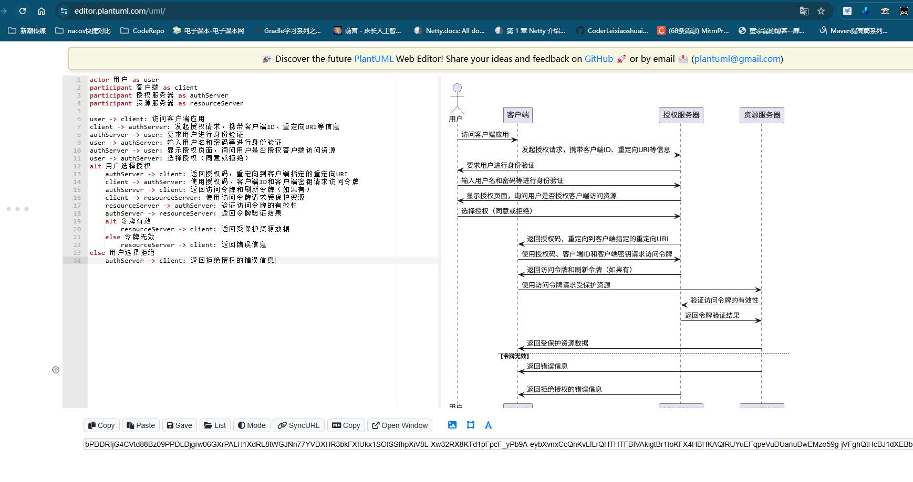

# 输出限制篇

## 常规格式

我们可以要求AI输出常规的文本格式结果，比如json，csv等格式；

## 程序语言限制

要求使用特定语言完成代码编写

## 输出内容使用markdown格式输出

## 使用表格输出

## 使用流程图输出

需要选定你要输出的流程图格式，比如plantuml、Mermaid、DOT语言（Graphviz）等等。

输出渲染技巧：

DOT在线渲染：[入口](https://graphviz.christine.website/?engine=dot)

Mermaid在线渲染：[入口](https://mermaid-live.nodejs.cn/edit) （技巧：可以在图上进行编辑）

plantuml在线渲染：[入口](https://editor.plantuml.com/uml/)

websequencediagrams 时序图在线渲染：[入口](https://www.websequencediagrams.com/)  （技巧：点击图上的图像可以定位到uml的代码在哪一行）

渲染效果

