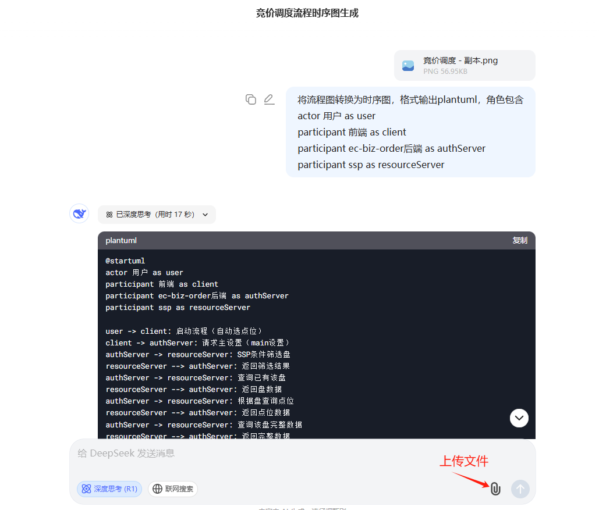
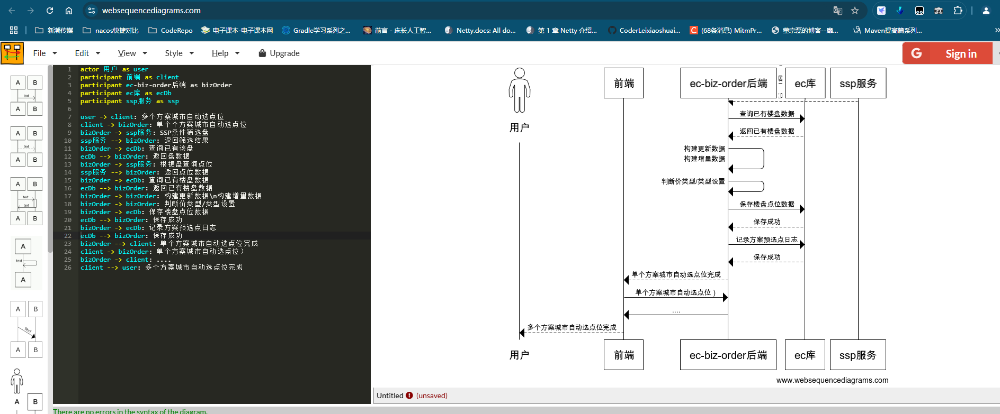
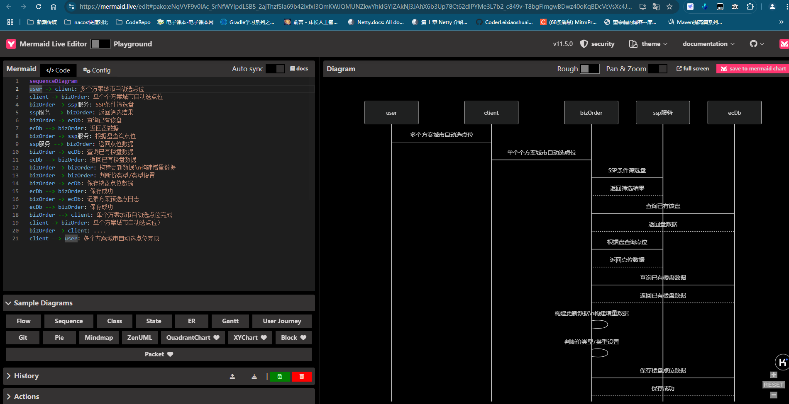
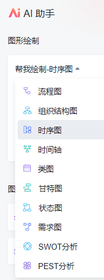
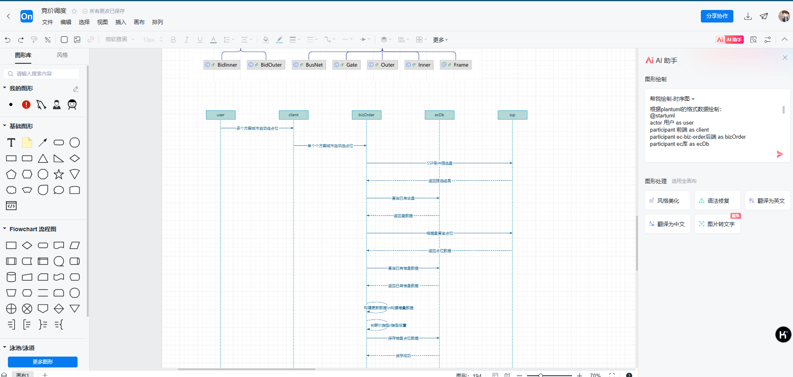

# 程序员设计图


## 将流程图转换为时序图

1.将流程图保存为图片



2. 然后结果的基础上，快速调整为自己想要的效果

   ```plantuml
   @startuml
   actor 用户 as user
   participant 前端 as client
   participant ec-biz-order后端 as bizOrder
   participant ec库 as ecDb
   participant ssp服务 as ssp
   
   user -> client: 多个方案城市自动选点位
   client -> bizOrder: 单个个方案城市自动选点位
   bizOrder -> ssp服务: SSP条件筛选盘
   ssp服务 --> bizOrder: 返回筛选结果
   bizOrder -> ecDb: 查询已有该盘
   ecDb --> bizOrder: 返回盘数据
   bizOrder -> ssp服务: 根据盘查询点位
   ssp服务 --> bizOrder: 返回点位数据
   bizOrder -> ecDb: 查询已有楼盘数据
   ecDb --> bizOrder: 返回已有楼盘数据
   bizOrder -> bizOrder: 构建更新数据\n构建增量数据
   bizOrder -> bizOrder: 判断价类型/类型设置
   bizOrder -> ecDb: 保存楼盘点位数据
   ecDb --> bizOrder: 保存成功
   bizOrder -> ecDb: 记录方案预选点日志
   ecDb --> bizOrder: 保存成功
   bizOrder --> client: 单个方案城市自动选点位完成
   client -> bizOrder: 单个方案城市自动选点位）
   bizOrder -> client: ....
   client --> user: 多个方案城市自动选点位完成
   @enduml
   ```

3. 使用[websequencediagrams](https://www.websequencediagrams.com/)输出成果

   

4. 使用[mermaid](https://mermaid.live/edit)输出成果

   

5. 使用[processon](https://www.processon.com/)输出成果（免费用户有次数限制）

​		   processon提供了一个AI助手，可以帮助我们快速画出相应的设计图。



将以上的plantuml内容在前面加上一个AI提示词：“根据plantuml的格式数据绘制：”，然后开始制作，它会自动在空白处给你画图：



如果你对效果不满意，你还可以选择“图形处理” -》 “风格美化”，根据结果你选一种你满意的样式。