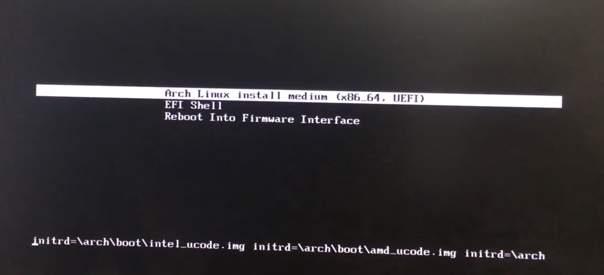
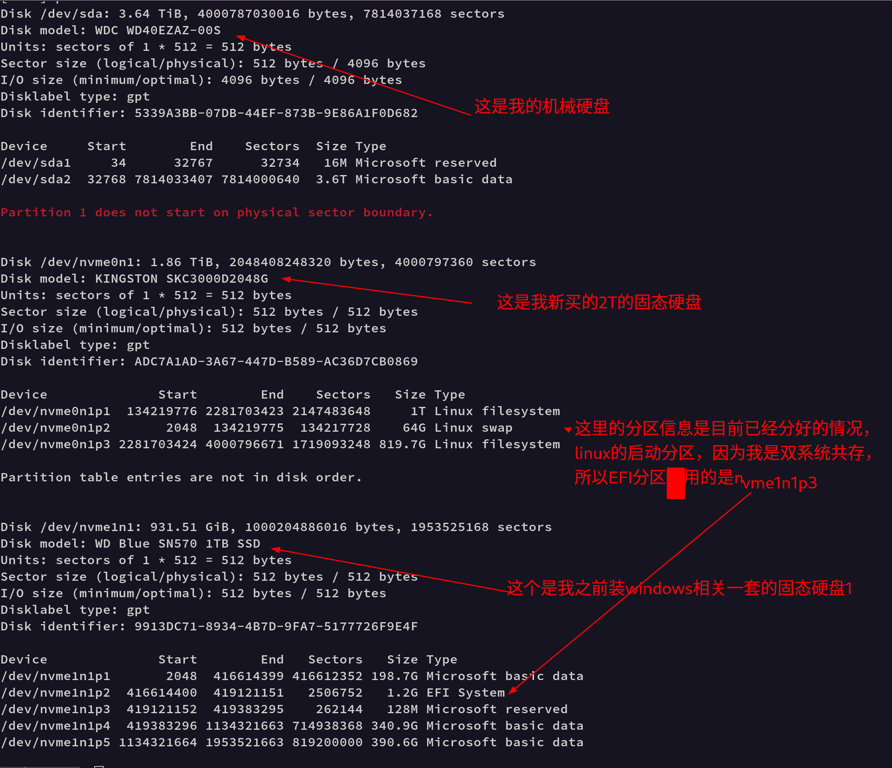
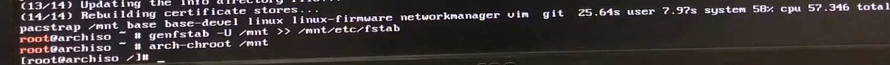
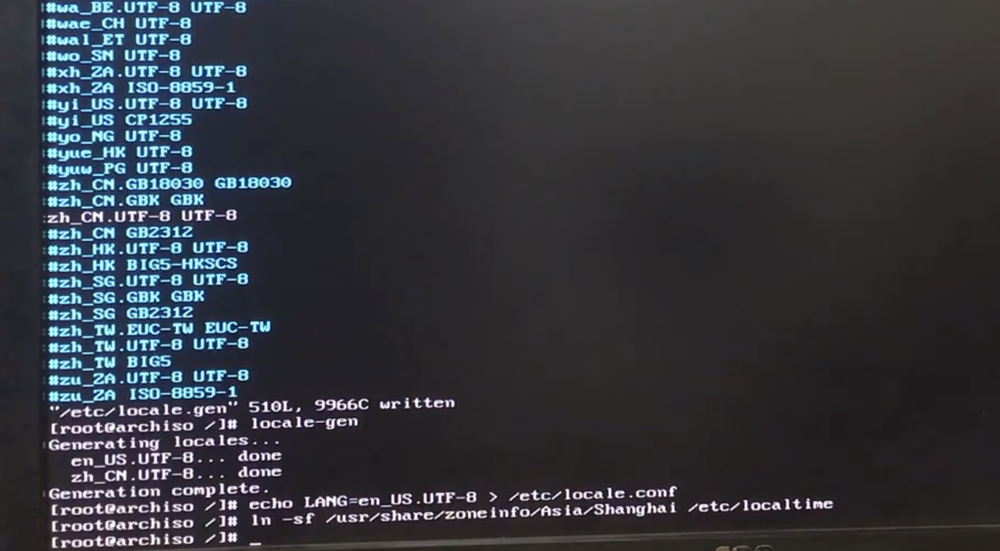
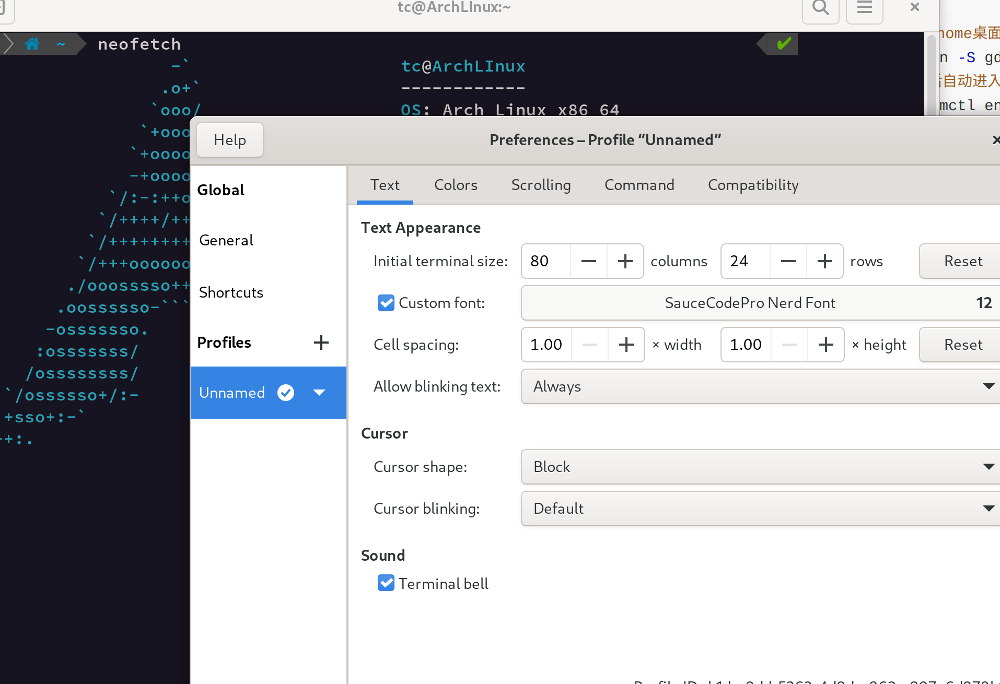

# 系统安装

[安装指南](https://wiki.archlinuxcn.org/wiki/%E5%AE%89%E8%A3%85%E6%8C%87%E5%8D%97)

[ArchLinux安装配置及美化](https://blog.csdn.net/qq_29930779/article/details/124219301)

# 安装Arch Linux须知

[为什么应该安装使用 Arch Linux？](https://blog.csdn.net/yaxuan88521/article/details/122768318)

**01、Arch Linux 是一个滚动发行版，只有一个版本**

**02、Arch Linux 有基于[命令](https://www.linuxcool.com/)行的安装**

**03、你必须在 Arch Linux 上手动安装所有东西**

**04、Arch 是最接近数字极简主义的东西**

**05、Arch Linux 不同于 Ubuntu 或 Fedora**

**06、你必须会修复你自己弄坏的东西**

**07、Arch 有一个维护良好的文档(ArchWiki)**

**08、AUR 几乎拥有你需要的所有软件**

切换到 Arch Linux 的原因有很多：最新软件的可用性、对系统的完全控制，以及根据您的喜好定制Linux的能力——仅举几例。除此之外，你可以在互联网论坛上说“顺便说一下，我使用Arch”，这是首先安装 Arch Linux 的最佳理由之一。不喜欢 Arch Linux 的复杂性?别担心。首先安装一个用户友好的基于 Arch 的发行版来测试 Arch 的功能，如果你喜欢它，你可以随时切换回来。现在你可以 Arch Linux 的安装了。

# 安装Arch Linux

参考[学习视频](https://www.bilibili.com/video/BV14z4y1X7eh/?spm_id_from=333.1007.top_right_bar_window_history.content.click&vd_source=d738e4925805b87bb827090f490126cd)

## **制作安装启动介质**

1. 从[官网下载](https://archlinux.org/download/)最新镜像
2. 下载[Rufus](https://rufus.ie/zh/)启动盘制作工具
3. 准备好要进行安装ArchLinux的存储空间（看是压缩，还是试用空余的空间，本次我是买了一块2TM.2固态硬盘）
4. 重启后进入BIOS中将对应U盘的启动选为首选启动

## **开始进行命令安装系统**



## 网络准备

```bash
# 查看网络设备信息 
ip a
# 我插了有线网络的，直接就获取到来ip地址，但是学习视频中还进行手动配置ip
# 我还单独连接来家里面的无线网络
iwctl device list
# wlan0是上面显示的网络设备，下面命令是用这个网络设备查看有哪些wifi
iwctl station wlan0 get-networks
# 连接wifi
iwctl station wlan0 connect "tc's HOME 5G"
# 输入密码，成功连接到wifi

# 测试连接网络是否成功
ping 100.76.76.76

# 配置域名解析
vim /etc/resolv.conf
# 加入 nameserver nameserver 8.8.8.8
```

## 配置软件安装源镜像

```bash
vim /etc/pacman.d/mirrorlist
# 配置国内的镜像源
Server = https://mirrors.bfsu.edu.cn/archlinuxcn/$arch
Server = https://mirrors.tuna.tsinghua.edu.cn/archlinux/$repo/os/$arch
Server = https://mirrors.aliyun.com/archlinux/$repo/os/$arch
Server = https://mirrors.ustc.edu.cn/archlinux/$repo/os/$arch
Server = http://mirrors.163.com/archlinux/$repo/os/$arch
Server = http://mirrors.hust.edu.cn/archlinux/$repo/os/$arch
Server = http://run.hit.edu.cn/archlinux/$repo/os/$arch
Server = http://ftp.kaist.ac.kr/ArchLinux/$repo/os/$arch
Server = http://mirrors.hustunique.com/archlinux/$repo/os/$arch
Server = http://ftp.jaist.ac.jp/pub/Linux/ArchLinux/$repo/os/$arch
Server = http://mirror.premi.st/archlinux/$repo/os/$arch
Server = http://mirror.its.dal.ca/archlinux/$repo/os/$arch
Server = http://mirror.de.leaseweb.net/archlinux/$repo/os/$arch
Server = http://mirror.clibre.uqam.ca/archlinux/$repo/os/$arch
# 更新源
pacman -Syy
```

## 磁盘分区准备

```bash
# 查看目前你的电脑所有存储设备以及磁盘分区情况，这里也找到了我的新固态硬盘，但是没没进行分区，设备名称/dev/nvme0n1
fdisk -l
```



### 分区

```bash
# 分区
gdisk /dev/nvme0n1
help
# 创建交换分区
n
# 输入分区编号6，我分配的大小是 +64G， 交换分区内存地址，设置8200

# 创建/分区，主要安装linux和日常使用的分区
n
# 输入分区编号5，我分区的大小是 +1T, 交换分区内存地址，设置8300

n
# 创建固态剩余空间的分区，我分配的大小直接回车， 交换分区内存地址，设置8200

# 分区结束来，进行保存分区
y
```

### 分区格式化

```bash
# 主要分区
mkfs.ext4 -L ArchFSRoot /dev/nvme0n1p1
# 交换分区
mkswap /dev/nvme0n1p2
# 启用交换分区
swapon /dev/nvme0n1p2

#其余分区 ntfs格式化比较慢，我看网上说要加-f，是不是f我记得不很确定了，可以查询下
mkfs.ntfs -f -L fileSystem /dev/nvme0n1p3
```

### 挂载分区

```bash
# 挂载主要分区
mount /dev/nvme0n1p1 /mnt
# 挂载windows的启动分区EFI到/mnt/boot
mkdir /mnt/boot
cd /mnt/boot
mount /dev/nvme1n1p2 /mnt/boot
```

然后接下来我们就可以开始装系统了

## 安装系统

使用archlinux提供的安装工具pacstrap进行安装。

```bash
# networkmanager 网络管理
# intel-ucdoe intel的cpu经常暴露出漏洞，安装这个包来堵住漏洞
# 我安装的时候因为之前windows对应的EFI盘只有100M，导致没有完全安装成功，所以我后面又进入之前windows系统，使用磁盘分区工具和diskgenius来进行容量扩容，结果发现根本扩容不了，我想应该该是因为当前启动的windows的影响，所以后面我又写来一个大白菜的启动盘，确保里面又diskgenius工具，然后进入光驱的系统，将之前的EFI，MBR都进行了备份，然后从其他盘压缩来一些空间出来，将EFI和MBR分区进行来删除，然后右击磁盘，建立来大小足够的EFI（600M）和MBR分区，本来我想从备份去恢复分区，结果发现桌面有一个引导修复工具，修复了一下，EFI分区的内容就回来了。实际安装总是要曲折一些。
pacstrap /mnt base base-devel linux linux-firmware networkmanager vim intel-ucode git 
# 生成文件表               /mnt/etc/fstab是标准的linux的硬盘挂载点
genfstab -U /mnt >> /mnt/etc/fstab

# 基本系统安装结束来，这个时候我们要切换到刚安装的新系统
arch-chroot /mnt
```



## 配置新系统

```bash
# 新系统，你打算使用什么样的语言
vim /etc/locale.gen
# 打开以下配置
en_US.UTF-8 UTF-8
zh_CN.UTF-8 UTF-8
# 生成语言文件
locale-gen
# 系统缺省配置语言文件
echo LANG=en_US.UTF-8 > /etc/locale.conf
```



```bash
# 设置时区
ln -sf /usr/share/zoneinfo/Asia/Shanghai /etc/localtime
# 设置网络时间
timedatectl set-ntp true
# 设置硬件同步时间
hwclock --systohc
# 设置主机名
echo ArchLinux > /etc/hostname

# 设置本地域名解析文件
vim /etc/hosts
127.0.0.1 localhost
::1		  localhost
127.0.1.1  ArchLInuxLinux.localdomain ArchLinux
:wq

# 我们打开sudo命令
visudo
# 找到 %wheel ALL=(ALL) ALL，将这个配置打开
:wq

# 设置root的密码
passwd

# 创建平常使用的普通用户
useradd -m tc
# 设置用户权限
usermod -aG wheel,audio,video,optical,storage tc
# 设置用户密码
passwd tc

# 默认打开网络管理
systemctl enable NetworkManager
```

## 配置引导

```bash
bootctl install
# 上面命令安装执行后，下面就会有一些文件
ls /boot/EFI
# 配置超时时间
vim /boot/loader/loader.conf
# 将timeout 5 设置长一点，不至于开启启动的时候选择哪个系统那么匆忙
touch /boot/loader/entries/Arch.conf
vim /boot/loader/entries/Arch.conf
# 写入
title Arch Linux
linux	/vmlinuz-linux
initrd	/intel-ucode.img
initrd	/initramfs-linux.img
options	root="PARTUUID=ad1766c0-79cc-464e-bf0b-fc46a7fd4466" rw
# 上面的root是Linux的根文件，可以这样查看 blkid
:wq

# 推出当前系统，回到安装系统
exit
# 查看启动顺序
efibootmgr
# 如果不符合自己期望的，可以进行修改或删除

# 重启之前，取消挂载
umount -R /mnt
reboot
```

下面是重启后的状态，让用户进行登录。


```bash
登录后，可以查看以下
uname -a
```


## 显卡安装

### 显卡驱动安装（显卡驱动独显可以不装）

- **英特尔核显**

  ```bash
  sudo pacman -S mesa lib32-mesa vulkan-intel lib32-vulkan-intel        ## 安装英特尔显卡驱动软件包
  ```

  AMD核显

- ```bash
  sudo pacman -S mesa lib32-mesa xf86-video-amdgpu vulkan-radeon lib32-vulkan-radeon                                ## 安装AMD显卡驱动软件包 
  ```

- 英伟达独显（若有）

  ```bash
  sudo pacman -S nvidia nvidia-settings lib32-nvidia-utils             ## 英伟达独显驱动软件包
  ```

- 双显卡切换工具

  ```bash
  ## 安装软件包
  yay -S optimus-manager optimus-manager-qt
  ## 添加自启动
  systemctl enable optimus-manager
  ```

  

## 显卡信息查看

- NVIDIA独立显卡

  ```bash
  nvidia-settings                            
  ```

- AMD 独立显卡

  ```bash
  ## 安装软件包
  yay -S radeon-profile-git radeon-profile-daemon-git
  ## 设置开机自启动服务
  systemctl enable --now radeon-profile-daemon.service
  ```

## 显卡性能测试

- glxgears 显示帧数

  ```bash
  sudo pacman -S mesa-utils
  glxgears
  ```

- glmark2 显示测试分数

  ```bash
  sudo pacman -S glmark2
  glmark2
  ```

- Unigine benchmark 3D引擎基准测试工具，显示全面

  ```bash
  yay -S unigine-superposition
  bash
  unigine-superposition
  ```

  

## 配置蓝牙（若存在）

```bash
 ## 安装蓝牙相应包
sudo pacman -S  bluez bluez-utils
## 安装蓝牙音频软件
sudo pacman -S pulseaudio-bluetooth
## 设置蓝牙开机自启动
sudo systemctl enable --now bluetooth
## 重启蓝牙音频服务
pulseaudio -k
```


# 图像界面安装

[学习视频](https://www.bilibili.com/video/BV1Qi4y1G7sp/?spm_id_from=333.788.top_right_bar_window_history.content.click&vd_source=d738e4925805b87bb827090f490126cd)

```bash
# 确保网络已经通了
ping www.baidu.com
# 看下软件镜像
head /etc/pacman.d/mirrorlist

# 小技巧
vim /etc/pacman.conf
# 找到Color，打开它，下载的时候可以显示颜色
# 加一项配置ILoveCandy,可以开启在下载的时候，进度条呈现是吃豆子的效果

#还可以添加中文的配置组
[archlinuxcn]
Server = https://mirrors.bfsu.edu.cn/archlinuxcn/$arch
Server = https://mirrors.tuna.tsinghua.edu.cn/archlinux/$repo/os/$arch
Server = https://mirrors.aliyun.com/archlinux/$repo/os/$arch
Server = https://mirrors.ustc.edu.cn/archlinux/$repo/os/$arch
Server = http://mirrors.163.com/archlinux/$repo/os/$arch
Server = http://mirrors.hust.edu.cn/archlinux/$repo/os/$arch
Server = http://run.hit.edu.cn/archlinux/$repo/os/$arch
Server = http://ftp.kaist.ac.kr/ArchLinux/$repo/os/$arch
Server = http://mirrors.hustunique.com/archlinux/$repo/os/$arch
Server = http://ftp.jaist.ac.jp/pub/Linux/ArchLinux/$repo/os/$arch
Server = http://mirror.premi.st/archlinux/$repo/os/$arch
Server = http://mirror.its.dal.ca/archlinux/$repo/os/$arch
Server = http://mirror.de.leaseweb.net/archlinux/$repo/os/$arch
Server = http://mirror.clibre.uqam.ca/archlinux/$repo/os/$arch
：wq
# 更新源
sudo packman -Syy
# 获取添加的archlinuxcn的源
sudo pacman -S archlinuxcn-keyring
# 如果出现错误
#     sudo rm -rf /etc/pacman.d/gnupg
#     sudo pacman-key --init
#     sudo pacman-key --populate archlinux
#     sudo pacman -S archlinuxcn-keyring

# 开始安装gnome桌面
sudo pacman -S gdm gnome gnome-extra
# 每次启动后自动进入图形界面
sudo systemctl enable gdm
# 安装AUR的安装工具
sudo pacman -S yay
# 安装系统后悔药工具，在下次重启后，在界面进行系统备份
yay -S timeshift
# 安装字体，否则浏览器的界面的中文文字是乱码的
yay noto-fonts-cjk
# 安装结束，重启
reboot
```


# Gnome终端设置、美化

下载一个好看的字体，这里使用的Github的[Nerd-fonts](https://github.com/ryanoasis/nerd-fonts), 找到喜欢的字体，也可以下载releases中的内容，然后找到自己喜欢的字体，安装双击点install进行安装，安装之后在系统Fonts中就能找到对应的字体。

打开Terminal，然后打开对应的Perferences。



```bash
# 看下目前是否安装zsh
which
# 没安装进行安装
yay zsh
```

**使用[ohmyzsh](https://ohmyz.sh/)进行美化**

```bash
# 使用官网提示进行安装
sh -c "$(curl -fsSL https://raw.githubusercontent.com/ohmyzsh/ohmyzsh/master/tools/install.sh)"bash
# 根据提示，切换到zsh
```

**提示符修改**

使用[powerlevel10k](https://github.com/romkatv/powerlevel10k#oh-my-zsh)，找到文档安装到on my zsh。

```bash
# 下载安装
git clone --depth=1 https://gitee.com/romkatv/powerlevel10k.git ${ZSH_CUSTOM:-$HOME/.oh-my-zsh/custom}/themes/powerlevel10k
# 配置zsh的主题
cd
vim .zshrc
# 注释以前的，配置新的主题
#ZSH_THEME="robbyrussell"
ZSH_THEME="powerlevel10k/powerlevel10k"

# 进入zsh，会进行第一次的配置，根据提示进行配置，最后配置成自己喜欢的风格。
zsh
```

优化终端输出ruby写的colorls [Github](https://github.com/athityakumar/colorls#installation)

```bash
# 确保ruby已经安装，且大于 version >= 2.6
ruby --version
# 安装colorls
gem install colorls
# 根据上面的WARNING提示，说你还没将之安装到PATH路径中
echo "export PATH=$PATH:/home/tc/.local/share/gem/ruby/3.0.0/bin" >> .zshrc
echo "alias ls=\"colorls\"" >> .zshrc
echo "alias ll=\"colorls -l\"" >> .zshrc
echo "alias startTeamViewer=\"teamviewer --daemon start\"" >> .zshrc
echo "alias neofetchc=\"clear;neofetch | lolcat\"" >> .zshrc
source .zshrc

colorls
ls
ll
```


zsh除了上面的插件之外，还有其他可以安装，[GitHub](https://github.com/zsh-users)

-  [zsh-syntax-highlighting](https://github.com/zsh-users/zsh-syntax-highlighting)  shell zsh语法高亮
- [awesome-zsh-plugins](https://github.com/unixorn/awesome-zsh-plugins) ZSH 插件管理
- [Antigen](https://github.com/zsh-users/antigen) 也可以帮助我们管理zsh插件
- [zsh-users](https://github.com/zsh-users) 这个仓库还有很多其他zsh插件


# Gnome其他界面美化

[gnome-look](https://www.gnome-look.org/p/1334194)


# 其他软件安装

```bash
# chrome browser
yay google-chrome
```


