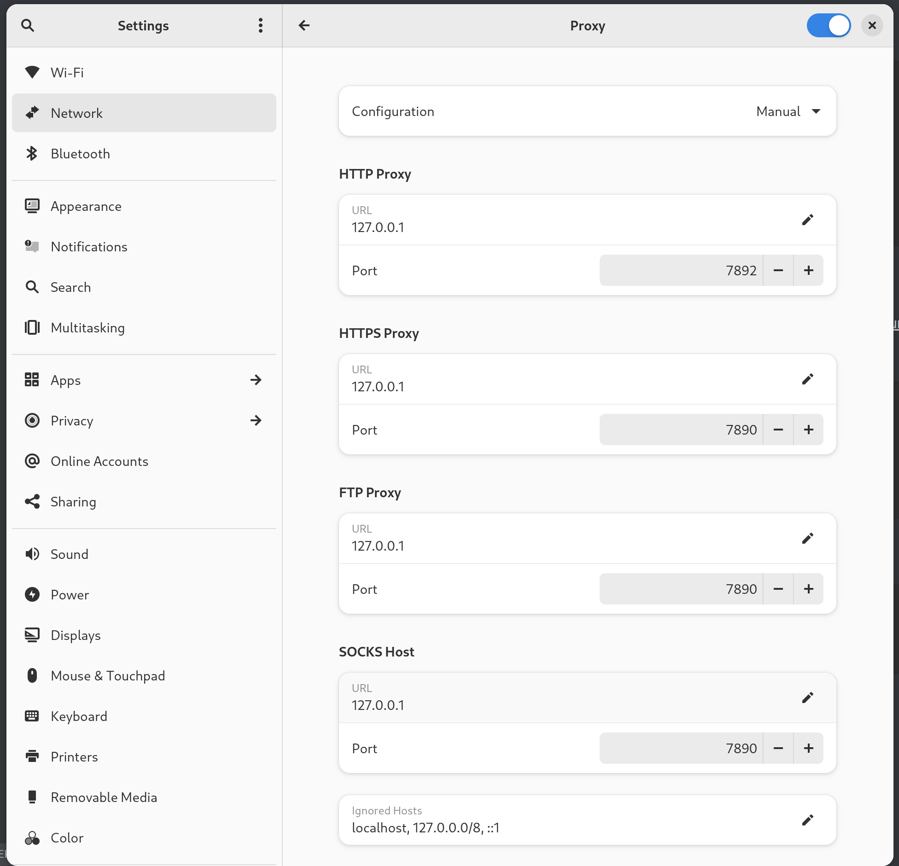

# 科学上网

## 未翻墙如何上github

1. 找到你想加速的域名，这里举例github.com

2. 在https://tool.chinaz.com/dns或ipaddress.com的域名查询中，找到一个比较块的ip地址

3. 配置hosts文件

   ```shell
   sudo vim /etc/hosts
   185.199.108.133 raw.githubusercontent.com
   20.205.243.168 api.github.com
   20.205.243.166 github.com
   140.82.112.4  github.com
   151.101.1.194 github.global.ssl.fastly.net
   :wq
   # 不要用我上面配置的ip，自己找，因为ip过一段时间会失效。
   ```

   

4. 然后可以访问了，如果在访问过程中有些按钮或链接比较慢，用开发者工具看看是哪个域名，依照上面的方法继续配置即可。

## archLinux for clash

```shell
# 安装clash
yay -S clash-premium-bin
# 首次运行
clash
#  启动后，会在 ~/.config中生成一个clash目录，里面是一些clash的配置信息，包括机场配置信息
ctrl+c退出shell
# 然后我们开始去找机场
```

看看这里的文章，有免费的机场可以使用。 https://github.com/bannedbook/fanqiang/tree/master/linux

然后，上面文档有连接跳转到这个文档 https://w1.v2ai.top/doc/#/linux/clash， 在这个文档中，我们可以下载到两个文件 [Country.mmdb](https://w1.v2ai.top/ssr-download/Country.mmdb)全球IP地址库文件和Clash订阅链接配置文件config.yaml（我用的这个网站的订阅链接）

```shell
# 将下载好的文件移动过来
mv /home/tc/Downloads/config_20230810.yaml ~/.config/clash/config.yaml
mv /home/tc/Downloads/Country.mmdb ~/.config/clash/
# 启动clash
clash
```

稍微说以下config.yaml

```yaml
# port: 7890
# socks-port: 7891
mixed-port: 7890 # 这个端口是上面两个的混合端口，可以使用一个端口就可以了，没必要用两个
```

给ArchLinux设置Clash代理Settings -> Network -> Proxy：




