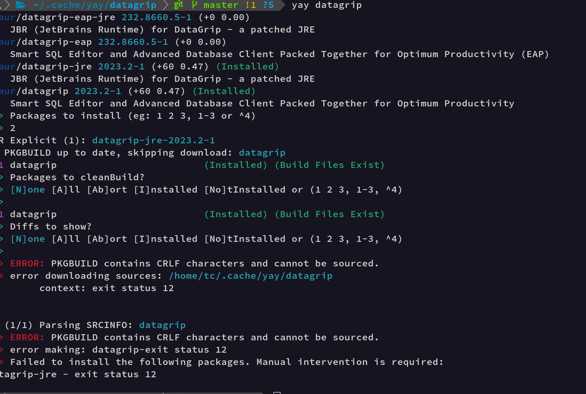
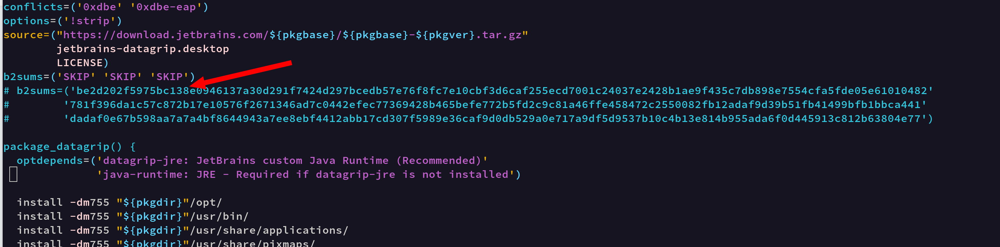

# 软件安装

## Gnome3.0桌面

### 桌面 .desktop 文件的位置

**以 root 权限安装的程序，**

其快捷入口大多创建在 `/usr/share/applications`目录下，

也可以创建在`~/.local/share/applications` 目录，

**以用户权限安装的程序**

则只能将快捷入口创建在`~/.local/share/applications` 目录下。


## **OBS Studio**

[官网](https://projectobs.com/zh-hant/download/)  可以在AUR中找到这个软件

[关于OBS Studio介绍](https://www.thosefree.com/obs-studio)

softinstall


## Typora

**ArchLinux：Typora设置gitee图床**

https://blog.51cto.com/u_15127687/4069365


## Neofetch

[Linux 中 9 个鲜为人知的 Neofetch 使用方法](https://www.linuxmi.com/linux-neofetch.html)

```shell
sudo pacman -S neofetch
```


## fortune&&cowsay

```bash
echo "hello world" | cowsay
fortune
fortune | cowsay
clear;fortune | cowsay | lolcat
clear;fortune | cowsay | lolcat -a
# 炫酷屌炸天
neofetch --ascii "$(fortune | cowsay -f dragon -W 30)" | lolcat -ats 60
```


## vivaldi浏览器

基于chromium内核的基础上套壳开发的浏览器，网上的结论就是更好用，更简洁。

参考[这里](https://zhuanlan.zhihu.com/p/92618817)

```shell
yay vivaldi
```


## https://mp.iqiyi.com/卸载一些无用软件

```bash
# 查看yay已经安装，但是不用上得功能
yay -s | grep gnome | grep Installed

# 卸载安装gnome-extra时，自带的游戏
yay -Rsn gnome-chess
yay -Rsn gnome-klotski
yay -Rsn gnome-mahjongg
yay -Rsn gnome-mines
yay -Rsn gnome-nibbles  # 贪吃蛇
yay -Rsn gnome-taquin   # 拼图
yay -Rsn gnome-sudoku   # 数独    
yay -Rsn gnome-tetravex #
yay -Rsn quadrapassel   # 俄罗斯方块
yay -Rsn lightsoff      # 黑白棋
yay -Rsn gnome-robots   # 卸载robots
yay -Rsn five-or-more   # 
yay -Rsn four-in-a-row
yay -Rsn tali
yay -Rsn swell-foop
yay -Rsn hitori
# gnome自带的浏览器，不好用
yay -Rsn epiphany

# 卸载一些我用不上的功能
# 联系方式
yay -Rsn gnome-contacts
# 拍照茄子
yay -Rsn cheese
# game 2048
yay -Rsn gnome-2048
yay -Rsn gnome-games
# Document Scanner
yay -Rsn simple-scan
yay -Rsn accerciser
# 已经有一个Gedit，不要TextEditor
yay -Rsn gnome-text-editor
```


## PKGBUILD安装报错修复经历

安装yay datagrip的时候报错：

`ERROR: PKGBUILD contains CRLF characters and cannot be sourced.`



经过网络查询，是因为PKGBUILD文件是windows中的换行符导致的CRLF，然后开始解决

```shell
cd /home/tc/.cache/yay/datagrip
# 将/r去掉
sed -i 's/\r//' PKGBUILD 
# 进行安装
makepkg -si
```

然后报这个错误：

`ERROR: One or more files did not pass the validity check!`

然后看来这个人的[博客记录](https://blog.csdn.net/qq_37284020/article/details/103991649)

核心是这句话：

> 找到对应的验证部分，把里面的验证的码修改为SKIP，SKIP一定要是大写（md5sums sha1sums sha256sums sha224sums, sha384sums, sha512sums b2sums）



```shell
vim PKGBUILD
b2sums=('SKIP' 'SKIP' 'SKIP')
:wq
# 然后进行安装，就安装成功来
makepkg -si
```


