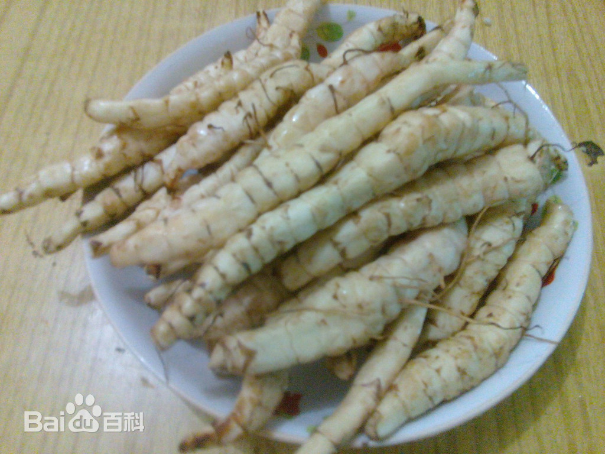
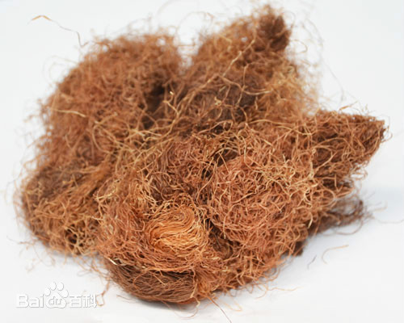

# 农村常见中药

## 地参

近些年，大量研究表明地参具有抗肿瘤、降血脂、抗衰老、降血糖、调节月经紊乱、缓解经期痉挛和心血管疾病等疗效，其功能与冬虫夏草相当。

药用价值

全草入药，乃本草经著录的泽兰正品，为妇科要药，能通经利尿，对产前产后诸病有效，根通称地笋，可食，又为金疮肿毒良剂，并治风湿关节痛。

食用价值

可以作为蔬菜食用，享有“蔬菜珍品”等美誉。地参叶子一年可割数茬，可以用于煮茶或煮汤；根部可作为高营养价值的蔬菜食用。

地参全身都是宝，春夏地参可采摘嫩茎叶，凉拌、炒食、做汤均可，主要食用晚秋以后采挖出的洁白脆嫩的环形肉质参。地参根茎观之洁白如玉，食之清爽脆嫩，可炒食、蒸煮、做汤、腌渍、醋泡、糖浸、蜜饯、做酱菜均可，尤其香酥油炸地参，风味独特、脆香无比，堪称菜中一绝，食之口味清香，与一般油炸食品不同，这道菜的独特之处在于不上火，反而祛火。且具有提神醒脑、开胃化食、补肝肾两虚、强腰膝筋骨之效。《中草药大辞典》等权威资料记载,地参含有多种药用成分，其茎叶晒干后即是名为名贵中草药。全草可提取挥发油和单宁。全草入药，具有活血、利尿、通经、滋阳、润燥、调血脂、通九窍、利关节、养气血等功能，主治腹痛、水肿、产后瘀血、跌打损伤等症。《中华本草》详细介绍地参不但能作为蔬菜食用，而且晒干后入药，功能与冬虫夏草相当。经现代医学研究表明：地参含有人体所需的20多种微量元素、18种氨基酸、酚类、糖类等多种营养成分。经常食用地参有抑制癌细胞扩散和减肥的特殊疗效，因此享有“蔬菜珍品”的美称。

## 薄荷

薄荷具有疏散风热，清利头目，利咽，透疹，疏肝行气的功能。

## 玉米须

有利尿消肿;清肝利胆的功效。主治主水肿，小便淋沥，黄疸，胆囊炎，胆结石，高血压，糖尿病，乳汁不通。

