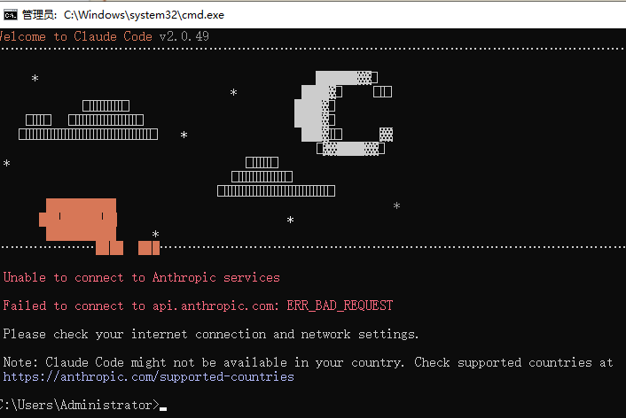
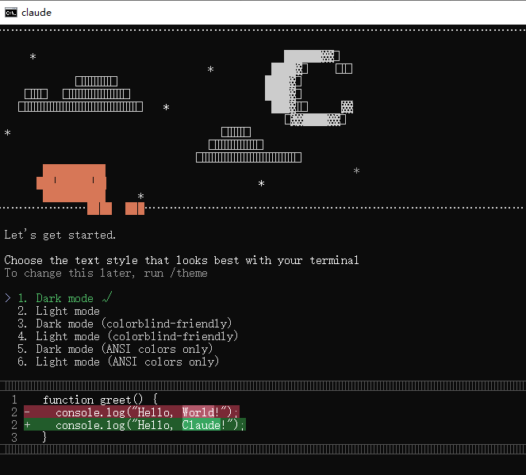

# Claude Code入门与配置


## 安装

1. 安装Node.js

​	Claude Code安装需要依赖NodeJs

   ```bash
node --version
npm --version
   ```

2. 安装Claude Code

   ```bash
   # 设置淘宝镜像源
   npm config set registry https://registry.npmmirror.com
   # 全局安装
   npm install -g @anthropic-ai/claude-code
   # 验证安装
   claude --version
   # 运行
   claude
   ```
   
   

## 配置文件目录结构

用户目录 或者 项目目录中，有一个.claude的目录，下面是比较完整的目录结构（刚学习的时候，了解即可）。

.claude/
├── config.json
│   # CLI 启动级配置（入口）
│   # 默认 profile、模型选择、运行模式
│
├── settings.json
│   # ⭐ 通用设置（可共享 / 可提交）
│   # system prompt、默认参数、工具策略
│
├── settings.local.json
│   # ⭐ 本地覆盖设置（私有）
│   # API Key、proxy、本地调试开关
│
├── .gitignore
│   # 忽略本地状态、缓存、隐私数据
│
├── profiles/
│   ├── default.json
│   │   # 默认运行配置
│   │
│   ├── work.json
│   │   # 工作模式（更严格权限 / 更保守工具）
│   │
│   └── restricted.json
│       # 高安全 / 沙箱模式
│
├── sessions/
│   ├── index.json
│   │   # 会话索引（session 元数据）
│   │
│   └── session-<id>.json
│       # 单会话完整上下文（消息 / 工具调用）
│
├── memory/
│   ├── project.json
│   │   # 项目级长期记忆
│   │   # 技术栈、规范、目标
│   │
│   └── user.json
│       # 用户级长期记忆
│       # 偏好、语言风格、习惯
│
├── prompts/
│   ├── system.md
│   │   # 系统级 Prompt（最高优先级）
│   │
│   ├── coding.md
│   │   # 编程 / 架构类 Prompt
│   │
│   ├── review.md
│   │   # Code Review / 文档审阅
│   │
│   └── debug.md
│       # Debug / 问题定位
│
├── skills/
│   ├── index.json
│   │   # Skill 注册表
│   │
│   ├── fs.json
│   │   # 文件系统能力声明
│   │
│   ├── shell.json
│   │   # Shell 执行能力
│   │
│   ├── git.json
│   │   # Git 操作能力
│   │
│   └── web.json
│       # Web / HTTP 能力
│
├── permissions/
│   ├── allow.json
│   │   # 明确允许的操作
│   │
│   ├── deny.json
│   │   # 明确禁止的操作
│   │
│   └── policy.json
│       # 权限裁决策略（优先级 / 冲突规则）
│
├── tools/
│   ├── definitions.json
│   │   # Tool Schema 定义
│   │
│   └── state.json
│       # Tool 运行态状态
│
├── schemas/
│   ├── tool-input.schema.json
│   │   # Tool 输入 JSON Schema
│   │
│   └── tool-output.schema.json
│       # Tool 输出 JSON Schema
│
├── shortcuts.json
│   # CLI 快捷指令 / alias
│
├── hooks/
│   ├── pre-run.sh
│   │   # 启动前 Hook
│   │
│   └── post-run.sh
│       # 结束后 Hook
│
├── logs/
│   ├── cli.log
│   │   # CLI 主日志
│   │
│   ├── error.log
│   │   # 错误日志
│   │
│   └── tools.log
│       # Tool 调用日志
│
├── cache/
│   ├── prompts/
│   │   # Prompt 缓存
│   │
│   ├── responses/
│   │   # LLM 响应缓存
│   │
│   └── embeddings/
│       # 向量缓存（RAG / Memory）
│
├── telemetry/
│   └── usage.json
│       # 使用统计 / Token 计量
│
├── experiments/
│   ├── prompt-a-b.json
│   │   # Prompt A/B 实验
│   │
│   ├── model-comparison.json
│   │   # 模型对比实验
│   │
│   └── latency-test.json
│       # 延迟 / 性能测试
│
└── state.json

    # CLI 全局运行状态
    # 当前 profile、最近 session


## 配置代理网络和API方式

1. 在当前项目目录下创建.claude/settings.json

   提示：如果做了全局的科学上网，不用配置这个!

   ```json
   {
   	"env": {
           "HTTP_PROXY": "http://127.0.0.1:7890",
           "HTTPS_PROXY": "http://127.0.0.1:7890"
       }
   }
   ```

   将科学上网打开后，再次运行claude：

   

2. 配置API Key环境变量

   ```bash
   setx ANTHROPIC_API_KEY "sk-VnQsySMzD4NddsspuykS4FfoGVcBw0ZnR634iV7Gdsda5"
   setx CLAUDE_CODE_GIT_BASH_PATH "C:\Program Files\Git\bin\bash.exe"
   ```

   官方两种计费模式，按月付费和按token付费，前者用于频繁使用，后者用于较少使用。

   可以在国内找套壳的服务，这样的价格会比你在官方划算。比如：[Code Router](https://api.codemirror.codes/)


## cc镜像中转站

### Code Router

使用说明：[入口地址](https://api.codemirror.codes/about)

