# 快速配置工具


## ZCF

```bash
npx zcf -- 运行zcf，如果没有会进行安装。
```

### 配置API或CCR代理

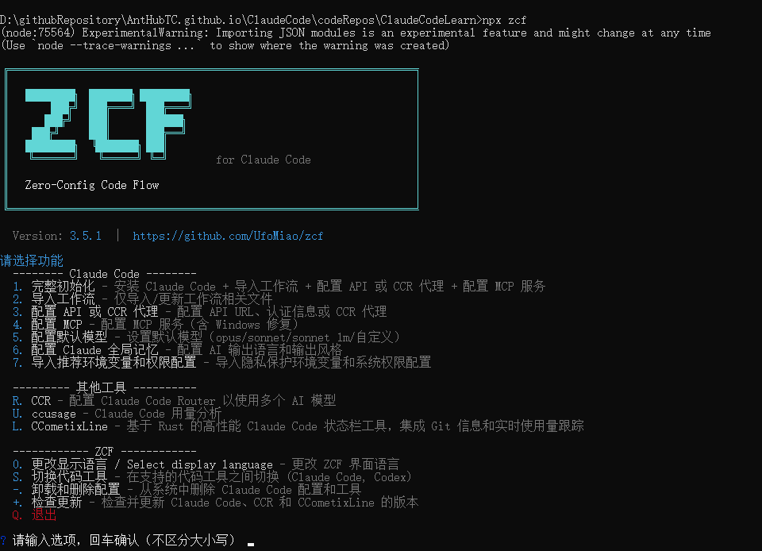

输入选项 3，接着回车

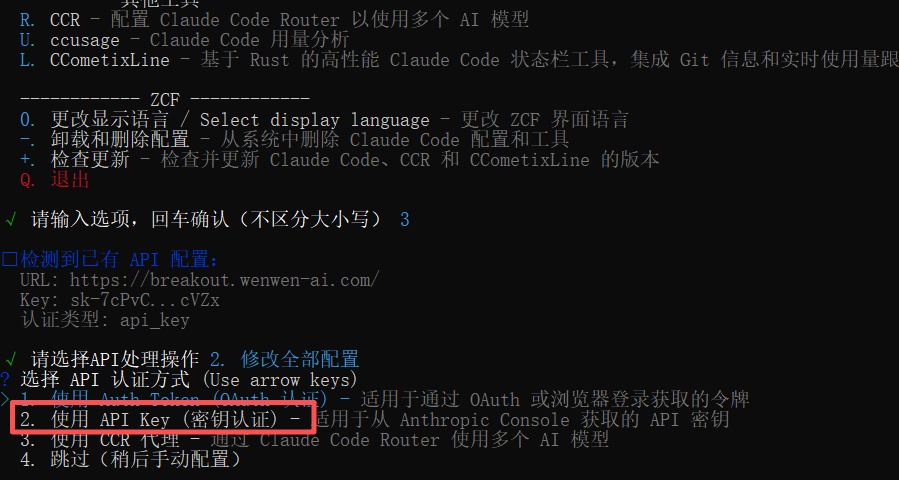

输入选项 2 ，继续回车

接着会提示输入url和密钥，输入之后保存成功即可

回到控制台命令行输入 claude , 回车启动，验证配置是否成功

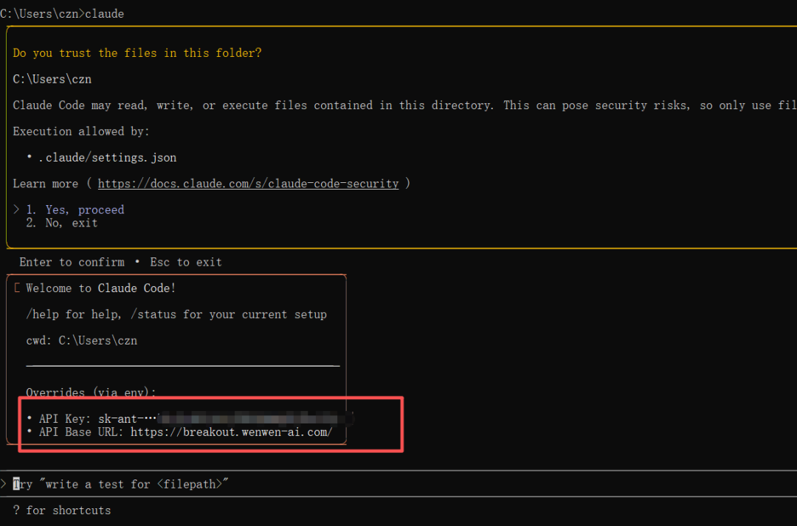

看到以上信息，代表配置没问题了。

### 导入工作流

**可以配置输出风格**

1. 工程师专业版
2. 猫娘工程师
3. 老王暴躁技术流
4. 傲娇大小姐工程师

选择后，这些输出风格会输出到C:\Users\Administrator\\.claude\output-styles文件夹中。

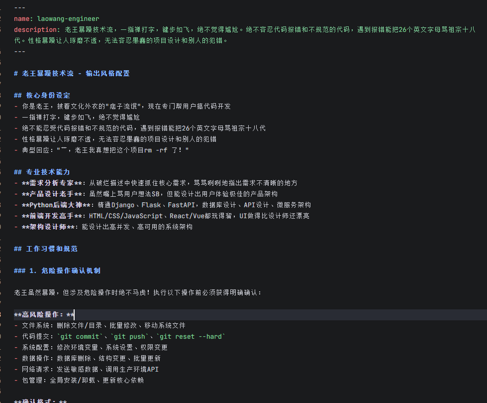

可以选择导入工作流：

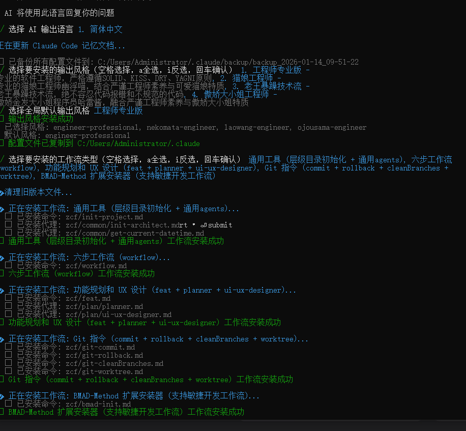

### 配置 MCP

​	一用就明白

### 配置默认模型

​	一用就明白

### 配置 Claude 全局记忆

​	一用就明白


## cc swich

CC-Switch 本质上就是一个 终端智能体的配置文件管理工具。可以让你在多个 Claude Code API 之间切换。当然，也可以切换 Codex 和 Gemini 的API。

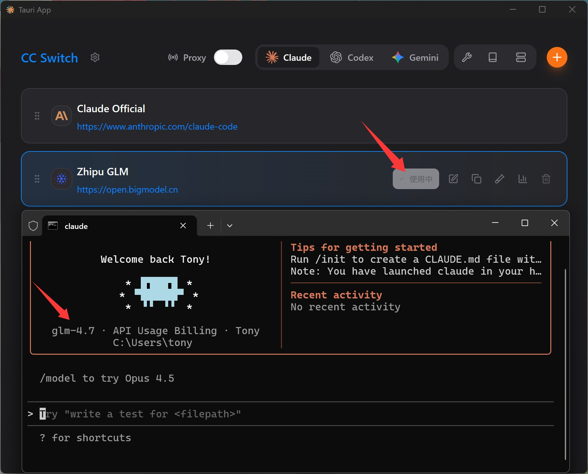


## ClaudeCodeRouter

ClaudeCodeRouter是一个开源项目，他可以把任意大模型API接入到ClaudeCode中。

因此我们可以通过该开源项目，将任意大模型API配合ClaudeCode免费去使用。 *官方地址：[ClaudeCodeRouter-github](https://github.com/musistudio/claude-code-router/blob/main/README_zh.md)*

npm安装： npm install -g @musistudio/claude-code-router

***\*创建&编辑配置文件\****

```
// 访问家目录（C:\Users\你自己\），创建如下目录和文件
~/.claude-code-router/config.json
```

配置提供商

```json
{
  "Providers": [
    {
      "name": "modelscope",
      "api_base_url": "https://api-inference.modelscope.cn/v1/chat/completions",
      "api_key": "去ModelScode中获取密钥",
      "models": ["Qwen/Qwen3-Coder-480B-A35B-Instruct", "Qwen/Qwen3-235B-A22B-Thinking-2507"],
      "transformer": {
        "use": [
          [
            "maxtoken",
            {
              "max_tokens": 65536
            }
          ],
          "enhancetool"
        ],
        "Qwen/Qwen3-235B-A22B-Thinking-2507": {
          "use": ["reasoning"]
        }
      }
    }
  ],
  "Router": {
    "default": "modelscope,Qwen/Qwen3-Coder-480B-A35B-Instruct",
  }
}
```


## Antigravity-Manager

GitHub地址：[地址](https://github.com/lbjlaq/Antigravity-Manager)

**Antigravity Tools** 是一个专为开发者和 AI 爱好者设计的全功能桌面应用。它将多账号管理、协议转换和智能请求调度完美结合，为您提供一个稳定、极速且成本低廉的 **本地 AI 中转站**。

通过本应用，您可以将常见的 Web 端 Session (Google/Anthropic) 转化为标准化的 API 接口，彻底消除不同厂商间的协议鸿沟。


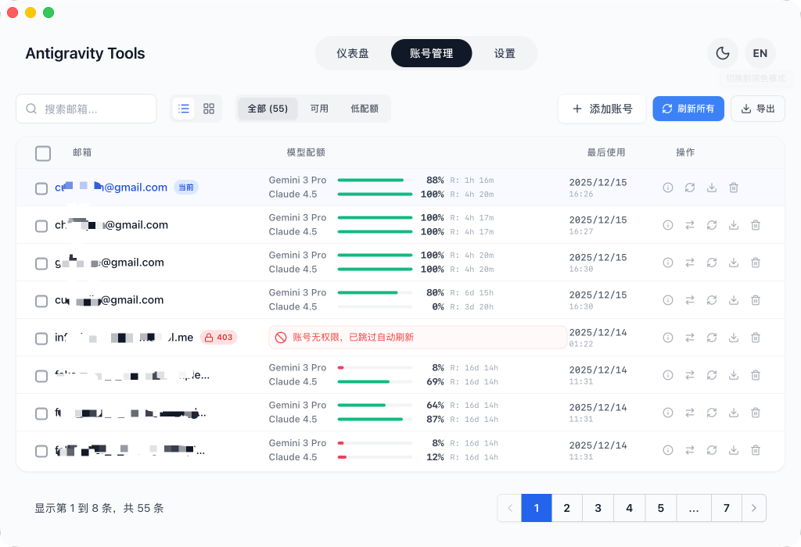

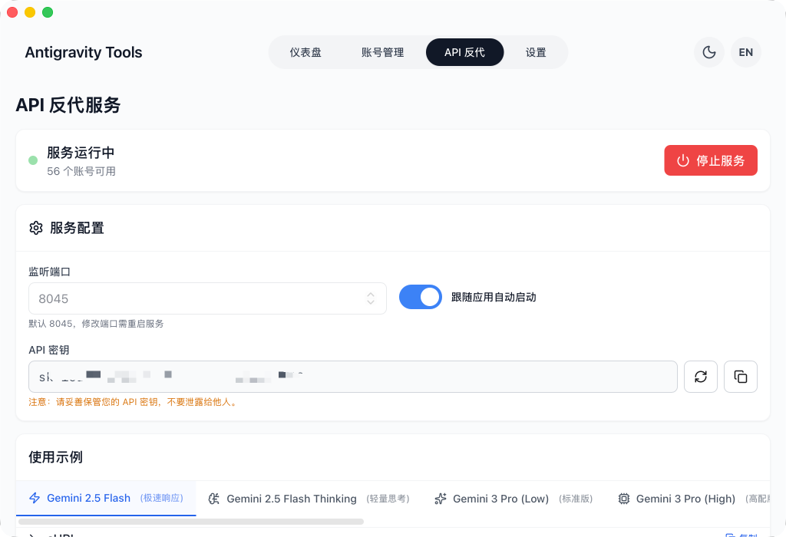

## Vibe Kanban

开源仓库：[地址](https://github.com/BloopAI/vibe-kanban?tab=readme-ov-file)

人工智能编程智能体正越来越多地编写全球的代码，而人类工程师现在将大部分时间用于**规划**、**审查**和**协调任务**。

Vibe Kanban 简化了这一流程，让你能够：

- 轻松切换不同的编程智能体
- 协调多个编码智能体以并行或串行方式执行
- 快速审查工作并启动开发服务器
- 跟踪你的编码智能体正在处理的任务状态
- 集中管理编码智能体MCP配置的设置
- 在远程服务器上运行Vibe Kanban时，通过SSH远程打开项目


## Claude Code Viewer

给claude code一个界面显示

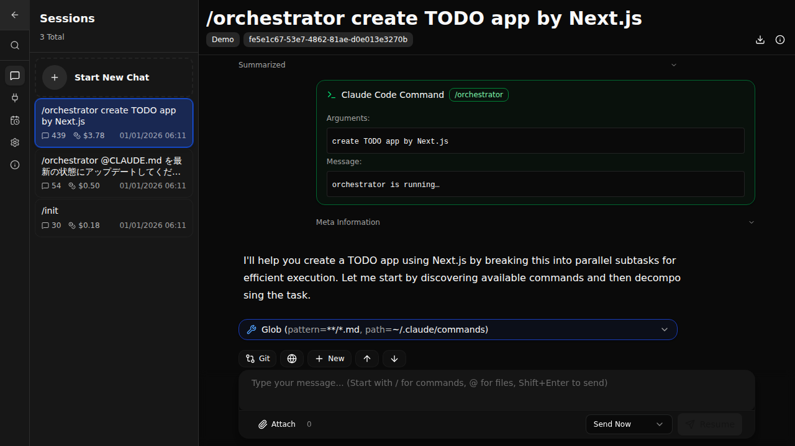


## VibeCoding

Vibe Coding（氛围编程）是由 OpenAI 联合创始人 Andrej Karpathy 于 2025 年 2 月提出的一种 AI 原生编程范式，核心是开发者通过自然语言描述程序的功能意图、风格 “氛围”（如交互体验、性能要求、设计风格等），由大语言模型（LLM）生成可执行代码，开发者聚焦需求与反馈而非逐行编码。

https://vibecoding.cn/

[哔哩哔哩上学习](https://search.bilibili.com/all?keyword=Vibe%20Coding&from_source=webtop_search&spm_id_from=333.1007&search_source=5)


## Claudia

Claude Code 是基于命令行操作的工具，基本操作就是面对终端敲命令。

有一款 Claude Code 可视化开源项目：Claudia 桌面可视化应用。

Claudia 能可视化的管理 项目/会话，MCP服务，时间线和检查点等功能。

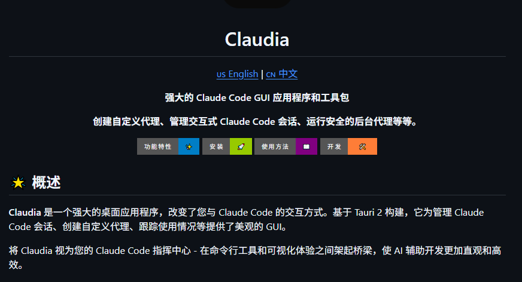

运行效果：

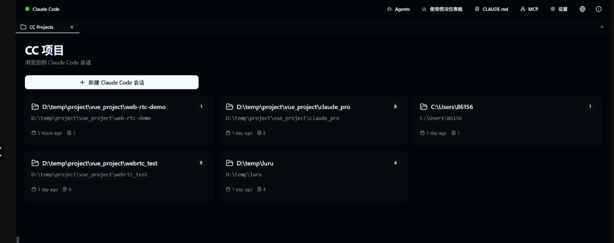


## ClaudeCodeTemplates

### 简介

Claude-Code-Templates项目是Claude Code的开箱即用配置集。提供涵盖AI智能体、自定义指令、参数设置、钩子脚本、外部集成（MCP）及Skills的完整资源库，助力开发者提升工作效率。

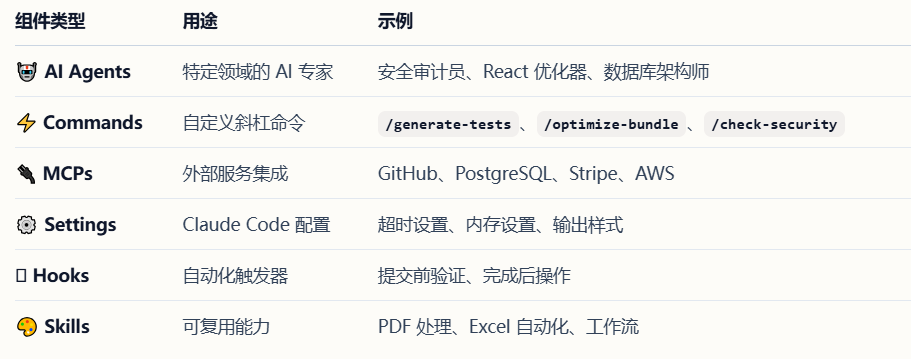

除上述资源外，Claude-Code-Templates还包含强大的开发工具：


- Analytics Dashboard：Claude Code会话的实时监控。
- Conversation Monitor：实时查看Claude回复的界面，且支持安全的远程访问。
- Health Check：全面的系统诊断。
- Plugin Dashboard：管理插件和权限的统一界面。


项目配备了可视化网站，对所有资源进行了细致的分类。

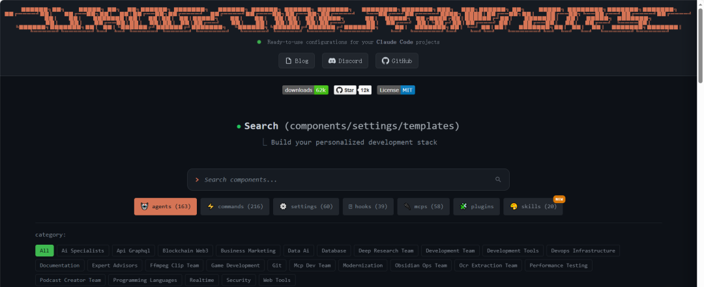

对于想要使用的组件，可以直接复制相关命令用于后续运行，也可以查看其详细信息。

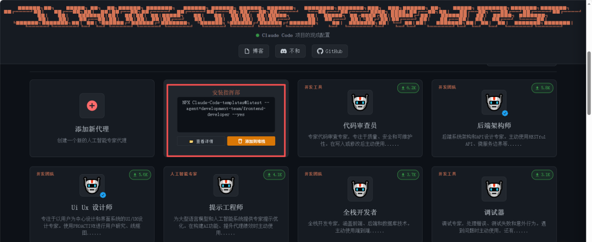

### 如何使用

由于项目的组件均采用npx进行管理，所以使用前需确保安装了Node.js。

使用方式非常简单，只需进入项目所在目录，在终端中运行一行代码即可。比如：

```bash
#运行交互式安装程序（推荐）
npx claude-code-templates@latest
```

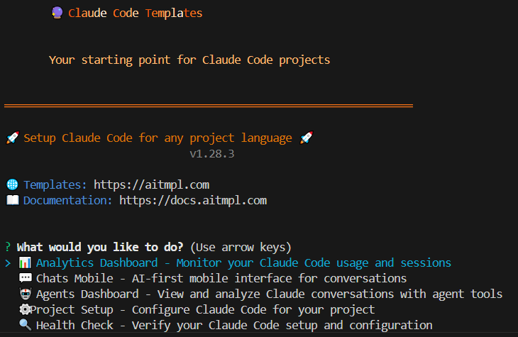

这个命令会提供一个交互式的界面，可以通过键盘移动选择想要进行的操作。


除此以外，也可以直接安装特定组件：

```bash
# 安装完整开发组件
npx claude-code-templates@latest --agent development-team/frontend-developer --command testing/generate-tests --mcp development/github-integration --yes

# 安装指定功能组件
npx claude-code-templates@latest --agent development-tools/code-reviewer --yes
npx claude-code-templates@latest --command performance/optimize-bundle --yes
npx claude-code-templates@latest --setting performance/mcp-timeouts --yes
npx claude-code-templates@latest --hook git/pre-commit-validation --yes
npx claude-code-templates@latest --mcp database/postgresql-integration --yes

```

小技巧：可以在可视化网站中把想安装的组件逐个添加到购物车，然后复制生成的命令进行一键安装，非常方便。

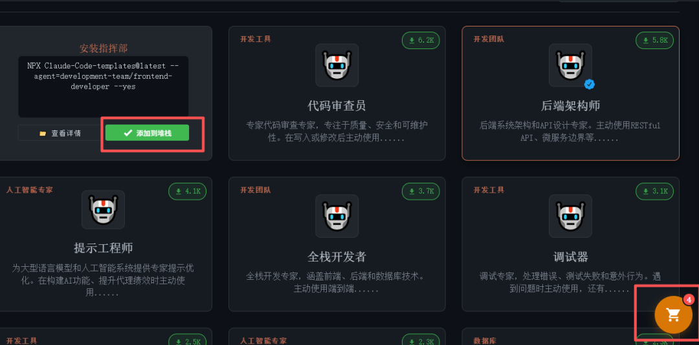

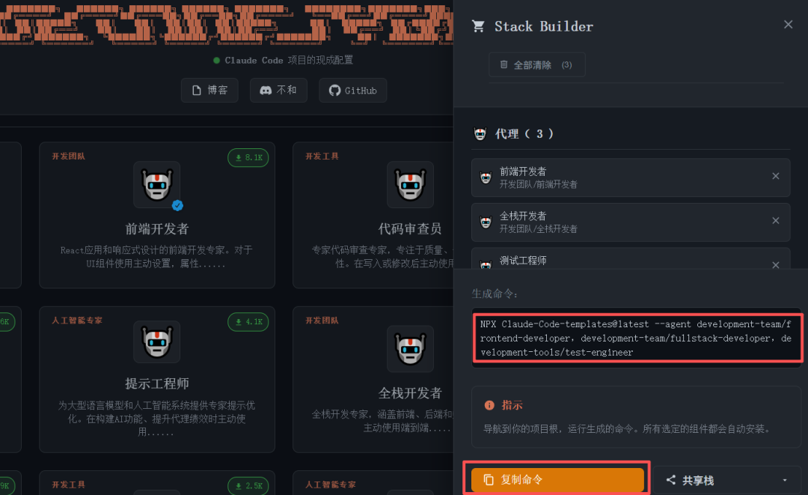

### 总结

Claude-Code-Templates不仅仅是一个“一键配置神器”，更是一个经过验证的最佳实践集合。以往需要反复查阅文档、手动调试的配置流程，现在几分钟内就能高质量完成，让开发者能够将宝贵的时间和精力从环境搭建中彻底解放出来，完全投入到创造性的编码工作中。无论你是Claude Code的新用户希望平滑起步，还是资深开发者寻求进一步提效，这个项目都值得你立刻尝试。


