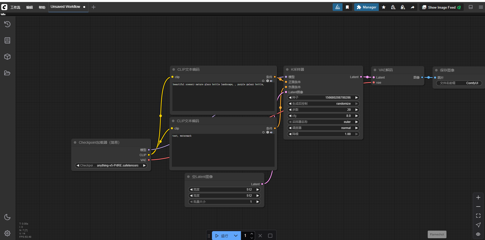
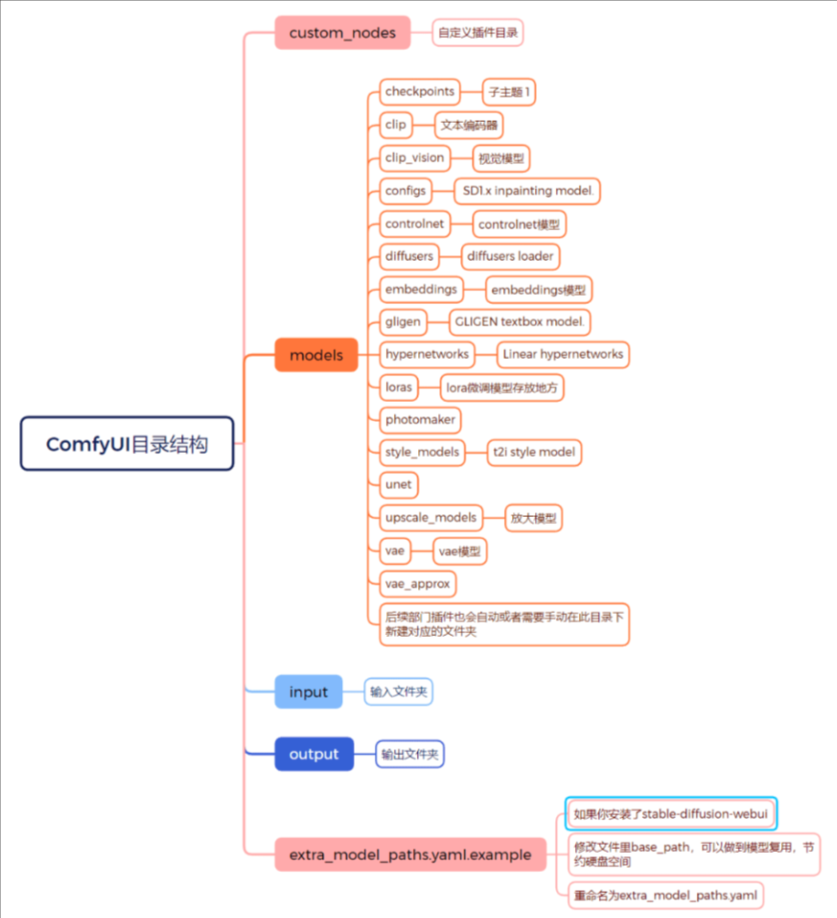
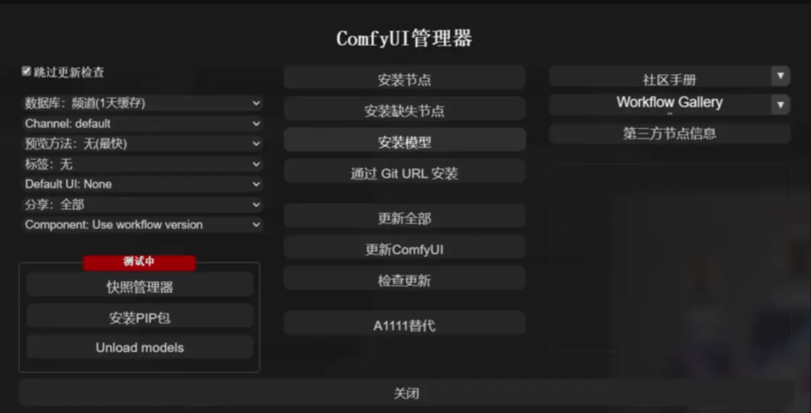
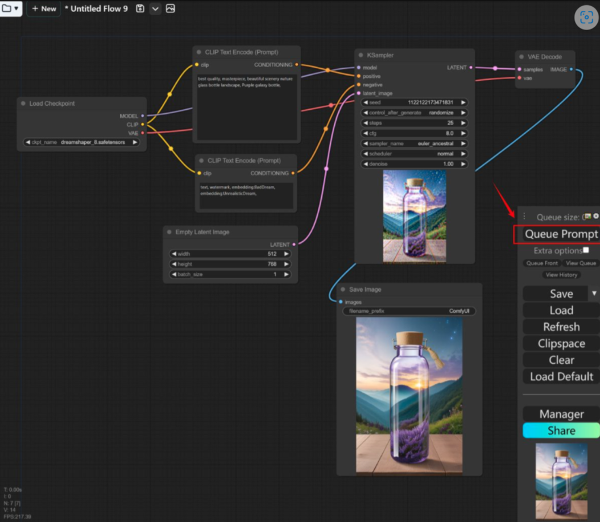

# 2026 秋叶 ComfyUI 整合包（aki-V3.7）安装与使用技术教程

秋叶大佬 2026 年发布的 ComfyUI 整合包，从版本介绍、 软件定义、下载安装、环境配置、模型部署、插件安装到基础使用流程，进行完整技术化讲解，指导用户从零完成 ComfyUI 部署与 AI 绘画基础操作，全程保留完整功能与配置细节，专注实操技术教学。

## 一、秋叶 ComfyUI 整合包版本说明

2026 年最新版本为ComfyUI-aki-V3.7，版本核心升级内容如下：

1. 底层运行环境升级至 Python 3.13、Torch cuda 13.0 版本；
2. 同步适配官方最新版 ComfyUI，兼容市面所有主流 AI 绘画模型；
3. 对预装自定义节点进行精简，移除停止更新、老旧冗余及无实际功能的节点；
4. 增补实用功能性节点与视频生成类专用节点，扩展图像、视频创作能力。

该整合包采用节点式工作流设计，解压后可直接部署使用，无需复杂底层环境编译配置。

## 二、ComfyUI 核心概述

ComfyUI 是基于 Stable Diffusion 架构开发的节点式 AI 绘画图形交互界面，是目前主流的 AI 绘画生产工具。

软件核心特性为可视化工作流自定义搭建：以节点为基础单元，通过连线组合的方式，自主编排图像生成全流程。每个独立节点对应单一固定功能，包含提示词编码、图像尺寸设置、采样运算、图像解码、成品保存等操作。用户可按需自由组合节点逻辑，自定义生成流程，实现精细化、个性化的 AI 图像创作。

## 三、ComfyUI 秋叶整合包下载与安装部署

### 3.1 整合包资源下载

秋叶 ComfyUI 历史及新版整合包（V2.7+V1.7 合集）下载地址： 百度网盘： https://pan.baidu.com/s/1-WMAz-eKpjfQCm4KSitd8A?pwd=5555 提取码: 5555 建议保存资源订阅，后续版本更新可及时获取通知。

### 3.2 基础运行界面说明

整合包启动后默认主界面包含核心功能区域：队列数量显示、提示词执行队列、历史记录、工作流保存 / 加载 / 刷新、剪贴空间清理、语言切换、插件管理器、工作流分享等基础功能按钮。

界面核心基础节点组件包含：CLIP 文本编码器、K 采样器、VAE 解码器、图像保存模块，为图像生成必备基础节点。同时支持随机种子设置、采样器调度器参数自定义、运行耗时与帧率实时监控等功能。

### 3.3 大模型安装配置（必配置项）

秋叶 ComfyUI 整合包默认不内置任何 AI 绘画大模型，首次使用前必须手动配置模型，提供**手动安装**和**共享 SD WebUI 模型目录(我当前就是这种)**两种部署方式。

### 3.3.1 手动安装模型

打开 ComfyUI 根目录，进入models核心模型文件夹；
各子文件夹模型存放规范：
checkpoints：存放 Stable Diffusion 基础大模型；
loras：存放 Lora 微调模型；
embeddings：存放 Embedding 嵌入词模型；
模型下载渠道：可从 Civitai、LiblibAI 等专业 AI 模型平台下载对应格式模型文件，放入对应文件夹即可生效。

### 3.3.2 共享 SD  WebUI 模型目录（推荐）

若本地已安装 Stable Diffusion-WebUI 且已下载完整模型，可通过目录共享复用模型，避免重复下载、节省硬盘存储空间，配置步骤如下：

定位 ComfyUI 根目录中的extra_model_paths.yamlexample文件；
将文件重命名为extra_model_paths.yaml；
编辑文件内base_path参数，填写本地 SD WebUI 安装根目录路径；
保存文件后重启 ComfyUI，即可自动识别复用 SD WebUI 已有的全部模型。

### 3.3.3 ComfyUI 完整目录结构说明

custom_nodes：自定义插件、第三方节点存放目录；

checkpoints：基础大模型存储目录；

clip：文本编码器模型目录；

clip_vision：视觉识别模型目录；

configs：SD1.x 版本修复模型配置目录；

controlnet：Controlnet 控制模型目录；

diffusers：扩散模型加载器目录；

gligen：GLIGEN 文本框模型目录；

hypernetworks：超网络模型目录；

photomaker：人像定制模型目录；

style_models：风格化模型目录；

unet：UNet 网络模型目录；

upscale_models：图像超分辨率放大模型目录；

vae：VAE 图像解码模型目录；

vae_approx：VAE 近似计算模型目录；

input：待处理输入图像存放目录；

output：AI 生成成品图像默认输出保存目录。

后续新增插件、自定义节点，可根据功能类型在对应目录新建子文件夹存放。

### 3.4 插件管理器 ComfyUI-Manager  安装

插件是 ComfyUI 扩展功能的核心，优先安装ComfyUI-Manager 插件管理器，可实现一键安装缺失节点、批量更新插件、在线安装第三方节点等功能，安装步骤：

1. 进入 ComfyUI 安装根目录下的custom_nodes文件夹；
2. 通过 Git 命令拉取 ComfyUI-Manager 源码完成安装；
3. 安装完成重启 ComfyUI，管理器集成至主界面，支持跳过更新检查、安装缺失节点、通过 Git 链接安装插件、一键更新全部插件、查看社区手册、工作流图库、快照管理、PIP 依赖包安装等拓展功能。

## 四、ComfyUI 基础标准使用流程

完整图像生成遵循固定节点逻辑流程，具体操作步骤如下：

加载基础大模型：在Load Checkpionts（检查点加载器）节点中，下拉选择已放入checkpoints文件夹的 AI 绘画大模型；
配置正负向提示词：打开Clip Text Encode（CLIP 文本编码）节点，第一个文本框填写正向提示词，描述期望生成的画面内容；第二个文本框填写反向提示词，屏蔽画面瑕疵、水印、畸形等无效元素；
设置图像尺寸：在Empty Latent Image（空潜空间图像）节点中，自定义设置生成图像宽度、高度及批次生成数量；
配置采样生成参数：在KSampler（K 采样器）节点中，设置迭代步数、CFG 引导参数、采样算法、调度器类型等核心生成参数；
生成并保存图像：确认所有节点参数配置无误后，点击界面右侧Queue Prompt按钮执行生成任务，运算完成后自动通过VAE Decode解码、Save Image节点保存成品至output目录；
可实时查看生成耗时 T、帧率 FPS 等运行数据，支持随机种子重置、生成模式自定义等进阶设置。

## 参考文档

[2026 秋叶 ComfyUI 整合包（aki-V3.7）安装与使用技术教程](https://blog.csdn.net/wyj985860/article/details/161492537?ops_request_misc=&request_id=&biz_id=102&utm_term=ComfyUI%E7%A7%8B%E5%8F%B6&utm_medium=distribute.pc_search_result.none-task-blog-2~all~sobaiduweb~default-1-161492537.142^v102^pc_search_result_base3&spm=1018.2226.3001.4187)

[comfyui新手到底该选秋叶整合包，还是官方包？](https://blog.csdn.net/m0_71744960/article/details/147422362?ops_request_misc=&request_id=&biz_id=102&utm_term=ComfyUI%E7%A7%8B%E5%8F%B6&utm_medium=distribute.pc_search_result.none-task-blog-2~all~sobaiduweb~default-0-147422362.142^v102^pc_search_result_base3&spm=1018.2226.3001.4187)
