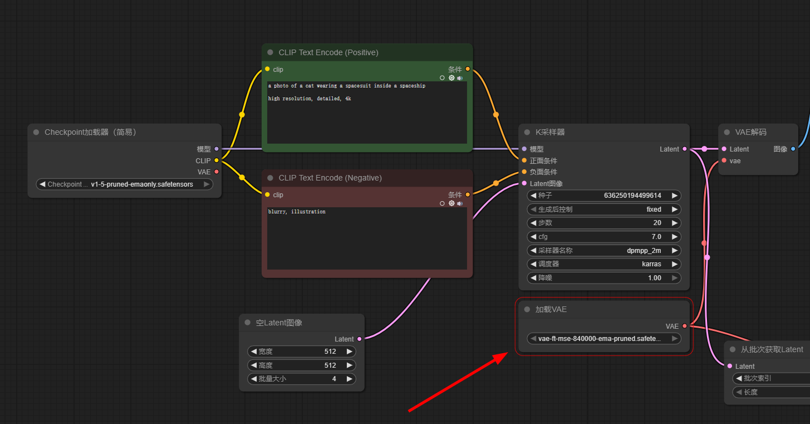
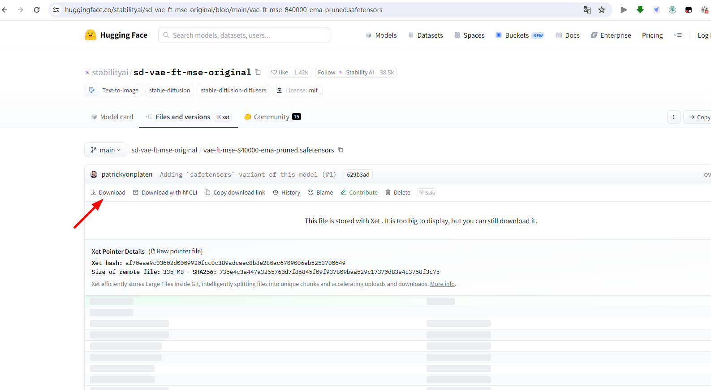
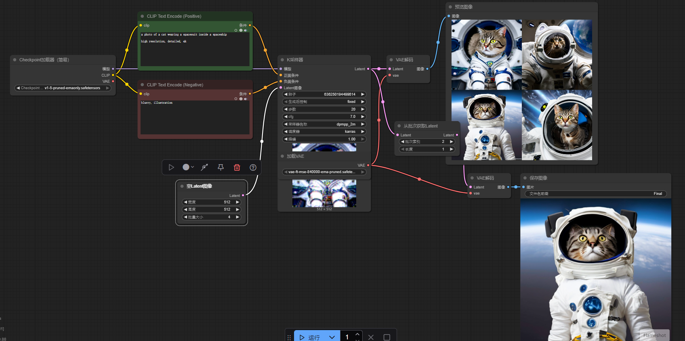

# 解决问题指南

## 解决问题核心原则

不知道的问题， 先问AI（比如豆包）

## 缺失模型

如果使用他人的模型，将模型拖入到工具中，然后执行发现有的节点显示是红色的线框住的，这个时候就要检查是不是模型缺失了。

然后就去找模型->[github](https://github.com/), [huggingface](https://huggingface.co/), [LibLibAI](https://www.liblib.art/)，[civitai](https://civitai.com/)，[OpenModelDB](https://openmodeldb.info/)等网站去找。

然后我放到了对应文件夹中，就可以了

E:\soft\SD\stable-diffusion-webui\models\VAE

