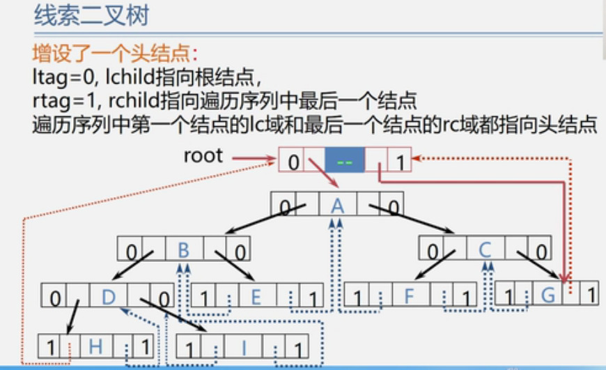

# 树

## 树的定义

​	树(Tree)是n(n>=0)个节点的有限集。

​			若 n = 0,称为空树；

​			若 n > 0，则它满足如下两个条件：

1. 有且仅有一个特定的称为根(Root)的节点；
2. 其余节点可分为m(m>=0)个互不想交的有限集T1，T2，T3，....,Tm，其中每一个集合本身又是一棵树，并称为根的子树(SubTree)。

## 二叉树的定义

​	二叉树是n(n>=0)个结点的有限集，它或者是空集(n=0)，或者由一个根结点及两颗互不相交的分别称作这个根的左子树和右子树的二叉树组成。

​	特点：

1. 每个结点最多有两孩子（二叉树中不存在度大于2的节点）。
2. 子树有左右之分，其次序不能颠倒。
3. 二叉树可以说空集合，根可以有空的左子树或空的右子树。

注：二叉树不是树的特殊情况，它们是两个概念。

## 二叉树的性质和存储结构

1. 性质1：
$$
在二叉树的第i层上至多有 2^{i-1}个节点(i>=1)。 \\ 第i层至少有i个节点
$$
2. 性质2：
$$
   深度为k的二叉树至多有2^k-1个节点(k>=1) \\ 深度为k的二叉树至少有k个节点
$$

3. 性质3：
$$
对任何一颗二叉树T，如果其叶子数为n_0，度为2的节点数为n_2，则n_0=n_2+1
$$

##    满二叉树

$$
一颗深度为k且有2^k-1个节点的二叉树称为蛮二叉树。
$$

特点：

1. 每一层上的节点数都是最大结点数（即每层都满）。
2. 叶子结点全部都在最顶层。

##  完全二叉树

​		注：在满二叉树中，从最后一个节点开始，连续去掉任意个结点，即是一颗完全二叉树。（一定是连续的去掉）

​	特点：1. 叶子只可能分布在层次最大的两层上。

  2. 对任一节点，如果其右子树的最大层次为i，则其左子树的最大层次必为i或i+1。

		3. 满二叉树一定是完全二叉树，反之则不一定。

		4. 具有n个节点的完全二叉树的深度为
     $$
     [log_2n]+1
     $$
     ​	注：【x】：称作x的底，表示不大于x的最大整数。

		5. 性质5：如果一颗有n个节点的完全二叉树，则对任一结点i，有：
	
     		1. 如果i=1,则结点i是二叉树的根，无双亲；如果i>1，则其双亲是接待你[i/2]。
     		2. 如果2i>n，则结点i为叶子结点，无左孩子；否则，其左孩子说结点2i。
     		3. 如果2i+1>n，则节点i无右孩子；否则，其右孩子是节点2i+1。

## 二叉树的性质和存储结构

### 顺序存储结构

​		二叉树的顺序存储：按满二叉树的节点层次编号，依次存放二叉树的数据元素。[视频地址](https://www.bilibili.com/video/BV1nJ411V7bd?p=84)

```c
// 二叉树顺序存储表示
#define MAXSIZE 100
typedef TElemType SqBiTree[MAXSIZE]
SqBiTree bt;
```

二叉树的顺序存储结构的**缺点**：

- 大小固定，不适用于元素变化特别大；
- 二叉树出现空节点，需要存储占位符，会浪费空间。

**特点：**节点间关系蕴含在其存储位置中浪费空间，适用于存满二叉树和完全二叉树。

### 链式存储结构

```c
typedef struct BiNode {
	TElemType data;
	struct BiNode *lchild, *rchild; // 左右孩子指针
} BiNode, *BiTree;
```

在n个结点的二叉链表中，有__n+1__个空指针域。

分析：比有2n个链域。除根节点外，每个节点有且仅有一个双亲，所以只会有n-1个节点的链域存放指针，指向非空子女节点。空指针数目=2n-(n-1)=n+1。

## 三叉链表存储结构

```c
typedef struct TriTNode {
	TElemType data;
	struct TriTNode *parent, *lchild, *rchild;
} TriTNode, *TriTree;
```

除了根节点，其它节点都有双亲。

## 遍历二叉树

[视频资料](https://www.bilibili.com/video/BV1nJ411V7bd?p=86)

### 了解遍历

**遍历定义**：顺着某一条搜索路径巡访二叉树中的节点，使得每个结点均被访问一次，而且仅被访问一次（又称周游）。

**遍历目的**: 得到树中所有节点的一个线性排列。

**遍历用途**：它是树结构插入、删除、修改、查找、和排序运算的前提，是二叉树一切运算的基础和核心。

**遍历方法**：我们将二叉树看成只有根节点，左子树，右子树三部分。假设：L.遍历左子树 D.访问根节点 R.遍历右子树，则整个二叉树方案共有：DLR、LDR、LRD、DRL、RDL、RLD六种。

若规定先左后右，则只有前三中情况：

DLR------ 先（根）序遍历；

LDR------ 中（根）序遍历；

LRD------ 后（根）序遍历；

| 先序遍历                                                     | 中序遍历                                                     | 后序遍历                                                     |
| ------------------------------------------------------------ | ------------------------------------------------------------ | ------------------------------------------------------------ |
| 若二叉树为空，则空操作；<br />否则<br />（1）访问根节点；<br />（2）先序遍历左子树；<br />（3）先序遍历右子树； | 若二叉树为空，则空操作；<br />否则<br />（1）中序遍历左子树；<br />（2）访问根节点；<br />（3）中序遍历右子树； | 若二叉树为空，则空操作；<br />否则<br />（1）后序遍历右子树；<br />（2）后序遍历左子树；<br />（3）访问根节点； |

由二叉树的递归定义可知，遍历左子树和遍历右子树可如同遍历二叉树一样”**递归**“进行。

使用


实例分析1：已知二叉树的先序和中序序列，构造出相应的二叉树，先序:ABCDEFGHIJ 中序：CDBFEAIHGJ。

​	   解题逻辑：通过先序先分析出根，然后再中序中分析出其它的结点在左还是在右，然后再通过先序继续分析下一个根....重复上面的逻辑直到完成。

实例分析2：已知一颗二叉树的中序序列：BDEAFHG，后序序列：DECBHGFA，请画出这颗二叉树。

​	解题逻辑：通过后序先分析出根，然后再中序中分析出其它的结点在左还是在右，然后再通过后序继续分析下一个根....重复上面的逻辑直到完成。

### 先序遍历

递归实现：

```java
package com.csii;

import java.io.Serializable;

public class BiTreeMain {

    public static BiTree<String> buildBiTree() {
        BiTree<String> A = new BiTree<String>("A");
        BiTree<String> B = new BiTree<String>("B");
        BiTree<String> C = new BiTree<String>("C", A, B);
        BiTree<String> D = new BiTree<String>("D");
        BiTree<String> E = new BiTree<String>("E", D, null);
        BiTree<String> F = new BiTree<String>("F", C, E);
        BiTree<String> G = new BiTree<String>("G");
        BiTree<String> H = new BiTree<String>("H", null, F);
        BiTree<String> I = new BiTree<String>("I", G, H);

        return I;
    }

    public static void main(String[] args) {
        BiTree<String> biTree = buildBiTree();

        System.out.println("先序遍历：");
        preOrderTraverse(biTree);
    }

    public static void preOrderTraverse(BiTree tree) {
        if (null != tree) {
            // 1 访问根节点
            System.out.print(tree.getData() + "\t");
            // 2 递归遍历左子树
            preOrderTraverse(tree.getLeft());
            // 3 递归遍历右子树
            preOrderTraverse(tree.getRight());
        }
    }
}

class BiTree<T> implements Serializable {
    public T data;
    public transient BiTree<T> left;
    public transient BiTree<T> right;

    public BiTree(T data) {
        this.data = data;
    }

    public BiTree(T data, BiTree<T> left, BiTree<T> right) {
        this.data = data;
        this.left = left;
        this.right = right;
    }

    public T getData() {
        return data;
    }

    public void setData(T data) {
        this.data = data;
    }

    public BiTree<T> getLeft() {
        return left;
    }

    public void setLeft(BiTree<T> left) {
        this.left = left;
    }

    public BiTree<T> getRight() {
        return right;
    }

    public void setRight(BiTree<T> right) {
        this.right = right;
    }

    @Override
    public String toString() {
        return "BiTree{" +
                "data=" + data +
                '}';
    }
}

```

非递归实现

```java
public static void preOrderTraverse(BiTree tree) {
        Stack<BiTree> stack = new Stack<BiTree>();

        BiTree p = tree;
        while (null != p || !stack.isEmpty()) {
            if (p != null) {
                // 1 访问根
                System.out.print(p.getData() + "\t");

                stack.push(p);
                // 2 访问左
                p = p.getLeft();
            } else {
                p = stack.pop();
                // 3 访问右
                p = p.getRight();
            }
        }
    }
```


### 中序遍历

递归实现：

```java
    public static void inOrderTraverse(BiTree tree) {
        if (null != tree) {
            // 1 递归遍历左子树
            inOrderTraverse(tree.getLeft());
            // 2 访问根节点
            System.out.print(tree.getData() + "\t");
            // 3 递归遍历右子树
            inOrderTraverse(tree.getRight());
        }
    }
```

非递归实现:

```java
    public static void inOrderTraverse(BiTree tree) {
//        非递归实现
        Stack<BiTree> stack = new Stack<BiTree>();

        BiTree p = tree;
        while (null != p || !stack.isEmpty()) {
            if (p != null) {
                stack.push(p);
                p = p.getLeft();
            } else {
                p = stack.pop();
                System.out.print(p.getData() + "\t");
                p = p.getRight();
            }
        }
    }
```


### 后序遍历

递归实现：

```java
public static void postOrderTraverse(BiTree tree) {
        if (null != tree) {
            // 1 递归遍历左子树
            inOrderTraverse(tree.getLeft());
            // 2 递归遍历右子树
            inOrderTraverse(tree.getRight());
            // 3 访问根节点
            System.out.print(tree.getData() + "\t");
        }
    }
```

非递归实现：

```java
后序遍历的非递归算法是三种顺序中最复杂的，原因在于，后序遍历是先访问左、右子树,再访问根节点，而在非递归算法中，利用栈回退到时，并不知道是从左子树回退到根节点，还是从右子树回退到根节点，如果从左子树回退到根节点，此时就应该去访问右子树，而如果从右子树回退到根节点，此时就应该访问根节点。所以相比前序和后序，必须得在压栈时添加信息，以便在退栈时可以知道是从左子树返回，还是从右子树返回进而决定下一步的操作
    // 现在没啥时间研究，跳过，后面有时间再在百度上研究
```


### 层次遍历

​		对于一颗二叉树，从根节点，按从上到下、从左到右的顺序访问每一个节点。每一个节点仅仅访问一次。

​		算法设计思路：使用一个**队列**。

1. 将根节点进队；
2. 队不空时循环：从队列中出列一个节点*p，放问它；
   1. 若它有左孩子节点，将左孩子节点进队；
   2. 若它有右孩子节点，将右孩子节点进队；

```java
    private static void levelTraverse(BiTree<String> biTree) {
        Queue<BiTree<String>> queue = new ArrayDeque<BiTree<String>>();
        queue.add(biTree);

        while (!queue.isEmpty()) {
            BiTree<String> tree = queue.remove();
            System.out.print(tree.getData() + "\t");
            if (tree.left != null) queue.add(tree.getLeft());
            if (tree.right != null) queue.add(tree.getRight());
        }
    }
```

## 二叉树遍历算法应用

### 先序建立二叉树

```java
package com.tc;

import com.tc.structure.BiTree;

import java.util.ArrayList;
import java.util.LinkedList;
import java.util.List;
import java.util.Scanner;

public class BiTreeCreateMain {

    public static Scanner scanner;

    public static void createBiTree(BiTree<String> tree) {
        // 先序遍历方式建立二叉树
        String str = scanner.next();
        if ("#".equals(str)) {
            tree.data = null;
        } else {
            tree.data = str;

            BiTree<String> leftTree = new BiTree<String>(null);
            createBiTree(leftTree);
            if (leftTree.data != null) tree.left = leftTree;

            BiTree<String> rightTree = new BiTree<String>(null);
            createBiTree(rightTree);
            if (rightTree.data != null) tree.right = rightTree;
        }
    }

    // 这个方法还有问题，无兄弟节点显示问题，但是大概能看出二叉树的结构
    public static void printTree(BiTree tree) {
        LinkedList<BiTree> aList = new LinkedList();
        LinkedList<BiTree> bList = new LinkedList();
        LinkedList<BiTree> curList = null;
        LinkedList<BiTree> readyList = null;


        if (tree != null)  aList.add(tree);
        curList = aList;
        readyList = bList;

        List<String> outList = new ArrayList<String>();
        outList.add("\n");
        int layer = 0;

        while (!curList.isEmpty()) {
            // 一层的操作 start
            layer++;
            while (!curList.isEmpty()) {
                BiTree biTree = curList.remove();
                outList.add(String.valueOf(biTree.data));
                if (null != biTree.left) readyList.add(biTree.left);
                if (null != biTree.right) readyList.add(biTree.right);
            }
            outList.add("\n");
            // 一层的操作 end

            // 交换进入下一轮
            curList = curList == aList ? bList : aList;
            readyList = readyList == aList ? bList : aList;
        }

        for (int i = 0, curLayer = 0; i < outList.size(); i++) {
            System.out.print(outList.get(i));
            if ("\n".equals(outList.get(i))) {
                curLayer++;
                for (int j = curLayer; j <= layer; j++) {
                    System.out.print(" ");
                }
            }
            for (int j = 0; j <= layer - curLayer; j++) {
                System.out.print("  ");
            }
        }
    }

    public static void main(String[] args) {
        /*
            eg:
                in: ABC##D##EF###
                out:
                         A
                      B    E    
                   C  D  F
         */
        scanner = new Scanner(System.in);

        BiTree<String> biTree = null;

        biTree = new BiTree<String>(null);
        createBiTree(biTree);
        if (biTree.data == null) biTree = null;

        printTree(biTree);

        scanner.close();
    }
}
```

### 复制二叉树

思路：

1. 如果是空树，递归结束；
2. 否则，申请新节点空间，复制根节点；
   1. 递归复制左子树；
   2. 递归复制右子树；

查看下面代码的copyTree二叉树复制代码实现。

```java
package com.tc;

import com.tc.structure.BiTree;

import java.util.ArrayList;
import java.util.LinkedList;
import java.util.List;
import java.util.Scanner;

public class BiTreeCreateMain {

    public static Scanner scanner;

    public static void createBiTree(BiTree<String> tree) {
        // 先序遍历方式建立二叉树
        String str = scanner.next();
        if ("#".equals(str)) {
            tree.data = null;
        } else {
            tree.data = str;

            BiTree<String> leftTree = new BiTree<String>(null);
            createBiTree(leftTree);
            if (leftTree.data != null) tree.left = leftTree;

            BiTree<String> rightTree = new BiTree<String>(null);
            createBiTree(rightTree);
            if (rightTree.data != null) tree.right = rightTree;
        }
    }

    // 这个方法还有问题，无兄弟节点显示问题，但是大概能看出二叉树的结构
    public static void printTree(BiTree tree) {
        LinkedList<BiTree> aList = new LinkedList();
        LinkedList<BiTree> bList = new LinkedList();
        LinkedList<BiTree> curList = null;
        LinkedList<BiTree> readyList = null;


        if (tree != null)  aList.add(tree);
        curList = aList;
        readyList = bList;

        List<String> outList = new ArrayList<String>();
        outList.add("\n");
        int layer = 0;

        while (!curList.isEmpty()) {
            // 一层的操作 start
            layer++;
            while (!curList.isEmpty()) {
                BiTree biTree = curList.remove();
                outList.add(String.valueOf(biTree.data));
                if (null != biTree.left) readyList.add(biTree.left);
                if (null != biTree.right) readyList.add(biTree.right);
            }
            outList.add("\n");
            // 一层的操作 end

            // 交换进入下一轮
            curList = curList == aList ? bList : aList;
            readyList = readyList == aList ? bList : aList;
        }

        for (int i = 0, curLayer = 0; i < outList.size(); i++) {
            System.out.print(outList.get(i));
            if ("\n".equals(outList.get(i))) {
                curLayer++;
                for (int j = curLayer; j <= layer; j++) {
                    System.out.print(" ");
                }
            }
            for (int j = 0; j <= layer - curLayer; j++) {
                System.out.print("  ");
            }
        }
    }

    public static void main(String[] args) {
        /*
            eg:
                in:ABC##D##EF###
                out:
                         A
                      B    E
                   C  D  F
         */
        scanner = new Scanner(System.in);

        BiTree<String> biTree = null;

        biTree = new BiTree<String>(null);
        createBiTree(biTree);
        if (biTree.data == null) biTree = null;

        System.out.println("创建二叉树：");
        printTree(biTree);

        System.out.println("复制二叉树：");
        BiTree<String> copyTree = copyTree(biTree);
        printTree(copyTree);

        scanner.close();
    }

    // 先序遍历方式复制二叉树
    private static BiTree<String> copyTree(BiTree<String> biTree) {
        if (null == biTree) {
            return null;
        }
        // 根
        BiTree<String> copyTree = new BiTree<String>(biTree.data);
        // 左
        copyTree.left = copyTree(biTree.left);
        // 右
        copyTree.right = copyTree(biTree.right);

        return copyTree;
    }
}

```

### 计算二叉树深度

思路：

1. 如果是空树，则深度为0；
2. 否则，递归计算左子树的深度记为m，递归计算右子树的深度记为n，二叉树的深度则为m与n的较大者加1。

```java
    // 先序遍历获取树的深度
    public static int treeDepth(BiTree<String> biTree) {
        // 如果是空树，则深度为0；
        if (null == biTree) return 0;
        // 递归计算左子树的深度
        int leftDepth = treeDepth(biTree.left);
        // 递归计算右子树的深度
        int rightDepth = treeDepth(biTree.right);
        // 子树深度较大的加1
        if (leftDepth > rightDepth) {
            return leftDepth + 1; // L + D
        } else {
            return rightDepth + 1; // R + D
        }
    }
```

### 计算二叉树节点总数

思路：

1. 如果是空树，则节点个数为0；
2. 否则，节点个数为左子树节点个数+右子树节点个数+根结点数1；

```java
    public static int treeNodeSize(BiTree<String> biTree) {
        return null == biTree ? 0 :
                treeNodeSize(biTree.left) + treeNodeSize(biTree.right) + 1;
    }
```

### 计算叶子节点数

思路：

1. 如果是空树，则叶子结点个树为0；
2. 否则，为左子树的叶子节点个数+右子树的叶子节点个数；

```java
    // 树叶子节点个数
    public static int treeLeafCount(BiTree<String> biTree) {
        if (null == biTree) return 0;
        if (null == biTree.left && null == biTree.right) return 1;
        return treeLeafCount(biTree.left) + treeLeafCount(biTree.right);
    }
```

## 线索二叉树

提出的问题：

​	如何寻找特定遍历序列中二叉树节点的前驱和后继？？？

解决方法：

1. 通过遍历寻找----费时间
2. 再增设前驱、后继指针域---增加了存储负担。
3. 利用二叉链表中的空指针域。

利用二叉链表中的空指针域：

​		如果某个节点的左孩子为空，则将空的左孩子指针域改为**指向其前驱**。

​		如果某个节点的右孩子为空，则将空的右孩子指针域改为**指向其后继**。

​	------- 这种**改变指向的指针**称为**线索**。加上了线索的二叉树称为**线索二叉树（Threaded Binary Tree）**。对二叉树按某种遍历次序使其变为线索二叉树的过程叫**线索化**。


​		为区分left和right指针到底指向孩子的指针，还是指向前驱或后继的指针，对二叉链表中每个结点增设两个标志域ltag和rtag，并约定：

​	ltag = 0   left指向该节点的左孩子

​	ltag = 1  left指向该节点的前驱

​	rtag = 0 right指向该节点的右孩子

​	rtag = 1 right指向该节点的后继

```java
package com.tc.bitree;


import java.io.Serializable;

// 线索二叉树
public class BiTree2<T> implements Serializable {
    public T data;
    /**
     * ltag = 0  left指向该节点的左孩子
     * ltag = 1  left指向该节点的前驱
     * rtag = 0  right指向该节点的右孩子
     * rtag = 1  right指向该节点的后继
     */
    public int ltag; // 增设的ltag和rtag两个域
    public int rtag;

    public transient BiTree2<T> left;
    public transient BiTree2<T> right;

    public BiTree2(T data) {
        this.data = data;
    }

    public BiTree2(T data, BiTree2<T> left, BiTree2<T> right) {
        this.data = data;
        this.left = left;
        this.right = right;
    }

    public BiTree2(T data, int ltag, BiTree2<T> left, int rtag, BiTree2<T> right) {
        this.data = data;
        this.ltag = ltag;
        this.rtag = rtag;
        this.left = left;
        this.right = right;
    }

    public T getData() {
        return data;
    }

    public void setData(T data) {
        this.data = data;
    }

    public BiTree2<T> getLeft() {
        return left;
    }

    public void setLeft(BiTree2<T> left) {
        this.left = left;
    }

    public BiTree2<T> getRight() {
        return right;
    }

    public void setRight(BiTree2<T> right) {
        this.right = right;
    }

    @Override
    public String toString() {
        return "BiTree{" +
                "data=" + data +
                '}';
    }
}
```


