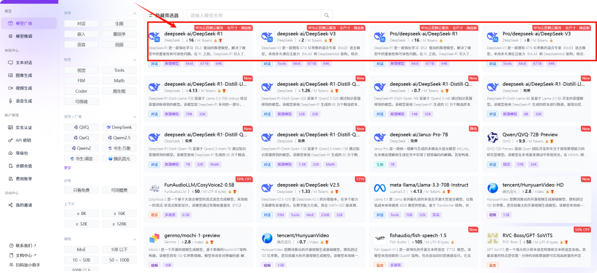
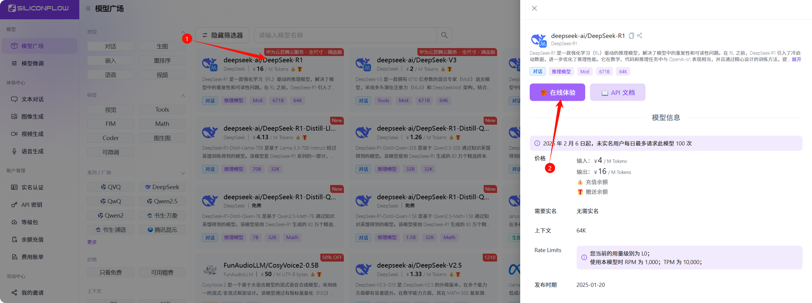
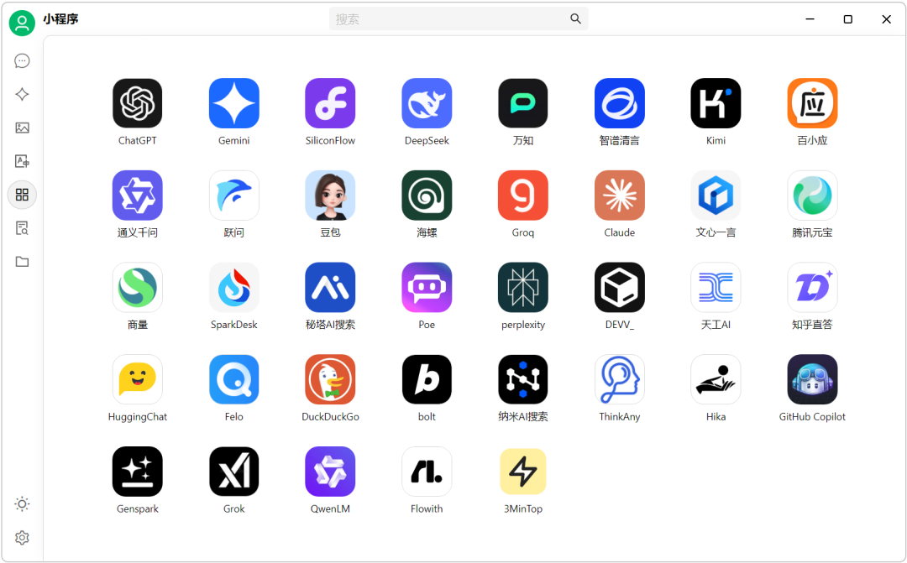
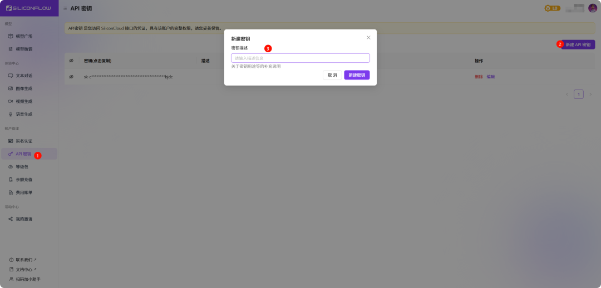
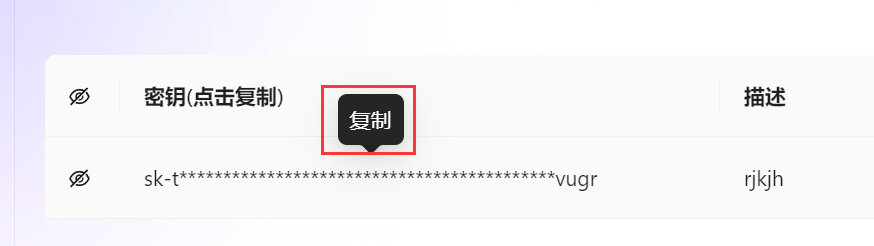
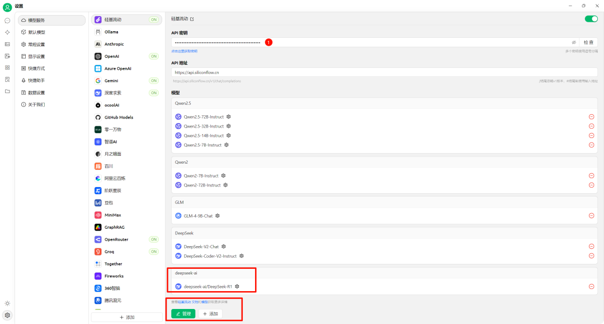
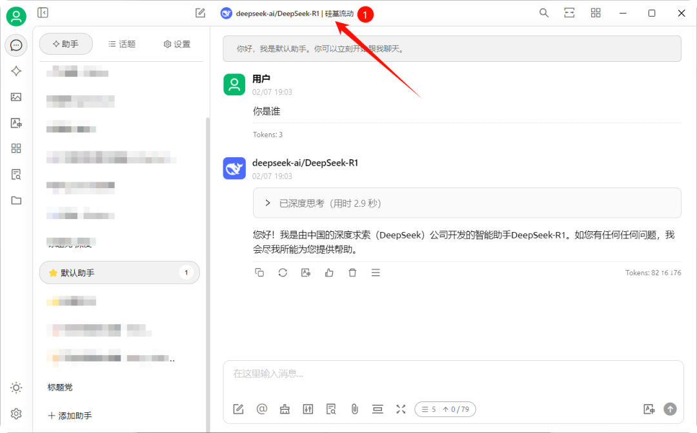
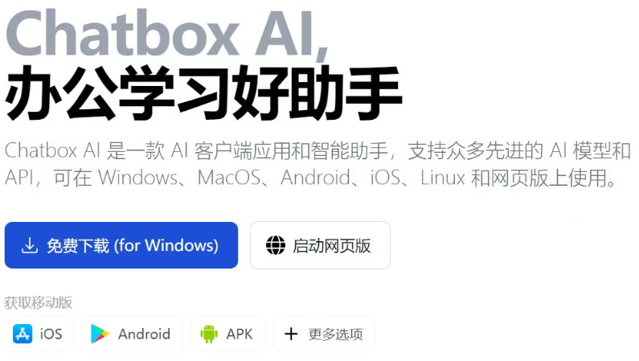
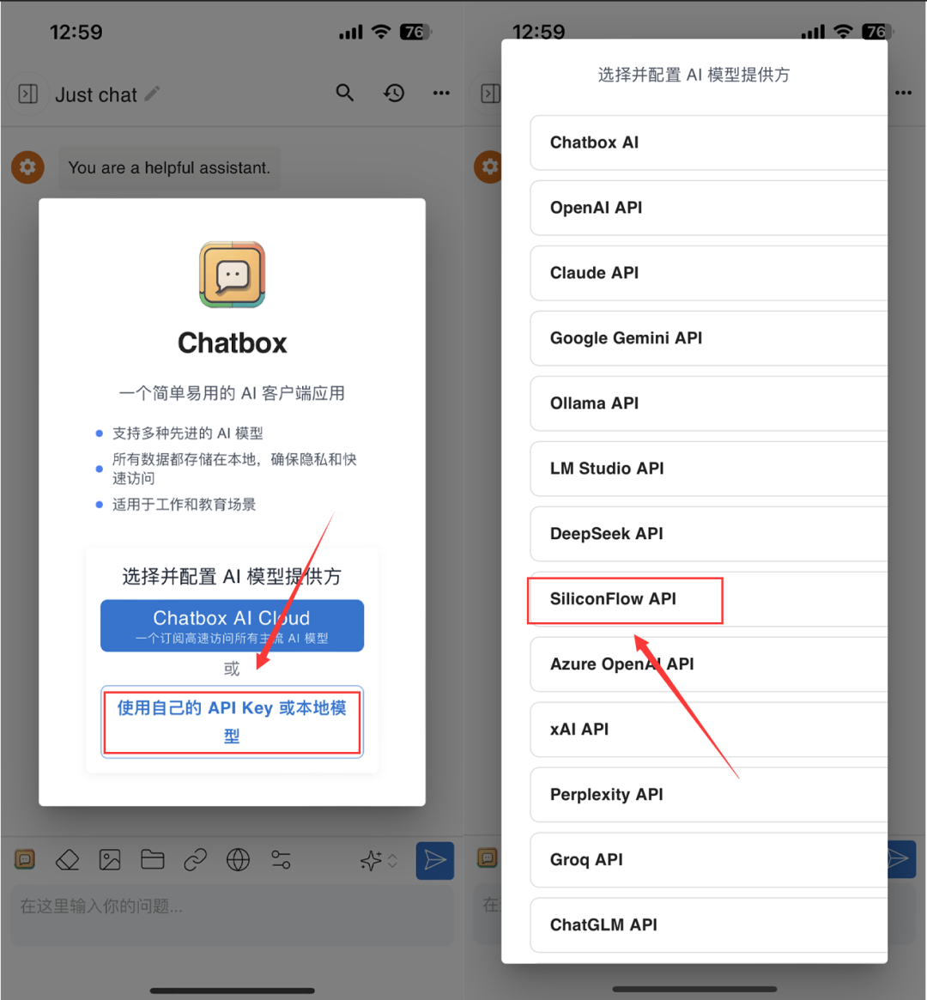
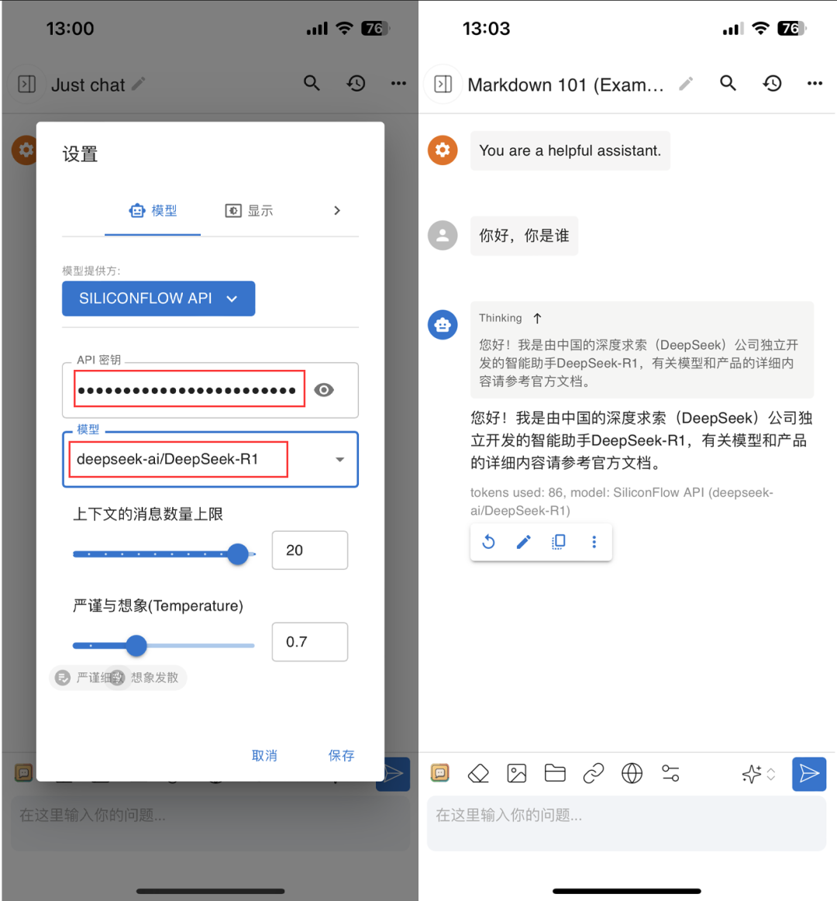

# 硅基流动使用DeepSeek

## 注册账号

首先，注册一个「硅基流动」的开发者账号，通过下方链接注册即可**免费获取 2000 万 Tokens**，注册成功后自动到账

**注册地址：** **https://cloud.siliconflow.cn/**

这是硅基流动和华为云合作，重新部署的 DeepSeek R1 和 V3 模型，提供了超方便的 API 调用方式。这样一来，不仅能有效缓解 DeepSeek 官方服务器的压力，避免咱们老是连不上，还能满足企业级商用的需求呢！

**在线使用**

最简单粗暴的方法，直接在硅基流动的网站上就能用！

打开首页，你会看到很多 DeepSeek 的模型。想要体验满血版 R1，一定要认准这个 671B 的 R1 模型 哦！点击【在线体验】就可以直接跟它对话啦！

## **电脑客户端使用**

如果你想在电脑上更方便地使用 DeepSeek-R1，那小狸强烈推荐你安装 **Cherry Studio 客户端**！**大家文末获取**

Cherry Studio 是一款聚合了各种大语言模型服务的桌面工具，可以通过 API 接口，让你在不同平台上都能用上各种模型，其中就包括 DeepSeek！它支持 Windows、macOS 和 Linux 三个系统！

在硅基流动首页找到【API秘钥】，点击【新建API密钥】，密钥描述随意输入，然后【复制】生成的API密钥

打开安装好的Cherry Studio客户端，点击左下角设置，选择【硅基流动】，在API密钥界面，把刚刚复制的API秘钥粘贴进来。大家也可以点击管理开启R1或者其他模型

在对话界面顶部，选择R1模型就可以开始聊天啦！

## 手机客户端使用

手机上想用 DeepSeek-R1 怎么办？小狸也给你们找好啦！推荐使用 Chatbox AI 这款 APP，安卓和苹果都能用！

打开软件，点击【使用自己的API或本地模型】，然后选择【SiliconFlow API】。

在API密钥处粘贴你从硅基流动复制的密钥，模型选择【DeepSeek-R1】，点击【保存】后就可以使用了

