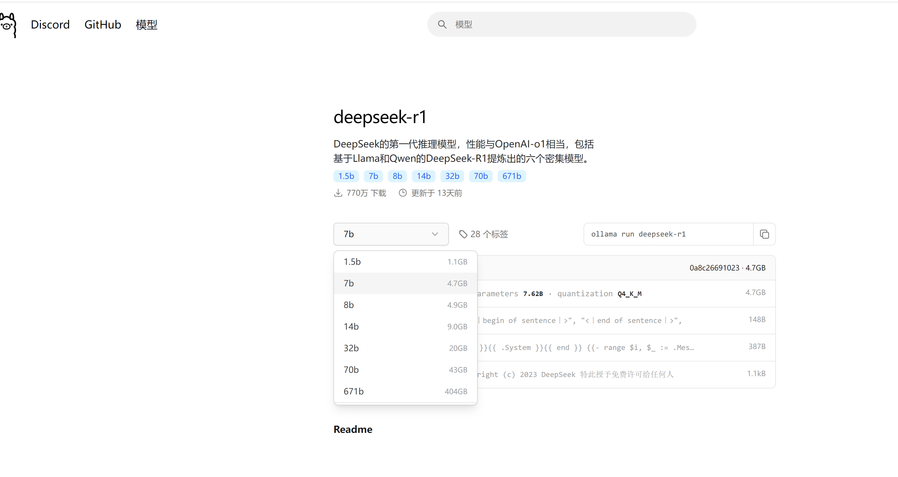

# 本地安装DeepSeek

## ollama方式

*Ollama是*一个专为在本地机器上便捷部署和运行大型语言模型（LLM）而设计的开源框架。

### 安装ollama

#### 下载

到ollama官网 https://ollama.com/下载，如果是windows，需要win10或以后的版本。我现在的时候有745.3M

#### 安装

双击安装文件，点击「Install」开始安装。目前的Ollama会默认安装到C盘，路径如下：C:\Users%username%\AppData\Local\Programs\Ollama，并不会让用户自定义选择安装路径。

安装完成后，会在电脑右下角出现Ollama图标，可以不用先启动Ollama，先退出做一些必要路径的配置！

右键图标，会出现退出的按钮「Quit Ollama」，注意：一定要退出Ollama，否则下边的环境配置无法生效！

####  配置环境

**关闭开机自启动（可选）**

**Ollama 默认会随 Windows 自动启动，可以在「文件资源管理器」的地址栏中访问以下路径，删除其中的Ollama.lnk快捷方式文件，阻止它自动启动。**
`%APPDATA%\Microsoft\Windows\Start Menu\Programs\Startup`

**配置环境变量（必须）**

Ollama 的默认模型存储路径如下：C:\Users%username%.ollama\models，无论 C 盘空间大小，需要安装多少模型，都建议换一个存放路径到其它盘，否则会影响电脑运行速度。

打开「系统环境变量」，新建一个系统变量OLLAMA_MODELS ，然后设置ollama模型的存储路径。

变量名：OLLAMA_MODELS

变量值（路径）：D:\Work\ollama\models

#### 配置端口（可选）

**Ollama API 的默认访问地址和侦听端口是http://localhost:11434，只能在装有 Ollama 的系统中直接调用。如果要在网络中提供服务，请修改 API 的侦听地址和端口（在系统环境变量里设置）：
变量名：OLLAMA_HOST

变量值（端口）：:8000

只填写端口号可以同时侦听（所有） IPv4 和 IPv6 的:8000 端口。(变量值的端口前号前有个冒号:)

注：要使用 IPv6，需要 Ollama 0.0.20 或更高版本。另外，可能需要在 Windows 防火墙中开放相应端口的远程访问。

#### 允许浏览器跨域请求（可选）

Ollama 默认只允许来自127.0.0.1和0.0.0.0的跨域请求，如果你计划在其它前端面板中调用 Ollama API，比如Open WebUI，建议放开跨域限制：

变量名：OLLAMA_ORIGINS

变量值：*

### 运行

[ollama常见命令](https://blog.csdn.net/m0_74462339/article/details/144562082)

#### 启动Ollama

在开始菜单中可以找到ollama程序，运行。

#### 模型选择

模型库地址：https://ollama.org.cn/library

**DeepSeek硬件需求**

| 模型大小 | 参数量 | 显存需求 (GPU)  | CPU和内存需求 | 适用场景                 |
| -------- | ------ | --------------- | ------------- | ------------------------ |
| **1.5B** | 15亿   | 2-4 GB          | 8 GB 内存     | 低端设备，轻量推理       |
| **7B**   | 70亿   | 8-12 GB         | 16 GB 内存    | 中端设备，通用推理       |
| **8B**   | 80亿   | 10-16 GB        | 16-32 GB 内存 | 中高端设备，高性能推理   |
| **14B**  | 140亿  | 16-24 GB        | 32 GB 内存    | 高端设备，高性能推理     |
| **32B**  | 320亿  | 32-48 GB        | 64 GB 内存    | 高端设备，专业推理       |
| **70B**  | 700亿  | 64 GB+          | 128 GB 内存   | 顶级设备，大规模推理     |
| **671B** | 6710亿 | 多 GPU (80 GB+) | 256 GB+ 内存  | 超大规模推理，分布式计算 |

**硬件需求详解**
GPU 需求
1.5B 和 7B 模型：可以在消费级 GPU 上运行，例如 NVIDIA GTX 1660、RTX 3060（8-12 GB 显存）。
8B 和 14B 模型：需要高端 GPU，例如 NVIDIA RTX 3090、A100（16-24 GB 显存）。
32B 和 70B 模型：需要专业级 GPU，例如 NVIDIA A100、H100（32 GB+ 显存）。
671B 模型：需要多 GPU 并行计算，例如多张 A100 或 H100。
CPU 和内存需求
1.5B 和 7B 模型：8-16 GB 内存，普通多核 CPU（如 Intel i5 或 Ryzen 5）。
8B 和 14B 模型：16-32 GB 内存，高性能多核 CPU（如 Intel i7 或 Ryzen 7）。
32B 和 70B 模型：64-128 GB 内存，服务器级 CPU（如 Intel Xeon 或 AMD EPYC）。
671B 模型：256 GB+ 内存，多路服务器级 CPU。

#### 运行指定模型

执行指令ollama run <模型名称[:模型版本]>，首次执行会从模型库中下载模型，所需时间取决于你的网速和模型大小。

查看帮助：

运行模型（初次会去拉模型到本地）：

尝试下是否安装成功：

### chatbox对接

下载chatbox [下载地址](https://chatboxai.app/zh#download)，然后进行安装。

配置AI选择"Ollama API" ，然后选择部署的模型，然后保存。

试用一下，看是否可以了。

### Ollama接口系统详解

内容参考：[地址](https://zhuanlan.zhihu.com/p/712360292)

