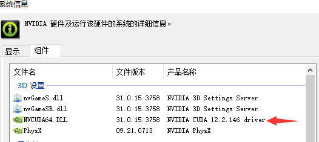
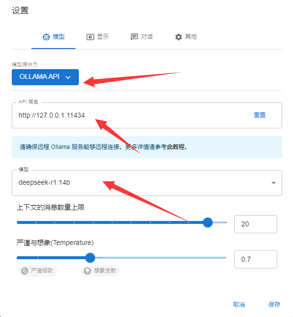

# 本地安装DeepSeek By Ollama

环境基本要求
硬件配置
需要本地跑模型，兼顾质量、性能、速度以及满足日常开发需要，我们需要准备以下硬件：

CPU：I9
内存：128GB
硬盘：3-4TB 最新SSD，C盘确保有400GB，其它都可划成D盘；
GPU：4080S即可（有条件的上4090D或者双卡），但是4080S已经足足够用了；
风扇：华硕七彩，10个 + 大功能水冷；

## nvidia cuda

确保nvidia的驱动在安装后你还必须要有nvidia cuda核心

一般互联网开发人员不知道这是什么，我们这样来装它。

先打开你的nvidia驱动装完后右下角的nvidia control panel找到以下这样的一个界面.

一般互联网开发人员不知道这是什么，我们这样来装它。

先打开你的nvidia驱动装完后右下角的nvidia control panel找到以下这样的一个界面

一般4080s+以上都是12.6.65及以上，我们记成12.6.0。

于是打开以下网址下载nvidia cuda核心：https://developer.nvidia.com/cuda-12-6-0-download-archive?target_os=Windows&target_arch=x86_64&target_version=10&target_type=exe_local

 在此下载cuda 12.6。

**确保nvidia CUDNN被安装**

一定要先装完了cuda核心后，再要装cudnn。

https://developer.nvidia.com/rdp/cudnn-archive#a-collapse897-120

我们进入nvidia开发者中心里下载它。

cuDNN下载完成后，是一个压缩包，解压完成后。请严格按照下面步骤去做，它解压后包含bin,include,lib三个目录。

把cuda\bin\cudnn64_7.dll复制到 C:\Program Files\NVIDIA GPU Computing Toolkit\CUDA\v10.2\bin 目录下.

把\cuda\ include\cudnn.h复制到 C:\Program Files\NVIDIA GPU Computing Toolkit\CUDA\v10.2\include 目录下.

把\cuda\lib\x64\cudnn.lib复制到C:\Program Files\NVIDIA GPU Computing Toolkit\CUDA\v10.2\lib\x64 目录下.

## 安装Ollama

接着我们下载Ollama，https://ollama.com/。

下载完后直接安装它。

安装完后右下角会有这么一个图标。

安装完后即启动了，你也可以设置成开机不启动。

## 配置ollama

我我们使用ollama安装deek seek前，一定要先做配置，如果不配置，它会在安装时把很多模型文件一股脑的装到你的：

Windows 目录：C:\Users%username%.ollama\models
MacOS 目录：~/.ollama/models
Linux 目录：/usr/share/ollama/.ollama/models
这样的话你的C盘或者是启动盘就吃紧了，到时麻烦可就大了。

必配参数与解释
OLLAMA_MODELS
模型文件存放目录，默认目录为当前用户目录我们把它指向了D盘的d:\ollama_models。

OLLAMA_HOST
Ollama 服务监听的网络地址，默认为127.0.0.1，如果允许其他电脑访问 Ollama（如：局域网中的其他电脑），建议设置成0.0.0.0，从而允许其他网络访问

OLLAMA_PORT
Ollama 服务监听的默认端口，默认为11434，如果端口有冲突，可以修改设置成其他端口（如：8080等）

OLLAMA_ORIGINS
HTTP 客户端请求来源，半角逗号分隔列表，若本地使用无严格要求，可以设置成星号，代表不受限制

OLLAMA_KEEP_ALIVE
大模型加载到内存中后的存活时间，默认为5m即 5 分钟（如：纯数字如 300 代表 300 秒，0 代表处理请求响应后立即卸载模型，任何负数则表示一直存活）；我们可设置成24h，即模型在内存中保持 24 小时，提高访问速度

OLLAMA_NUM_PARALLEL
请求处理并发数量，默认为1，即单并发串行处理请求，可根据实际情况进行调整

OLLAMA_MAX_QUEUE
请求队列长度，默认值为512，可以根据情况设置，超过队列长度请求被抛弃

OLLAMA_DEBUG
输出 Debug 日志标识，应用研发阶段可以设置成1，即输出详细日志信息，便于排查问题

OLLAMA_MAX_LOADED_MODELS
最多同时加载到内存中模型的数量，默认为1，即只能有 1 个模型在内存中

配置完成后，启动一个terminal或者是命令行，然后以下几条常用ollama命令供参考

Ollama常用命令
列出当前系统装了哪些模型
ollama list
NAME            ID              SIZE    MODIFIED

gemma2:9b       c19987e1e6e2    5.4 GB  7 days ago

qwen2:7b        e0d4e1163c58    4.4 GB  10 days ago

安装和运行一个模型
ollama run deepseek-r1:14b
如果这个模型不存在，它就会先下载这个模型至ollama_models指向的那个目录并作下载，如上条命令就是安装和运行deep seek r1 14b的。

查看己安装的模型
ollama ps
删除一个模型
ollama rm 
如：

ollama rm gemma2:9b

## ChatBox验证

**下载网址:** https://chatboxai.app/zh

建议安装1.9.6版。

**配置**

 我们使用了一个生产的复杂场景，3层推理分别试了让GPT3.5 TURBO16K以及GPT4O，还有QWEN2 7B以及Deep Seek r1 14b分别作了回答。

无论是从GPU性能开销、回答正确性来看，Deep Seek秒杀了Gpt4O，不得不说Deep Seek是我们的国产之光。

这下，我们实现了AI自由了。

## 附、其它ollama支持的模型

| **模型**  | **参数** | **大小** | **使用命令**             |
| --------- | -------- | -------- | ------------------------ |
| Llama 3.1 | 8B       | 4.7GB    | ollama run llama3.1      |
| Llama 3.1 | 70B      | 40GB     | ollama run llama3.1:70b  |
| Llama 3.1 | 405B     | 231GB    | ollama run llama3.1:405b |
| Gemma 2   | 9B       | 5.5GB    | ollama run gemma2        |
| Gemma 2   | 27B      | 16GB     | ollama run gemma2:27b    |
| qwen2     | 7B       | 4.4GB    | ollama run qwen2         |
| qwen2     | 72B      | 41GB     | ollama run qwen2:72b     |
| glm4      | 9B       | 5.5GB    | ollama run glm4          |

## 其他参考资料

[实战本地电脑部署 DeepSeek-R1](https://blog.csdn.net/Wufjsjjx/article/details/145458601)