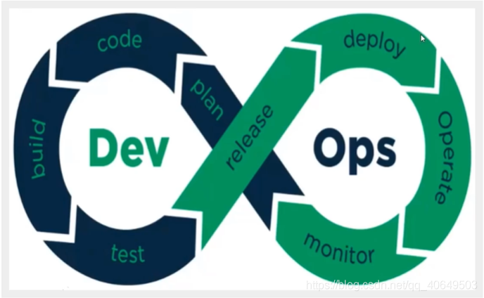
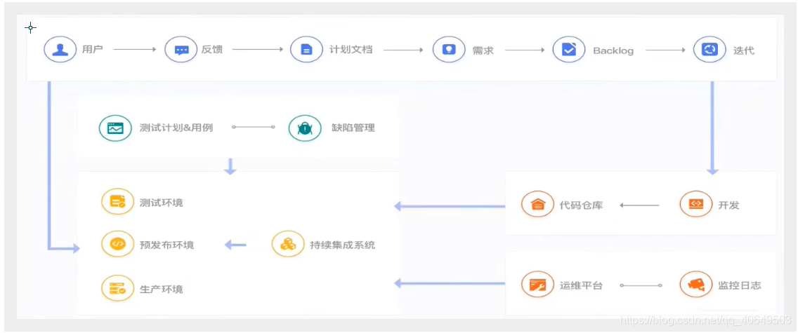
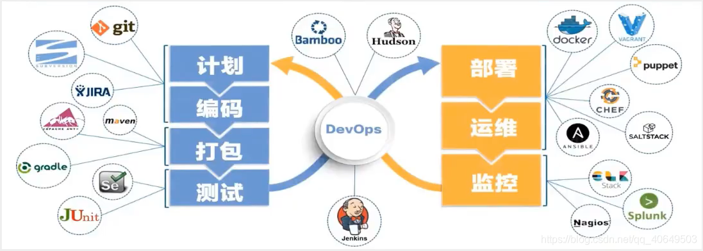
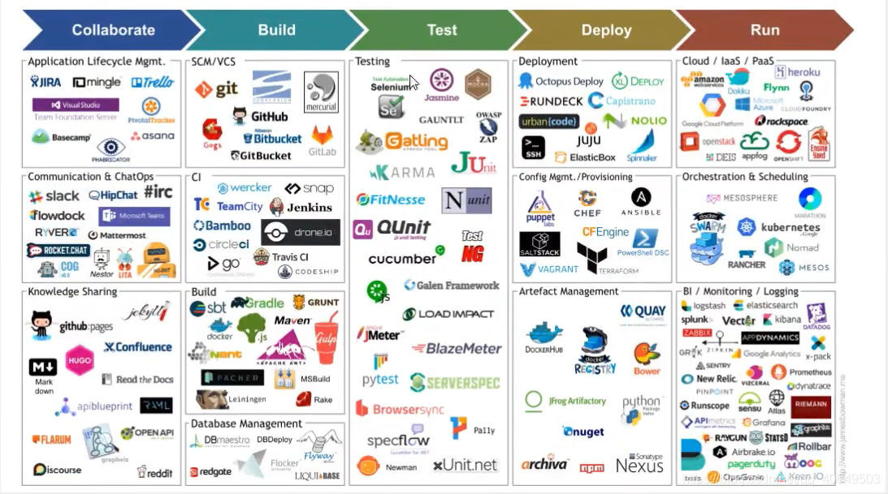
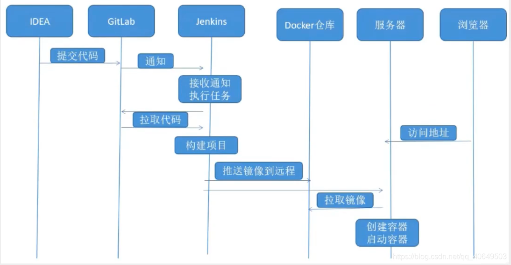
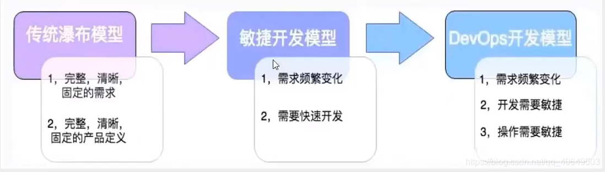

# CI/CD到底是什么？十分钟理解企业级DevOps

[视频资料](https://www.bilibili.com/video/BV1zf4y127vu)

## CI/CD到底是什么？

DevOps是一种思想或方法论，它涵盖开发、测试.运维的整个过程!
DevOps强调软件开发人员与软件测试、软件运维、质量保障(QA)部门之间有效的沟通与协作。
强调通过自动化的方法，管理软件变更，软件集成。
使软件从构建到测试、发布更加快捷、可靠，最终按时交付软件。

**公司项目开发大概流程，看看是如何一部以操作的：**

Product Backlog源自于Scrum方法，是指产品待办事项的集合，其中事务有优先级判断，先处理优先级高的事项。

## 如何落地实现DevOps理念?

​		DevOps兴起于2009年,近年来由于云计算、互联网的发展，促进了DevOps的基础设施及工具链的发展,涌现了-大批优秀的工具，这些工具包括开发,测试，运维的各个领域，例如: GitHub, Git/sn, Docker. Jenkins, HudSon,
Ant/Maven/Gradle,QUnit、JMeter等， 看下图:

## 实践测试

## 当今大公司一定要使用DevOps

传统上在软件开发中(无论是瀑布模型还是敏捷方式，敏捷也比较传统)，都由”开发团队”来构建 软件。

开发团队需要与运维团队进行了大规模的交接"。运维团队负责执行一系列部署 "活动,将软件代码移至生产环境,负责维护后续的系统稳定运行。生产环境的基础设施与开发或测试不同。需要有额外检查和平衡，以确保它一切功能正常。部署是由不同的人完成的,运维团队之前从未见过或听说过任何此类软件。

DevOps这种软件开发方法，涉汲到软件整个开发生命周期，这些活动只能在DevOps中实现,而不是敏捷或瀑布流。

DevOps是在较短的开发周期内开发高质量软件的首选方法,同时可以提高客户满意度。

这就是为什么顶级互联网公司选择DevOps作为其业务目标的前进方向。

如果你是一名开发工程师:学习DevOps，让你成为更加优秀的IT工程师
如果你是一名运维工程师:应用DevOps必将,简化你的工作流程，提高你的工作效率
如果你是一名架构师: DevOps是你在实践中必须拥有的技术能力