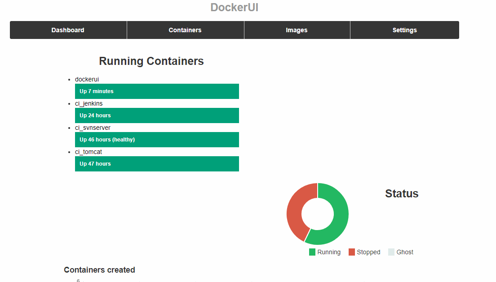

# Docker图形化工具之DockerUI

## 安装DockerUI

```bash
docker pull abh1nav/dockerui
docker run -d --privileged --name dockerui -p 9000:9000 -v /var/run/docker.sock:/var/run/docker.sock abh1nav/dockerui
# 浏览器访问http://192.168.56.2:9000/#/
```

当前我安装的版本是“Docker API Version: **v1.8** UI Version: **v0.4**”

## 效果展示

​	我感觉这个DockerUI的功能还不是特别丰富。

