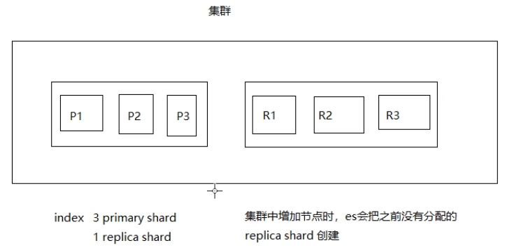

# 进阶原理

## 解析ES的分布式架构

### 分布式架构的透明隐藏特性

Elasticsearch是一个分布式系统,隐藏了复杂的处理机制。

1. 分片机制： 我们不用关心数据是按照什么机制分片的，最后放入到哪个分片中。
2. 分片的副本：
3. 集群发现机制（cluster discovery）：比如当前我们启动了一个es进程， 当启动了第二个es进程时，这个进程作为一个node自动就发现了集群，并且加入了进去。
4. shard负载均衡：比如现在有10shard，集群中有3个节点，es会进行负载均衡的进行分配，以保持每个节点均衡的负载请求。
5. 请求路由

### 扩容机制

垂直扩容：购置新的机器，替换已有的机器

水平扩容：直接添加机器

### 自动均衡rebalance

增加或减少节点时会自动均衡

### master节点

​	master节点是通过选举产生的， 它的主要职责是和集群操作相关的内容,如创建或删除索引,跟踪哪些节点是集集的一部分,并决定啷些分片分配相关的节点。稳定的主节点对集群的健康是非常重要的。

### 节点对等

​	**每个节点都能接收**请求毎个节点接收到请求后都能把该请求路由到有相关数据的其它节点上接收原始请求的节点负责采集数据并返回给客户端


## 分片和副本机制

1. indext包含多个 shard

2. 每个 shard都是一个最小工作单元,承载部分数据:每个 shard都是一个 lucene实例,有完整的建立素引和处理请求的能力

3. 增减节点时, shard会目动在 nodes.中负载均

4. primary shard和 replica shard,每个 documenti肯定只存在于某一个 primary shard.以及其对应的 replica shard中,不可能存在于多个 primary shard
5.  replica shard是 primary shard的副本,负责容错,以及承担读请求负载
6. primary shards的数量在创素引的时候就固定了, replica shard的数量可以随时修改
7. primary shard的默认数量是5, replicas认是1,默认有10个 shard,5个 primary shard,5个 replica shard
8. primary shard不能和目己的 replica shard放在同一个节点上(否则节点宕机, primary shard和副本都去失,起不到容错的作用),但是可以和其他primary sharda的 replica shard放在同一个节点上


## 单节点环境下创建索引分析

```bash
PUT /myIndex
{
  "settings": {
    "number_of_shards": 3,
    "number_of_replicas": 1
  }
}
```

​	这个时候,只会将3个 primary shard分配到仅有的一个node上去,另外3个 replica shard是无法分配的(一个 shard的副本 replica,他们两个是不能在同一个节点的)。集群可以正常工作,但是一且出现节点容机,数据全部去失,而且集群不可用,无法接收任何请求。

```bash
# 查看集群健康状态
GET _cat/health
# 返回1561107502 08:58:22 elasticsearch yellow 1 1 17 17 0 0 1 0 - 94.4%
# yellow 表示集群不是完全健康的状态，因为只有一个节点，出现了shard分布齐全的情况。如果没我们创建的索引的主分片和副分片能够全部的进行分配，这个时候健康状态就是绿色的。
```

## 两个节点环境下创建索引分析

将3个 primary shard分配到一个node上去,另外3个 replica shard分配到另一个节点上

primary shard和 replica shard保持同步

primary shard和 replica shard都可以处理客户端的读请求

 

 这个时候集群的健康状态就是绿色的。 副本是和主分片是保持同步的，主分片出分体，副本就上。

## 水平扩容的过程

1. 扩容后 primary shard和 Replica shard会目动的负载均衡
2. 扩容后每个节点上的 shard会减少,那么分配给每个 shard的CPU,内存,IO资源会更多,性能提高
3. 扩容的极限,如果有6个 shard,扩容的极限就是6个节点,每个节点上一个 shard,如果想超出扩容的极限,比如说扩容到9个节点,那么可以增加 replica shard的个数
4. 6个 shard,3个节点,最多能承受几个节点所在的服务器岩机?(容错性)任何一台服务器宕机都会丢失部分数据
5. 为了提高容错性,增加shard的个数:9个 shard,(3个 primary shard,6个 replica shard),这样就能容忍最多两台服务器岩机了

**总结**: 扩是为了提高系统的吞吐量, 同时也要考虑容错性, 也就是让尽可能多的服务器机还能保证数据不丢失

## 容错机制

以9个shard，3个节点为例：

​	如果 master node宕机,此时不是所有的 primary shard都是 Active status,所以此时的集群状就是red

​	容错处理的第一步：是选择一台服务器作为 master。容错错处理的第二步：新选举出的 master会把挂掉的 primary shards的某个 replica shard提升为 primary shard此时集群的状为 yellow,因为少了ー个 replica shard,并不是所有的 replica shard都是 active status

​	容错处理的第三步：重启故障机,新 master会把所有的副本都复制一份到该节点上,(同步一下宕机后发生的修改),此时集群的状态为 green,因为所有的primary shard和replica shard都是Active status

