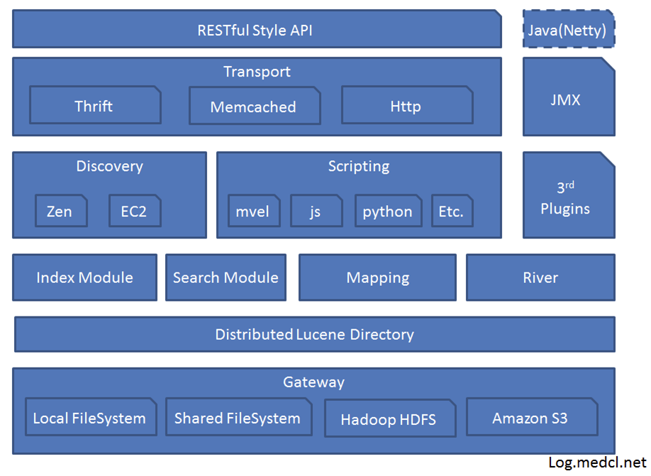

# ElasticSearch基础概念

## ElasticSearch概述

​	[全文搜索](https://baike.baidu.com/item/%E5%85%A8%E6%96%87%E6%90%9C%E7%B4%A2%E5%BC%95%E6%93%8E)属于最常见的需求，开源的 [Elasticsearch](https://www.elastic.co/) （以下简称 Elastic）是目前全文搜索引擎的首选，它提供了一个分布式多用户能力的全文搜索引擎。它可以快速地储存、搜索和分析海量数据。维基百科、Stack Overflow、Github 都采用它。

​	ElasticSearch是用Java开发的，并作为Apache许可条款下的开放源码发布，底层是开源库 [Lucene](https://lucene.apache.org/)。但是，你没法直接用 Lucene，必须自己写代码去调用它的接口。Elastic 是 Lucene 的封装，提供了 REST API 的操作接口，开箱即用，不仅能够对海量规模的数据完成分布式索引与检索，还能提供数据聚合分析。设计用于云计算中，能够达到实时搜索，稳定，可靠，快速，安装使用方便。

> 概括：基于Restful标准的高扩展高可用的实时数据分析的全文搜素工具。

## ElasticSearch的基本概念

**集群（Cluster)**

​	ES集群是一个或多个节点的集合，它们共同存储了整个数据集，并提供了联合索引以及可跨所有节点的搜索能力。多节点组成的集群拥有冗余能力，它可以在一个或几个节点出现故障时保证服务的整体可用性。
集群靠其独有的名称进行标识，默认名称为“elasticsearch”。节点靠其集群名称来决定加入哪个ES集群，一个节点只能属一个集群。

**节点(node)**

​	一个节点是一个逻辑上独立的服务，可以存储数据，并参与集群的索引和搜索功能, 一个节点也有唯一的名字，群集通过节点名称进行管理和通信.

**主节点**

​	主节点的主要职责是和集群操作相关的内容，如创建或删除索引，跟踪哪些节点是群集的一部分，并决定哪些分片分配给相关的节点。稳定的主节点对集群的健康是非常重要的。虽然主节点也可以协调节点，路由搜索和从客户端新增数据到数据节点，但最好不要使用这些专用的主节点。一个重要的原则是，尽可能做尽量少的工作。
对于大型的生产集群来说，推荐使用一个专门的主节点来控制集群，该节点将不处理任何用户请求。

**数据节点**

​	持有数据和倒排索引。

**客户端节点**

​	它既不能保持数据也不能成为主节点，该节点可以响应用户的情况，把相关操作发送到其他节点；客户端节点会将客户端请求路由到集群中合适的分片上。对于读请求来说，协调节点每次会选择不同的分片处理请求，以实现负载均衡。

**部落节点**

​	部落节点可以跨越多个集群，它可以接收每个集群的状态，然后合并成一个全局集群的状态，它可以读写所有节点上的数据。

**Index索引**

​	ElasticSearch会索引所有字段，经过处理后写入一个反向索引（Inverted Index）。查找数据的时候，直接查找该索引。所以，Elastic 数据管理的顶层单位就叫做 Index（索引）。它是单个数据库的同义词。每个 Index （即数据库）的名字必须是小写。

**Type文档类型**

​	Document 可以分组，比如`weather`这个 Index 里面，可以按城市分组（北京和上海），也可以按气候分组（晴天和雨天）。这种分组就叫做 Type，它是虚拟的逻辑分组，用来过滤 Document。不同的 Type 应该有相似的结构（schema）

**Document文档**

​	文档是Lucene Index和搜索的原子单位，它是包含了一个或多个域的容器，基于JSON格式进行表示。文档由一个或多个域组成，每个域拥有一个名字及一个或多个值，有多个值的域通常称为“多值域”。每个文档可以存储不同的域集，但同一类型下的文档至应该有某种程度上的相似之处。Index 里面单条的记录称为 Document（文档）。许多条 Document 构成了一个 Index。Document 使用 JSON 格式表示，下面是一个例子。

```json
{
  "user": "张三",
  "title": "工程师",
  "desc": "数据库管理"
}
```

**Mapping**

​	相当于数据库中的schema，用来约束字段的类型，不过 Elasticsearch 的 mapping 可以自动根据数据创建ES中，所有的文档在存储之前都要首先进行分析。用户可根据需要定义如何将文本分割成token、哪些token应该被过滤掉，以及哪些文本需要进行额外处理等等。

**分片(shard)** 

​	ES的“分片(shard)”机制可将一个索引内部的数据分布地存储于多个节点，它通过将一个索引切分为多个底层物理的Lucene索引完成索引数据的分割存储功能，这每一个物理的Lucene索引称为一个分片(shard)。
每个分片其内部都是一个全功能且独立的索引，因此可由集群中的任何主机存储。创建索引时，用户可指定其分片的数量，默认数量为5个。

**Indexed**

​	就是名义上的建立索引。在es中默认都是会加上索引的，除非你特殊制定不建立索引只是镜像存储用于展示，这个需要看你具体的需求和业务进行设定了。

**Elasticsearch查询**

​	Elasticsearch中存在两种DSL：查询DSL(query DSL)和过滤DSL(filter DSL)。查询子句和过滤子句的自然属性非常相近，但在使用目的上略有区别。

**GET/PUT/POST/DELETE**

​	分别类似于mysql中的select/update/delete....

**Shard有两种类型**

​	primary和replica，即主shard及副本shard。
​	Primary shard用于文档存储，每个新的索引会自动创建5个Primary shard，当然此数量可在索引创建之前通过配置自行定义，不过，一旦创建完成，其Primary shard的数量将不可更改。
​	Replica shard是Primary Shard的副本，用于冗余数据及提高搜索性能。
​	每个Primary shard默认配置了一个Replica shard，但也可以配置多个，且其数量可动态更改。ES会根据需要自动增加或减少这些Replica shard的数量。
​	ES集群可由多个节点组成，各Shard分布式地存储于这些节点上。
​	ES可自动在节点间按需要移动shard，例如增加节点或节点故障时。简而言之，分片实现了集群的分布式存储，而副本实现了其分布式处理及冗余功能。

## ElasticSearch架构




**架构各模块介绍**

**Lucence Directory**:  是lucene的框架服务发现以及选主 ZenDiscovery: 用来实现节点自动发现，还有Master节点选取，假如Master出现故障，其它的这个节点会自动选举，产生一个新的Master

**Plugins**：插件可以通过自定的方式扩展加强Elasticsearch的基本功能，比如可以自定义类型映射，分词器，本地脚本，自动发现等

**Scripting**:使用脚本语言可以计算自定义表达式的值，比如计算自定义查询相关度评分。
支持的脚本语言有groovy，js，mvel（1.3.0废弃），python等

**Disovery**:该模块主要负责集群中节点的自动发现和Master节点的选举。节点之间使用p2p的方式进行直接通信，不存在单点故障的问题。Elasticsearch中，Master节点维护集群的全局状态，比如节点加入和离开时进行shard的重新分配

**River**:代表es的一个数据源，也是其它存储方式（如：数据库）同步数据到es的一个方法。它是以插件方式存在的一个es服务，通过读取river中的数据并把它索引到es中

**Gateway**:模块用于存储es集群的元数据信息。

**Zen Discovery**  :zen发现机制是elasticsearch默认的内建模块。它提供了多播和单播两种发现方式，能够很容易的扩展至云环境。zen发现机制是和其他模块集成的，例如所有节点间通讯必须用trasport模块来完成。


## Restful API

​	一种软件架构风格、设计风格，而不是标准，只提供了一组设计原则和约束条件。它主要用于客户端和服务器交互类的软件。基于这个风格设计的软件可以更简洁、更有层次，更易于实现缓存机制。在目前主流的三种Web服务交互方案中，REST相对于SOAP（Simple Object Access protocol，简单对象访问协议）以及XML-RPC更加简单明了。

​	REST（Representational State Transfer， 意思是：表述性状态传递），它使用典型的HTTP方法，诸如GET、POST、DELETE、PUT来实现资源的获取、添加、修改、删除等操作。即通过HTTP动词来实现资源的状态扭转。

GET 用来获取资源

POST 用来新建资源（也可以用于更新资源）

PUT 用来更新资源

DELETE 用来删除资源

## CRUL命令

以命令的方式执行HTTP协议的请求GET/POST/PUT/DELETE。

示例：访问一个网页

curl www.baidu.com

curl -o tt.html www.baidu.com    将访问的结果保存到tt.html文件中

curl -i www.baidu.com 显示响应头信息

curl -v www.baidu.com 显示一次HTTP请求的通信过程

curl -X GET/POST/PUT/DELETE curl    执行GET/POST/PUT/DELETE操作


