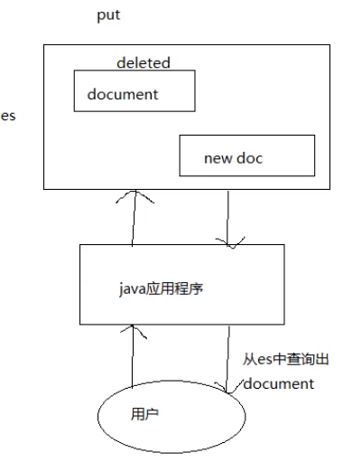
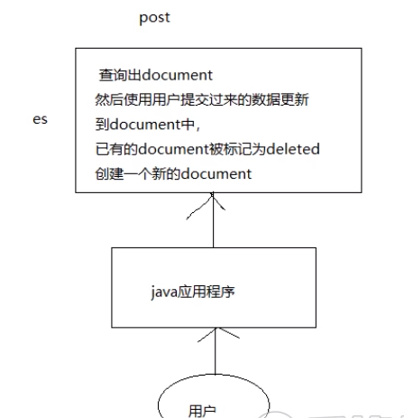
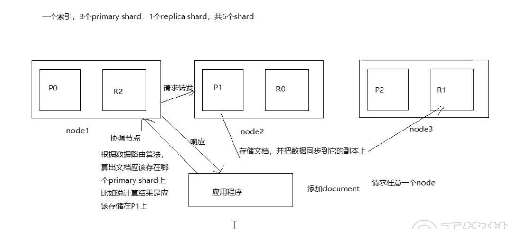
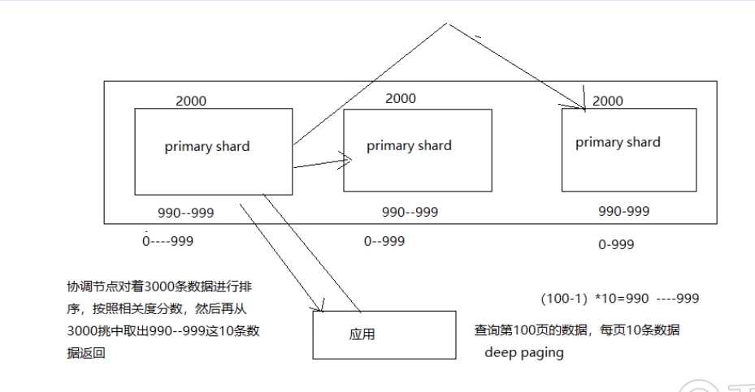

## 文档的核心元数据

1. _index

   说明了一个文档存储在哪个索引中

   同一个索引下存放的是相似的文档(文档的field多数是相同的)

   索引名必须是小写的,不能以下划线开头,不能包括逗号

2. _type (7.x开始已经移除)

   表示文档属于索引中的哪个类型

   一个索引下只能有一个type

   类型名可以是大写也可以是小写的,不能以下划线开头,不能包括逗号

3. _id

   文档的唯一标识,和索引,类型组合在一起唯一标识了一个文档

   可以手动指定值,也可以由es来生成这个值

## 文档id生成方式

1. 手动指定

   PUT /inex/type/66

   通常是把其它系统的已有数据导入到es中。

2. 由es生成id值

   POST /index/type

   es生成的id长度为20个字符，使用的是base64编码，URL安全，使用的是GUID算法，分布式下并发生成id时不会冲突。

## _source元数据分析

其实就是我们在添加文档时request body中的内容

指定返回的结果含有哪些字段

GET /index/_doc/1?_source=name

## 改变文档内容原理解析

替换方式：

1. 全部替换

   PUT /lib/user/4

   {

   ​     .....

   }

   

	es内部会将原来的文档标记为删除状态，使用新的文档，es会在合适的时间将标记为delete的文档进行删除。

2. 部分替换

POST  /lib/user/4/_update

{

​     'doc': {

​		some field....

​	}

}



post方式发生并发索冲突的可能性降低。使用上更新使用post比put好。

3. 删除文档

   将文档标记为delete状态，es在合适的时间会将该文档删除。

## 更新文档对并发问题的处理

​	当出现并发问题的时候，es内部是使用乐观锁，使用version来解决并发所问题。

**retry_on_conflict**

​	如果更新失败，会重新获取文档数据和版本信息进行更新，retry_on_conflict表示重试次数。

```
POST /lib3/_update/4>retry_on_conflict=3&version=5
```


## 文档数据路由原理

1. 文档路由到分片上

   ​	一个索引由多个分片构成，当添加、删除、修改一个文档时，es就需要决定这个文档存储在那个分片上，这个过程就称为数据路由(routing)。

2. 路由算法

   > shard=hash(routing) % number_of_primary_shards

   示例：一个索引，3个primary shard
   (1). 每次增删改查时，都有一个routing值，默认是文档的_id值；

   (2). 对这个routing值使用哈希函数进行计算；

   (3). 计算出的值再和主分片个数取余数。余数肯定在. 0----(number_of_primary - 1)之间，文档就在对应的shard上。

   routing值默认是文档的_id的值，也可以手动指定一个值，手动指定对于负载均衡以及提高批量读取的性能都有帮助。

3. primary shard个数一旦确定就不能修改了。

## 文档操作ES内部原理



##  写一致性原理和quorum机制

1.  任何一个增删改操作都可以跟上一个参数consistency

   可以给该参数指定的值：

   ​	one：（primary shard）只要有一个primary shard是活跃的就可以执行。

   ​	all：（all shard）所有的primary shard和replica都是活跃的才能执行。

   ​	quorum：（default）默认值，大部分shard是活跃的才能执行（例如共有6个shard，至少有3个shard是活跃的才能执行写操作）。

2. quorum机制：多数shard都是可用的

   int((primary + number_of_replica)/2) + 1

   例如：3个primary shard，1个replica，就是int((3+1)/2)+1=3，至少3个shard是活跃的。

   注意：可能出现shard不能分配齐全的情况。

   比如： 1个primary shard，1个replica，就是int((1+1)/2)+1=2，但是如果只有一个节点，因为primary shard和replica不能再一个节点上，所以仍然不能进行写操作。

   再举例：1个primary shard，3个replica， 2个节点，就是int((1+3)/2)+1=3

   最后：当最活跃的shard的个数没有达到要求时，es默认会等待一分钟，如果在等待的期间活跃的shard的个数没有增加，则显示timeout。

   put /index/_doc/id?timeout=60s    注意加上时间单位


## 文档查询内部原理

**第一步**：查询请求发给任意一个节点,该节点就成了coordinating node协调节点，该节点使用路由算法算出文档所在的 primary shard。

**第二步**：协调节点把请求转发始 primary shard也可以转发给 replica shard(使用轮询调度算法( Round- Robin Scheduling），把请求平均分配至 primary shard和 replica shard)；

**第三步**：处理请求的节点把结果返回给协调节点，协调节点再返回给应用程序

**特殊情况**：请求的文档还在建立索引的过程中, primary shard上存在,但 replica shard上不存在,但是请求被转发到了 replica shard上,这时就会提示找不到文档。


## 查询结果分析

```json
{
  "took" : 1,
  "timed_out" : false,
  "_shards" : {
    "total" : 3,
    "successful" : 3,
    "skipped" : 0,
    "failed" : 0
  },
  "hits" : {
    "total" : {
      "value" : 1,
      "relation" : "eq"
    },
    "max_score" : 0.2876821,
    "hits" : [
      {
        "_index" : "lib3",
        "_type" : "_doc",
        "_id" : "5",
        "_score" : 0.2876821,
        "_source" : {
          "name" : "zhangsan",
          "address" : "bei jing chao yang qu",
          "age" : 29,
          "birthday" : "1998-10-12",
          "interests" : "xi huan tingyinyue,changge,tiaowu"
        }
      }
    ]
  }
}
```

took: 查询耗费的时间，单位是毫秒。

_shards: 共请求了多少个shard。

total：查询出的文档总个数。

max_score：本次查询中，相关度分数的最大值，文档和此次查询的匹配度越高，_score的值越大，排位越靠前。

_score： 文档匹配度分数。

hits：默认查询前10个文档。

time_out: 是否超时，通过设置的超时时间判定。

```bash
GET /lib3/_search?timeout=10ms
```


## 分页查询中的deep paging问题

```bash
GET /lib3/_search?from=0&size=2

GET　/lib3/_search
{
  "from": 0,
  "size": 2,
  "query": {
    "terms": {
      "interests": [
        "hejiu",
        "changge"
      ]
    }
  }
}
```

​	deep paging直询的很深,比如一个索引有三个 primary shard,分别存储了6000条数据,我们要得到第100页的数据(每页10条),类似这种情况就叫deep paging。

**如何得到第100页的10条数据？**

​	错误做法：在每个 shard中搜索990到999这10条数据,然后用这30条数据排序,排序之后取10条数据就是要搜索的数据,这种做法是错的,因为3个 shard中的数据的_score分数不ー样,可能这某一个 shard中第一条数据的__score分数比另ー个 shard中第1000条都要高,所以在每个 shard中搜索990到999这10条数据然后排序的做法是不正确的。

​	正确的做法：每个 shard把0到999条数据全部搜索出来(按排序顺序),然后全部返回给 coordinate node协调节点,由 coordinate node按 score分数排序后,取出第100页的10条数据,然后返回给客户端。



**deep paging性能问题**：

1. 耗费网络带宽,因为搜索过深的话,各 shard要把数传送给 coordinate node,这个过程是有大量数据传递的,消耗网络。
2. 消耗内存,各 shard要把数指传送给 coordinate node,这个传递回来的数据,是被 coordinate nodet保存在内存中的,这样会大量消耗内存。
3. 消耗 cpu， coordinate node协调节点要把传回来的数据进行排序,这个排序过程很消耗cpu。

鉴于 deep paging的性能问题,所以应尽量减少使用。

## query string查询及copy_to解析

```bash
# 在所有文档中去找(这种方式性能比较低)
GET /lib3/_search?q=changge,zhangsan
```

如何解决这个问题？使用copy_to。

```bash
PUT /myIndex/article/_mapping
{
  "properties": {
    "post_date": {
      "type": "date"
    },
    "title": {
      "type": "text",
      "copy_to": "fullcontent" ＃ 将title的值拷贝到fullcontent字段中去。
    },
    "content": {
      "type": "text",
      "copy_to": "fullcontent"
    },
    "author_id": {
      "type": "integer"
    }
  }
}
```

copy_to字段是把其它字段中的值，以空格为分隔符组成一个大字符串，然后被分析和索引，但是不存储，也就是说它能被查询，但不能被取回显示。

注意：copy_to指向的字段类型要为：text

```bash
# 使用copy_to形成的字段中查询
GET /lib3/_search?q=fullcontent:changge,zhangsan
```

当没有指定field时，就会从copy_to字段中查询GET /lib3/user/_search?q=changge

## 字符串排序问题

```bash
GET /lib3/_search
{
  "query": {
    "match_all": {}
  },
  "sort": [
    {
      "interests": {
        "order": "desc"
      }
    }
  ]
}
```

错误：Fielddata is disabled on text fields by default. Set fielddata=true on [interests] in order to load fielddata in memory by uninverting the inverted index. Note that this can however use significant memory. Alternatively use a keyword field instead.

对一个字符串类型的字段进行排序通常不准确,因为已经被分词成多个词条了

解决方式:对字段索引两次,一次索引分词（用于搜索），一次索引不分词(用于排序)。

```bash
DELETE lib3
PUT /lib3
{
  "settings": {
    "number_of_shards": 3,
    "number_of_replicas": 0
  },
  "mappings": {
    "properties": {
        "name": {"type": "text"},
        "address": {"type": "text"},
        "age": {"type": "integer"},
        "interests": {
        	"type": "text",  # 索引分词,用于搜索
        	"fields": {
        		"type": "keyword" # 索引不分词,用于排序
        	},
        	"fielddata": true
        },
        "birthday": {"type": "date"}
      }
  }
}
# ... 加入其它数据
# 会发现还是按照分词的方式进行排序
GET /lib3/_search
{
  "query": {
    "match_all": {}
  },
  "sort": [
    {
      "interests": {
        "order": "desc"
      }
    }
  ]
}
# 解决, 使用raw表示用原始值
GET /lib3/_search
{
  "query": {
    "match_all": {}
  },
  "sort": [
    {
      "interests.raw": {
        "order": "desc"
      }
    }
  ]
}
```

## 如何计算相关度分数

使用的是TF/IDF算法（Term Frequency&Inverse Document Frequency）

1. Term Frequency： 我们查询的文本中的词条在document中出现的次数，出现次数越多，相关度越高。

   搜索内容：hello world

   Hello， I love china.

   Hello world, how are you!

2. Inverse Document Frequency：我们查询的文本中的词条在索引的所有文档中出现了多少次，出现的次数越多，相关度越低。

   搜索内容：hello world

   hello, what are you doning?

   I like the world.

   hello 在索引的所有文档中出现了500次，world出现了100次。

3. Field-length（字段长度归约） norm:field越长，相关度越低。

   搜索内容：hello world

   {"title": "hello, what's your name?", "content": "owieurowieuolsdjflk"}

   {"title": "hi, good morning", "content": "lkjkljkj......world"}

查看分数是如何计算的：

```bash
	GET /lib3/_search?explain=true
	{
	  "query": {
	    "match": {
	      "interests": "duanlian,changge"
	    }
	  }
	}
```

结果中_explanation的内容就是计算的过程。

查看一个文档能否匹配上某个查询：

```bash
	GET /lib3/_explain/2
	{
	  "query": {
	    "match": {
	      "interests": "duanlian,changge"
	    }
	  }
	}
```

## Doc values解析

DocValues其实是Lucene在构建倒排索引时，会额外建立一个有序的正排索引（基于document => field value的映射列表）

{"birthday": "1985-11-11", age: 23}

{"birthday": "1985-11-11", age: 29}

document&nbsp;&nbsp;&nbsp;age &nbsp;&nbsp;&nbsp;&nbsp;birthday

doc1&nbsp;&nbsp;&nbsp;&nbsp;23&nbsp;&nbsp;&nbsp;&nbsp;1985-11-11

doc1&nbsp;&nbsp;&nbsp;&nbsp;29&nbsp;&nbsp;&nbsp;&nbsp;1985-11-11

存储在磁盘上，节约内存。

对于排序，分组和一些聚合操作能够大大提升性能。

> **注意**：默认对不分词的字段是开启的，对分词字段无效（需要把fielddata设置为true）

```bash
PUT /lib3
{
  "settings": {
    "number_of_shards": 3,
    "number_of_replicas": 0
  },
  "mappings": {
    "properties": {
        "name": {"type": "text"},
        "address": {"type": "text"},
        "age": {"type": "integer", "doc_values": false}, # 这个字段就不能进行分组聚合排序了
        "interests": {"type": "text"},
        "birthday": {"type": "date"}
      }
  }
}
```


