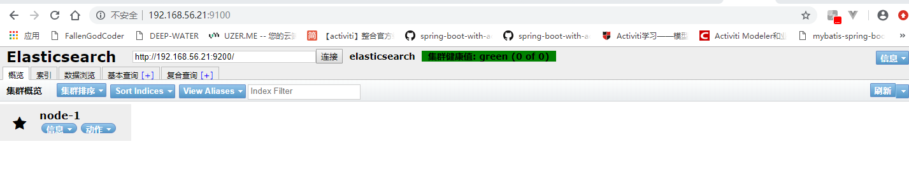
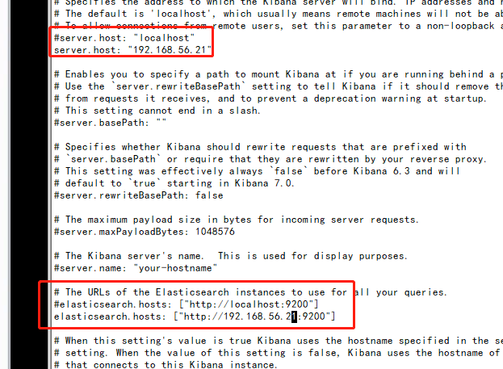
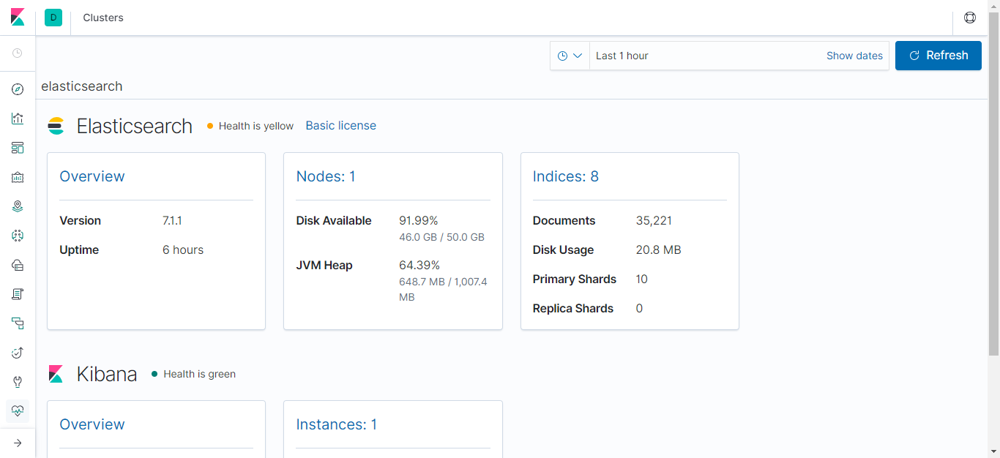

# 基础环境搭建篇

## 安装JAVA 8

​	Elastic 需要 Java 8 环境。如果你的机器还没安装 Java，注意要保证环境变量`JAVA_HOME`正确设置。

.bashrc中配置JAVA的配置信息：

```shell
# 用户自定义
export JAVA_HOME=/opt/jre1.8.0_171
export JRE_HOME=${JAVA_HOME}/jre
export CLASSPATH=.:${JAVA_HOME}/lib:${JRE_HOME}/lib
export PATH=${JAVA_HOME}/bin:$PATH
```

退出，让配置生效，运行：

```shell
source .bashrc
```


## 安装ElasticSearch

​	安装完 Java，就可以跟着[官方文档](https://www.elastic.co/guide/en/elasticsearch/reference/current/zip-targz.html)安装 Elastic。

将ELK这三个软件的安装包拷贝到/opt目录下，使用“tar -zxvf 包名”进行解压。
下面是/opt目录下的情况：

```
drwxr-xr-x. 6     10     143       211 3月  29 2018 jre1.8.0_171
-rwxr-x---. 1 root   root    346794062 6月  13 20:49 elasticsearch-7.1.1-linux-x86_64.tar.gz
-rwxr-x---. 1 root   root    167785446 6月  13 20:50 kibana-7.1.1-linux-x86_64.tar.gz
-rwxr-x---. 1 root   root    171222976 6月  13 20:50 logstash-7.1.1.tar.gz
```

说明：启动elasticsearch，由于Elasticsearch可以接收脚本到服务器上运行，该软件出于安全性考虑，不允许该程序在root用户下运行，这个时候需要为该程序创建独立的用户和用户组。

```
[root@localhost bin]# ./elasticsearch
[2019-06-14T09:47:16,102][WARN ][o.e.b.ElasticsearchUncaughtExceptionHandler] [localhost.localdomain] uncaught exception in thread [main]
org.elasticsearch.bootstrap.StartupException: java.lang.RuntimeException: can not run elasticsearch as root
        at org.elasticsearch.bootstrap.Elasticsearch.init(Elasticsearch.java:163) ~[elasticsearch-7.1.1.jar:7.1.1]
        at org.elasticsearch.bootstrap.Elasticsearch.execute(Elasticsearch.java:150) ~[elasticsearch-7.1.1.jar:7.1.1]
        at org.elasticsearch.cli.EnvironmentAwareCommand.execute(EnvironmentAwareCommand.java:86) ~[elasticsearch-7.1.1.jar:7.1.1]
        at org.elasticsearch.cli.Command.mainWithoutErrorHandling(Command.java:124) ~[elasticsearch-cli-7.1.1.jar:7.1.1]
        at org.elasticsearch.cli.Command.main(Command.java:90) ~[elasticsearch-cli-7.1.1.jar:7.1.1]
        at org.elasticsearch.bootstrap.Elasticsearch.main(Elasticsearch.java:115) ~[elasticsearch-7.1.1.jar:7.1.1]
        at org.elasticsearch.bootstrap.Elasticsearch.main(Elasticsearch.java:92) ~[elasticsearch-7.1.1.jar:7.1.1]
Caused by: java.lang.RuntimeException: can not run elasticsearch as root
        at org.elasticsearch.bootstrap.Bootstrap.initializeNatives(Bootstrap.java:102) ~[elasticsearch-7.1.1.jar:7.1.1]
        at org.elasticsearch.bootstrap.Bootstrap.setup(Bootstrap.java:169) ~[elasticsearch-7.1.1.jar:7.1.1]
        at org.elasticsearch.bootstrap.Bootstrap.init(Bootstrap.java:325) ~[elasticsearch-7.1.1.jar:7.1.1]
        at org.elasticsearch.bootstrap.Elasticsearch.init(Elasticsearch.java:159) ~[elasticsearch-7.1.1.jar:7.1.1]
        ... 6 more
[root@localhost bin]# groupadd esgroup
[root@localhost bin]# useradd esuser -g esgroup -p 123456
[root@localhost bin]# cd ../../
[root@localhost opt]# chown -R esuser:esgroup elasticsearch-7.1.1
```

启动elasticsearch

```shell
[root@localhost ~]# su esuser
[esuser@localhost root]$ cd /opt/elasticsearch-7.1.1/bin/
[esuser@localhost bin]$ nohup ./elasticsearch >>start.log 2>&1 &
```

测试下是否启动成功：

```shell
[esuser@localhost bin]$ curl http://127.0.0.1:9200
{
  "name" : "localhost.localdomain",
  "cluster_name" : "elasticsearch",
  "cluster_uuid" : "XQxhY4YUQsWGfn6Ei-YTjQ",
  "version" : {
    "number" : "7.1.1",
    "build_flavor" : "default",
    "build_type" : "tar",
    "build_hash" : "7a013de",
    "build_date" : "2019-05-23T14:04:00.380842Z",
    "build_snapshot" : false,
    "lucene_version" : "8.0.0",
    "minimum_wire_compatibility_version" : "6.8.0",
    "minimum_index_compatibility_version" : "6.0.0-beta1"
  },
  "tagline" : "You Know, for Search"
}
```

​	上面返回信息中，请求9200端口，Elastic 返回一个 JSON 对象，包含当前节点、集群、版本等信息。

## 实现ES远程访问

```shell
[root@localhost elasticsearch-7.1.1]# cd config/
[root@localhost config]# vi elasticsearch.yml

node.name: node-1 前面的#打开
# ---------------------------------- Network -----------------------------------
#
# Set the bind address to a specific IP (IPv4 or IPv6):
#
# network.host: 127.0.0.1 这个只能本机访问
network.host: 0.0.0.0

cluster.initial_master_nodes: ["node-1"] 这里一定要这样设置，我就是这里没有这样设置出问题的，弄了好久

# 在最后加上这两句，要不然，外面浏览器就访问不了哈
# 是否支持跨域
http.cors.enabled: true
# *表示支持所有域名
http.cors.allow-origin: "*"

:wq
```

​	默认情况下，Elastic 只允许本机访问，如果需要远程访问，可以修改 Elastic 安装目录的`config/elasticsearch.yml`文件，去掉`network.host`的注释，将它的值改成`0.0.0.0`，然后重新启动 Elastic。上面代码中，设成`0.0.0.0`让任何人都可以访问。线上服务不要这样设置，要设成具体的 IP。

### 可能会遇到的问题

**问题**： max file descriptors [4096] for elasticsearch process is too low, increase to at least [65536]

解决：

```bash
>su root
>vi /etc/security/limits.conf
* soft nofile 65536
* hard nofile 131072
* soft nproc 2048
* hard nproc 4096

:wq
```


**问题**：  max virtual memory areas vm.max_map_count_count [65530] is too low, increase to at least [655360]

  解决： 

```shell
>su root
>vi /etc/sysctl.conf
vm.max_map_count=655360

:wq
>sysctl -p   #使生效
```

**问题**：所有配置都正确，机器内能够访问curl http://192.168.56.21:9200/，但是外网还是不能够访问， 大概是防火墙没有关闭。

   解决：关闭防火墙：

```shell
systemctl stop firewalld.service
```


经过上诉问题的解决后，如果没有问题了就可以使用浏览器访问： http://192.168.56.21:9200/


**问题：**如果遇到java虚拟机内存报错这种情况

​	在elasticSearch的conf目录下面有一个jvm.properites文件，可以配置java虚拟机运行的一些参数。

### 防火墙打开端口（防火墙未停止使用）

默认对外访问端口：

ElasticSearch    9100

ElasticSearch-Head  9200

kibana      5601

```bash
firewall-cmd --zone=public --add-port=9100/tcp --permanent
firewall-cmd --zone=public --add-port=9200/tcp --permanent
firewall-cmd --zone=public --add-port=5601/tcp --permanent
firewall-cmd --reload
```

## 安装Head插件

​	由于head插件本质上还是一个nodejs的工程，因此需要安装node，使用npm来安装依赖的包。

### 安装nodeJS

```bash
cd /opt
wget https://npm.taobao.org/mirrors/node/v10.16.0/node-v10.16.0-linux-x64.tar.xz
xz -d node-v10.16.0-linux-x64.tar.xz
tar -xvf node-v10.16.0-linux-x64.tar 
chown -R esuser:esgroup node-v10.16.0-linux-x64
cd
vi .bashrc 
# node环境配置
export NODE_HOME=/opt/node-v10.16.0-linux-x64
export PATH=$PATH:$NODE_HOME/bin
:wq
source .bashrc
node -v
npm -v
```

### 安装git

如果未安装git，则先安装git工具。

> 如果是虚拟机中其实不一定一定要git，可以到github将仓库下载下来丢到虚拟机中去也可以。

```bash
 yum install -y git
 git -version
```

### 安装Head插件

​	elasticsearch-head是一个elasticsearch的集群管理、数据可视化、增删查改、查询语句可视化的工具，它是完全由html5编写的独立网页程序。elasticsearch5.0之后，elasticsearch-head不做为插件放在其plugins目录下了，所以可以单独部署一台服务器，没必要和elasticsearch部署在同一台机器，这就需要在下面的文章中配置对应的跨域访问。

```
git clone https://github.com/mobz/elasticsearch-head.git
cd elasticsearch-head
npm install
```

报错问题1：

```
npm ERR! code ELIFECYCLE
npm ERR! errno 1
npm ERR! phantomjs-prebuilt@2.1.16 install: `node install.js`
npm ERR! Exit status 1
npm ERR! 
npm ERR! Failed at the phantomjs-prebuilt@2.1.16 install script.
npm ERR! This is probably not a problem with npm. There is likely additional logging output above.
```

解决方法：

```bash
 npm install phantomjs-prebuilt@2.1.16 --ignore-scripts
 然后再次执行npm install安装完其它未安装的包。
```

### Head插件配置

修改elasticsearch-head下的Gruntfile.js，connect配置节点：

```
{
    connect: {
        server: {
            options: {
            	hostname: '*',
                port: 9100,
                base: '.',
                keepalive: true
            }
        }
    }
}
```

修改head连接地址

```
 vi _site/app.js
this.base_uri = this.config.base_uri || this.prefs.get("app-base_uri") || "http://<这里写你的IP>:9200";
```


### 运行Head插件

```
nohup grunt server &     # 如果使用npm install -g grunt就可以直接全局使用
否则：
 ./node_modules/grunt/bin/grunt  -version
 nohup  ./node_modules/grunt/bin/grunt server &
```

### 浏览器访问Head插件的网页

```
http://192.168.56.21:9100/
```



### 关闭Head插件

```bash
netstat -apn | grep 9100
或者
ps -ef | grep grunt 去找进程
找到进程后使用
kill -9 进程号
```

## 安装kibana

​	Kiana是一个针对 Elasticsearch的开源分析及可视化平台,使用 Kiana可以查询、查看井与存储在ES素引的数据进行交互操作,使用 Kiana能执行高级的据分析,井能以图表、表格和地图的形式查看数据。

​	从官网下载好kibana的安装包

```bash
tar -zxvf kibana-7.1.1-linux-x86_64.tar.gz 
vi kibana-7.1.1-linux-x86_64/config/kibana.yml
```



 将上图中的server.host修改成kibana所在服务器的ip地址。elasticsearch.host修改成elasticSearch所在服务器的ip地址。

### 启动kibana

​	不同版本的kibana界面有些区别，新版本提供了更多的功能和更高的稳定性。

```
nohup sh kibana >run.log 2>&1 &
```





## 安装中文分词器ik

elasticsearch-analysis-ik 

​	在[gitHub](https://github.com/medcl/elasticsearch-analysis-ik)直接下载elasticsearch对应版本的elasticsearch-analysis-ik源码来使用maven构建得到发布的包，也可以使用给上面已经打好包的release包（这种方便一点）。

```
-rwxr-x---. 1 esuser esgroup   4504541 6月  19 11:28 elasticsearch-analysis-ik-7.1.1.zip
```

安装：

```bash
mkdir elasticsearch-7.1.1/plugins/ik
cp elasticsearch-analysis-ik-7.1.1.zip elasticsearch-7.1.1/plugins/ik/
cd elasticsearch-7.1.1/plugins/ik/
unzip elasticsearch-analysis-ik-7.1.1.zip
rm -f elasticsearch-analysis-ik-7.1.1.zip
ll
```

```
-rw-r--r--. 1 esuser esgroup 263965 5月   6 2018 commons-codec-1.9.jar
-rw-r--r--. 1 esuser esgroup  61829 5月   6 2018 commons-logging-1.2.jar
drwxr-xr-x. 2 esuser esgroup   4096 6月   5 22:49 config   配置文件目录
-rw-r--r--. 1 esuser esgroup  54633 6月   5 22:49 elasticsearch-analysis-ik-7.1.1.jar
-rw-r--r--. 1 esuser esgroup 736658 5月   6 2018 httpclient-4.5.2.jar
-rw-r--r--. 1 esuser esgroup 326724 5月   6 2018 httpcore-4.4.4.jar
-rw-r--r--. 1 esuser esgroup   1805 6月   5 22:50 plugin-descriptor.properties
-rw-r--r--. 1 esuser esgroup    125 6月   5 22:50 plugin-security.policy
```

重新启动elasticsearch，能看到已经安装了ik分词器的一些信息：

```
.....
[2019-06-19T11:55:08,352][INFO ][o.e.p.PluginsService     ] [node-1] loaded plugin [analysis-ik]
.....
[2019-06-19T11:55:19,637][INFO ][o.w.a.d.Monitor          ] [node-1] try load config from /opt/elasticsearch-7.1.1/config/analysis-ik/IKAnalyzer.cfg.xml
[2019-06-19T11:55:19,639][INFO ][o.w.a.d.Monitor          ] [node-1] try load config from /opt/elasticsearch-7.1.1/plugins/ik/config/IKAnalyzer.cfg.xml
.....
```

