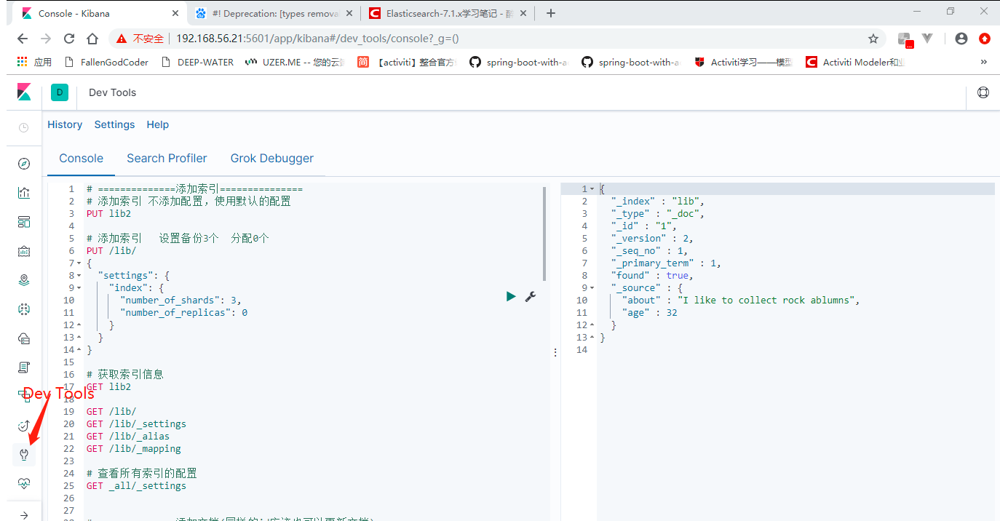

# 扬帆起航

## Kibana DevTools

​	在后面的学习中，Kibana为我们提供了非常好的开发工具，方便我们对ElasticSearch进行操作。



## ElasticSearch7.X去掉Type

> 我们一直认为ES中的“index”类似于关系型数据库的“database”，而“type”相当于一个数据表。ES的开发者们认为这是一个糟糕的认识。例如：关系型数据库中两个数据表示是独立的，即使他们里面有相同名称的列也不影响使用，但ES中不是这样的。
>
> 我们都知道elasticsearch是基于Lucene开发的搜索引擎，而ES中不同type下名称相同的filed最终在Lucene中的处理方式是一样的。举个例子，两个不同type下的两个user_name，在ES同一个索引下其实被认为是同一个filed，你必须在两个不同的type中定义相同的filed映射。否则，不同type中的相同字段名称就会在处理中出现冲突的情况，导致Lucene处理效率下降。
>
> 去掉type能够使数据存储在独立的index中，这样即使有相同的字段名称也不会出现冲突，就像ElasticSearch出现的第一句话一样“你知道的，为了搜索····”，去掉type就是为了提高ES处理数据的效率。
> 除此之外，在同一个索引的不同type下存储字段数不一样的实体会导致存储中出现稀疏数据，影响Lucene压缩文档的能力，导致ES查询效率的降低。

> ---------------------
> 作者：zjx546391707 
> 来源：CSDN 
> 原文：https://blog.csdn.net/zjx546391707/article/details/78631394 
> 版权声明：本文为博主原创文章，转载请附上博文链接！

## 添加索引

```bash
#使用kibana:
# ==============添加索引===============
# 添加索引 不添加配置，使用默认的配置
PUT lib2

# 添加索引   设置备份3个  分配0个
PUT /lib/
{
  "settings": {
    "index": {
      "number_of_shards": 3,
      "number_of_replicas": 0
    }
  }
}
```

```bash
#使用curl命令：
# ==============添加索引===============
# 添加索引 不添加配置，使用默认的配置
curl -XPUT "http://192.168.56.21:9200/lib2"

# 添加索引   设置备份3个  分配0个
curl -XPUT "http://192.168.56.21:9200/lib/" -H 'Content-Type: application/json' -d'
{
  "settings": {
    "index": {
      "number_of_shards": 3,
      "number_of_replicas": 0
    }
  }
}'
```


## 获取索引信息

```bash
# 获取索引信息
GET lib2

GET /lib/
GET /lib/_settings
GET /lib/_alias
GET /lib/_mapping

# 查看所有索引的配置
GET _all/_settings
```

```bash
#使用curl命令：
# 获取索引信息
curl -XGET "http://192.168.56.21:9200/lib2"
```


## 添加文档

​	为索引添加文档

索引名一定要是小写，不能含有特殊字符, 可以带有下划线。

```bash
# ==============添加文档(同样的id应该也可以更新文档)===============
PUT /lib/user/1
{
  "first_name": "Jane",
  "last_name": "smith",
  "age": 32,
  "about": "I like to collect rock ablumns",
  "interests": [ "music" ]
}
#  遇到的问题：：：当前版本elasticsearch-7.1.1使用上面这种方式添加文档会提示警告信息！ 由于es让使用一种无类型的文档方式。包括后面的GET也是这样
#! Deprecation: [types removal] Specifying types in document get requests is deprecated, use the /{index}/_doc/{id} endpoint instead.

PUT /lib/_doc/2
{
  "first_name": "Jane",
  "last_name": "smith",
  "age": 32,
  "about": "I like to collect rock ablumns",
  "interests": [ "music" ]
}

# 自动生成一个id
POST /lib/_doc
{
  "first_name": "Douglas",
  "last_name": "Fir",
  "age": 23,
  "about": "I like to build cabinets",
  "interests": [ "forestry" ]
}
```

```bash
#使用curl命令：
curl -XPUT "http://192.168.56.21:9200/lib/user/1" -H 'Content-Type: application/json' -d'
{
  "first_name": "Jane",
  "last_name": "smith",
  "age": 32,
  "about": "I like to collect rock ablumns",
  "interests": [ "music" ]
}'
# 自动生成一个id
curl -XPOST "http://192.168.56.21:9200/lib/_doc" -H 'Content-Type: application/json' -d'
{
  "first_name": "Douglas",
  "last_name": "Fir",
  "age": 23,
  "about": "I like to build cabinets",
  "interests": [ "forestry" ]
}'
```


## 获取文档

```bash
# ===========获取添加的文档======================
GET /lib/user/1
GET /lib/user/2
# 不推荐在文档索引请求中制定类型，请改用无类型总结点_d

GET /lib/_doc/1
GET /lib/_doc/2

# 使用自动生成的id获取文档
GET /lib/_doc/iv7ZbmsBEioX68YC8flN
# 只显示文档的部分信息
GET /lib/_doc/1?_source=age,about
```

```bash
#使用curl命令：
# 只显示文档的部分信息
curl -XGET "http://192.168.56.21:9200/lib/_doc/1?_source=age,about"
```


## 更新文档

```bash
# (覆盖方式) 将Jane smith这个人的年龄调整为33岁
PUT /lib/_doc/2
{
  "first_name": "Jane",
  "last_name": "smith",
  "age": 33,
  "about": "I like to collect rock ablumns",
  "interests": [ "music" ]
}
GET /lib/_doc/2

# (局部更新) 将Jane smith这个人的年龄调整为20岁
POST /lib/_update/2
{
  "doc": {
    "age": 20
  }
}
GET /lib/_doc/2
```

## 删除文档/索引

```bash
# 删除文档
DELETE /lib/_doc/2
GET /lib/_doc/2
# 删除索引
DELETE /lib/
# 获取所有的所有
GET _all/_settings
```

```bash
#使用curl命令：
# 删除文档
curl -XDELETE "http://192.168.56.21:9200/lib/_doc/2"
```


## 批量获取文档

使用es提供的Multi Get API：

使用Multi Get APIkey通过索引名、类型名、文档id一次得到一个文档集合,文档可以来自同一个索引库,也可以来自不同索引库。

```bash
#新增数据
PUT /lib/_doc/1
{
  "first_name": "Jane1",
  "last_name": "smith1",
  "age": 32,
  "about": "I like to collect rock ablumns",
  "interests": [ "music" ]
}

PUT /lib/_doc/2
{
  "first_name": "Jane2",
  "last_name": "smith2",
  "age": 18,
  "about": "I like to collect rock ablumns",
  "interests": [ "music" ]
}
# 批量获取
GET /_mget
{
  "docs": [
    {
      "_index": "lib",
      "_id": 1
    },
    {
      "_index": "lib",
      "_id": 2
    }
  ]
}
# 举一反三
# 批量获取部分字段的文档
GET /_mget?_source=first_name
{
  "docs": [
    {
      "_index": "lib",
      "_id": 1
    },
    {
      "_index": "lib",
      "_id": 2
    }
  ]
}
# 批量获取文档，让部分文档的域制定特定的域
GET /_mget
{
  "docs": [
    {
      "_index": "lib",
      "_id": 1,
      "_source": "first_name"
    },
    {
      "_index": "lib",
      "_id": 2,
      "_source": [ "first_name", "age"]
    }
  ]
}
# 也可以将索引加到路径上
GET /lib/_mget
{
  "docs": [
    {
      "_id": 1,
      "_source": "first_name"
    },
    {
      "_id": 2,
      "_source": [ "first_name", "age"]
    }
  ]
}
# 再简单一点的写法
GET /lib/_mget
{
  "ids": [1, 2]
}
```

## Bulk API实现批量操作

bulk的格式：

```
{action:{metadata}}\n
{requestbody}\n
```

action行为: 

1. create: 文档不存在时创建 ，已经有会报错
2. update: 更新文档
3. index: 创建新文档或替换已有文档
4. delete 删除一个文档

metadata: _index, _type, _id

requestbody: 文档数据

示例：

```bash
# 批量添加文档
PUT /tc_id/_bulk
{"index": {"_id": 1}}
{"title": "Java", "price": 55}
{"index": {"_id": 2}}
{"title": "Html5", "price": 45}
{"index": {"_id": 3}}
{"title": "Php", "price": 35}
{"index": {"_id": 4}}
{"title": "Python", "price": 50}

# curl 方式访问
curl -XPUT "http://192.168.56.21:9200/tc_id/_bulk" -H 'Content-Type: application/json' -d'
{"index": {"_id": 1}}
{"title": "Java", "price": 55}
{"index": {"_id": 2}}
{"title": "Html5", "price": 45}
{"index": {"_id": 3}}
{"title": "Php", "price": 35}
{"index": {"_id": 4}}
{"title": "Python", "price": 50}
'

# 批量获取添加的文档
GET /tc_id/_mget
{"ids": [1, 2, 3, 4]}

# 批量新增修改删除文档
PUT /tc_id/_bulk
{"created": {"_id": 5}}
{"title": "c", "price": 22}
{"update": {"_id": 2}}
{"doc": {"price": 54}}
{"index": {"_id": 3}}
{"title": "Php", "price": 35}
{"delete": {"_id": 4}}

# 能从结果中看出有些找到了有些没有找到
GET /tc_id/_mget
{"ids": [1, 2, 3, 4, 5, 6]}
```

bulk一次最大处理多少数据流：

> ​	bulk会把将要处理的数据载入内存中，所以数据量是有限制的，最佳的数据量是不是一个确定的数值，它取决于你的硬件，你的文档大小以及复杂性，你的索引以及搜索的负载。
>
> ​	一般建议是1000-5000个文档，大小建议是5-15M，默认不超过100M，可以在elasticSearch的配置文件中进行配置($ES_HOME/config/elasticsearch.yml中)。


## 数据版本控制

​	用于控制数据的版本，方式多个客户端对同一个版本同一个数据进行修改。

​	Elasticsearch采用了[乐观锁](https://baike.baidu.com/item/%E4%B9%90%E8%A7%82%E9%94%81/7146502?fr=aladdin)来保证数据的一致性,也就是说,当用户对 document进行操作时,并不需要对该 document作加锁和解锁的操作,只需要指定要操作的版本即可。当版本号一致时, Elasticsearch会允许该操作顺利执行,而当版本号存在冲实时, Elasticsearch会提示冲突井抛出异常（Version Conflictengine Exception异常）。

ElasticSearch的版本号的取值范围为1到2^63-1

​	内部版本控制： 使用的是if_primary_term和if_seq_no(老版本是使用的version)

​	外部版本控制（6.7版本移除）

> ​	对于if_seq_no和if_primary_term，官方文档已经有比较详细的叙述，[https://www.elastic.co/guide/...](https://www.elastic.co/guide/en/elasticsearch/reference/6.7/optimistic-concurrency-control.html) 。这里我说下简单的理解方式，对于if_primary_term记录的就是具体的哪个主分片，而if_seq_no这个参数起的作用和旧版本中的_version是一样的，之所以加上if_primary_term这个参数主要是提高并发的性能以及更自然，因为每个document都只会在某一个主分片中，所以由所在主分片分配序列号比由之前通过一个参数_version，相当于由整个ES集群分配版本号要来的更好。
> ​	To ensure an older version of a document doesn’t overwrite a newer version, every operation performed to a document is assigned a sequence number by the primary shard that coordinates that change. The sequence number is increased with each operation and thus newer operations are guaranteed to have a higher sequence number than older operations. Elasticsearch can then use the sequence number of operations to make sure a newer document version is never overridden by a change that has a smaller sequence number assigned to it.
> ​	简单翻译就是为确保较旧版本的文档不会覆盖较新版本，对文档执行的每个操作都会由协调该更改的主分片分配序列号。每次操作都会增加序列号，因此保证较新的操作具有比旧操作更高的序列号。然后，Elasticsearch可以使用序列号操作来确保更新的文档版本永远不会被分配给它的序列号更小的更改覆盖。

[参考资料](https://segmentfault.com/a/1190000018931191?utm_source=tag-newest)

```bash
# 查看一下目前的版本信息
GET /tc_id/_doc/1
# 如果更新的是一个老版本的数据，就会报"... version conflict..."
PUT /tc_id/_doc/1?if_primary_term=1&if_seq_no=5
{
  "first_name": "Jane",
  "last_name": "smith",
  "age": 33,
  "about": "I like to collect rock ablumns",
  "interests": [ "music" ]
}
```

