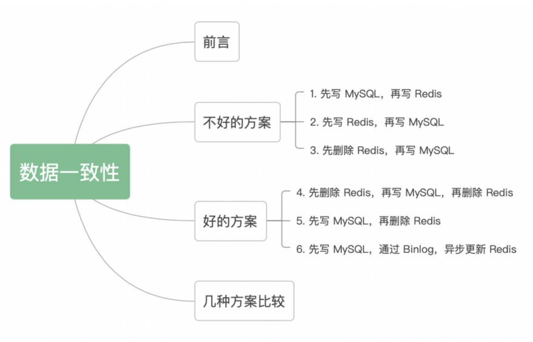
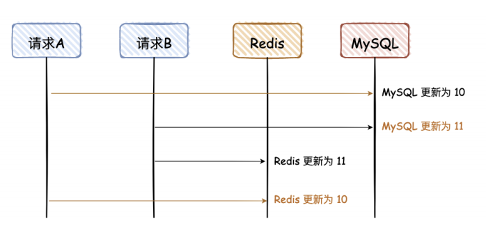
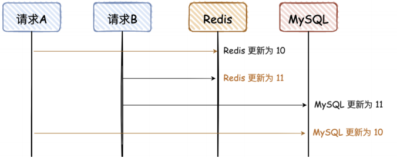
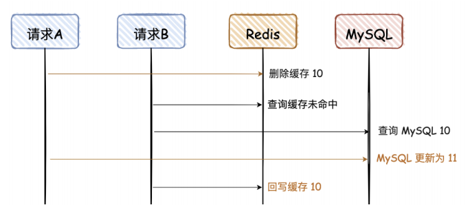
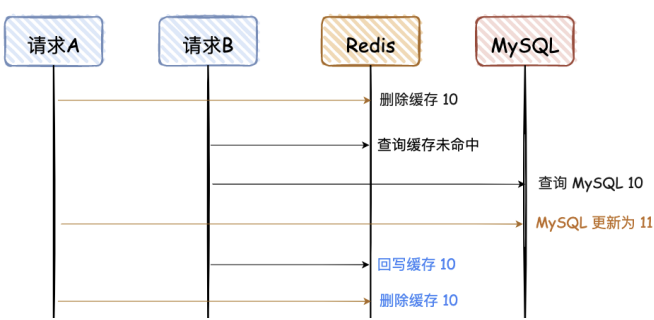
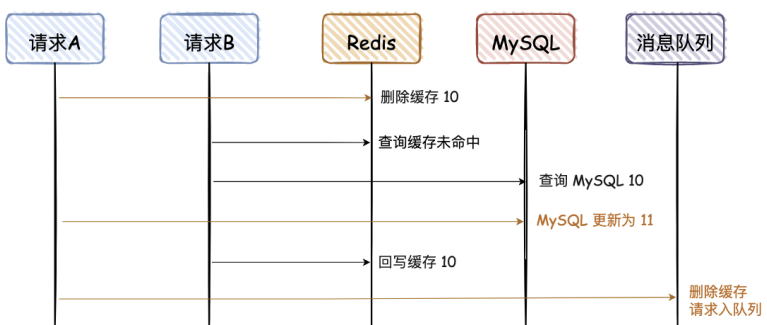
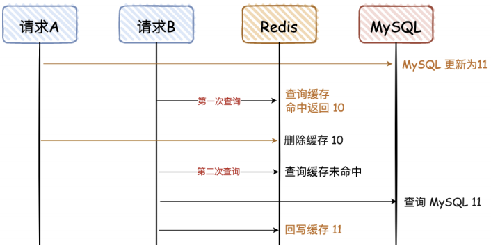
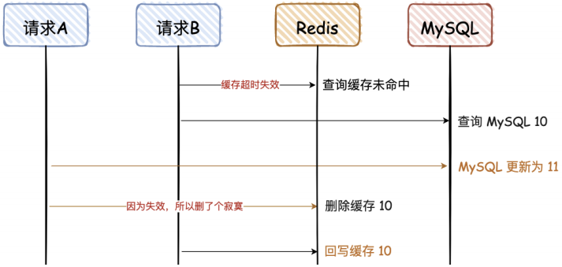
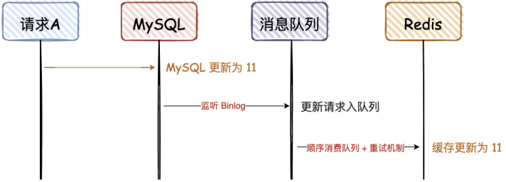

# 缓存和数据库⼀致性问题




# 不好的方案

## **1.** 先写Mysql,再写Redis(同步双写)



> 对于读请求，先去读 Redis，如果没有，再去读 DB，但是读请求不会再回写 Redis

### **a.** 同步双写优化（性能会有所下降）

在同⼀事务中同步将数据写⼊DB和Cache，在更新Cache后，提交更新DB事务，由MySQL⾏锁来确保数据⼀致性。

```java
// 开启事务
begin(transaction);
try {
    // 更新DB
    updateDB(user); 
    // 更新缓存
    updateCache(key);
    // 提交事务
    commit(transaction);
} catch(Exception e) {
    // 异常回滚
    rollback(transaction);
}
```

## **2.** 先写Redis,再写Mysql



写Redis 成功，但写数据库失败，是个问题。如果Redis 再挂了，就麻烦了

## **3.** 先删Redis,再写Mysql



请求 A 先删除缓存，可能因为卡顿，数据⼀直没有更新到 MySQL，导致两者数据不不⼀致。

这种情况出现的概率⽐较⼤，因为请求 A 更新 MySQL 可能耗时会⽐较⻓，⽽请求 B 的前两步都是查

询，会⾮常快。

# 好的方案

## **1.** 先删Redis,再写Mysql,再删Redis(<font color="red">延迟</font>缓存双删)

对于“先删除 Redis，再写 MySQL”，如果要解决最后的不⼀致问题，其实再对 Redis 重新删除即可。



第⼆次删除的时机和⽅案？

Delay⽽⾮Sleep并不是将每次写请求进程都强制sleep(N毫秒)，⽽是另外再新建⼀个线程或队列来实现延迟删除。（可选技术）

● 使⽤java.util.concurrent.DelayQueue 来实现延迟删除

● 使⽤java.util.concurrent.ScheduledExecutorService 实现定时删除

● 使⽤MQ实现DelayQueue功能

● 使⽤Redis ZSet特性实现延迟队列



## **2.** 先写Mysql,再删Redis



对于上⾯这种情况，对于第⼀次查询，请求 B 查询的数据是10，但是 MySQL 的数据是11，**只存在这⼀次不⼀致的情况**，对于不是强⼀致性要求的业务，可以容忍。

当请求B进⾏第⼆次查询时，因为没有命中 Redis，会重新查⼀次 DB，然后再回写到 Reids。

删除Redis 失败怎么办？重试/本身有TTL/回滚

**可能的问题？**



这⾥需要满⾜2个条件：

● 缓存刚好⾃动失效。

● 请求B从数据库查出10，回写缓存的耗时，⽐请求A写数据库并且删除缓存的耗时还要⻓。

对于第⼆个条件，我们都知道更新DB肯定⽐查询耗时要⻓，所以出现这个情况的概率很⼩，同时满⾜上述条件的情况更⼩。

### **a.** 为什么删除⽽不更新缓存

● 删除是幂等操作（对于分布式系统是⼀个⾮常好的特性）

● 多线程请求Update，可能由于不可预知的原因导致数据脏写，造成数据不⼀致

● 删除简单：简单优于复杂，不需要考虑加锁

● 为缓存设置⼀个TTL(time-to-live) ，删除不会打乱TTL时间

● 以Redis为例：HDEL删除Key时间复杂度为O(1)，HSET更新为O(N) N为Field/Value(字段和值)对数量

## **3.** 先写Mysql,异步更新Redis(异步双写)

然后通过异步的⽅式，将数据更新到 Redis，这种⽅案有个前提，查询

的请求，不会回写 Redis。



这个⽅案，会保证 MySQL 和 Redis 的最终⼀致性，但是如果中途请求 B 需要查询数据，如果缓存⽆数据，就直接查 DB；如果缓存有数据，查询的数据也会存在不⼀致的情况。所以这个⽅案，是实现最终⼀致性的终极解决⽅案，但是不能保证实时性。

### **a.** 异步双写实现

● MQ⽅案：写请求完成后，将Key推送⾄消息队列，消费者更新cache数据

● MySQL Binlog：利⽤MySQL主从复制的特性，消费binlog将数据写⼊缓存

# 几种方案比较

1. 先写 MySQL，再写 Redis（常⻅⽅案，但不建议）

适⽤于并发量、⼀致性要求不⾼的项⽬。但是不建议这么做；当 Redis 瞬间不可⽤的情况，需要报警出来，然后线下处理。

2. 先写 Redis，再写 MySQL（不建议）

不建议使⽤，Redis 挂了，数据就丢了。

3. 先删除 Redis，再写 MySQL（忽略）

没⽤过，直接忽略吧。

4. 先删除 Redis，再写 MySQL，再删 Redis

这种⽅式虽然可⾏，但是感觉好复杂，还要搞个消息队列去异步删除 Redis。

5. 先写 MySQL，再删除 Redis（推荐）

删除 Redis 如果失败，可以再多重试⼏次，否则报警出来；这个⽅案，是实时性中最好的⽅案，在⼀些⾼并发场景中，推荐这种。

6. 先写 MySQL，通过 Binlog，异步更更新 Redis
7. 对于异地容灾、数据汇总等，建议采⽤这种⽅案，⽐如 binlog + kafka，数据的⼀⼀致性也可以达到秒级；⾼并发场景，不建议⽤这种⽅案，⽐如抢购、秒杀等。

## 个人结论

实时⼀致性⽅案：采⽤“先写 MySQL，再删 Redis”的策略，这种情况虽然也会存在两者不⼀致，但是需要满⾜的条件有点苛刻，所以是满⾜实时性条件下，能尽量满⾜⼀致性的最优解。

最终⼀致性⽅案：采⽤“先写 MySQL，通过 Binlog，异步更新 Redis”，可以通过 Binlog，结合消息队列异步更新 Redis，是最终⼀致性的最优解。
