# IDEA插件

## idea-sql-generator-tool

一个sql快捷生成的实用插件。

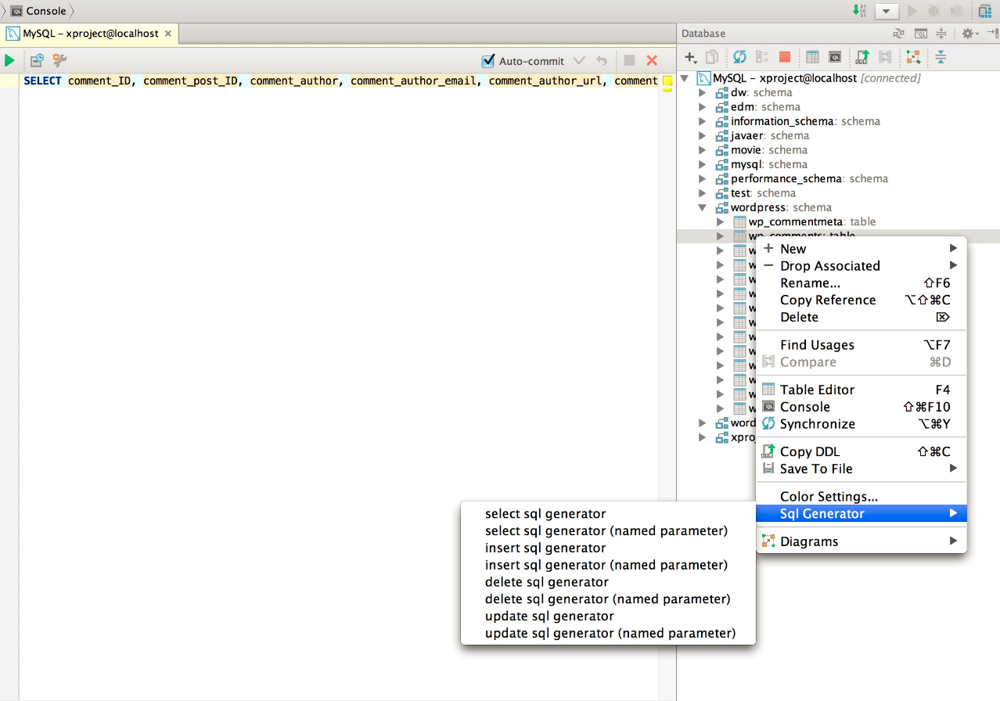


## PlantUML

PlantUML 是一个画图脚本语言，用它可以快速地画出（有很多工具都有这个插件）：

- 时序图
- 流程图
- 用例图
- 状态图
- 组件图

简单地讲，我们使用 visio 画图时需要一个一个图去画，但使用 PlantUML 只需要用文字表达出图的内容，然后就可以直接生成图片。

参考资料：

   http://www.jianshu.com/p/e92a52770832

## 单元测试覆盖率-JaCoCo插件

### pom配置

```xml
<project xmlns="http://maven.apache.org/POM/4.0.0" xmlns:xsi="http://www.w3.org/2001/XMLSchema-instance"
  xsi:schemaLocation="http://maven.apache.org/POM/4.0.0 http://maven.apache.org/xsd/maven-4.0.0.xsd">
  <modelVersion>4.0.0</modelVersion>

    <groupId>cn.demo</groupId>
    <artifactId>answers</artifactId>
    <version>0.0.1-SNAPSHOT</version>
    <packaging>jar</packaging>
    <name>answers</name>
    <url>http://maven.apache.org</url>
  
    <build>
        <finalName>answers</finalName>
        <plugins>
            <plugin>
                <inherited>true</inherited>
                <groupId>org.apache.maven.plugins</groupId>
                <artifactId>maven-compiler-plugin</artifactId>
                <version>3.1</version>
                <configuration>
                    <source>${compiler.source}</source>
                    <target>${compiler.target}</target>
                    <encoding>${project.build.sourceEncoding}</encoding>
                </configuration>
            </plugin>

　　　　　　　　<!--检查代码覆盖率的插件配置-->
             <plugin>
                <groupId>org.jacoco</groupId>
                <artifactId>jacoco-maven-plugin</artifactId>
                <version>0.7.8</version>
                <executions>
                    <execution>
                        <id>prepare-agent</id>
                        <goals>
                            <goal>prepare-agent</goal>
                        </goals>
                    </execution>
                    <execution>
                          <id>check</id>
                        <goals>
                            <goal>check</goal>
                        </goals>
                    </execution>
                    <execution>
                        <id>report</id>
                        <phase>prepare-package</phase>
                        <goals>
                            <goal>report</goal>
                        </goals>
                    </execution>
                </executions>
                
                <!-- Configuration 里面写配置信息 -->
                <configuration>
                <!-- 配置rules里面指定覆盖规则 -->
                <rules>
                  <rule implementation="org.jacoco.maven.RuleConfiguration">
                    <element>BUNDLE</element>
                    <limits>
                         <!-- 指定方法覆盖到80% -->
                      <limit implementation="org.jacoco.report.check.Limit">
                        <counter>METHOD</counter>
                        <value>COVEREDRATIO</value>
                        <minimum>0.80</minimum>
                      </limit>
                        <!-- 指定指令覆盖到80% -->
                      <limit implementation="org.jacoco.report.check.Limit">
                        <counter>INSTRUCTION</counter>
                        <value>COVEREDRATIO</value>
                        <minimum>0.80</minimum>
                      </limit>
                       <!-- 指定行覆盖到80% -->
                      <limit implementation="org.jacoco.report.check.Limit">
                        <counter>LINE</counter>
                        <value>COVEREDRATIO</value>
                        <minimum>0.80</minimum>
                      </limit>
                      <!-- 指定类覆盖到100%，不能遗失任何类 -->
                      <limit implementation="org.jacoco.report.check.Limit">
                        <counter>CLASS</counter>
                        <value>MISSEDCOUNT</value>
                            <maximum>0</maximum>
                      </limit>
                      
                    </limits>
                  </rule>
                </rules>
                </configuration>
            </plugin>
            
        </plugins>
    </build>
    <properties>
        <project.build.sourceEncoding>UTF-8</project.build.sourceEncoding>
        <compiler.source>1.7</compiler.source>
        <compiler.target>1.7</compiler.target>
        <junit.version>4.12</junit.version>
    </properties>

    <dependencies>
        <!-- 新增jacoco的maven插件 -->
        <dependency>
            <groupId>org.jacoco</groupId>
            <artifactId>jacoco-maven-plugin</artifactId>
            <version>0.7.8</version>
        </dependency>
        <dependency>
            <groupId>junit</groupId>
            <artifactId>junit</artifactId>
            <version>${junit.version}</version>
            <scope>test</scope>
        </dependency>
    </dependencies>        
</project>
```

### 单元测试运行换JaCoCo

> 如果覆盖率达不到，并且没有跳过测试，那么install会报错。


## CamelCase

大小写及驼峰转换插件 快捷键使用 ➡️ `Shift + Alt + U`

## CodeGlance

代码编辑区缩略图插件 快捷键使用 ➡️ `Ctrl + Shift + G`

## MybatisX

在好用的插件Free MyBatis plugin之上进行改造的一个插件。

- 生成mapper xml文件
- 快速从代码跳转到mapper及从mapper返回代码
- mybatis自动补全及语法错误提示
- 集成mybatis generator gui界面
- 根据数据库注解，生成swagger model注解

- mapper and xml can jump back and forth
- mybatis.xml, mapper.xml prompt
- mapper and xml support auto prompt like jpa (reference MybatisCodeHelperPro)

## 翻译插件Translation 

第一步下载插件：

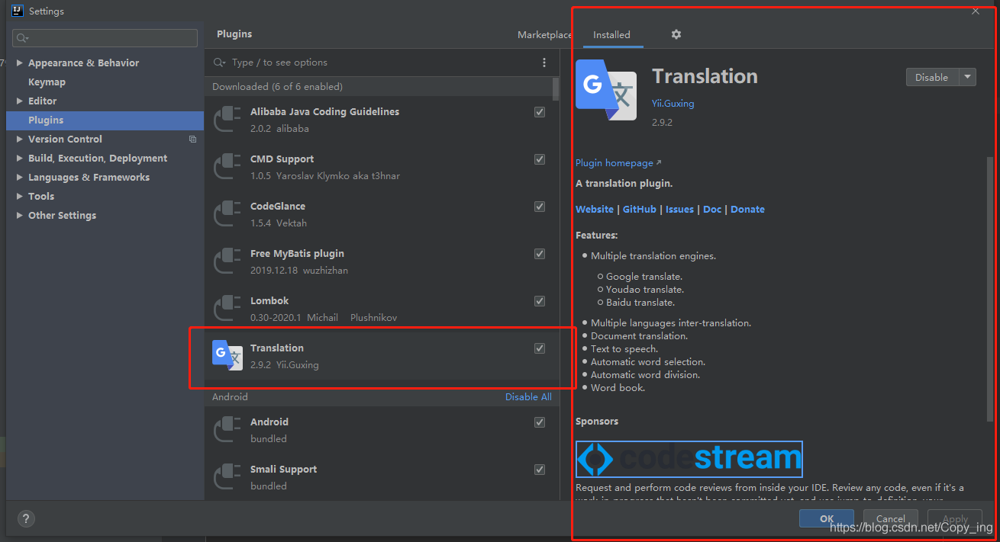

使用很简单：

- 选中单词或者段落ctrl+shift+y翻译，ctrl+shift+s切换翻译源 
- 选择输入字符，然后ctrl+shift+x，能够将代码中的汉字转换为对应的英文

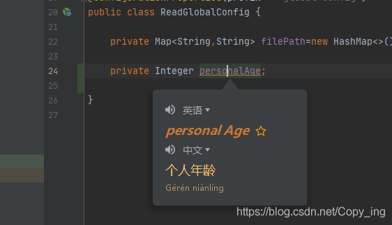

但是有的时候会快捷键冲突，我们需要重新设置一下：

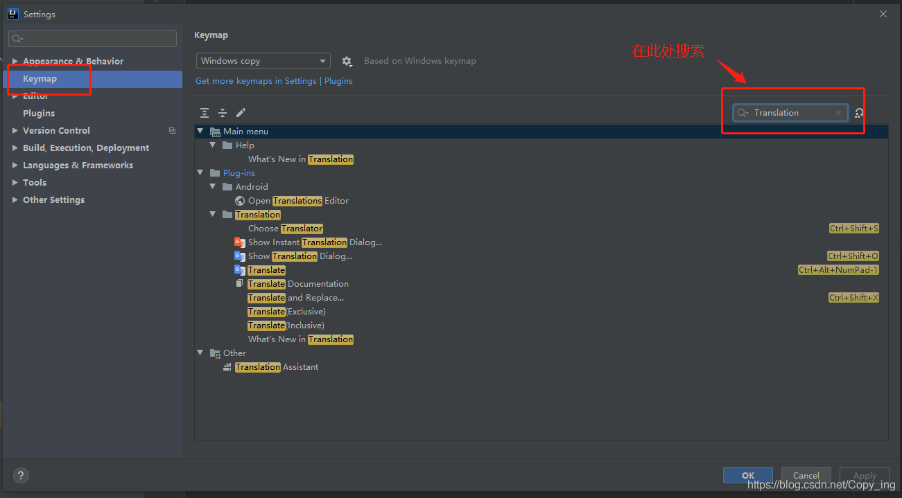

 

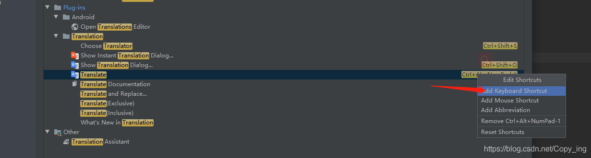

 

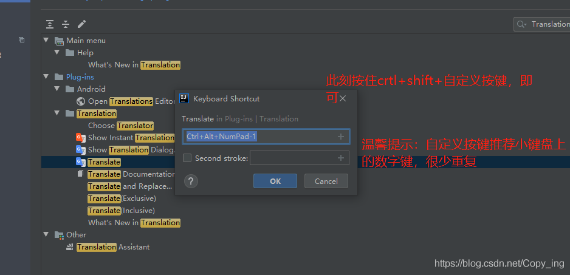

 以下为效果图：

汉译英

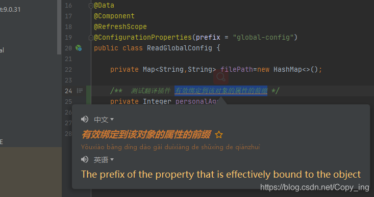

 英译汉

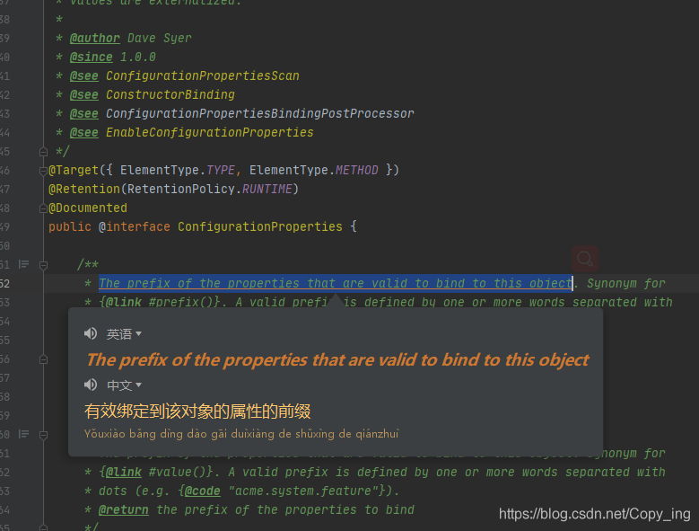

## grep console

java 开发的过程中，日志都会输出到console，输出的内容是非常多的，所以需要有一个工具可以方便的查找日志，或者可以非常明显显示我们关注的内容，grep console就是这样的一个工具。

安装完成后，在console中右键就能打开。

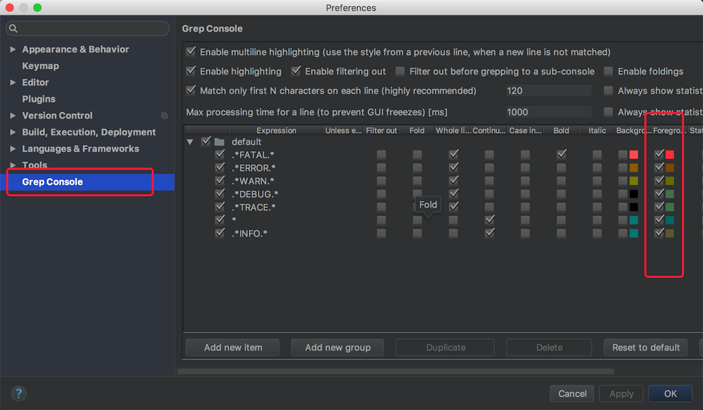

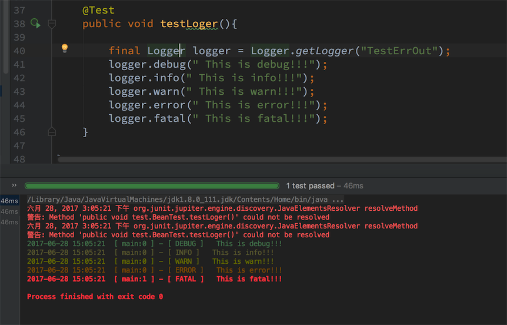

## MyBatis Log Plugin

Mybatis现在是java中操作数据库的首选，在开发的时候，我们都会把Mybatis的脚本直接输出在console中，但是默认的情况下，输出的脚本不是一个可以直接执行的。>MyBatis Log Plugin

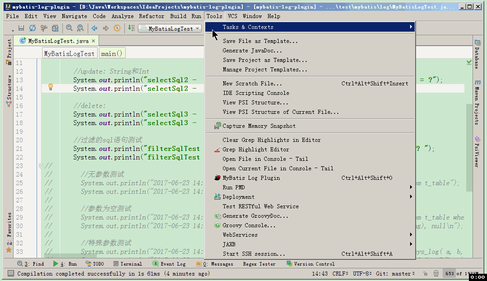

## Alibaba Java Coding Guidelines

阿里代码规约检测：Alibaba Java Coding Guidelines

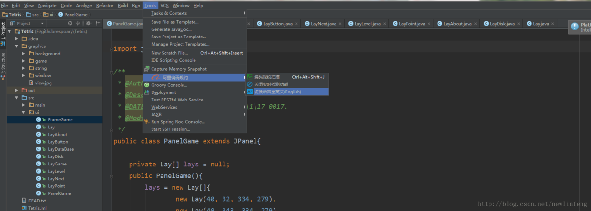

### Key promoter X

快捷键提示工具：Key promoter X


## Lombok

代码注解插件： Lombok

## CodeMaker

代码生成工具：CodeMaker     有时间的时候可以试一试好不好用

## GsonFormatPlus

JSON转领域对象工具


## String Manipulation

字符串工具：String Manipulation

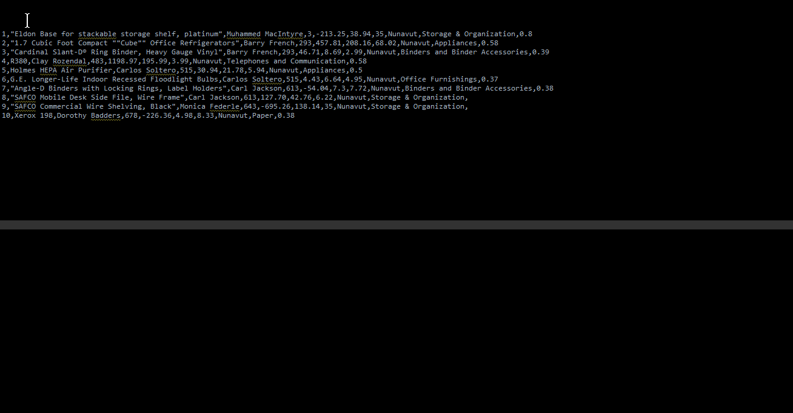

## Iedis

Redis可视化：Iedis

## Kubernetes

K8s工具：Kubernetes