# IDEA 设置Settings

​	进入IDEA全局设置，File | Settings (Ctrl + Alt + S)

## 编码设置

​	防止项目代码编码问题，以及控制台乱码等问题。

项目编码设置：

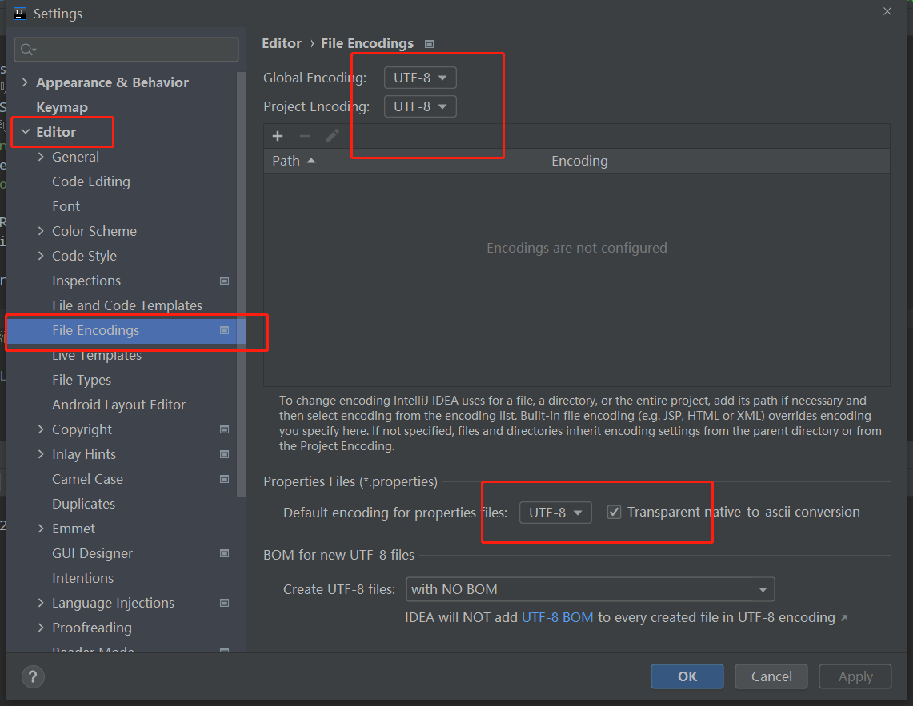

防止控制台输出中文乱码问题：

Help->Edit Custom VM Options 在打开的文件中追加上这一行：

```
-Dfile.encoding=utf-8
```

IDEA安装目录下两个文件idea.exe.vmoptions和idea64.exe.vmoptions文件末尾添加上一行。

```
-Dfile.encoding=utf-8
```


## 新建项目默认配置

​	防止比如每次新建项目都要改一次maven配置，仓库settings文件，编码等。

"File"->"New Projects Settings " -> "Settings for New Projects"

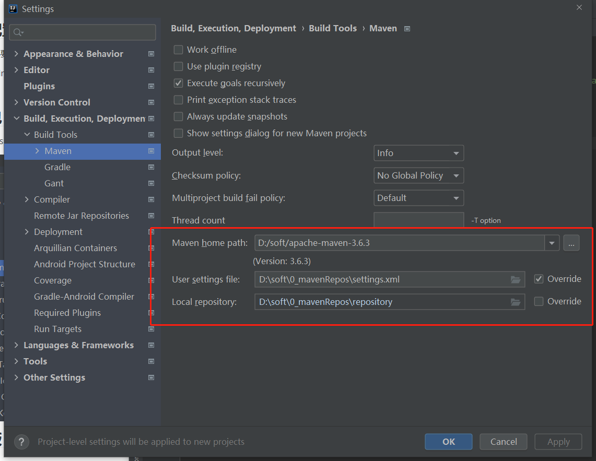

## 代码自动导入包

​	**功能路径：**File | Settings | Editor | Genreal | Auto Import

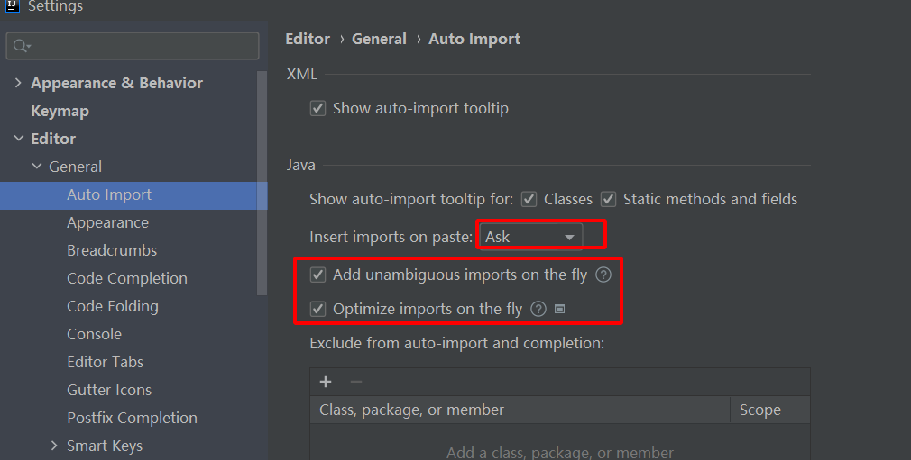

## 文件和代码模板 File and Code Templates

### 功能介绍

​	**功能路径：**File | Settings | Editor | File and Code Templates

​	这个功能的代码模板都是基于[Apache Velocity](http://velocity.apache.org/) 模板语言编写的，使用模板能够提取文件或者相同代码的共性，让我们少做重复性劳动，能够提高我们的生产效率。

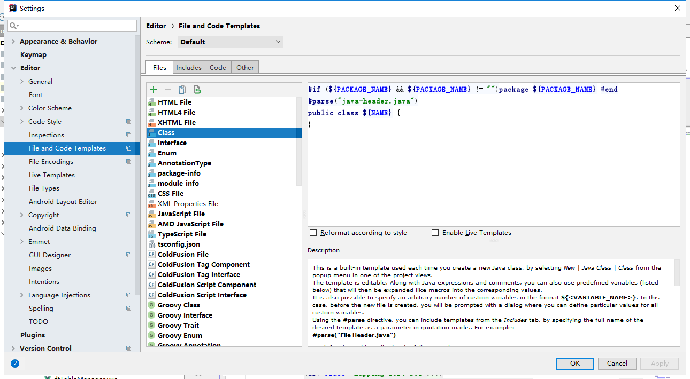

​	**Files标签**中存放了文件和代码模板，系统默认自带了一些对特定文件格式的模板。不管是系统自带的还是后来用户自己新建的文件代码模板，都会出现在新建文件列表中。

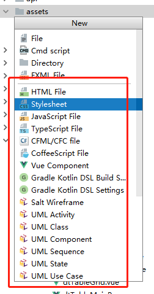

​	**Includes标签**中存放了其它几个标签中可以复用的代码片段。比如说：你定义了一个关于VUE公用的头注释模板，可以在你定义的多个VUE模板中使用。 可以通过#parse("代码片段文件.扩展名")方式使用。


​	**Code标签**，这个标签中定义的内容，在代码中使用快捷键可以直接使用，可惜可是不能新增代码块，只能使用系统自带的几个预定义类型（可以修改）。如果自己新增代码块，可以考虑使用Live Templates基于代码快捷的方式使用代码模板。

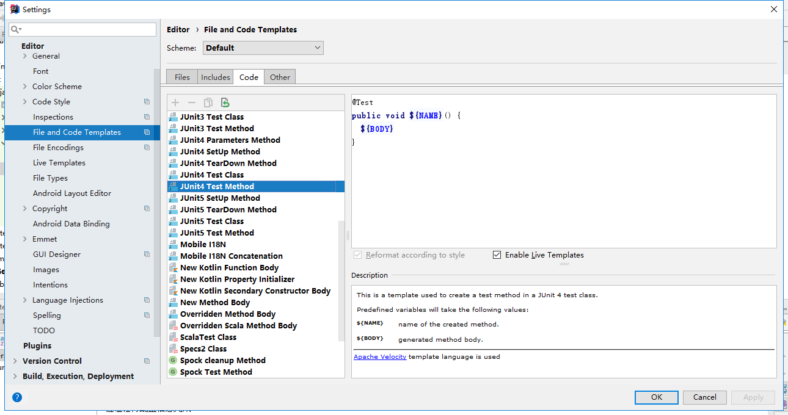

​	上图中有一个Junit4的测试方法模板，那么你在一个Junit4测试类中可以使用alt+insert就可以选择这个预定好的模板。


**Other标签**,存放其它相关技术常用的一些通用代码模板文件。

​	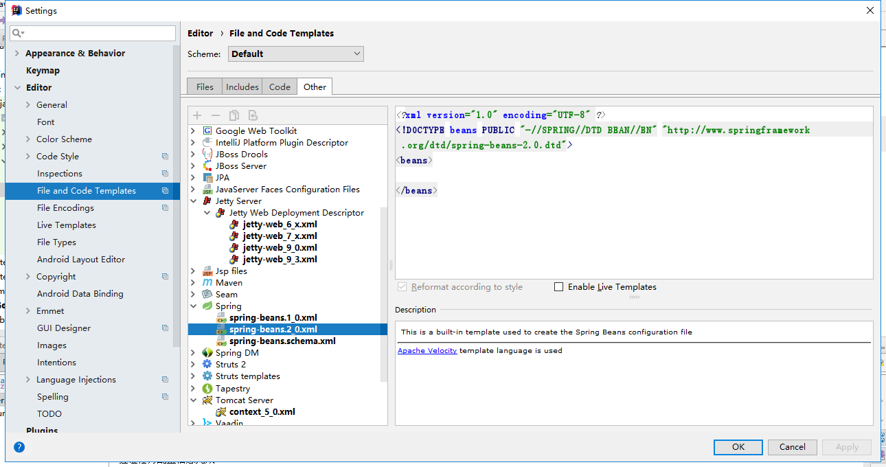

**Schema：**schema有Default和Project两种， 意思是对于下面的文件和代码模板的设置有两个模板空间。

​	Default 系统默认的代码模板空间，在里面定义的东西可以适用于所有的IDEA新建的项目。

​	Project 是针对于某个项目定义的代码模板，只能用于当前项目，不能再其它项目中使用。

​	在这个功能里面定义的所有模板在磁盘上都能找到，这样在用户自定好模板在不同机器上或者不同项目上可以拷贝模板直接使用。

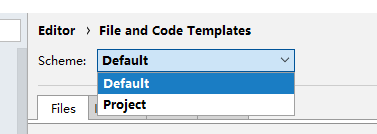

​	Default的存放路径是 ${user.home}\.IntelliJIdea2017.3\config\fileTemplates下

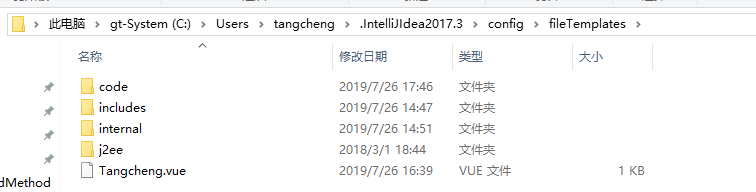

​	Project的存放路径在${project.path}/.idea/fileTemplates中。

### 文件代码模板预设的变量

${PACKAGE_NAME} - 创建一个java类或者接口的时候的包路径.

${PROJECT_NAME} - 当前项目的名称.

${FILE_NAME} - 创建PHP文件的名称.

${NAME} - 创建新文件在对话框中输入的文件名称.

${USER} - 当前系统登录的用户名.

${DATE} - 当前系统的日期.

${TIME} - 当前系统的时间.

${YEAR} - 当前系统的年份.

${MONTH} - 当前系统的月份.

${DAY} - 当前系统月份的哪一日.

${HOUR} - 当前系统时间的小时.

${MINUTE} - 当前系统时间的分钟.

${PRODUCT_NAME} - the name of the IDE in which the file will be created.

${MONTH_NAME_SHORT} - 当前月份3个字符缩写，例如: Jan, Feb, etc.

${MONTH_NAME_FULL} - 当前月份全写，例如: January, February, etc.

​	如果在模板中使用的变量不是系统预定的变量，并且没有通过#set来初始化这个变量，那么在使用这个模板的时候在新建对话框中会提示用户录入变量值。例如下图中的classDescr和userDefineVar变量（不支持中文变量）。


### 代码Files功能实战

定义一个include代码片段，名为java-header, 扩展名问.java：

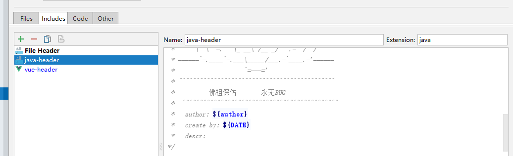

代码片段内容：

```bash
#set($author = "tangcheng_cd")

/**
  *                    _ooOoo_
  *                   o8888888o
  *                   88" . "88
  *                   (| -_- |)
  *                   O\  =  /O
  *                ____/`---'\____
  *              .'  \\|     |//  `.
  *             /  \\|||  :  |||//  \
  *            /  _||||| -:- |||||-  \
  *            |   | \\\  -  /// |   |
  *            | \_|  ''\---/''  |   |
  *            \  .-\__  `-`  ___/-. /
  *          ___`. .'  /--.--\  `. . __
  *       ."" '<  `.___\_<|>_/___.'  >'"".
  *      | | :  `- \`.;`\ _ /`;.`/ - ` : | |
  *      \  \ `-.   \_ __\ /__ _/   .-` /  /
  * ======`-.____`-.___\_____/___.-`____.-'======
  *                    `=---='
  * ^^^^^^^^^^^^^^^^^^^^^^^^^^^^^^^^^^^^^^^^^^^^^
  *          佛祖保佑       永无BUG
  * ^^^^^^^^^^^^^^^^^^^^^^^^^^^^^^^^^^^^^^^^^^^^^
  *   author: ${author}
  *   create by: ${DATE}
  *   descr: 
 */
```

​	定义好之后，我在文件模板中就可以通过#parse("java-header.java")来使用这个代码片段，这个可以加入到系统自带的Class、Interface、Enum等中，也可以自己建立一个myJava文件模板，下面是用自己建立的方式。

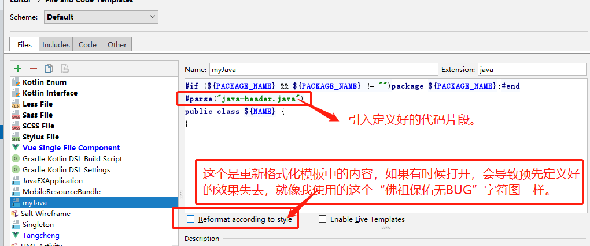

在建立好文件模板后，在新建文件选择列表(目录上alt+insert, 否则ctrl+alt+insert)中就有了我建立的myJava。

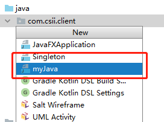

建立效果图：

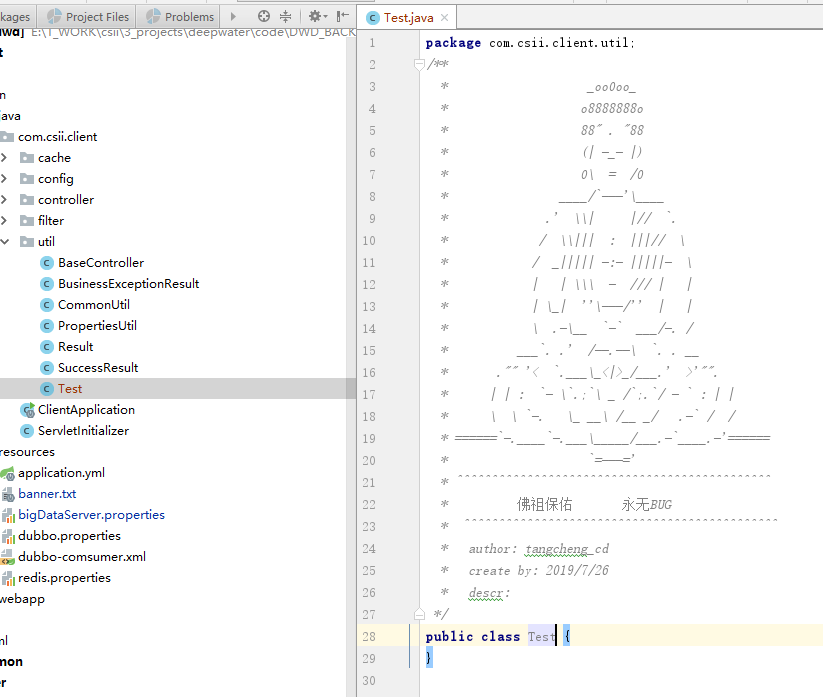

java之外的代码模板一样的建立方法，就不一一举例了。


## 加大共享构建处理内存

​	经常遇到打开大工程编译的时候编译不了，是因为下面设置设置小了，默认是700M。

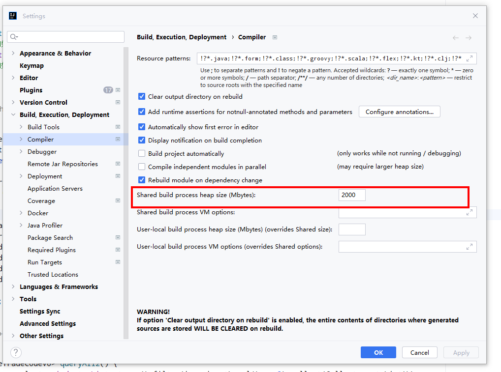
