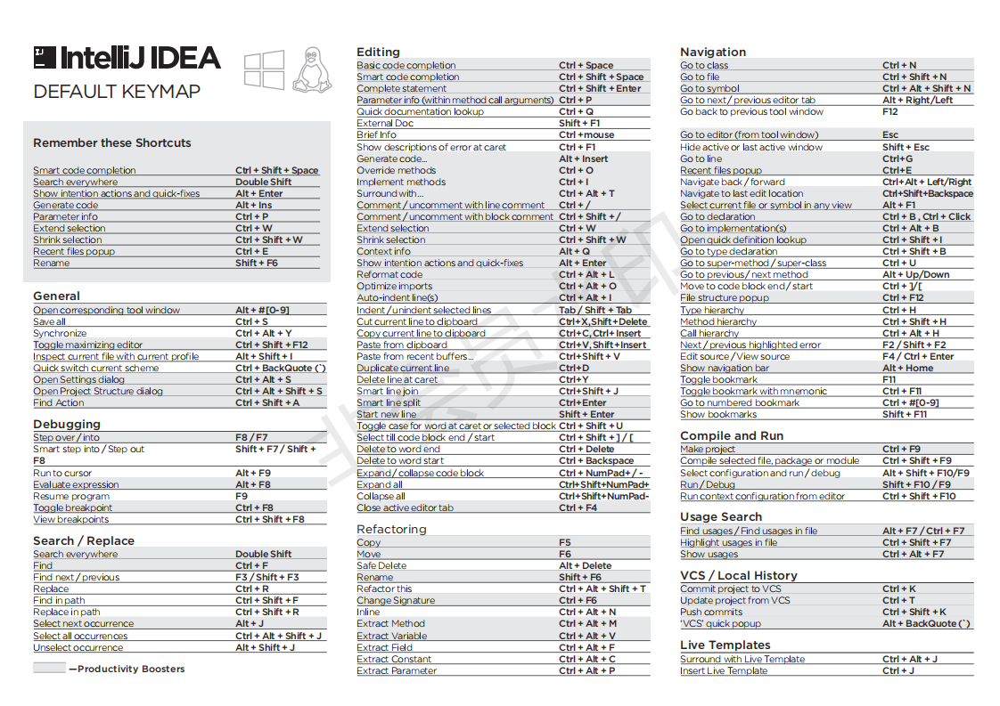
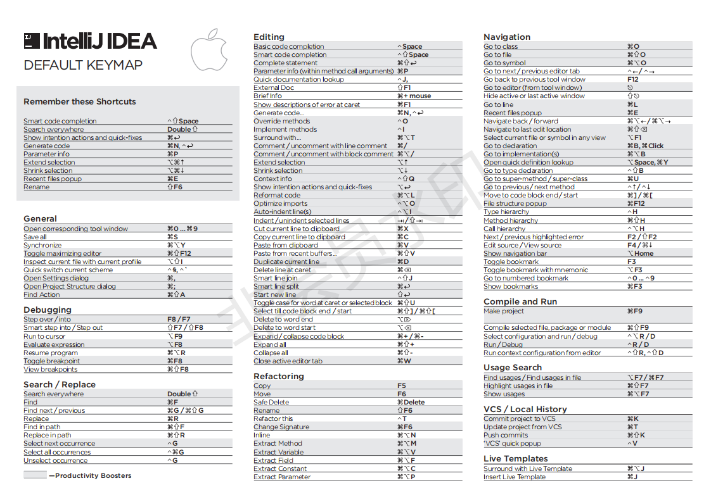

# IDEA快捷键

[网络上朋友的IDEA使用总结](https://www.cnblogs.com/jingmoxukong/p/7813862.html)

## IDEA官方快捷键指南图

**windows的IDEA快捷键:**

**Mac的IDEA快捷键**

###### 

## 自我总结的快捷键

 **快输合并和展开代码（合并和展开的是某一个标签）**

ctrl  + -  合并代码  			ctrl + +  展开代码   

**快速合并和展开代码（合并和展开选中的所有标签）**

ctrl  + shift + -  合并代码  			ctrl + shift + +  展开代码   

**Boomarks功能快捷键**

ctrl + shift + 数字键     快速为代码打数字标签(再按一次同名数字标签取消上次打的哪个同名标签)

ctrl + 数字键       定位到数字标签位置

ctrl + F11  打开书签面板选择字母或者字母标签名

shift + F11  以面板的形式显示所有存在的书签（只读），点击可以跳转，或者点击删除建立的书签。

**快速编辑类快捷键**

shift + enter 快速新启一行在下一行

ctrl + shift + enter  快速新启一行在上一行

ctrl + shift + top/bottom 快速将   当前行/当前选择内容  上移/下移。 （用于将当前内容移动到合适的位置）

alt + 鼠标拖动  多列编辑  （特别赞）

shift + alt + 鼠标点击    光标多处编辑  （特别赞）

ctrl+alt+shift+j 快速查找当前鼠标位置字符串或选择字符，并开启多处编辑模式（特别赞）

ctrl + f/r   查找/替换   支持正则表达式搜索 

**快速选择类快捷键**

ctrl + w  基于当前光标位置选择一个单词, 多次按会扩大选择范围

ctrl + shift  + w 反向缩小范围选择单词

ctrl + shift + left/right 基于单词向左/右选择单词

**快速移动快捷键**

ctrl + left/right   基于单词向左/右移动

Alt+回车 导入包,自动修正

Ctrl+N  查找类

Ctrl+Shift+N 查找文件

Ctrl+Alt+L  格式化代码

Ctrl+Alt+O 优化导入的类和包

Alt+Insert 生成代码(如get,set方法,构造函数等)

Ctrl+R 替换文本

Ctrl+F 查找文本

Ctrl+空格 代码提示

Ctrl+Alt+Space 类名或接口名提示

Ctrl+P 方法参数提示

Ctrl+Shift+Alt+N 查找类中的方法或变量

Alt+Shift+C 对比最近修改的代码

 

Ctrl+Shift+先上键

Ctrl+X 删除行

Ctrl+D 复制行

Ctrl+/ 或 Ctrl+Shift+/  注释（// 或者/*...*/ ）

Ctrl+J  自动代码

Ctrl+E 最近打开的文件

Ctrl+H 显示类结构图

Ctrl+Q 显示注释文档

Alt+F1 查找代码所在位置

Alt+1 快速打开或隐藏工程面板

ctrl+alt+B 快速跳转到实现

Ctrl+Alt+ left/right 返回至上次浏览的位置

Alt+ left/right 切换代码视图

Alt+ Up/Down 在方法间快速移动定位

F2 或Shift+F2 高亮错误或警告快速定位

 

代码标签输入完成后，按Tab，生成代码。

选中文本，按Ctrl+Shift+F7 ，高亮显示所有该文本，按Esc高亮消失。

Ctrl+W 选中代码，连续按会有其他效果

Ctrl+Up/Down 光标跳转到第一行或最后一行下

ctrl+alv+v  快速生成变量

iter   快速生成遍历语句

Ctrl+Shift+Up/Down 代码向上/下移动。

Ctrl+B 快速打开光标处的类或方法 

选中文本，按Alt+F3 ，逐个往下查找相同文本，并高亮显示。

Ctrl+Shift+Space 自动补全代码

Ctrl+Shift+BackSpace 快速回到最后一次编辑的位置

Shift+F6  重构-重命名

Ctrl+E或者Alt+Shift+C  最近更改的代码
