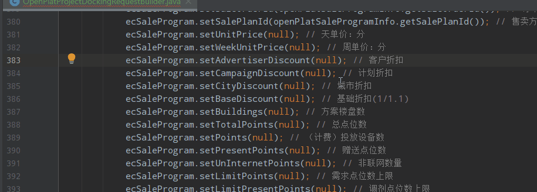

# 我的IDEA奇技淫巧

## 多个位置候选输入

idea快捷键技巧之通过候选进行下一个输入位置。

1. 定义候选位置符号（大多数时候可能已经有了），动图中使用的是null；

2. ctrl+f，输入null搜索，然后按esc关闭搜索框；
3. 开始进行你的内容编辑，然后按F3前往下一处编辑位置；




## 代码特殊注释

### 规范

```java
// FIXME  说明标识处代码需要修正，甚至代码是错误的，不能工作，需要修复
// TODO   说明在标识处有功能代码待编写
// XXX    标识处代码虽然实现了功能，但是实现的方法有待商榷，希望将来能改进
```

**为了区分出是否是自己的标注，自己重新定义为！！！：**

```java
// FIXME:tc:
// TODO:tc: 
// XXX:tc: 
```

### **配置Live Templates**

配置Live Templates方便快速输入：

File | Settings | Editor | Live Templates


定义好之后，我们输入fix或者td或者xxx，然后按tab键就可以快速生成特殊标记。

### 使用TODO面板


#### **快捷键：**

ctrl+alt+向下/向上  前往下一处或上一处代办标记处      比较有用

ctrl+alt+M  group by Modules    需要在todo面板

ctrl+alt+P   group by packages	需要在todo面板

ctrl+alt+C   group by Flatten View	需要在todo面板

ctrl + +/- 展开或收缩分组

#### **作用域查看**

Project：项目视图

Current File：当前打开激活的文件

Scope Based：可以定义多个作用域来查看。eg：所有位置、当前选择、项目视图、最近查看文件、最近修改文件、某个Module等等

Default Changelist：这个是基于版本管理的列出的改动文件中的代码特殊标记。

#### **个性化规范代码特殊标记配置**

配置Filters


