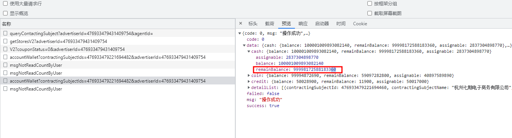
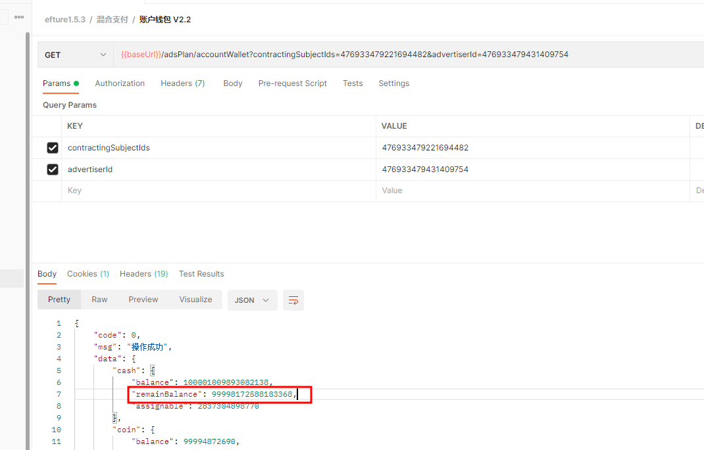

# 浏览器精度问题


​       后端返回了一个long型的金额给浏览器，这个值特别的大，导致值末尾实际是68，结果返回显示的60问题。但是使用postman发同样的环境，返回的是正确的68。

**解决方案：**为了避免这种问题，通常后端给前端返回比较大的数字使用字符串的形式就可以避免这种问题。

浏览器返回数据
postman返回数据

浏览器返回数据是不对的


## 解决办法

- 方式一：直接不使用Long返回，使用String

- 方式二：使用Long返回，加注解JsonFormat

  ```java
  import com.fasterxml.jackson.annotation.JsonFormat;
  
  @Data
  @NoArgsConstructor
  @AllArgsConstructor
  public class DismantleResultVo {
      
      @JsonFormat(shape = JsonFormat.Shape.STRING)
      private List<Long> newAdsProgramCodeList;
      
      @JsonFormat(shape = JsonFormat.Shape.STRING)
      private Long id;
  }
  ```

  