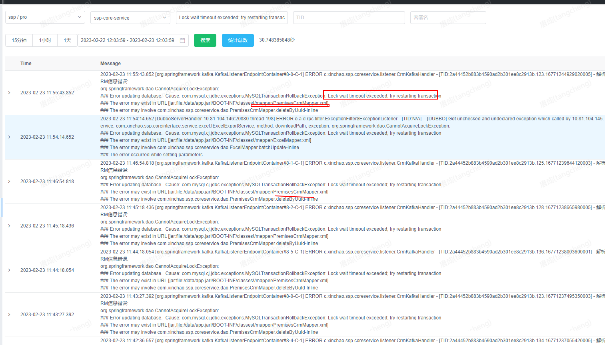

# 手动操作事务引发的生产问题

# 一、**发现时间：**

2023年2月23日 9点18分

# 二、**故障现象：**

SSP系统相关功能使用，返回结果较慢，且部分功能提示处理成功后，不同功能相同的数据展示的结果不一致。

# 三、**对业务的影响**

1） 影响业务使用：2.5个小时；

2） 造成的业务脏数据：吾悦华府、国贸新城、星叶瑜憬湾2期、益田村、财富大厦高层、金润名都、锦艺金水湾观臻苑；

 

# 四、**处理过程：**

整个事件处理过程分两条线：问题排查及解决。

1、 **问题排查及处理过程**

主要参与人：王\*、庄\*、何\*、陆\*、唐\*、房\*、黄\*、唐\*

处理过程：

- 09:25 查询业务日志，日志中有大量的MySQLTransactionRollbackException: Lock wait timeout exceeded; try restarting transaction；

  

- 09:30 联系DBA查看SSP数据库是否有异常，DBA排查无死锁脚本、数据库监控数据正常；

- 09:50 通过showProcessList命令，发现有主从备份及数据平台dump的日志，联系华为云排查；

- 10:30 通过showProcessList命令，查询其他数据库，发现主从备份有类似的dump日志，因此排除是dump日志造成的；

- 10:35 确认前一天发过版，发版内容是“优化了和资产系统的交互，调用资产系统的接口由同步修改为异步调用”，研发测试确认发版内容和该问题无关；

- 0:40 通过“SELECT * FROM INFORMATION_SCHEMA.INNODB_TRX;”查询数据库，有5条事务，其中有一条从00:10开始一直挂起；

- 10:50 通过kill命令关闭上面对应的线程，重启数据库并重启ssp-core-service和ssp-inner-api两个服务；

- 10:57 SSP系统恢复正常；

- 12:17 唐成查看业务日志，再次出现大量的MySQLTransactionRollbackException: Lock wait timeout exceeded；

- 12:20 通过“SELECT * FROM INFORMATION_SCHEMA.INNODB_TRX;”查询数据库，有3条事务,从11:32开始一直挂起；

- 12:40 将ssp-core-service和ssp-inner-api两个服务回滚到上一个版本；

- 12:50 SSP系统恢复正常

- 12:55 排查出前一天发版的代码中存在通过代码主动开启事务后在异常情况下未关闭的情况

 

 

# 五、**处理方式：**

1） 及时联系DBA排查数据库情况；

2） 回滚发版；

3） 复核前一天发版的代码

 

# 六、**故障原因分析：**

- 问题引发的原因

​		周三发布的代码，存在通过手动代码开启事务处理处理不完整，对异常情况未考虑，导致在异常情况下，事务开启后，一直无法关闭，数据库连接池达到上限后，后续的事务一直处于等待状态。

 	对异常if逻辑分支处理不玩转，导致有些分支走到最后不会去关闭事务，导致事务连接耗尽。

# 七、**暴露的问题:**

通过对本次事件的思考，反馈出以下各个方面的不足：

1） 问题发现后置：业务反馈有问题后才去排查，缺少预警；

2） 代码规范：目前框架、组件等使用规范缺失；

3） 代码审核：缺少审核标准，每个人的关注点有差异；

4） 运维监控数据不足以支撑快速定位问题

 

 

# 八、**相关方及责任：**

 

 

 

# 九、**整改措施及建议：**

1.  代码整改：修改代码实现方式，将事务相关处理抽取成独立的方法，使用@Transactional注解代替手动开启事务，责任人：陆\*，预计完成时间：2023年2月24日完成代码整改，2023年2月27日完成测试并发布到线上环境；

2. 数据清洗：清洗系统异常期间产生的脏数据，责任人：周\*\*，预计完成时间：2023年2月27日；

3. 增加业务异常日志推送：联系蒋何博，将SSP的业务异常日志推送给王巧和唐成，责任人：王巧，预计完成时间：2023年2月24日；

4. 代码规范制定，责任人：钟\*\*，预计完成时间：2023年3月31日；

5. 代码审核标准制定，责任人：钟\*\*，预计完成时间：2023年3月31日；

6. 督促运维增加数据库连接池监控数据，责任人：王\*：预计完成时间：2023年2月24日

# 十、**持续优化**

# 十一、**后续跟进**

 

 

# 十二、**技术委员会建议及评审结论：**

事故等级：

责任等级：

 