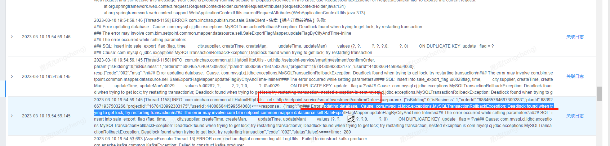
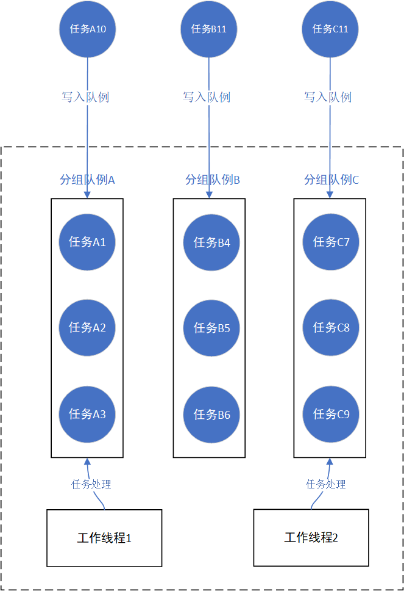
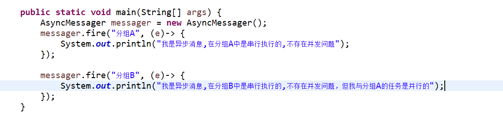
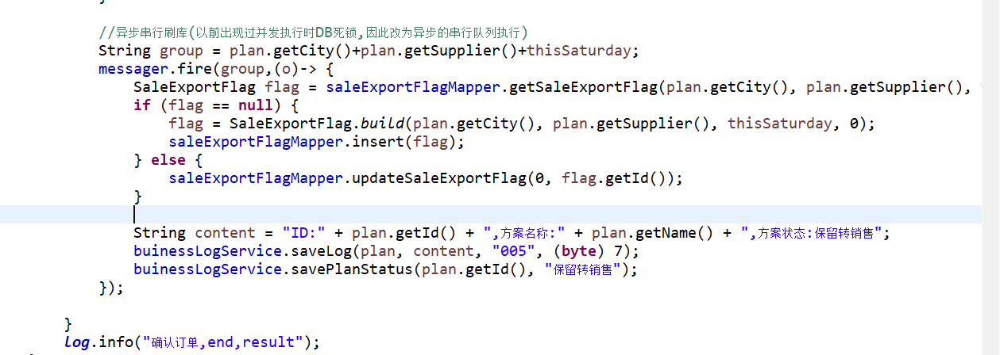

# insert on duplicate key update引发数据库死锁

在做电梯广告这家公司，有一次周五值班的时候出现有智能投放广告订单转销售失败，报错是由售卖系统报错出来的。

最后确定是由于insert on duplicate key update引发数据库死锁。

下面部分资料来源于 小波同学，https://www.jianshu.com/p/7f5d9cf57945，感谢！！

我们的数据库中的发生死锁的表是具有”多列组合构建的唯一索引“（不包含自增的主键），且数据库的隔离等级为Read Committed，另外对于这个表来说是写入远大于读取的，由于业务的原因，经常会出现同一数据反复插入（同一数据指唯一索引值相同的数据，但其他非索引字段可能不同），所以为了简化代码，我们使用insert on duplicate key update来解决这种问题，当mysql检测到唯一键冲突时，仅更新特定（非索引）字段。但是问题就出现在大规模多worker并发插入的时候，会经常出现"Deadlock found when trying to get lock"。

即任务提交到线程池，多线程并发执行insert on duplicate key update，并且为长事务时，抛出异常。

## 总结：

死锁的原因找到了，解决的办法其实比较简单。

- 1、将批量insert on duplicate key update，拆分成多个语句。保证一次事务中不要插入过多值，将多个数据，变成多个sql，执行插入。可以有效的减少死锁命中的发生。
- 2、重试：死锁不可怕，当出现死锁发生时，多执行重试操作可以有效保证插入成功，更新不丢失。
- 3、线程池多线程并发执行改为单线程排队处理。 （这个当时项目组的架构师使用其他工程的一个自定义线程池，实现同组的线程排队执行，不同组的线程并发执行）

同时满足了上面的第1点和第3点解决办法：

