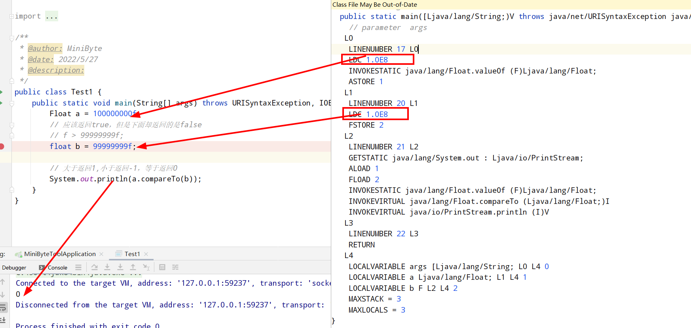
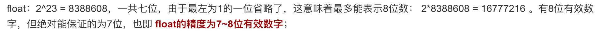

# float精度问题引发的神奇探索

问题起源是业务上，有一个字段有个边界值为99999999，但是测试人员使用用100000000仍然没有出边界。

```java
100000000f == 99999999f; // true
```


通过IDEA的show bytecode查看编译后的数值情况：



通过上图可用发现，两个值都被转换为科学计数法1.0E8，这是为啥的呢？编译器有问题？那我要比较这两个值谁大谁小改怎么做？

```java
package com.minibyte.test;

import java.math.BigDecimal;

public class Test1 {
    public static void main(String[] args){
        test1();// 原问题
        test2();// 解决尝试一，未解决
        test3();// 解决尝试二，可以解决
    }

    private static void test1() {
        Float a = 100000000f; // 1.0E8
        // 应该返回true，但是下面却返回的是false
        // f > 99999999f;
        float b = 99999999f;

        // 大于返回1,小于返回-1，等于返回0
        System.out.println(a.compareTo(b));
    }

    private static void test2() {
        Float a = 100000000f;
        // 应该返回true，但是下面却返回的是false
        // f > 99999999f;
        Float b = new Float("99999999"); // 该方法依然不能解决

        // 大于返回1,小于返回-1，等于返回0
        System.out.println(a.compareTo(b));
    }


    private static void test3() {
        Float a = 100000000f;
        // 应该返回true，但是下面却返回的是false
        // f > 99999999f;
        BigDecimal b = new BigDecimal("99999999"); // 借助BigDecimal解决

        // 大于返回1,小于返回-1，等于返回0
        System.out.println(new BigDecimal(a).compareTo(b));
    }
}
```

这个时候有人问，难道这个值超出了Float的取值范围了吗？

```java
 Float.MAX_VALUE  = 3.4028235E38
 System.out.println(new BigDecimal(Float.MAX_VALUE));
// 340282346638528859811704183484516925440
```

欸，最大值那么大，没有超出欸！那是怎么回事呢？

从上面值变成科学计算法后的值可以看出，两个值是一样的，说明float比较的是科学计数法以后的值，超过8位的数值将不能被准确表示，所以同位数或者四舍五入后同位数的值，比较起来就直接相等了。




其实double也有同样的问题，不过**double有效数字位为15 – 16位**，而float的**有效数字是6或7位，第7位不一定有效，前6位一定有效**。


