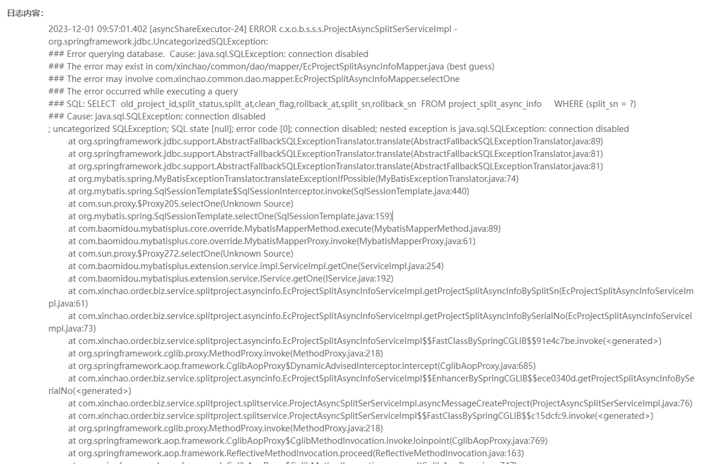
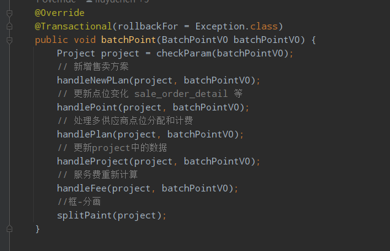

# 手动操作事务引发的生产事务2


## 现象

两个现象：

1. 不同功能偶发查询出现 Cause: java.sql.SQLException: connection disabled；
2. 偶发前面步骤应该入库的数据，后续异步操作没看到数据。 （通过候补工具接口，业务成功完成） 注意：该功能运行有几年了，今日首次出现这种情况；


方案拆解ec-biz-order首次出现 ### Cause: java.sql.SQLException: connection disabled， 是在执行一个查询语句出现的 
今日2023-12-01 09:15:14到2023-12-01 10:30:17之间，一共发生5次这个错误，分别在不同功能


后续，知道下午一直有出现不同功能的错误。


## 排查问题

1.DBA观察数据库是正常的；

2.运维观察到服务是正常运行的；

3.查看最近提交的代码（最后才想到的，还好没有重启大法）；

发现近几天有同事修改了关联计划的代码，他是好意的，为了业务操作能够进行回滚，他对业务加了事务的处理，但是没做成好事。


### 问题1（主要问题）：

​	提前return，事务没有关闭！

## 问题2（不太确定）:

​	getTransactionStatus()代码：

```java
	private TransactionStatus getTransactionStatus () {
		DefaultTransactionDefinition defaultTransactionDefinition = new DefaultTransactionDefinition();
		defaultTransactionDefinition.setPropagationBehavior(TransactionDefinition.PROPAGATION_REQUIRES_NEW);
		return dataSourceTransactionManager.getTransaction(defaultTransactionDefinition);
	}
```

代码开启事务，采用的是PROPAGATION_REQUIRES_NEW（同事说外层事务用了这个，内层又用注解开启事务的时候可能会出问题）。

但是kickSharingPremisePoint分成楼盘的踢点的内存方法，使用了注解事务@Transactional(rollbackFor = Exception.class)。




# 总结

- 问题是由于事务未释放，导致数据库连接池的数据库连接耗尽。耗尽数据库连接后，数据库连接可能引发了强行抢占了其它线程的数据库连接或关闭连接，所以导致Connection disabled的现象。
- 尽量不要去用手动事务，很容易一不小心引发未关闭事务的惨案。也许用手动事务的人很好控制了事务逻辑，但是后续维护加需求代码的人可能考虑不到，同样会引发这种问题。

这个问题和下面这个问题导致原因很类似，但是引发的问题现象不同。

[手动操作事务引发的生产事故](case2)
