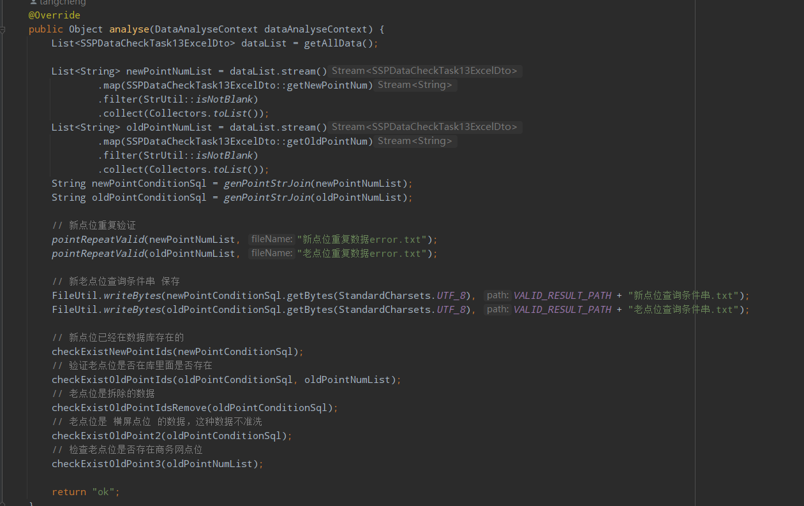

# 一次糟糕的存储过程洗数据上线


## 背景

​	关于公司要对SSP的数据进行梯外编码洗梯内编码的需求，要进行洗数据，每周产品会收集到一批数据来进行清洗。

​    开始拿着需求后，首先想到了用程序完成，后面又想到使用存储过程让数据库自产自销这样肯定更快（只是我以为！），写起来也快，而且不用发应用服务（心里小高兴了一把），做的时候我也给我上级说了我的想法，上级没说啥，意思可以干。

## 第一版本存储过程

```mysql
-- 注意注意：：执行sql前，首版需要全量备份这几张表
-- point、point_taboo、point_extra、push_task_record


-- 生成雪花id
DROP FUNCTION IF EXISTS snowflake_id;
CREATE FUNCTION `snowflake_id`() RETURNS bigint(20)
BEGIN
	DECLARE WORKER_ID INT DEFAULT 8;   -- 机器ID
	DECLARE DATA_CENTER_ID INT DEFAULT 8; -- 数据中心ID
	DECLARE SEQ INT DEFAULT 0; -- 序列号
	DECLARE LAST_MILLISECOND BIGINT DEFAULT 0; -- 上次时间戳
	DECLARE CURRENT_MILLISECOND BIGINT; -- 当前时间戳

	SET CURRENT_MILLISECOND = UNIX_TIMESTAMP(NOW(6)) * 1000 + EXTRACT(MICROSECOND FROM NOW(6))/1000 ;
	IF CURRENT_MILLISECOND = LAST_MILLISECOND THEN
		SET SEQ = (SEQ + 1) & 4095;
		IF SEQ = 0 THEN
			SET CURRENT_MILLISECOND = WAIT_UNTIL_NEXT_MILLISECOND(LAST_MILLISECOND);
    END IF;
    ELSE
            SET SEQ = 0;
    END IF;
        SET LAST_MILLISECOND = CURRENT_MILLISECOND;
    RETURN floor((((CURRENT_MILLISECOND - 1598275200000) << 22) | (DATA_CENTER_ID << 17 ) | (WORKER_ID<< 12) | SEQ) + floor(rand()*100000+1)/10);
END;
-- 测试 select snowflake_id();
-- ======= 测试snowflake_id是否会生成重复的id start ====
-- CREATE TABLE snowflake_ids_test (
--     id BIGINT(20) NOT NULL
-- );
-- 
-- DELIMITER //
-- CREATE PROCEDURE generate_snowflake_ids(IN loop_count INT)
-- BEGIN
--     DECLARE i INT DEFAULT 0;
--     DECLARE snowflake BIGINT;
--
--     WHILE i < loop_count DO
--         SET snowflake = snowflake_id();
-- INSERT INTO snowflake_ids_test (id) VALUES (snowflake);
-- SET i = i + 1;
-- END WHILE;
-- END //
-- DELIMITER ;
-- 测试生成1万条id
-- CALL generate_snowflake_ids(10000);
-- select count(1) from snowflake_ids;
-- 结论：可靠
-- ======= 测试snowflake_id是否会生成重复的id end ====

-- 拷贝和更新点位
DROP FUNCTION IF EXISTS snowflake_id;
DROP PROCEDURE IF EXISTS copy_and_update_point;
DELIMITER //
CREATE PROCEDURE copy_and_update_point (
    IN old_point_num VARCHAR ( 100 ), -- 老点位编码
    IN new_point_num VARCHAR ( 100 ) -- 新点位编码
)
BEGIN
    -- 新点位主键id
    DECLARE newPointPrimaryId BIGINT ( 20 );
    -- 中转数据变量
    DECLARE sign_type_data TINYINT ( 2 );
    DECLARE taboo_industry_data VARCHAR ( 20 );
    DECLARE extra_key_id_data BIGINT(20);
    DECLARE extra_value_id_data BIGINT(20);
    DECLARE create_time_data TIMESTAMP;
    DECLARE create_man_data INT(10);
    DECLARE update_time_data TIMESTAMP;
    DECLARE update_man_data INT(10);
    DECLARE done INT DEFAULT FALSE;
    DECLARE tabooId BIGINT ( 20 );

    -- 游标定义
    DECLARE point_taboo_cursor CURSOR FOR
        SELECT sign_type, taboo_industry
        FROM point_taboo
        WHERE point_primary_id IN (SELECT id FROM point WHERE point_id = old_point_num);
    DECLARE point_extra_cursor CURSOR FOR
        SELECT extra_key_id,extra_value_id,create_time,create_man,update_time,update_man
        FROM point_extra
        where point_id IN (SELECT id FROM point WHERE point_id = old_point_num);
    DECLARE CONTINUE HANDLER FOR NOT FOUND SET done = TRUE;

    -- 生成新的点位主键id
    -- set newPointPrimaryId = snowflake_id();
    select max(id) + 1 into newPointPrimaryId from `point` where id < 369548096504007;
    -- 复制数据
    INSERT INTO point (
       id, -- 需要设置新的点位id
       company, premises_sign_id, premises_id, build_id, unit_id, ele_id, dev_id, floor,
       point_num, machine_num, point_id, -- 需要设置新的点位编码
       resource_num, status, sign_type, position, install_time, network, pk, decibel, master, fix_reason, fix_img, re_reason,
       create_man, update_man, is_delete, net_status, silent_night, gate_id, gate_way_id,
       floor_id, floor_value, predict_dismantle_time, predict_update_time, point_cooperation_model,
       point_lowest_price, backplate, external_code, stable_network,
       create_time,update_time -- 创建时间，更新时间为当前时间，影响百度推送
    ) SELECT
          newPointPrimaryId, -- 设置新的点位id
          company,premises_sign_id, premises_id, build_id, unit_id, ele_id,dev_id, floor,
          new_point_num, new_point_num, new_point_num, -- 设置新的点位编码
          resource_num, status, sign_type, position, install_time, network,pk, decibel, MASTER, fix_reason, fix_img, re_reason,
          create_man, update_man, is_delete,net_status, silent_night, gate_id, gate_way_id,
          floor_id,floor_value, predict_dismantle_time, predict_update_time, point_cooperation_model,
          point_lowest_price,backplate, external_code, stable_network,
          CURRENT_TIMESTAMP,  CURRENT_TIMESTAMP
    FROM point WHERE point_id = old_point_num;

    -- 更新老点位信息
    UPDATE point SET STATUS = 6, resource_num = '', update_time = CURRENT_TIMESTAMP WHERE point_id = old_point_num;

    -- 点位行业禁忌复制
    set done = FALSE;
    select (max(id) + 1) into tabooId from point_taboo where id < 6369548096504007;
    open point_taboo_cursor;
    point_taboo_loop: LOOP
        -- 循环读取游标，直到没有可读的数据为止
        FETCH point_taboo_cursor INTO sign_type_data, taboo_industry_data;
        IF done THEN
            LEAVE point_taboo_loop;
        END IF;
        -- 处理读取到的数据
        INSERT INTO point_taboo(
            id, point_primary_id,   point_id,   sign_type,  taboo_industry
        ) VALUES (
            tabooId, newPointPrimaryId, new_point_num, sign_type_data, taboo_industry_data
        );
        set tabooId = tabooId + 1;
    END LOOP;
    close point_taboo_cursor;

    -- point_extra复制
    set done = FALSE;
    open point_extra_cursor;
    point_extra_loop: LOOP
            -- 循环读取游标，直到没有可读的数据为止
            FETCH point_extra_cursor INTO extra_key_id_data,extra_value_id_data,create_time_data,create_man_data,update_time_data,update_man_data;
            IF done THEN
                LEAVE point_extra_loop;
            END IF;
            -- 处理读取到的数据
            INSERT INTO point_extra(
                point_id,extra_key_id,extra_value_id,create_time,create_man,update_time,update_man
            ) VALUES (
                newPointPrimaryId, extra_key_id_data,extra_value_id_data,create_time_data,create_man_data,update_time_data,update_man_data
             );
    END LOOP;
    close point_extra_cursor;

    -- push_task_record京东推送
    -- 老点位
    update push_task_record set push_count = 2, push_status = 1, is_enable = 1
    where point_id in (SELECT id FROM point WHERE point_id = old_point_num);
--     -- 新点位
    insert into push_task_record(id, push_uuid, point_id, push_count, push_status)
    values (newPointPrimaryId, '', newPointPrimaryId, 1, 1)
    ON DUPLICATE KEY UPDATE id = VALUES(`id`),
                     push_uuid = VALUES(`push_uuid`),
                     point_id = VALUES(`point_id`),
                     push_count = VALUES(`push_count`),
                     push_status = VALUES(`push_status`);

END//
DELIMITER ;
-- 使用方法： call copy_and_update_point('旧编码', '新编码');
```

清洗数据调用存储过程：

```
-- 清洗2023-07-09给的第一批数据
call copy_and_update_point("NBB-A47-013-WZ01-01","NBB-A47-100");
call copy_and_update_point("NBB-A47-011-WZ01-01","NBB-A47-101");
call copy_and_update_point("NBB-A47-015-WZ01-01","NBB-A47-102");
call copy_and_update_point("CD-B26-481-WZ01-01","CD-B26-610");
call copy_and_update_point("CD-B26-482-WZ01-01","CD-B26-611");
..... 此处省略大概4000行
```

### 上线的问题

- 雪花id产生了重复，chatgpt生成的mysql 雪花函数不可靠，执行太快的时候id产生重复。
- 涉及的几张表都是大表，每个表生产都又几百万数据，执行速度慢（因为id重复导致中断的问题，所以还没明显发现）。


### 解决问题

​	解决了id问题，使用max(id)+1的方式

## 第二版本存储过程


```mysql
DROP PROCEDURE IF EXISTS copy_and_update_point;
DELIMITER //
CREATE PROCEDURE copy_and_update_point (
    IN old_point_num VARCHAR ( 100 ), -- 老点位编码
    IN new_point_num VARCHAR ( 100 ) -- 新点位编码
)
BEGIN
    -- 新点位主键id
    DECLARE newPointPrimaryId BIGINT ( 20 );
    -- 中转数据变量
    DECLARE sign_type_data TINYINT ( 2 );
    DECLARE taboo_industry_data VARCHAR ( 20 );
    DECLARE extra_key_id_data BIGINT(20);
    DECLARE extra_value_id_data BIGINT(20);
    DECLARE create_time_data TIMESTAMP;
    DECLARE create_man_data INT(10);
    DECLARE update_time_data TIMESTAMP;
    DECLARE update_man_data INT(10);
    DECLARE done INT DEFAULT FALSE;
    DECLARE tabooId BIGINT ( 20 );

    -- 游标定义
    DECLARE point_taboo_cursor CURSOR FOR
        SELECT sign_type, taboo_industry
        FROM point_taboo
        WHERE point_primary_id IN (SELECT id FROM point WHERE point_id = old_point_num);
    DECLARE CONTINUE HANDLER FOR NOT FOUND SET done = TRUE;

    -- 生成新的点位主键id
    -- set newPointPrimaryId = snowflake_id();
    select max(id) + 1 into newPointPrimaryId from `point` where id < 369548096504007;
    -- 复制数据
    INSERT INTO point (
       id, -- 需要设置新的点位id
       company, premises_sign_id, premises_id, build_id, unit_id, ele_id, dev_id, floor,
       point_num, machine_num, point_id, -- 需要设置新的点位编码
       resource_num, status, sign_type, position, install_time, network, pk, decibel, master, fix_reason, fix_img, re_reason,
       create_man, update_man, is_delete, net_status, silent_night, gate_id, gate_way_id,
       floor_id, floor_value, predict_dismantle_time, predict_update_time, point_cooperation_model,
       point_lowest_price, backplate, external_code, stable_network,
       create_time,update_time -- 创建时间，更新时间为当前时间，影响百度推送
    ) SELECT
          newPointPrimaryId, -- 设置新的点位id
          company,premises_sign_id, premises_id, build_id, unit_id, ele_id,dev_id, floor,
          new_point_num, new_point_num, new_point_num, -- 设置新的点位编码
          resource_num, status, sign_type, position, install_time, network,pk, decibel, MASTER, fix_reason, fix_img, re_reason,
          create_man, update_man, is_delete,net_status, silent_night, gate_id, gate_way_id,
          floor_id,floor_value, predict_dismantle_time, predict_update_time, point_cooperation_model,
          point_lowest_price,backplate, external_code, stable_network,
          CURRENT_TIMESTAMP,  CURRENT_TIMESTAMP
    FROM point WHERE point_id = old_point_num;

    -- 点位行业禁忌复制
    set done = FALSE;
    select (max(id) + 1) into tabooId from point_taboo where id < 6369548096504007;
    open point_taboo_cursor;
    point_taboo_loop: LOOP
        -- 循环读取游标，直到没有可读的数据为止
        FETCH point_taboo_cursor INTO sign_type_data, taboo_industry_data;
        IF done THEN
            LEAVE point_taboo_loop;
        END IF;
        -- 处理读取到的数据
        INSERT INTO point_taboo(
            id, point_primary_id,   point_id,   sign_type,  taboo_industry
        ) VALUES (
            tabooId, newPointPrimaryId, new_point_num, sign_type_data, taboo_industry_data
        );
        set tabooId = tabooId + 1;
    END LOOP;
    close point_taboo_cursor;

    -- point_extra复制
		update point_extra set point_id = newPointPrimaryId where point_id = (SELECT id FROM point WHERE point_id = old_point_num);

--     -- 新点位
--     insert into push_task_record(id, push_uuid, point_id, push_count, push_status)
--     values (newPointPrimaryId, '', newPointPrimaryId, 1, 1)
--     ON DUPLICATE KEY UPDATE id = VALUES(`id`),
--                      push_uuid = VALUES(`push_uuid`),
--                      point_id = VALUES(`point_id`),
--                      push_count = VALUES(`push_count`),
--                      push_status = VALUES(`push_status`);

END//
DELIMITER ;
```

### 上线的问题

- 雪花id产生了重复，chatgpt生成的mysql 雪花函数不可靠，执行太快的时候id产生重复。
- 执行速度慢

### 解决问题

当晚搞到第二天3点了才在公司躺下休息，如果继续执行下去，计算了下要到第二天下午3-4点才能执行完毕，然后让剩下的点位调用存储过程慢慢的执行了下去。后续又半夜起来看了执行情况，把最开始因为存储过程搞漏的也补上去了。

这样下去肯定不行呀！

第二天，睡了哈，头没有当天晚上那么荤了，有了新的想法！IDEA批量生成SQL！

## 第三版本IDEA批量生成SQL

使用**IDEA的批量列式编辑大法**，快速写出每个点位的洗数据sql（如果太多，进行900个分批编辑）。

单个的sql语句在预发布验证后执行很快，4千多个点位的洗数据sql很快就刷完了，应该是2分钟内完成的。

考虑到更快生成SQL，后续还不知道产品要洗几次这种数据，还是写程序生成SQL更快，也更方便做逻辑判断，验证数据等操作。

## 第四版本程序生成SQL

第一次洗数据上线后，知道洗数据单个洗的语句更快，所以第2-3天马上写了一个生成洗数据的sql程序。

通过公司的通过archery平台，使用生产库权限的账号拿取到token，然后用archery平台执行sql的请求去执行我要的查询，然后拿到数据进行sql拼装。

也感谢我后续使用程序来洗sql了，因为后面产品提供的数据存在很大的问题，每次都要对他们提供的数据进行验证数据，所以为了省去这个过程，我直接将验证数据的逻辑写到了程序里面。

速度方面，很快，还好转换了方法，后续每周的清洗点位量达到了几万个点位，整体清洗也在分钟级别单位完成了。

### **分析提供的数据合法性验证：**



### 生成洗数据的sql

```java
 	@Override
    public Object analyse(DataAnalyseContext dataAnalyseContext) {
        List<SSPDataCheckTask13ExcelDto> oldNewPontList = getAllData();
        List<String> oldPointNumList = oldNewPontList.stream().map(SSPDataCheckTask13ExcelDto::getOldPointNum).collect(Collectors.toList());
        List<String> newPointNumList = oldNewPontList.stream().map(SSPDataCheckTask13ExcelDto::getNewPointNum).collect(Collectors.toList());

        // 数据验证
        checkData(oldNewPontList, newPointNumList);

        String oldPointStr = CollUtil.join(oldPointNumList, "\",\"");

        // 获取老点位的信息
        Map<String, Map<String, String>> oldPointInfoMapMap = getOldPointInfoMap(oldPointNumList);
        // 获取点位当前最大可用的的点位id
        AtomicLong maxPointId = new AtomicLong(getMaxPointId());
        // 获取点位当前最大可用的的行业禁忌id
        AtomicLong maxTabooId = new AtomicLong(getMaxTabooId());
        // 查询行业禁忌信息
        Map<String, List<Map<String, String>>> oldPointTabooMapMap = getOldPointTabooMap(oldPointNumList);
        // 查询老点位的point_extra
        Map<String, List<Map<String, String>>> oldPointExtraMapMap = getOldPointExtraMap(oldPointNumList);

        StringBuilder resultSQLBuilder = new StringBuilder();
        List<String> oldPointPrimaryIdList = new ArrayList<>();
        List<String> newPointPrimaryIdList = new ArrayList<>();
        for (int i = 0; i < oldNewPontList.size(); i++) {
            log.info("拷贝点位信息进度:({}/{})", (i+1), oldNewPontList.size());

            SSPDataCheckTask13ExcelDto dto = oldNewPontList.get(i);
            Map<String, String> oldPointInfoMap = oldPointInfoMapMap.get(dto.getOldPointNum());
            // 拷贝生成新点位sql
            long newPointPrimaryId = maxPointId.getAndIncrement();
            pointCopy(newPointPrimaryId, resultSQLBuilder, dto, oldPointInfoMap);
            // 点位行业禁忌复制
            tabooCopy(maxTabooId, oldPointTabooMapMap, resultSQLBuilder, dto, newPointPrimaryId);
            // 点位point_extra复制
            pointExtraCopy(newPointPrimaryId, oldPointExtraMapMap, resultSQLBuilder, dto);

            resultSQLBuilder.append("\r\n").append("\r\n");

            oldPointPrimaryIdList.add(oldPointInfoMap.get("id"));
            newPointPrimaryIdList.add(String.valueOf(newPointPrimaryId));
        }

        // push_task_record京东推送 -- 老点位
        update_push_task_record(resultSQLBuilder, oldPointPrimaryIdList);
        // push_task_record京东推送 -- 新点位
        inert_push_task_record(resultSQLBuilder, newPointPrimaryIdList);
        // 更新老点位信息
        updateOldPointInfo(oldPointStr, resultSQLBuilder);

        log.info("正在将生成的sql写入最终sql文件..");
        // 将生成的结果sql导出
        FileUtil.writeBytes(resultSQLBuilder.toString().getBytes(StandardCharsets.UTF_8), new File("D:\\xinchao\\05_work\\SSP数据清洗\\20230719_7.19-7.26梯外编码洗梯内编码问题\\8.7\\result.sql"));
        log.info("写入最终sql文件完成");

        return "ok";
    }

    private List<SSPDataCheckTask13ExcelDto> getAllData() {
        File storeAnalyseData = new File(SSPDataCheckConstant.TASK_14_SOURCE_EXCEL);
        List<SSPDataCheckTask13ExcelDto> dataList = new ArrayList<>();
        try (InputStream finToObs = new FileInputStream(storeAnalyseData)) {
            Consumer<List<SSPDataCheckTask13ExcelDto>> consumer = dataList::addAll;

            EasyExcelDataListener<SSPDataCheckTask13ExcelDto> listener = new EasyExcelDataListener<>(consumer, 500);
            EasyExcel.read(finToObs, SSPDataCheckTask13ExcelDto.class, listener).sheet(0).doRead();
        } catch (Exception e) {
            e.printStackTrace();
            throw new MBBizException("解析excel错误");
        }
        return dataList;
    }

    private Map<String, Map<String, String>> getOldPointInfoMap(List<String> oldPointNumList) {
        log.info("正在获取老点位的点位信息....");
        List<Map<String, String>> dataMapList1 = new ArrayList<>();
        CollUtil.split(oldPointNumList, 300).forEach(subPointNumList -> {
            String oldPointStr = CollUtil.join(subPointNumList, "\",\"");
            String sql1 = "select id, point_id," +
                    " company,premises_sign_id, premises_id, build_id, unit_id, ele_id,dev_id, floor, " +
                    " resource_num, status, sign_type, position, install_time, network,pk, decibel, master, fix_reason, fix_img, re_reason, " +
                    " create_man, update_man, is_delete,net_status, silent_night, gate_id, gate_way_id, " +
                    " floor_id,floor_value, predict_dismantle_time, predict_update_time, point_cooperation_model, " +
                    " point_lowest_price,backplate, external_code, stable_network " +
                    " FROM `point` WHERE point_id in (\"" + oldPointStr + "\")";
            ArcherySQLQryReq archerySQLQryReq1 = ArcheryInstanceProvrder.genSSP3Instance(sql1);
            List<Map<String, String>> dataMapList = archerySQLQueryService.runSQL(archerySQLQryReq1, false);
            dataMapList1.addAll(dataMapList);
        });
        Map<String, Map<String, String>> map1 = dataMapList1.stream()
                .collect(Collectors.toMap(item -> item.get("point_id"), Function.identity()));

        log.info("获取老点位的点位信息成功");
        return map1;
    }

 private static void pointCopy(Long maxPointId, StringBuilder resultSQLBuilder, SSPDataCheckTask13ExcelDto dto, Map<String, String> oldPointInfoMap) {
        resultSQLBuilder.append("-- ").append(dto.getOldPointNum()).append("==>").append(dto.getNewPointNum()).append(" 点位信息复制\r\n");
        resultSQLBuilder.append("INSERT INTO point ( \r\n" +
                "       id, -- 需要设置新的点位id \n" +
                "       company, premises_sign_id, premises_id, build_id, unit_id, ele_id, dev_id, floor, \n" +
                "       point_num, machine_num, point_id, -- 需要设置新的点位编码 \n" +
                "       resource_num, status, sign_type, position, install_time, network, pk, decibel, master, fix_reason, fix_img, re_reason, \n" +
                "       create_man, update_man, is_delete, net_status, silent_night, gate_id, gate_way_id, \n" +
                "       floor_id, floor_value, predict_dismantle_time, predict_update_time, point_cooperation_model, \n" +
                "       point_lowest_price, backplate, external_code, stable_network, \n" +
                "       create_time,update_time -- 创建时间，更新时间为当前时间，影响百度推送 \n" +
                "    )");
        resultSQLBuilder.append("values (");
        {
            resultSQLBuilder.append(withBlock(String.valueOf(maxPointId))).append("\r\n");
            resultSQLBuilder.append(withStrBlock(oldPointInfoMap.get("company")))
                    .append(withBlock(oldPointInfoMap.get("premises_sign_id")))
                    .append(withBlock(oldPointInfoMap.get("premises_id")))
                    .append(withBlock(oldPointInfoMap.get("build_id")))
                    .append(withBlock(oldPointInfoMap.get("unit_id")))
                    .append(withBlock(oldPointInfoMap.get("ele_id")))
                    .append(withBlock(oldPointInfoMap.get("dev_id")))
                    .append(withStrBlock(oldPointInfoMap.get("floor"))).append("\r\n");
            resultSQLBuilder.append(withStrBlock(dto.getNewPointNum()))
                    .append(withStrBlock(dto.getNewPointNum()))
                    .append(withStrBlock(dto.getNewPointNum())).append("\r\n");
            resultSQLBuilder.append(withStrBlock(oldPointInfoMap.get("resource_num")))
                    .append(withBlock(oldPointInfoMap.get("status")))
                    .append(withBlock(oldPointInfoMap.get("sign_type")))
                    .append(withStrBlock(oldPointInfoMap.get("position")))
                    .append(withStrBlock(oldPointInfoMap.get("install_time")))
                    .append(withStrBlock(oldPointInfoMap.get("network")))
                    .append(withStrBlock(oldPointInfoMap.get("pk")))
                    .append(withStrBlock(oldPointInfoMap.get("decibel")))
                    .append(withStrBlock(oldPointInfoMap.get("master")))
                    .append(withStrBlock(oldPointInfoMap.get("fix_reason")))
                    .append(withStrBlock(oldPointInfoMap.get("fix_img")))
                    .append(withStrBlock(oldPointInfoMap.get("re_reason"))).append("\r\n");
            resultSQLBuilder.append(withBlock(oldPointInfoMap.get("create_man")))
                    .append(withBlock(oldPointInfoMap.get("update_man")))
                    .append(withBlock(oldPointInfoMap.get("is_delete")))
                    .append(withBlock(oldPointInfoMap.get("net_status")))
                    .append(withBlock(oldPointInfoMap.get("silent_night")))
                    .append(withBlock(oldPointInfoMap.get("gate_id")))
                    .append(withBlock(oldPointInfoMap.get("gate_way_id"))).append("\r\n");
            resultSQLBuilder.append(withBlock(oldPointInfoMap.get("floor_id")))
                    .append(withBlock(oldPointInfoMap.get("floor_value")))
                    .append(withStrBlock(oldPointInfoMap.get("predict_dismantle_time")))
                    .append(withStrBlock(oldPointInfoMap.get("predict_update_time")))
                    .append(withBlock(oldPointInfoMap.get("point_cooperation_model"))).append("\r\n");
            resultSQLBuilder.append(withBlock(oldPointInfoMap.get("point_lowest_price")))
                    .append(withBlock(oldPointInfoMap.get("backplate")))
                    .append(withStrBlock(oldPointInfoMap.get("external_code")))
                    .append(withBlock(oldPointInfoMap.get("stable_network"))).append("\r\n");
            resultSQLBuilder.append(withBlock("CURRENT_TIMESTAMP"))
                    .append(withBlockEnd("CURRENT_TIMESTAMP")).append("\r\n");
        }
        resultSQLBuilder.append("); \r\n\r\n");
    }
    // ......... 其他代码省略
```


## 回顾

​	  第一次上线中遇到了很多问题，文章中只拿了最主要的一些事情说了下，领导和我那天完成搞到4点才休息，然后让sql存储过程执行下去，后续6点还起来补了最开始失败的数据，弄的很难受！

​	  第二次洗数据就简单了，先执行验证数据程序，将所有违反规则的数据全部告知提供方修改然后反复验证，直到通过为止，然后通过生成SQL程序几分钟就将很多洗数据的SQL生成了，每次洗数据的SQL都有号几十M（最大一次38M，但是执行很快）。

​      第二次和第三次因为规则没给全，有部分点位要洗回去，横向屏幕不允许洗。 这个也简单，我用一个新的洗数据模板的将来源点位编码和目标点位编码填写一换，直接运行SQL程序就出来了。

   <font color=red size=6>最难忘的是那天晚上我在公司过了我30岁的生日，我的老婆和女儿在微信视频远程给我说了生日快乐和吹了蜡烛，真是一辈子难忘呀！</font>

​	

## 经验总结

1. 洗数据一定要验证数据正确性（提供的洗数据的依据，还有洗后的数据）；
2. 洗数据要关注洗数据速度 （不要用存储过程）；
3. 洗数据一定要备份，给自己一个二次做人的机会；
4. 产品提供的数据清洗依据文件数据以及不允许清洗的规则不严谨或不全，会导致反复正反数据清洗；


