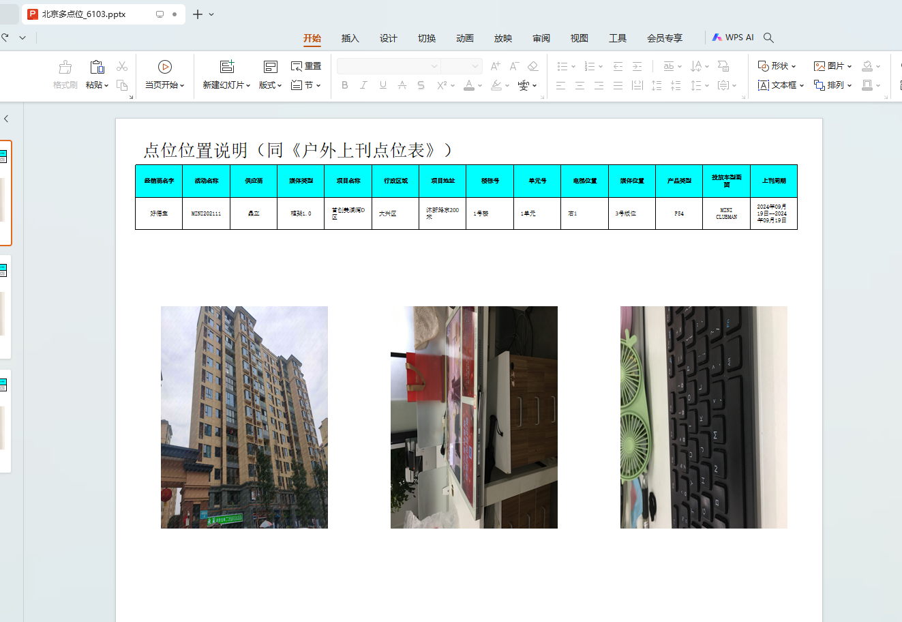
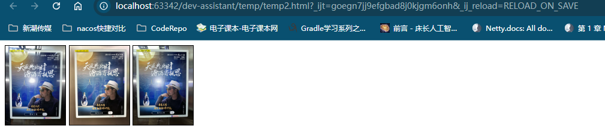
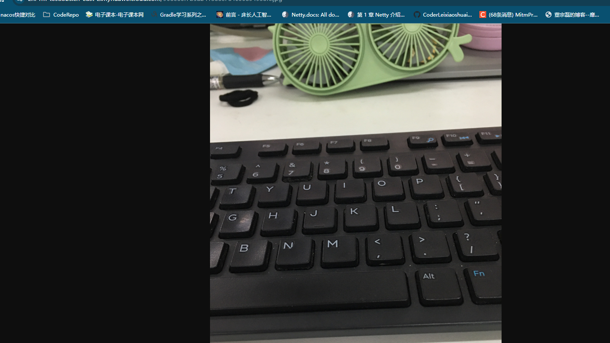
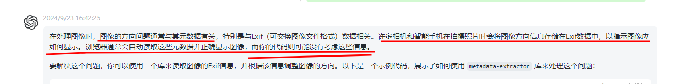
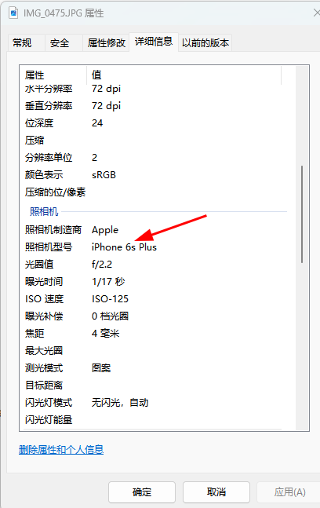

# 为什么导出的报告图片是倒着的？





:question::question::question::question::question::question::question::question:🤔🤔🤔🤔🤔🤔🤔🤔🤔为啥？

通过数据库将url还原出来，使用html构建出来看，结果没有问题。

```html
<!doctype html>
<html lang="en">
<head>
    <meta charset="UTF-8">
    <meta name="viewport"
          content="width=device-width, user-scalable=no, initial-scale=1.0, maximum-scale=1.0, minimum-scale=1.0">
    <meta http-equiv="X-UA-Compatible" content="ie=edge">
    <title>Document</title>
    <style>
        body > div {
            overflow-y: auto;
        }
        img{
            width: 100px;

            display: inline-block;
            border: 1px solid black;
        }
    </style>
</head>
<body>
        <div>
            
            
            
        </div>
</body>
</html>
```




:question::question::question::question:让测试人员复现，首次没有复现处理来。

:question::question::question::question:排查了很久，没发现啥问题，后来产品导出来说又可以了，所以后来就没管了。

:question::question::question::question:我们怀疑是用户偷偷将照片重新传正了，照片肯定拍出来就是那样的。


描述的很简单，过程中真的曲折，花了大力气去排查，包括换包的版本都试过，还是不行，加上我们组接过融媒这个系统，一点点都不熟悉他们之前的代码，整的非常恼火！！


🌩️🌩️🌩️🌩️🌩️🌩️过了一周，生产第二次暴雷了，又有人反馈导出的照片是倒着的了。

🤵有人说，系统界面上看着是正的，导出来歪着的！！！！

:question::question::question::question::question::question::question::question::question::question::question::question::question::question::question::question::question::question::question::question:蒙蔽了！！

🤵测试人员页开始复现，多次复现后，发现导出高清的图片才会有问题

:question::question::question::question:

🤵开始排查代码！~ 我在本地调试打断点，好不容易追踪到下面的代码片段。

```java
switch (pictureQualityEnum(picQuality)) {
	case SD: // 普清
		inputStream = pptHandlerManager.getFileHandlerService().getFileAndCompress(fileId, 900, 1200);
		break;
	case HD: // 高清
		inputStream = pptHandlerManager.getFileHandlerService().getFileFromOBS(fileId);
		break;
	default:
		inputStream = pptHandlerManager.getFileHandlerService().getFileAndCompress(fileId, 480, 640);
		break;
}java
```

然后寻找getFileAndCompress和getFileFromOBS的区别，唯一区别就是普清的照片会加华为的x-image-process处理标识，然后直接使用getFileFromOBS方法是直接从obs下载原始照片。

```java
    public InputStream getFileAndCompress(String fileUrl,
                                          Integer width,
                                          Integer height) {
        String compressUrl = "?x-image-process=image/resize,w_%d,h_%d";
        String formatCompressUrl = String.format(compressUrl, width, height);
        String downLoadUrl = fileUrl + formatCompressUrl;
        InputStream fileFromOBS = this.getFileFromOBS(downLoadUrl);
        return fileFromOBS;
    }

	public InputStream getFileFromOBS(String fileUrl) {
        InputStream in = null;
        if (StringUtils.isNotEmpty(fileUrl) && !fileUrl.contains("http")) {
            fileUrl = fileSysProperties.getBaseUrl() + fileUrl;
        }
        try {
            URL url = new URL(fileUrl);
            HttpURLConnection urlCon = (HttpURLConnection) url.openConnection();
            urlCon.setRequestProperty("REFERER", fileSysProperties.getReferer());
            urlCon.setConnectTimeout(15000);
            urlCon.setReadTimeout(15000);
            in = urlCon.getInputStream();
        } catch (IOException e) {
            e.printStackTrace();
            logger.error("获取文件失败！： {}", e.getMessage());
        }
        return in;
    }
```


我在本地调试打断点，去将fileUrl的值拷贝出来使用postman和浏览器去访问，发现结果照片是正常的。




然后在断点位置，通过临时执行代码的方式，将流的图片保存到本地来看，看照片是否正确？

```java
try (ByteArrayInputStream in = new ByteArrayInputStream(picture2)) {
    // stream读入image
    BufferedImage image = ImageIO.read(in);
    ImageIO.write(image, "JPG", new File("D:\\aaaa1.jpg"));
}
```

```
    BufferedImage image = ImageIO.read(in);
    ImageIO.write(image, "JPG", new File("D:\\aaaa2.jpg"));
```


结果，发现，经过这个流下载的照片，照片就是倒着的！！！！ what？？ JDK的API有毛病？？

在没有明白下面有个知识，我完全懵逼了！~ 喊了几个同事来看着神奇的事情，大家都觉得奇怪？？！！

在多次其它方法无法解决后，绝望无助的情况下，我求助了**chatGPT，它点醒了我**。




然后我使用三方工具，读取这个原始图片的所有TAG信息查看。

```xml
        <dependency>
            <groupId>com.drewnoakes</groupId>
            <artifactId>metadata-extractor</artifactId>
            <version>2.13.0</version>
        </dependency>
```

```java
    private static void test2() throws Exception {
//         ExifHelper exifHelper = new ExifHelper("D:\\908e86f7b5ab41388c784e00894938fc.jpg");
         ExifHelper exifHelper = new ExifHelper("D:\\IMG_0475.JPG");
//        ExifHelper exifHelper = new ExifHelper("D:\\IMG_20240919_172852.jpg");
//        ExifHelper exifHelper = new ExifHelper("D:\\aaaa1.jpg");
        HashMap<String, String> allTags = exifHelper.getAllTags();
        for (String tag : allTags.keySet()) {
            System.out.println(tag + ":" + allTags.get(tag));
        }
    }
```


```java
import com.drew.imaging.ImageMetadataReader;
import com.drew.metadata.Directory;
import com.drew.metadata.Metadata;
import com.drew.metadata.Tag;

import java.io.File;
import java.io.InputStream;
import java.util.*;

/**
 * 图片Exif标签帮助类
 * 
 *
 */
public class ExifHelper {
    Metadata metadata = null;
    public ExifHelper(File f) throws Exception {
        metadata = ImageMetadataReader.readMetadata(f);
    }

    public ExifHelper(String path) throws Exception {
        File f = new File(path);
        metadata = ImageMetadataReader.readMetadata(f);
    }

    public ExifHelper(InputStream is) throws Exception {
        metadata = ImageMetadataReader.readMetadata(is);
    }

    /**
     * 获取Exif信息文件夹
     * 
     * @return
     */
    private Iterable<Directory> getDirectoryList() {
        Iterable<Directory> iterable = metadata.getDirectories();
        return iterable;
    }

    private List<Directory> getDir() {
        List<Directory> lstDir = new ArrayList<Directory>();
        for (Iterator<Directory> iter = getDirectoryList().iterator(); iter
                .hasNext();) {
            Directory dr = iter.next();
            lstDir.add(dr);
        }
        return lstDir;
    }

    /**
     * 获取Exif Directory 对象下的 Tag 集合
     * 
     * @return
     */
    private List<Collection<Tag>> getTars() {
        List<Collection<Tag>> lsttag = new ArrayList<Collection<Tag>>();
        for (Directory d : getDir()) {
            lsttag.add(d.getTags());
        }
        return lsttag;
    }

    /**
     * 获取不同的 Exif 分类文件夹名称
     * 
     * @param type
     * @return
     */
    private String getExifDirectoryName(int type) {
        String directoryName = "File";
        switch (type) {
        case 1:
            directoryName = "Exif SubIFD";
            break;
        case 2:
            directoryName = "Exif IFD0";
            break;
        case 3:
            directoryName = "JFIF";
            break;
        case 4:
            directoryName = "JPEG";
            break;
        case 5:
            directoryName = "File";
        default:
            break;
        }
        return directoryName;
    }

    /**
     * 指定键获取 Exif 元数据的属性值.
     * 
     * @param tagKey
     *            Tag 键名称
     * @param type
     *            获取类型:1.Exif SubIFD; 2.Exif IFD0; 3.JFIF; 4.JPEG; 5.File;
     * @return
     */
    public String getTagByKey(String tagKey, int type) {
        String tagValue = "";
        if (type > 5)
            return tagValue;
        List<Collection<Tag>> lstTag = getTars();
        boolean sgin = true;
        for (Collection<Tag> tagColl : lstTag) {
            if (!sgin)
                break;
            for (Tag tag : tagColl) {
                if (tag.getTagName().equals(tagKey)
                        && tag.getDirectoryName().equals(
                                getExifDirectoryName(type))) {
                    tagValue = tag.getDescription();
                    sgin = false;
                    break;
                }
            }
        }
        return tagValue;
    }

    /**
     * 获取图片的所有 Exif 信息.
     * 
     *            获取类型:1.Exif SubIFD; 2.Exif IFD0; 3.JFIF; 4.JPEG; 5.File;
     * @return
     */
    public HashMap<String, String> getAllTags() {
        HashMap<String, String> map = new HashMap<String, String>();
        List<Collection<Tag>> lstTag = getTars();
        for (Collection<Tag> tagColl : lstTag) {
            for (Tag tag : tagColl) {
                map.put(tag.getTagName(), tag.getDescription());
                // System.out.println(tag.getTagName() + ":" +
                // tag.getDescription() + "[" + tag.getDirectoryName() + "]");
            }
        }
        return map;
    }

    /**
     * 获取 Exif 日期元数据.通过属性名称.
     * 
     * @return
     */
    /*
     * public String getExifDateTime(){ return ""; }
     */
    private String getExifDateTimeByKeyFromHashMap(String key) {
        HashMap<String, String> hash = getAllTags();
        return hash.get(key);
    }

    /**
     * 获取 Exif 相机制造商信息
     * 
     * @return
     */
    public String getExifMake() {
        String make = "";
        make = getTagByKey("Make", 2);
        return make;
    }

    /**
     * 获取 Exif 相机型号信息
     * 
     * @return
     */
    public String getExifModel() {
        String model = "";
        model = getTagByKey("Model", 2);
        return model;
    }
}
```


下面是这个图片的输出内容：

```ini
Lens Model:iPhone 6s Plus back camera 4.15mm f/2.2
Unknown tag (0x0006):162
Compression:JPEG (old-style)
Number of Tables:4 Huffman tables
Exif Version:2.32
Components Configuration:YCbCr
Compression Type:Baseline
Host Computer:iPhone 6s Plus
Number of Components:3
Component 2:Cb component: Quantization table 1, Sampling factors 1 horiz/1 vert
Focal Length:4.2 mm
Component 1:Y component: Quantization table 0, Sampling factors 2 horiz/2 vert
YCbCr Positioning:Center of pixel array
Sub-Sec Time Digitized:592
Date/Time Original:2024:09:19 16:01:18
Shutter Speed Value:1/16 sec
Unknown tag (0x000c):49/256 27/128
X Resolution:72 dots per inch
Brightness Value:1.35
Component 3:Cr component: Quantization table 1, Sampling factors 1 horiz/1 vert
Offset Time Digitized:+08:00
F-Number:f/2.2
Focal Length 35:29 mm
Unknown tag (0x0010):1
Exposure Program:Program normal
Unknown tag (0x0002):[558 values]
Unknown tag (0x0014):5
Unknown tag (0x0026):0
Unknown tag (0x0017):0
Unknown tag (0x0009):4627
Detected File Type Long Name:Joint Photographic Experts Group
Exposure Time:1/17 sec
Detected MIME Type:image/jpeg
Expected File Name Extension:jpg
ISO Speed Ratings:125
Subject Location:2015 1511 2217 1330
Make:Apple
Unknown tag (0x002b):25DA31BB-A170-4C24-8A01-7AD3D6387E6C
Orientation:Right side, top (Rotate 90 CW)
Metering Mode:Multi-segment
Unknown tag (0x002f):98
Thumbnail Offset:2146 bytes
Lens Specification:4.15mm f/2.2
Software:14.4.2
Exif Image Height:3024 pixels
Unknown tag (0x0001):12
Unknown tag (0x0025):0
Y Resolution:72 dots per inch
Unknown tag (0x0005):156
Scene Type:Directly photographed image
Unknown tag (0x0008):5789/118751 -47377/65075 -21679/33444
FlashPix Version:1.00
Data Precision:8 bits
Sub-Sec Time Original:592
Offset Time:+08:00
Unknown tag (0x003c):0
Sensing Method:One-chip color area sensor
Unknown tag (0x001c):3
Unknown tag (0x000e):0
Unknown tag (0x000f):2
Thumbnail Length:8698 bytes
Color Space:sRGB
Offset Time Original:+08:00
File Size:1915652 bytes
Unknown tag (0x0020):98C384B8-9865-4E36-89B9-7A82F12C8857
Date/Time Digitized:2024:09:19 16:01:18
File Name:IMG_0475.JPG
Flash:Flash did not fire, auto
Unknown tag (0x0036):150
Unknown tag (0x0004):1
Aperture Value:f/2.2
Unknown tag (0x0007):1
Unknown tag (0x0019):0
File Modified Date:星期四 九月 19 17:57:10 +08:00 2024
Date/Time:2024:09:19 16:01:18
Lens Make:Apple
Unknown tag (0x003b):0
Exif Image Width:4032 pixels
Image Height:3024 pixels
Unknown tag (0x000d):20
Image Width:4032 pixels
Unknown tag (0x001f):0
Resolution Unit:Inch
Exposure Bias Value:0 EV
Detected File Type Name:JPEG
Exposure Mode:Auto exposure
Model:iPhone 6s Plus
Scene Capture Type:Standard
Unknown tag (0x0011):FE2DF3B8-D988-4E59-BB46-BB3533747997
Run Time:[104 values]
White Balance Mode:Auto white balance
Unknown tag (0x0027):0
```

这里面有几个信息非常重要：

Lens Make:Apple

Orientation:Right side, top (Rotate 90 CW)

**翻译： 苹果手机！  图片旋转90度！**

我们在看看我们的导出代码的getFileFromOBS方法导出的照片的TAG信息：

```ini
Resolution Units:none
Number of Tables:4 Huffman tables
Detected File Type Long Name:Joint Photographic Experts Group
File Modified Date:星期一 九月 23 17:00:25 +08:00 2024
Compression Type:Baseline
Data Precision:8 bits
Detected MIME Type:image/jpeg
Expected File Name Extension:jpg
Number of Components:3
Component 2:Cb component: Quantization table 1, Sampling factors 1 horiz/1 vert
Thumbnail Height Pixels:0
Component 1:Y component: Quantization table 0, Sampling factors 2 horiz/2 vert
Image Height:1080 pixels
Thumbnail Width Pixels:0
X Resolution:1 dot
Image Width:1440 pixels
File Size:126904 bytes
Component 3:Cr component: Quantization table 1, Sampling factors 1 horiz/1 vert
Version:1.2
Detected File Type Name:JPEG
File Name:aaaa1.jpg
Y Resolution:1 dot
```

TAG内容很少，上面的“苹果手机！  图片旋转90度！”的TAG标签信息页没有了！ 所以我们看到的照片是倒着的。


另外，windows的文件详细信息，只能看到部分的TAG信息，不能看到这个“  图片旋转90度！”的TAG标签信息，只能看到是苹果手机拍照的。



## 结论


> 结论：通过通过的java流去处理图片流信息，会丢失图片的TAG信息，导致旋转属性Orientation:Right side, top (Rotate 90 CW)未生效，所以导出的报告中的图片是倒着的。

## 问题找到了，那怎么处理这个问题？

现在我能通过三方工具读取到这个图片是否需要旋转，难道我在自己代码里面发现需要旋转自己来旋转？

后来通过发现，华为的x-image-process，能自动处理这个tag属性信息。那我就可以借助华为提供的这个工具，自动转正这个照片。导出高清是吧，我质量设置100就可以了呗

https://zhl-rm-test.obs.cn-east-2.myhuaweicloud.com/908e86f7b5ab41388c784e00894938fc.jpg?x-image-process=image/quality,q_100

从getFileFromOBS基础上，加个重载的壳代码：

```java
/**
     * 这里备注一个生产问题：为什么这里要从getFileFromOBS基础上抽出一个getHDFile方法
     * apple手机拍照存在拍照的照片是倒着的，是通过图片的tag属性转正的。
     *  Orientation:Right side, top (Rotate 90 CW)
     *  如果是用java流直接去读取这个图片，图片的tag属性会丢失，导致下载的上刊报告中过的图片是倒着的。
     *
     *  那为什么浏览器和postman去访问这个地址，图片又是正着的呢？
     *  https://zhl-rm-test.obs.cn-east-2.myhuaweicloud.com/908e86f7b5ab41388c784e00894938fc.jpg
     *  原因是因为浏览器和postman会去读取这个图片的tag属性信息，会旋转到正确的角度。
     *
     *  如果直接使用getFileFromOBS方法，下载的图片就是倒着的。
     *
     *  解决办法：
     *      华为的图片处理器x-image-process，会去读取这个属性信息，自动调整为正确的角度，下载下来就不是倒着的照片。
     *
     * @param fileUrl 文件url
     * @return
     */
    public InputStream getHDFile(String fileUrl) {
        return getFileFromOBS(fileUrl + "?x-image-process=image/quality,q_100");
    }
```


<center><font color="green" size="40">完美！收工！</font></center>

## 反思这个问题

- 如果这个功能是在一些特别关键的系统上，如果发生大的问题，对公司造成了巨大损失，就GG了，还好至少普通功能；
- 说实在话，没遇到过这个问题的人，我们部门的人肯定全部都要踩这个坑！而且很可能很久都找不出来。虽然这个代码不是我写的，我来写一会犯这个错误！！
- 这次排错，如果不是chatGPT提醒了我，我可能还要在上面懵逼很久！~感谢chatGPT，有时候一个解决问题思路不行，可以尝试下其它思路。
- 没有遇到过这个问题，测试人员也不能想到这样的测试案例，不会想到ios的照片在导出上刊报告的时候会有问题！！
- 这个问题，除非有相关经验，不然都得栽！！！


## 全部的调试代码：

```java
package com.minibyte.test;

import org.apache.commons.lang3.StringUtils;

import javax.imageio.ImageIO;
import java.awt.image.BufferedImage;
import java.io.File;
import java.io.FileInputStream;
import java.io.IOException;
import java.io.InputStream;
import java.net.HttpURLConnection;
import java.net.URL;
import java.util.HashMap;

public class Test1 {
    public static void main(String[] args) throws Exception {
//        test1();
        test2();
//        test3();

//        FileInputStream fileInputStream = new FileInputStream(new File("D:\\IMG_0475.JPG"));
//        BufferedImage image = ImageIO.read(fileInputStream);
//        ImageIO.write(image, "JPG", new File("D:\\aaaa7.jpg"));
    }
    private static void test1() throws IOException {
        InputStream fileFromOBS = getFileFromOBS("908e86f7b5ab41388c784e00894938fc.jpg");
        BufferedImage image = ImageIO.read(fileFromOBS);
        ImageIO.write(image, "JPG", new File("D:\\aaaa1.jpg"));
    }

    private static void test3() throws IOException {
        InputStream fileFromOBS = getFileFromOBS("908e86f7b5ab41388c784e00894938fc.jpg?x-image-process=image/quality,q_100");
        BufferedImage image = ImageIO.read(fileFromOBS);
        ImageIO.write(image, "JPG", new File("D:\\aaaa4.jpg"));

    }

    private static void test2() throws Exception {
//         ExifHelper exifHelper = new ExifHelper("D:\\908e86f7b5ab41388c784e00894938fc.jpg");
//         ExifHelper exifHelper = new ExifHelper("D:\\IMG_0475.JPG");
//        ExifHelper exifHelper = new ExifHelper("D:\\IMG_20240919_172852.jpg");
        ExifHelper exifHelper = new ExifHelper("D:\\aaaa1.jpg");
        HashMap<String, String> allTags = exifHelper.getAllTags();
        for (String tag : allTags.keySet()) {
            System.out.println(tag + ":" + allTags.get(tag));
        }
    }


    public static InputStream getFileFromOBS(String fileUrl) {
        InputStream in = null;
        if (StringUtils.isNotEmpty(fileUrl) && !fileUrl.contains("http")) {
            fileUrl = "https://zhl-rm-test.obs.cn-east-2.myhuaweicloud.com/" + fileUrl;
        }
        try {
            System.out.println(fileUrl);
            URL url = new URL(fileUrl);
            HttpURLConnection urlCon = (HttpURLConnection) url.openConnection();
            urlCon.setRequestProperty("REFERER", "www.xinchao.com");
            urlCon.setConnectTimeout(15000);
            urlCon.setReadTimeout(15000);
            in = urlCon.getInputStream();
        } catch (IOException e) {
            e.printStackTrace();
        }
        return in;
    }
}
```


## 后续

上面得照片是苹果手机竖着拍的，我们喊测试横着排了一张看了下TAG信息区别！


