# JDK源码阅读环境搭建

​	本文中描述的方法有个问题：不可改变代码的行结构（只能行尾注释，不能跨行注释。

​     有https://www.imooc.com/article/308360描述的方法，但是太麻烦了。

## 一、JDK源码的重要性

JDK源码的重要性不言而喻，平时的面试、深入学习等都离不开JDK的源码。当然，JDK源码是非常优秀的代码，我们之所以阅读JDK源码，就是为了理解底层原理、学习优秀的设计模式和思想。不过JDK源码也是相当难啃的知识点，我们一定要有信心，不要畏难，硬着头皮去学习，一定会有很大的收获的。

## 二、搭建JDK源码阅读项目（一）

1、新建项目并导入JDK源码
首先新建一个普通的Java项目，笔者这里将项目取名为jdkSourceLearn，大家可自行选择。

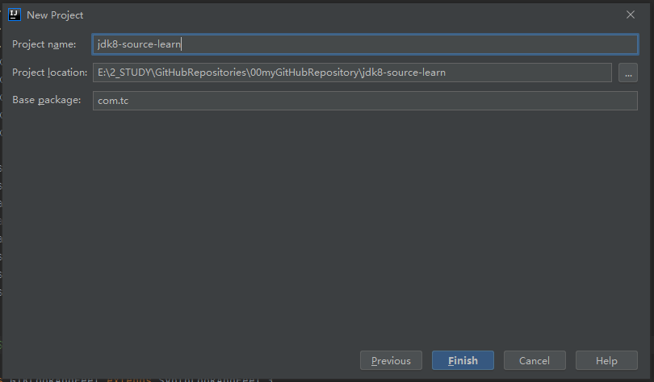

编码设置：

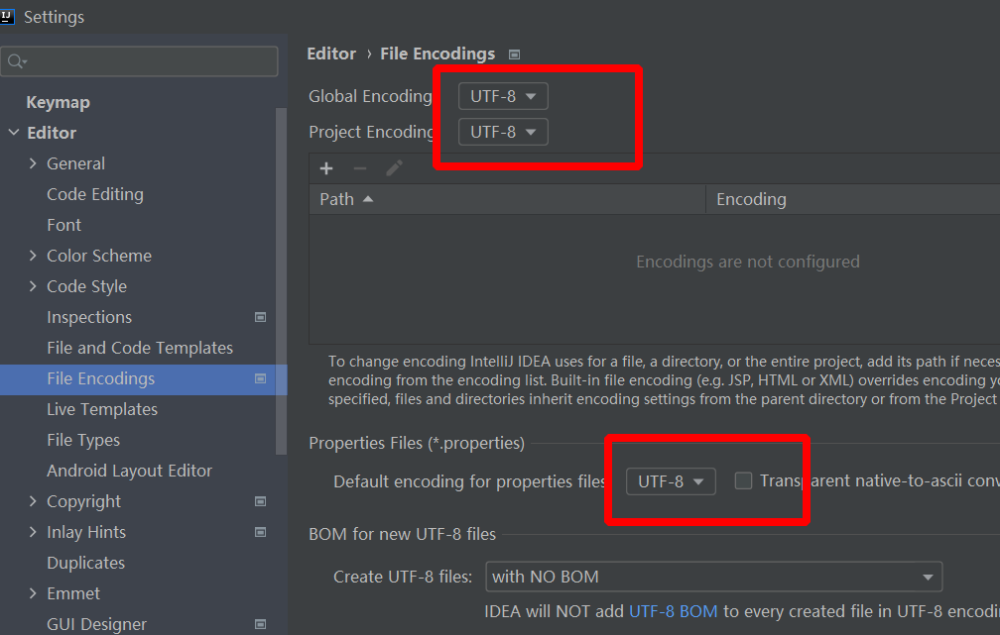

建立一个jdk8src目录，标记为源码目录，然后导入JDK源码，找到安装JDK的目录，里面有个叫src.zip的文件，那个就是源码的压缩文件。将其解压完毕后直接拷贝到项目的source目录下即可。

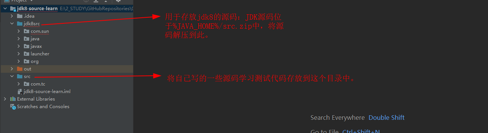

项目目前还是使用的src.zip中的源码，改为项目中的源码目录。

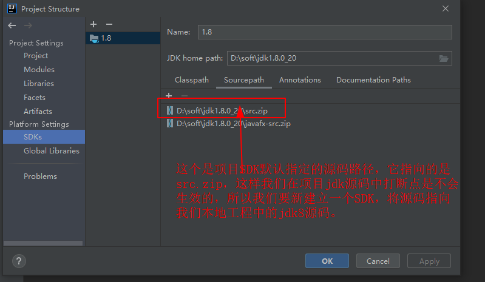

新建JDK1.8SourceCodeLearnSDK，并重新定位jdk8的src源码位置。

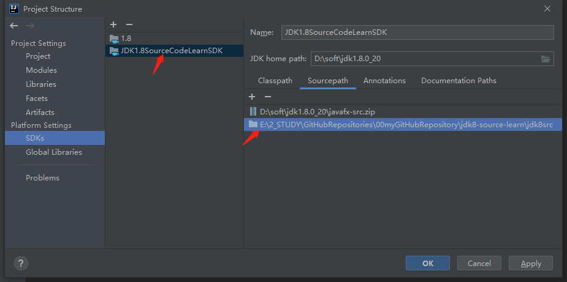

项目语言SDK设置：选择我们新建立的SDK包。

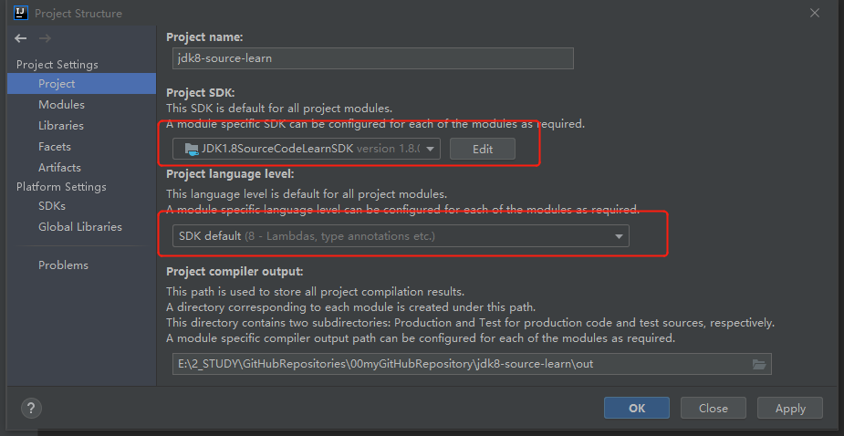

**允许调试进入:**

此时如果我们打断点进行单步调试的话，可以发现点击Step Into无法进入源码内部，因为JDK源码的受保护的，无法进入，但是点击Force Step Into是可以进入源码内部的。如果想要直接按F7(即点击Step Into)进入源码内部的话，需要做如下设置：
点击File–>Settings–>Build,Execution,Deployment–>Debugger–>Stepping，取消勾选Do not step into the classes。

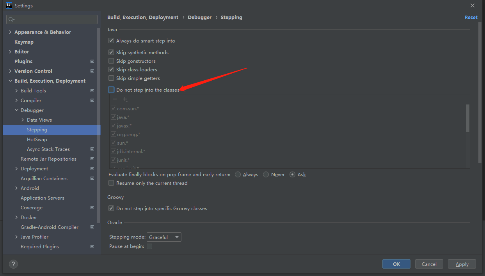

## 三、搭建环境可能会出现的问题

### 1、系统资源不足

问题提示如下：

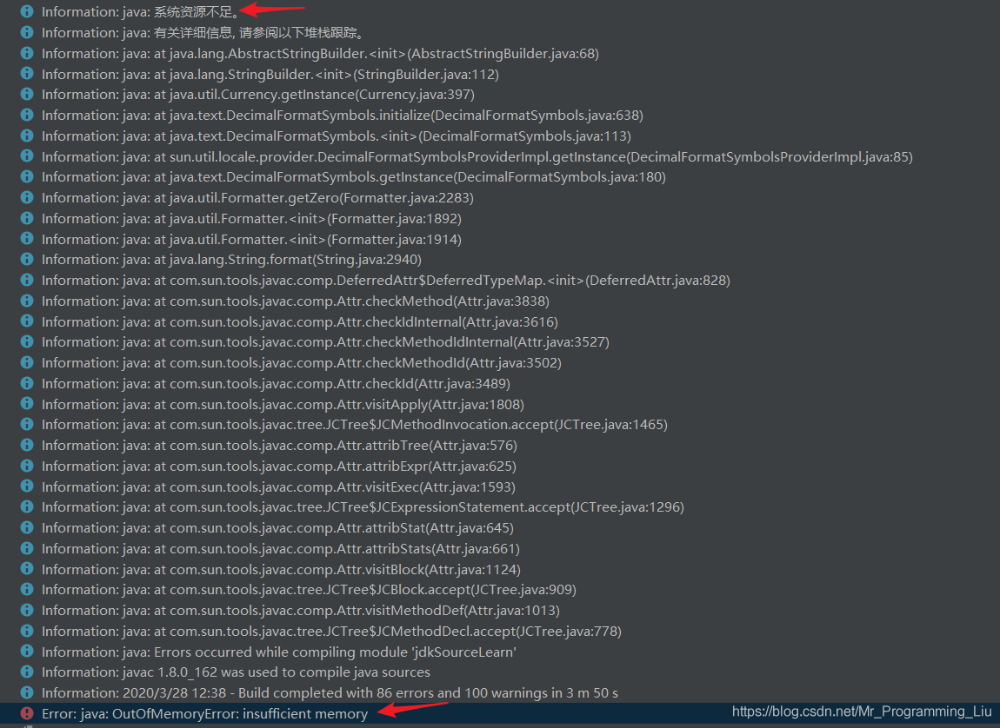

通过提示可以看出导致这个错误出现的原因是内存不够。解决办法当然是加大内存。
点击File–>Settings–>Build,Execution,Deployment–>Compiler，将Build process heap size(Mbytes)选项加大，默认值是700，笔者这里调至1200：

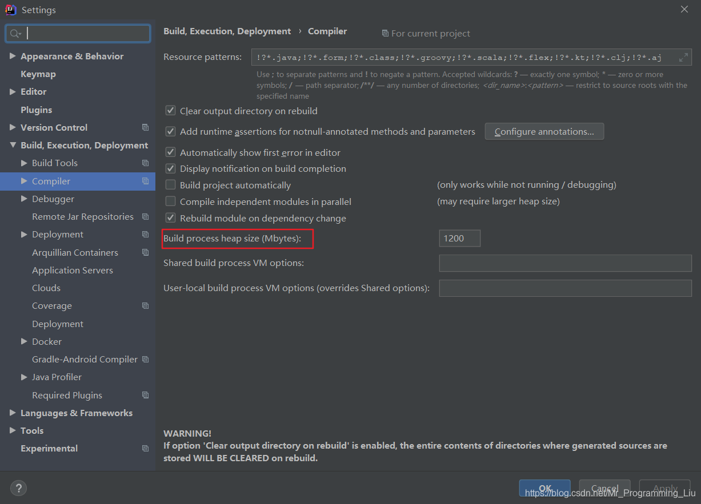

### 2、程序包com.sun.tools.javac.*不存在

问题提示如下：

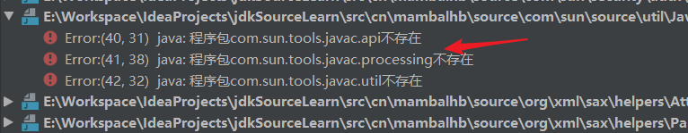

这是缺少tools的jar包所导致的。
点击**File–>Project Structure–>Libraries**

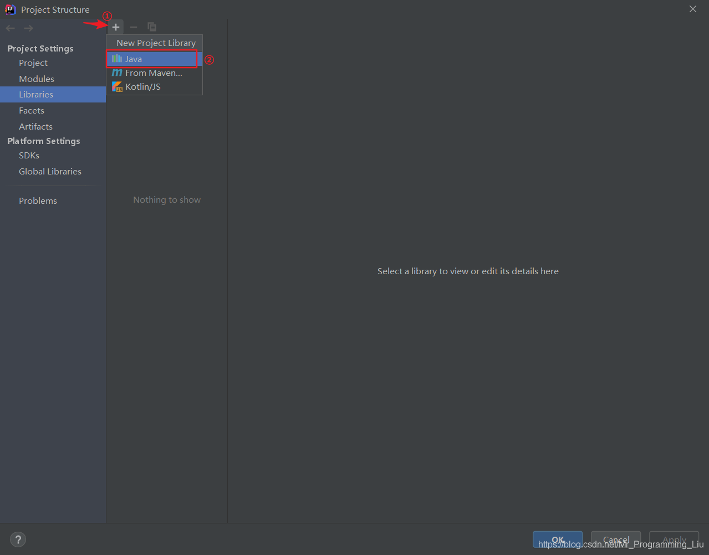

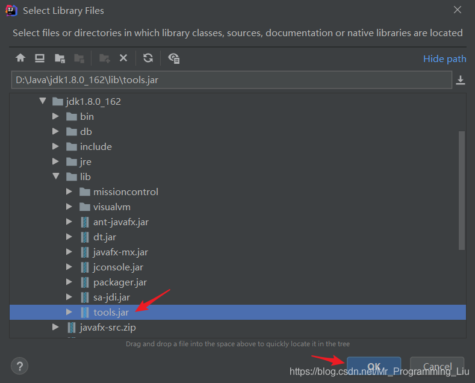

3、找不到符号UNIXToolkit、FontConfigManager

问题提示如下：
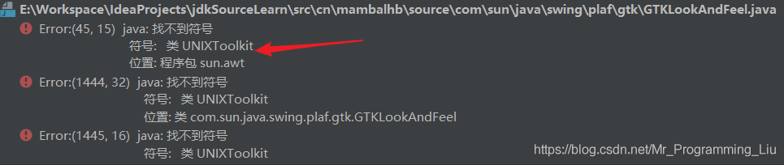

这是因为在Windows平台下缺少了两个java类文件所导致的。
这两个类文件可在[OpenJDK](http://openjdk.java.net/)网站上找到。

注意这里选择自己相应的JDK版本，笔者的是jdk1.8.0_20。


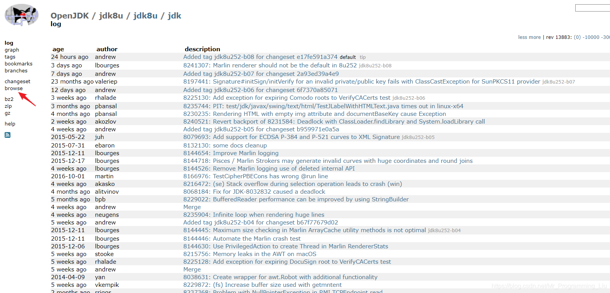

sun.awt.UNIXToolkit.java的位置：

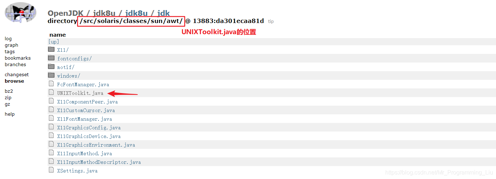

sun.font.FontConfigManager.java

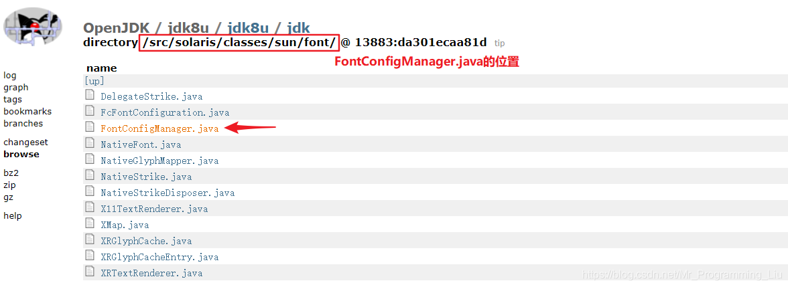

找到这两个类文件的位置后，将它们复制进项目如下图所示的位置中。

### 3、多行注释问题

​		不可改变代码的行结构（只能行尾注释，不能跨行注释），否则debug调试时会出现行号错位的问题。导致的原因是由于：jre还是使用的它自己的jdk源码，字节码中有反应对应源码中的行号，我们源码阅读环境中配置的源码，只是做的一个源码映射，而不是在根本源码上修改然后重新编译，所以如果改变了行结构就会导致行错乱问题。

​		另一种方法：可以解决多行注释问题，但是太复杂。 https://www.imooc.com/article/308360

​		

## 二、搭建JDK源码阅读项目（二）

​	为了解决多行注释后，bytecode和code source代码行对应不上的问题，引入自己编译一个rt.jar包的方法，取名为rt_debug.jar然后加入到SDK的CLASSPATH中去。	https://blog.csdn.net/u010999809/article/details/102762142

整体的大概思路：

1. 生成需要编译的文件列表
dir /B /S /X src\*.java > filelist.txt
2. 执行编译操作（rt.jar是在JDK_HOME\jre\lib下找的，tools.jar是在JDK_HOME\lib下找的）
javac -J-Xms16m -J-Xmx1024m -sourcepath f:\src -cp f:\rt.jar;f:\tools.jar -d f:\jdk_debug -g @filelist.txt >> log.txt 2>&1
（如果只是编译一小部分，只用rt.jar没问题；要编译完整的，就还得加上tools.jar）
3. 生成rt_debug.jar
进入jdk_debug目录执行命令jar cf0 rt_debug.jar *
4. 把新生成的jar包放到JDK_HOME\jre\lib\endorsed中（如果没有endorsed文件夹，则手动创建）

将上面步骤做成一个全面一点的批处理BAT文件：

compileSourceCode.bat

```bat
@echo off
:: 设置UTF-8编码
chcp 65001
:: 文章 https://blog.csdn.net/u010999809/article/details/102762142

rem 记录当前位置
set "CURRENT_DIR=%cd%"

rem jdk源码目录
cd ..
set "SOURCE_DIR=%cd%\jdk8src"
cd /d %CURRENT_DIR%

rem 编译rt_debug.jar存放的目录
set "RT_DEBUG_DIR=%CURRENT_DIR%\jdk_debug"

rem jdklib目录（编译代码要用的）
rem set "LIB_PATH=%JAVA_HOME%\jre\lib\rt.jar;%JAVA_HOME%\lib\tools.jar"
set "LIB_PATH=%JAVA_HOME%\jre\lib\rt.jar %JAVA_HOME%\lib\tools.jar"

rem rt_debug.jar需要存放的位置
set "RT_DEBUG_ENDORSED_DIR=%JAVA_HOME%\jre\lib\endorsed"

rem 显示JAVA_HOME变量
rem echo "%JAVA_HOME%"

rem 如果jdk_debug不存在，则进行创建
if not exist "%RT_DEBUG_DIR%" mkdir "%RT_DEBUG_DIR%"

rem 生成需要编译的文件列表
dir /B /S /X "%SOURCE_DIR%\*.java" > "%CURRENT_DIR%\filelist.txt"

rem 执行编译操作
rem javac可能不支持在指定cp的时候，写不同路径的jar包，这里简单起见，直接把rt.jar和tools.jar复制到当前目录下
rem javac -J-Xms16m -J-Xmx1024m -encoding UTF-8 -sourcepath %SOURCE_DIR% -cp %LIB_PATH% -d %RT_DEBUG_DIR% -g @filelist.txt >> log.txt 2>&1

rem 批量将jar包复制到当前目录下（如果不存在，则复制过去）
rem 临时存放路径的变量
set "my_path="
setlocal EnableDelayedExpansion
for %%i in (%LIB_PATH%) do (
rem setlocal
call:getFileName "%%i"
if not exist "!my_path!" copy /y "%%i" "%CURRENT_DIR%"
rem endlocal
)
setlocal DisableDelayedExpansion

javac -encoding UTF-8 -nowarn -J-Xms16m -J-Xmx1024m -sourcepath %SOURCE_DIR% -cp rt.jar;tools.jar -d %RT_DEBUG_DIR% @filelist.txt >> log.txt 2>&1
:: javac -encoding UTF-8 -g -J-Xms16m -J-Xmx1024m -sourcepath %SOURCE_DIR% -cp rt.jar;tools.jar -d %RT_DEBUG_DIR% @filelist.txt >> log.txt 2>&1

rem 生成rt_debug.jar
cd /d "%RT_DEBUG_DIR%" && jar cf0 rt_debug.jar *

rem 把新生成的jar包放到JDK_HOME\jre\lib\endorsed中（如果没有endorsed文件夹，则手动创建）
if not exist "%RT_DEBUG_ENDORSED_DIR%" mkdir "%RT_DEBUG_ENDORSED_DIR%"
copy /y "%RT_DEBUG_DIR%\rt_debug.jar" "%RT_DEBUG_ENDORSED_DIR%\rt_debug.jar"

rem pause&goto:eof
goto:eof&exit


rem 自定义函数：通过全路径获得文件名
:getFileName
rem for %%a in ("%~1") do (echo %%~nxa)
rem for %%a in ("%~1") do (echo %CURRENT_DIR%\%%~nxa)
for %%a in ("%~1") do (
set "my_path=%CURRENT_DIR%\%%~nxa"
)
goto:eof

rem 参考链接
rem 如何在bat脚本中定义函数？ https://www.jb51.net/article/53016.htm
rem 如何从文件全路径中提取文件名？ https://blog.csdn.net/techfield/article/details/83061295
rem 常用匹配模式 https://www.jb51.net/article/97588.htm
rem for循环中无法改变变量的值 https://zhidao.baidu.com/question/140583844767053805.html
rem https://www.cnblogs.com/mq0036/p/3478108.html
```

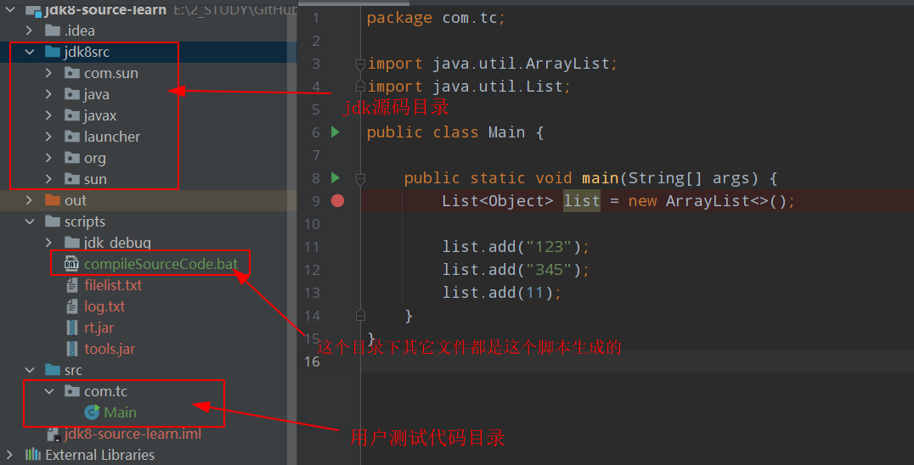


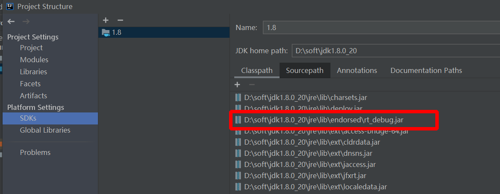

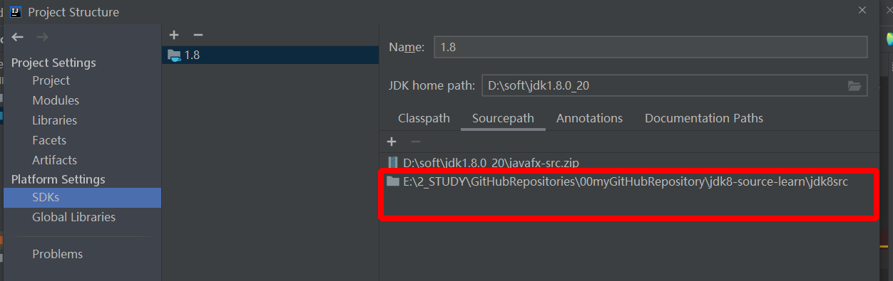

