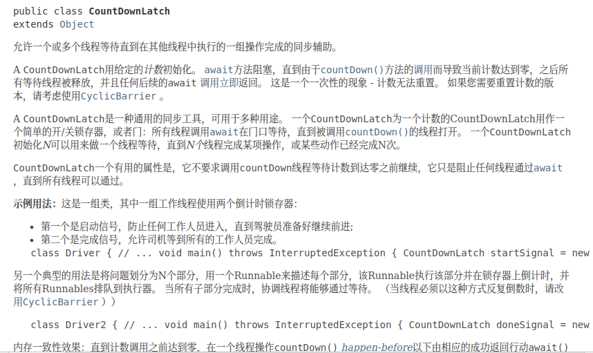
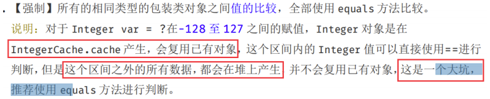
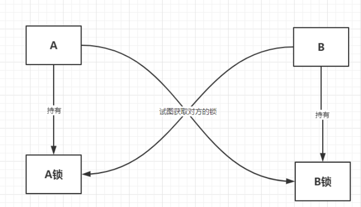

# JUC并发编程

​			并发编程的学习，感谢[遇见狂神说的视频教程](https://www.bilibili.com/video/BV1B7411L7tE?p=1)！讲得非常好！其次，我再结合《Java并发编程的艺术》再系统看了一遍。


## 多线程进阶=》JUC并发编程

### 什么是JUC


java.util.concurrent工具包、包、分类。

业务：普通的线程代码Thread

Runnable： 没有返回值、效率相比Callable相对较低。

### 进程和线程

> 线程、进程，如果不能使用一句话说出来的技术，不扎实！

进程：一个程序，QQ.exe，网易云音乐.exe，程序是指令的集合；

一个进程往往可以包含多个线程，至少包含一个主线程。

java默认有几个线程？2个  main，GC

对于java而言：Thread、Runnable、Callable。

java真的可以自己开启线程吗？直接开不了，它是去调用start0的native方法，由虚拟机底层去和操作系统交互开启。

**What are the differences between processes and threads?** （外网看见的，总结太经典了！比上面总结好：[入口](https://www.edureka.co/blog/interview-questions/java-interview-questions/)）

|                   | **Process**                                                  | **Thread**                                                   |
| ----------------- | ------------------------------------------------------------ | ------------------------------------------------------------ |
| **Definition**    | An executing instance of a program is called a process.      | A thread is a subset of the process.                         |
| **Communication** | Processes must use inter-process communication to communicate with sibling processes. | Threads can directly communicate with other threads of its process. |
| **Control**       | Processes can only exercise control over child processes.    | Threads can exercise considerable control over threads of the same process. |
| **Changes**       | Any change in the parent process does not affect child processes. | Any change in the main thread may affect the behavior of the other threads of the process. |
| **Memory**        | Run in separate memory spaces.                               | Run in shared memory spaces.                                 |
| **Controlled by** | Process is controlled by the operating system.               | Threads are controlled by programmer in a program.           |
| **Dependence**    | Processes are independent.                                   | Threads are dependent.                                       |

### 线程的状态

```java
public enum State {
    // 新生
    NEW,
	// 可运行
    RUNNABLE,
	// 阻塞
    BLOCKED,
	// 等待
    WAITING,
    // 超时等待
    TIMED_WAITING,
	// 停止
    TERMINATED;
}
```

线程状态生命周期扭转图：


### wait和sleep区别

1. 来自不同的类； wait => Object; sleep => Thread;
2. 关于锁的释放：wait会释放锁，sleep不会释放锁。
3. 使用范围不同：wait必须在同步代码块中，sleep可以在任何地方睡眠。

```
        Thread.sleep(1000);
        // 下面两个本质上都是执行的sleep
        TimeUnit.SECONDS.sleep(1); 
        TimeUnit.MINUTES.sleep(1);
```

## 并发和并行

并发： 多个线程操作同一个资源。

- cpu一核，模拟出多条线程。

并行：多个人一起走。

- cpu多核，多个线程可以同时进行。

```java
public class Test1 {
    public static void main(String[] args) {
        // 获取CPU的核数
        // CPU 密集型   IO密集型       System.out.println(Runtime.getRuntime().availableProcessors());
    }
}
```

并发编程的本质：充分利用CPU的资源。

## synchronized


```java

public class Test2 {
    public static void main(String[] args) {
        // 创建资源
        Ticket ticket = new Ticket();

        // 创建消费线程
        new Thread(()->{ // @FunctionalInterface 函数式接口， jdk1.8  表达式: (参数)->{代码}
            for (int i = 0; i < 40; i++) {
                ticket.sale();
            }
        }, "A").start();

        new Thread(()->{
            for (int i = 0; i < 40; i++) {
                ticket.sale();
            }
        }, "B").start();

        new Thread(()->{
            for (int i = 0; i < 40; i++) {
                ticket.sale();
            }
        }, "C").start();
    }
}

class Ticket {
    private int number = 20;

    public synchronized void sale() {
        if (number > 0) {
            System.out.println(Thread.currentThread().getName() + "卖出了" + (number--)+"票，剩余：" + number);
        }
    }
}

```

[面试题：请简述一下synchronized的锁升级过程](https://blog.csdn.net/weixin_42311349/article/details/114619927)

## Lock锁


ReentrantLock部分源码：

```java
public class ReentrantLock implements Lock, java.io.Serializable {
	// .......
	public ReentrantLock() {
        sync = new NonfairSync();// 非公平锁
    }
    public ReentrantLock(boolean fair) {
        // 如果传入true，则是公平锁，否则是非公平锁
        sync = fair ? new FairSync() : new NonfairSync();
    }
    // .......
}
```

公平锁：十分公平：先来后到。

非公平锁：十分不公平，可以插队。


### Synchronized和Lock区别

1. synchronized是内置的java关键字，Lock是java类。
2. synchronized无法判断获取锁的状态，Lock可以判断是否获取到了锁。
3. synchronized会自动释放锁，Lock需要手动释放锁，如果不释放，会产生死锁。
4. synchronized线程1（获得锁，阻塞），线程2（等待，傻傻的等）；Lock就不一定等待下去。  lock.tryLock();
5. synchronized可重入锁，不可以中断，非公平；Lock锁，可重入锁，可以判断锁，非公平锁（可设置）。
6. synchronized适合锁少量代码同步问题，Lock锁适合大量的同步代码。


## 生产者和消费者问题

```java
package ceg1;

// synchronized版生产者消费者问题
public class Test5 {
    public static void main(String[] args) {
        Data data = new Data();
        new Thread(()-> {
            for (int i = 0; i < 10; i++) {
                try {
                    data.incr();
                } catch (InterruptedException e) {
                    e.printStackTrace();
                }
            }
        }, "A").start();
        new Thread(()-> {
            for (int i = 0; i < 10; i++) {
                try {
                    data.decr();
                } catch (InterruptedException e) {
                    e.printStackTrace();
                }
            }
        }, "B").start();
    }
}

class Data {
    private int number = 0;

    public synchronized void incr() throws InterruptedException {
        if (number != 0) {
            this.wait();
        }
        number++;
        System.out.println(Thread.currentThread().getName()+"=>" + number);
        // 通知其它线程，我+1完毕了
        this.notifyAll();
    }

    public synchronized void decr() throws InterruptedException {
        if (number == 0) {
            this.wait();
        }
        number--;
        System.out.println(Thread.currentThread().getName()+"=>" + number);
        // 通知其它线程，我-1完毕了
        this.notifyAll();
    }
}
```

> 问题存在：如果两个线程没有问题，但是如果存在A B C D四个线程！怎么解决这个问题？

jdk中文API文档chm中，Object的wait方法有相关说明：

​		线程也可以唤醒，而不会被通知，终端或超时，即所谓的虚假唤醒，虽然这在实践中很少发生，但应用程序必须通过测试应该使线程被唤醒的条件来防范，并且如果条件不满足则继续等待。换句话说，等待应该总是出现在循环中，就像这样：

```java
synchronized (obj) {
	while (<condition does not hold>) {
        obj.wait(timeout);
        // Perform acton appropriate to condition
    }
}
```


修改后的代码:

```java
package ceg1;

// synchronized版生产者消费者问题
public class Test5 {
    public static void main(String[] args) {
        Data data = new Data();
        new Thread(()-> {
            for (int i = 0; i < 10; i++) {
                try {
                    data.incr();
                } catch (InterruptedException e) {
                    e.printStackTrace();
                }
            }
        }, "A").start();
        new Thread(()-> {
            for (int i = 0; i < 10; i++) {
                try {
                    data.decr();
                } catch (InterruptedException e) {
                    e.printStackTrace();
                }
            }
        }, "B").start();
        new Thread(()-> {
            for (int i = 0; i < 10; i++) {
                try {
                    data.incr();
                } catch (InterruptedException e) {
                    e.printStackTrace();
                }
            }
        }, "C").start();
        new Thread(()-> {
            for (int i = 0; i < 10; i++) {
                try {
                    data.decr();
                } catch (InterruptedException e) {
                    e.printStackTrace();
                }
            }
        }, "D").start();
    }
}

class Data {
    private int number = 0;

    public synchronized void incr() throws InterruptedException {
        while (number != 0) {
            this.wait();
        }
        number++;
        System.out.println(Thread.currentThread().getName()+"=>" + number);
        // 通知其它线程，我+1完毕了
        this.notifyAll();
    }

    public synchronized void decr() throws InterruptedException {
        while (number == 0) {
            this.wait();
        }
        number--;
        System.out.println(Thread.currentThread().getName()+"=>" + number);
        // 通知其它线程，我-1完毕了
        this.notifyAll();
    }
}
```


**JUC版生产者消费者问题：**

例如，假设我们有一个有限的缓冲区，它支持`put`和`take`方法。 如果在一个空的缓冲区尝试一个`take` ，则线程将阻塞直到一个项目可用; 如果`put`试图在一个完整的缓冲区，那么线程将阻塞，直到空间变得可用。 我们希望在单独的等待集中等待`put`线程和`take`线程，以便我们可以在缓冲区中的项目或空间可用的时候使用仅通知单个线程的优化。 这可以使用两个Condition实例来实现。


```java
package ceg1;

import java.util.concurrent.locks.Condition;
import java.util.concurrent.locks.Lock;
import java.util.concurrent.locks.ReentrantLock;

/**
 * JUC版生产者和消费者
 */
public class Test6 {
    public static void main(String[] args) {
        Data2 data = new Data2();
        new Thread(()-> {
            for (int i = 0; i < 10; i++) {
                try {
                    data.incr();
                } catch (InterruptedException e) {
                    e.printStackTrace();
                }
            }
        }, "A").start();
        new Thread(()-> {
            for (int i = 0; i < 10; i++) {
                try {
                    data.decr();
                } catch (InterruptedException e) {
                    e.printStackTrace();
                }
            }
        }, "B").start();
        new Thread(()-> {
            for (int i = 0; i < 10; i++) {
                try {
                    data.incr();
                } catch (InterruptedException e) {
                    e.printStackTrace();
                }
            }
        }, "C").start();
        new Thread(()-> {
            for (int i = 0; i < 10; i++) {
                try {
                    data.decr();
                } catch (InterruptedException e) {
                    e.printStackTrace();
                }
            }
        }, "D").start();
    }
}

class Data2 {
    private int number = 0;

    Lock lock = new ReentrantLock();
    Condition condition = lock.newCondition();

    // condition.await(); 等待
    // condition.signalAll(); 唤醒

    public void incr() throws InterruptedException {
        lock.lock();
        try {
            while (number != 0) {
                condition.await();
            }
            number++;
            System.out.println(Thread.currentThread().getName()+"=>" + number);
            // 通知其它线程，我+1完毕了
            condition.signalAll();
        } catch (InterruptedException e) {
            e.printStackTrace();
        } finally {
            lock.unlock();
        }
    }

    public void decr() throws InterruptedException {
        lock.lock();
        try {
            while (number == 0) {
                condition.await();
            }
            number--;
            System.out.println(Thread.currentThread().getName()+"=>" + number);
            // 通知其它线程，我-1完毕了
            condition.signalAll();
        } catch (InterruptedException e) {
            e.printStackTrace();
        } finally {
            lock.unlock();
        }
    }
}
```

任何一个新的技术，绝对不是仅仅只是覆盖了原来的技术，优势和补充！

> Condition精准的通知和唤醒线程。


实现ABCD顺序执行：

```java
package ceg1;

import java.util.concurrent.locks.Condition;
import java.util.concurrent.locks.Lock;
import java.util.concurrent.locks.ReentrantLock;

/**
 * A执行完，执行B，B执行完执行C
 */
public class Test7 {
    public static void main(String[] args) {
        Data3 data = new Data3();

        new Thread(()->{
            for (int i = 0; i < 10; i++) {
                data.printA();
            }
        }, "A").start();
        new Thread(()->{
            for (int i = 0; i < 10; i++) {
                data.printB();
            }
        }, "B").start();
        new Thread(()->{
            for (int i = 0; i < 10; i++) {
                data.printC();
            }
        }, "C").start();
    }
}

class Data3 {
    private Lock lock = new ReentrantLock();

    private Condition condition1 = lock.newCondition();
    private Condition condition2 = lock.newCondition();
    private Condition condition3 = lock.newCondition();

    private int number = 1; // 1-A  2-B 3-C   A-》B-》C-》A....

    public void printA() {
        lock.lock();
        try {
            // 业务，判断-》执行-》通知
            while (number != 1) {
                condition1.await();
            }
            System.out.println(Thread.currentThread().getName()+"=>AAAAAA");
            // 唤醒，唤醒指定的人
            number = 2;
            condition2.signal();
        } catch (Exception e) {
            e.printStackTrace();
        } finally {
            lock.unlock();
        }
    }

    public void printB() {
        lock.lock();
        try {
            // 业务，判断-》执行-》通知
            while (number != 2) {
                condition2.await();
            }
            System.out.println(Thread.currentThread().getName()+"=>BBBBB");
            // 唤醒，唤醒指定的人
            number = 3;
            condition3.signal();
        } catch (Exception e) {
            e.printStackTrace();
        } finally {
            lock.unlock();
        }
    }

    public void printC() {
        lock.lock();
        try {
            // 业务，判断-》执行-》通知
            while (number != 3) {
                condition3.await();
            }
            System.out.println(Thread.currentThread().getName()+"=>CCCCC");
            // 唤醒，唤醒指定的人
            number = 1;
            condition1.signal();
        } catch (Exception e) {
            e.printStackTrace();
        } finally {
            lock.unlock();
        }
    }
}
```

## 8锁现象

如何判断锁的是谁！永远的知道什么是锁，锁到底锁的是谁！

对象、Class。

### 1、2

```java
package ceg2;

import java.util.concurrent.TimeUnit;

/**
 * 8锁现象
 * 1、标准情况下，都不延时，两个线程先打印  发短信 还是 打电话？  先发短信后发打电话。
 * 2、sendSms延迟2秒，两个线程先打印  发短信 还是 打电话？  先发短信后发打电话。
 */
public class Test1 {
    public static void main(String[] args) {
        Phone phone = new Phone();

        new Thread(()->{
            phone.sendSms();
        }, "A").start();

//        try {
//            TimeUnit.SECONDS.sleep(2);
//        } catch (InterruptedException e) {
//            e.printStackTrace();
//        }

        new Thread(()->{
            phone.call();
        }, "B").start();
    }
}

class Phone {
    // synchronized 锁的对象是该方法的调用者。
    // 两个方法用的是同一个锁，谁先拿到谁先执行。
    public synchronized void sendSms () {
        try {
            TimeUnit.SECONDS.sleep(2);
        } catch (InterruptedException e) {
            e.printStackTrace();
        }
        System.out.println("发短信");
    }

    public synchronized void call() {
        System.out.println("打电话");
    }
}
```

### 3

```java
package ceg2;

import java.util.concurrent.TimeUnit;

/**
 * 8锁现象
 * 3、增加类一个普通方法！先执行发短信还是hello？   hello  发短信
 */
public class Test2 {
    public static void main(String[] args) {
        Phone2 phone = new Phone2();

        new Thread(()->{
            phone.sendSms();
        }, "A").start();


        new Thread(()->{
            phone.hello();
        }, "B").start();
    }
}

class Phone2 {
    // synchronized 锁的对象是该方法的调用者。
    // 两个方法用的是同一个锁，谁先拿到谁先执行。
    public synchronized void sendSms () {
        try {
            TimeUnit.SECONDS.sleep(2);
        } catch (InterruptedException e) {
            e.printStackTrace();
        }
        System.out.println("发短信");
    }

    public synchronized void call() {
        System.out.println("打电话");
    }

    // 这里没有锁，不是同步方法，不受锁的影响。
    public void hello() {
        System.out.println("hello");
    }
}
```

### 4

```java
package ceg2;

import java.util.concurrent.TimeUnit;

/**
 * 8锁现象
 * 4、两个对象，两个同步方法，发短信还是但电话？  打电话 发短信
 *  锁的是对象，所以两个对象各有一把锁，互不影响。
 */
public class Test3 {
    public static void main(String[] args) {
        Phone3 phone1 = new Phone3();
        Phone3 phone2 = new Phone3();

        new Thread(()->{
            phone1.sendSms();
        }, "A").start();

        try {
            TimeUnit.SECONDS.sleep(1);
        } catch (InterruptedException e) {
            e.printStackTrace();
        }

        new Thread(()->{
            phone2.call();
        }, "B").start();
    }
}

class Phone3 {
    // synchronized 锁的对象是该方法的调用者。
    // 两个方法用的是同一个锁，谁先拿到谁先执行。
    public synchronized void sendSms () {
        try {
            TimeUnit.SECONDS.sleep(2);
        } catch (InterruptedException e) {
            e.printStackTrace();
        }
        System.out.println("发短信");
    }

    public synchronized void call() {
        System.out.println("打电话");
    }

    // 这里没有锁，不是同步方法，不受锁的影响。
    public void hello() {
        System.out.println("hello");
    }
}
```

### 5

```java
package ceg2;

import java.util.concurrent.TimeUnit;

/**
 * 8锁现象
 * 5、增加两个静态方法  发短信还是打电话    发短信打电话
 * 静态同步方法锁的是类对象
 */
public class Test4 {
    public static void main(String[] args) {
        Phone4 phone = new Phone4();

        new Thread(()->{
            phone.sendSms();
        }, "A").start();

        try {
            TimeUnit.SECONDS.sleep(1);
        } catch (InterruptedException e) {
            e.printStackTrace();
        }

        new Thread(()->{
            phone.call();
        }, "B").start();
    }
}

class Phone4 {
    public static synchronized void sendSms () {
        try {
            TimeUnit.SECONDS.sleep(2);
        } catch (InterruptedException e) {
            e.printStackTrace();
        }
        System.out.println("发短信");
    }

    public static synchronized void call() {
        System.out.println("打电话");
    }
}
```

### 6

```java
package ceg2;

import java.util.concurrent.TimeUnit;

/**
 * 8锁现象
 * 6、两个对象！增加两个静态的同步方法，先打印发短信还是打电话？ 都是锁的同一个类对象。  发短信   打电话
 */
public class Test5 {
    public static void main(String[] args) {
        Phone5 phone1 = new Phone5();
        Phone5 phone2 = new Phone5();

        new Thread(()->{
            phone1.sendSms();
        }, "A").start();

        try {
            TimeUnit.SECONDS.sleep(1);
        } catch (InterruptedException e) {
            e.printStackTrace();
        }

        new Thread(()->{
            phone2.call();
        }, "B").start();
        // 先短信 后 电话
    }
}

class Phone5 {
    public static synchronized void sendSms () {
        try {
            TimeUnit.SECONDS.sleep(2);
        } catch (InterruptedException e) {
            e.printStackTrace();
        }
        System.out.println("发短信");
    }

    public static synchronized void call() {
        System.out.println("打电话");
    }
}
```

### 7

```java
package ceg2;

import java.util.concurrent.TimeUnit;

/**
 * 8锁现象
 * 7、1个静态的同步方法，1一个普通的同步方法，一个对象，先打印 发短信还是打电话？   打电话  发短信
 * 锁的对象不同，互不影响。
 */
public class Test6 {
    public static void main(String[] args) {
        Phone6 phone1 = new Phone6();

        new Thread(()->{
            phone1.sendSms();
        }, "A").start();

        try {
            TimeUnit.SECONDS.sleep(1);
        } catch (InterruptedException e) {
            e.printStackTrace();
        }

        new Thread(()->{
            phone1.call();
        }, "B").start();
        // 先短信 后 电话
    }
}

class Phone6 {
    public static synchronized void sendSms () {
        try {
            TimeUnit.SECONDS.sleep(2);
        } catch (InterruptedException e) {
            e.printStackTrace();
        }
        System.out.println("发短信");
    }

    public synchronized void call() {
        System.out.println("打电话");
    }
}
```

### 8

```java
package ceg2;

import java.util.concurrent.TimeUnit;

/**
 * 8锁现象
 * 7、1个静态的同步方法，1一个普通的同步方法，一个对象，先打印 发短信还是打电话？
 */
public class Test7 {
    public static void main(String[] args) {
        Phone7 phone1 = new Phone7();
        Phone7 phone2 = new Phone7();

        new Thread(()->{
            phone1.sendSms();
        }, "A").start();

        try {
            TimeUnit.SECONDS.sleep(1);
        } catch (InterruptedException e) {
            e.printStackTrace();
        }

        new Thread(()->{
            phone2.call();
        }, "B").start();
        // 先短信 后 电话
    }
}

class Phone7 {
    public static synchronized void sendSms () {
        try {
            TimeUnit.SECONDS.sleep(2);
        } catch (InterruptedException e) {
            e.printStackTrace();
        }
        System.out.println("发短信");
    }

    public synchronized void call() {
        System.out.println("打电话");
    }
}
```

小结：

new 锁的是this  具体的实例。

static 锁的是Class   唯一的类对象。

## 集合类不安全

### list线程安全

```java
package ceg3;

import java.util.*;
import java.util.concurrent.CopyOnWriteArrayList;

public class ListTest {
    public static void main(String[] args) {
//        List<Integer> list = Arrays.asList(1, 2, 3, 4);
//        list.forEach(System.out::println);

        List<String> list = new ArrayList<>(); // ArrayList线程非安全
        /**
         * 解决方案：
         * 1、 List<String> list = new Vector<>();
         * 2、 List<String> list = Collections.synchronizedList(new ArrayList<>());
         * 3、 JUC List<String> list = new CopyOnWriteArrayList<>();
         */
        /**
         * CopyOnWriteArrayList
         * CopyOnWrite 写入时复制  COW  计算机程序设计领域的一种优化策略；
         * 多个线程调用的时候，list，读取的时候，固定的，写入（覆盖）
         * 在写入的时候避免覆盖，造成数据问题。
         * 读写分离
         * 我们跟踪代码会发现CopyOnWriteArrayList中，写操作加了可重入锁，但是读操作没有加，存储数据的array加了volatile保证可见性和禁止指令重排，不保证原子性，
         * 使用volatile实现了轻量级同步，另外做修改的时候使用了COW技术，修改完成后一次性设置成功。
         *
         * CopyOnWriteArrayList  比Vector   NB在哪里？
         * 1、vector使用synchronized方式效率要低一点，CopyOnWriteArrayList使用lock锁
         * 2、写入时复制
         */

        for (int i = 1; i < 100; i++) {
            new Thread(()-> {
                list.add(UUID.randomUUID().toString().substring(0, 5));
                /*
                     使用ArrayList报错：  Exception in thread "93" java.util.ConcurrentModificationException
                 */
                System.out.println(list);
            }, String.valueOf(i)).start();
        }
    }
}
```

### set线程不安全

```java
package ceg3;

import java.util.Set;
import java.util.UUID;
import java.util.concurrent.CopyOnWriteArraySet;

public class SetTest {
    public static void main(String[] args) {
        // Exception in thread "Thread-9" java.util.ConcurrentModificationException
//        Set<String> set = new HashSet<>();
//        Set<String> set = Collections.synchronizedSet(new HashSet<>());
        Set<String> set = new CopyOnWriteArraySet<>();

        for (int i = 1; i < 30; i++) {
            new Thread(()-> {
                set.add(UUID.randomUUID().toString().substring(0,6));
                System.out.println(set);
            }).start();
        }
    }
}
```

HashSet底层是什么？

```java
public class HashSet<E>
    extends AbstractSet<E>
    implements Set<E>, Cloneable, java.io.Serializable
{

    //......
	private static final Object PRESENT = new Object();// 一个不变的对象
    public HashSet() {
        map = new HashMap<>();
    }
    //......
    // add set 本质就是map  key是无法重复的。
    public boolean add(E e) {
        return map.put(e, PRESENT)==null;
    }
    //......
}
```

### map不安全

```java
package ceg3;

import java.util.Collections;
import java.util.HashMap;
import java.util.Map;
import java.util.UUID;
import java.util.concurrent.ConcurrentHashMap;

public class MapTest {
    public static void main(String[] args) {
        // map 是这样用的吗？默认等价于什么？
//        Map<String, String> map = new HashMap<>();
        // 回答： 如果使用无参构造，默认参数是：加载因子 0.75、初始化容量 16

        /*
             解决线程安全问题:
             1. Map<String, String> map = Collections.synchronizedMap(new HashMap<>());
             2. Map<String, String> map2 = new ConcurrentHashMap<>();
             3. HashTable
         */
        Map<String, String> map = new ConcurrentHashMap<>();

        for (int i = 1; i < 30; i++) {
            new Thread(()-> {
                map.put(Thread.currentThread().getName(),
                        UUID.randomUUID().toString().substring(0, 6));
                System.out.println(map);
            }, String.valueOf(i)).start();
        }

    }
}
```


## Callable

​		返回结果并可能引发异常的任务。 实现者定义一个没有参数的单一方法，称为call 。

​		Callable接口类似于Runnable ，因为它们都是为其实例可能由另一个线程执行的类设计的。 然而，A **Runnable不返回结果，也不能抛出被检查的异常**。

该Executors类包含的实用方法，从其他普通形式转换为Callable类。

1. 可以有返回值
2. 可以抛出异常
3. 方法不同，run()/call()

代码测试：

```java
package ceg4;

import java.util.concurrent.Callable;
import java.util.concurrent.ExecutionException;
import java.util.concurrent.Executors;
import java.util.concurrent.FutureTask;

public class CallableTest {
    public static void main(String[] args) throws ExecutionException, InterruptedException {
//        Executors.callable(new Runnable() {
//            @Override aA
//            public void run() {
//                System.out.println("print");
//            }
//        });
//        new Thread(new Runnable()).start();
//        new Thread(new FutureTask<V>()).start();
//        new Thread(new FutureTask<V>( callable )).start();

        // 怎么启动callable
        MyThread thread = new MyThread();
        FutureTask futureTask = new FutureTask(thread);

        new Thread(futureTask, "A").start();
        new Thread(futureTask, "B").start();
        // call() 这个最后只打印了一次，结果被缓存  效率高

        // 这个get方法可能会产生阻塞！把他放到最后，或者使用异步通信来处理。
        Object o = futureTask.get();

        System.out.println("线程执行结果：" + o);
    }
}

class MyThread implements Callable<Integer> {

    @Override
    public Integer call() throws Exception {
        System.out.println("call()");

        return 1024;
    }
}
```

细节：

1. 有缓存
2. 结果可能需要等待，会阻塞！


## 常用辅助类

### CountDownLatch 

减法计数器



```java
package ceg4;

import java.util.concurrent.CountDownLatch;

// 计数器
public class CountDownLatchDemo {
    public static void main(String[] args) {
        final int TOTAL_NUM = 6;
        CountDownLatch countDownLatch = new CountDownLatch(TOTAL_NUM);

        for (int i = 1; i <= TOTAL_NUM; i++) {
            new Thread(()-> {
                System.out.println(Thread.currentThread().getName() + " Go out");
                countDownLatch.countDown(); // 数量-1
            }, String.valueOf(i)).start();
        }

        try {
            // 等待计数器归零，然后再往下执行
            countDownLatch.await();
            
            System.out.println("Close Door!");
        } catch (InterruptedException e) {
            e.printStackTrace();
        }
    }
}
```

原理：

countDownLatch.countDown(); // 数量-1

countDownLatch.await(); // 等待计数器归零，然后再往下执行

每次有线程调用countDown()数量-1，如果计数器变成0,那么await就会被重新唤醒。

### CyclicBarrier

读音：[ˈsaɪklɪk]  [ˈbæriə(r)] 

加法计数器


```java
package ceg4;

import java.util.concurrent.BrokenBarrierException;
import java.util.concurrent.CyclicBarrier;

public class CyclicBarrierTest {
    public static void main(String[] args) {
        /**
         * 集齐7颗龙珠召唤神龙
         */
        // 召唤龙珠的线程
        CyclicBarrier cyclicBarrier = new CyclicBarrier(7, () -> {
            System.out.println("召唤神龙成功!");
        });

        for (int i = 1; i <= 7; i++) {
            final int temp = i;
            new Thread(()->{ // lambda能操作到i吗？
                System.out.println(Thread.currentThread().getName()+ "收集" + temp + "个龙珠");
                try {
                    cyclicBarrier.await();
                } catch (InterruptedException e) {
                    e.printStackTrace();
                } catch (BrokenBarrierException e) {
                    e.printStackTrace();
                }
            }).start();
        }
    }
}
```

### Semaphore

Semaphore:信号量


eg: 抢车位！   6车-------3个停车位置  一次只能进去3个，只有等车走了其他车才能进去。

```java
package ceg4;

import java.util.concurrent.Semaphore;
import java.util.concurrent.TimeUnit;

public class SemaphoreTest {
    public static void main(String[] args) {
        // 线程数量，停车位！   这个在限流里面使用比较多
        Semaphore semaphore = new Semaphore(3);

        for (int i = 1; i <= 6; i++) {
            new Thread(()-> {
//                semaphore.acquire(); 获得信号量
//                semaphore.release(); 释放信号量
                try {
                    semaphore.acquire();
                    System.out.println(Thread.currentThread().getName() + "抢到了车位");
                    // 车停了一段时间
                    TimeUnit.SECONDS.sleep((long) (Math.floor(Math.random()*5) + 2));
                    System.out.println(Thread.currentThread().getName() + "离开了车位");
                } catch (InterruptedException e) {
                    e.printStackTrace();
                } finally {
                    semaphore.release();
                }
            }, String.valueOf(i)).start();
        }
    }
}
```

某次运行结果：

```
1抢到了车位
2抢到了车位
3抢到了车位
3离开了车位
4抢到了车位
1离开了车位
5抢到了车位
2离开了车位
6抢到了车位
4离开了车位
5离开了车位
6离开了车位
```

**原理：**

semaphore.acuquire()  获得，假设如果已经满了，等待，等待释放为止！

semaphore.release() 释放，会将当前的信号量释放+1，然后唤醒等待的线程！

作用：多个共享资源互斥的使用！并发限流，控制最大的线程数！

## Exchanger

​		Exchanger是一个用于线程间协作的工具类,用于两个线程间交换数据。它提供了一个交换的同步点,在这个同步点两个线程能够交换数据。交换数据是通过 exchange方法来实现的,如果一个线程先执行 exchange方法,那么它会同步等待另一个线程也执行 exchange方法,这个时候两个线程就都达到了同步点,两个线程就可以交换数据

## 读写锁

ReadWriteLock


```java
package ceg5;

import java.util.HashMap;
import java.util.Map;
import java.util.UUID;
import java.util.concurrent.locks.ReadWriteLock;
import java.util.concurrent.locks.ReentrantReadWriteLock;

/**
 * ReadWriteLock
 * 读占锁（写锁） 一次只能被一个线程占有
 * 共享锁（读锁） 多个线程可以同时占有
 */
public class ReadWriteLocKTest {
    public static void main(String[] args) {
        // 新建缓存容器对象
//        Cache cache = new MyCache();
        Cache cache = new MyCacheLock();

        // 多线程写
        for (int i = 1; i <= 10; i++) {
            final String temp = String.valueOf(i);
            new Thread(()->{
                cache.put(temp, UUID.randomUUID().toString().substring(0, 6));
            }, "W-" + temp).start();
        }

        // 多线程读
        for (int i = 1; i <= 10; i++) {
            final String temp = String.valueOf(i);
            new Thread(()->{
                cache.get(temp);
            }, "R-" + temp).start();
        }
    }
}

interface Cache {
    void put(String key, Object value);
    Object get(String key);
}

/**
 * 无锁   结果会存在问题，写操作不具备原子性。
 */
class MyCache implements Cache{
    private volatile Map<String, Object> cache = new HashMap<>();

    public void put(String key, Object value) {
        System.out.println("写入" + key);
        cache.put(key, value);
        System.out.println("写入" + key + " finish");
    }

    public Object get(String key) {
        System.out.println("读取" + key);
        Object o = cache.get(key);
        System.out.println("读取" + key + " finish");
        return o;
    }
}

/**
 *
 * 使用读写锁完成，读可以任意读，写只能一个线程写完其它才能写。（读能插队，写不能插队）
 */
class MyCacheLock implements Cache{
    private volatile Map<String, Object> cache = new HashMap<>();

    private ReadWriteLock rwLock = new ReentrantReadWriteLock();

    public void put(String key, Object value) {
        rwLock.writeLock().lock();
        try {
            System.out.println("写入" + key);
            cache.put(key, value);
            System.out.println("写入" + key + " finish");
        } catch (Exception e) {
            e.printStackTrace();
        } finally {
            rwLock.writeLock().unlock();
        }
    }

    public Object get(String key) {
        rwLock.readLock().lock();
        Object o = null;
        try {
            System.out.println("读取" + key);
            o = cache.get(key);
            System.out.println("读取" + key + " finish");
        } catch (Exception e) {
            e.printStackTrace();
        } finally {
            rwLock.readLock().unlock();
        }

        return o;
    }
}
```

## StampedLock

   Jdk 1.8中比ReentrantReadWriteLock更好的读写锁。 [文档参考](https://www.liaoxuefeng.com/wiki/1252599548343744/1309138673991714)

## 阻塞队列


### BlockingQueue阻塞队列


什么情况下我们使用阻塞队列：多线程并发处理，线程池。


**学会使用队列**

添加、移出

**四组API**

| 方式       | 抛出异常 | 有返回值,不抛出异常 | 阻塞等待 | 超时等待  |
| ---------- | -------- | ------------------- | -------- | --------- |
| 添加       | add      | offer               | put      | offer(,,) |
| 移出       | remove   | poll                | take     | poll(,)   |
| 判断队列首 | element  | peek                |          |           |

```java
package ceg5;

import org.junit.Test;

import java.util.concurrent.ArrayBlockingQueue;
import java.util.concurrent.BlockingQueue;
import java.util.concurrent.TimeUnit;

public class BlockingQueueTest {

    /**
     *  抛出异常
     */
    @Test
    public void test1() {
        ArrayBlockingQueue blockQueue = new ArrayBlockingQueue<>(3);

        System.out.println(blockQueue.add("a"));
        System.out.println(blockQueue.add("b"));
        System.out.println(blockQueue.add("c"));
        System.out.println("element:" + blockQueue.element());

        // java.lang.IllegalStateException: Queue full 报错
//        System.out.println(blockQueue.add("d"));

        System.out.println(blockQueue.remove());
        System.out.println(blockQueue.remove());
        System.out.println(blockQueue.remove());

        // java.util.NoSuchElementException 报错
//        System.out.println(blockQueue.remove());
    }

    /**
     * 有返回，不抛出异常
     */
    @Test
    public void test2() {
        BlockingQueue blockingQueue = new ArrayBlockingQueue(3);

        System.out.println(blockingQueue.offer("a"));
        System.out.println(blockingQueue.offer("b"));
        System.out.println(blockingQueue.offer("c"));
        System.out.println("peek:" + blockingQueue.peek());

        // 不报错  返回false
        System.out.println(blockingQueue.offer("d"));


        System.out.println(blockingQueue.poll());
        System.out.println(blockingQueue.poll());
        System.out.println(blockingQueue.poll());
        // 不报错 返回null
        System.out.println(blockingQueue.poll());
    }

    /**
     * 阻塞 等待
     */
    @Test
    public void test3() throws InterruptedException {
        BlockingQueue blockingQueue = new ArrayBlockingQueue(3);

        blockingQueue.put("a");
        blockingQueue.put("b");
        blockingQueue.put("c");
        // 阻塞 （一直等待）
//        blockingQueue.put("d");

        System.out.println(blockingQueue.take());
        System.out.println(blockingQueue.take());
        System.out.println(blockingQueue.take());
        // 阻塞（一直等待）
        System.out.println(blockingQueue.take());
    }

    /**
     * 超时等待
     */
    @Test
    public void test4() throws InterruptedException {
        BlockingQueue blockingQueue = new ArrayBlockingQueue(3);

        System.out.println(blockingQueue.offer("a"));
        System.out.println(blockingQueue.offer("b"));
        System.out.println(blockingQueue.offer("c"));

        // 超时阻塞等待2秒
        System.out.println(blockingQueue.offer("d", 2, TimeUnit.SECONDS));

        System.out.println(blockingQueue.poll(2, TimeUnit.SECONDS));
        System.out.println(blockingQueue.poll(2, TimeUnit.SECONDS));
        System.out.println(blockingQueue.poll(2, TimeUnit.SECONDS));

        // 超时阻塞等待2秒
        System.out.println(blockingQueue.poll(2, TimeUnit.SECONDS));
    }
}
```

### SynchronousQueue同步队列

SynchronousQueue也是BlockingQueue的一个实现。

没有容量，进去一个元素，必须等待取出来之后再往里面放一个元素！

put、take。

```java
package ceg5;

import java.util.concurrent.BlockingQueue;
import java.util.concurrent.SynchronousQueue;
import java.util.concurrent.TimeUnit;

/**
 * 同步队列
 *      和其他的BlockingQueue不一样，SynchronousQueue不存储元素，put了一个元素，必须从里面take出来，否则不能put进去（等待）。
 */
public class SynchronousQueueTest {
    public static void main(String[] args) {
        // 同步队列
        BlockingQueue<String> synchronousQueue = new SynchronousQueue<>();
//        SynchronousQueue<String> synchronousQueue = new SynchronousQueue<>();

        new Thread(()->{
            try {
                System.out.println(Thread.currentThread().getName() + " put 1");
                synchronousQueue.put("1");
                System.out.println(Thread.currentThread().getName() + " put 2");
                synchronousQueue.put("2");
                System.out.println(Thread.currentThread().getName() + " put 3");
                synchronousQueue.put("3");
            } catch (InterruptedException e) {
                e.printStackTrace();
            }
        }, "T1").start();
        new Thread(()->{
            try {
                TimeUnit.SECONDS.sleep(2);
                System.out.println(Thread.currentThread().getName() + " take " + synchronousQueue.take());
                TimeUnit.SECONDS.sleep(2);
                System.out.println(Thread.currentThread().getName() + " take " + synchronousQueue.take());
                TimeUnit.SECONDS.sleep(2);
                System.out.println(Thread.currentThread().getName() + " take " + synchronousQueue.take());
            } catch (InterruptedException e) {
                e.printStackTrace();
            }
        }, "T2").start();
    }
}
```

输出：

T1 put 1
T2 take 1
T1 put 2
T2 take 2
T1 put 3
T2 take 3

## 线程池

线程池：五大方法、7大参数、4种拒绝策略。

> 池化技术：事先准备好一些资源，有人要用，就来我这里拿，用完之后还给我。

程序的运行，本质：占用系统的资源！优化资源的使用！

线程池、连接池、内存池、对象池...    创建、销毁对象十分浪费资源。

**线程池的好处：**

1. 降低资源的消耗
2. 提高响应速度
3. 方便管理

**<span style="color:red">线程复用、可以控制最大并发数、管理线程。</span>**

### 五大方法


```java
package ceg6;

import java.util.concurrent.ExecutorService;
import java.util.concurrent.Executors;
import java.util.concurrent.Future;
import java.util.concurrent.TimeUnit;

// Executors工具类 五个大方法
public class ExecutorsTest1 {
    public static void main(String[] args) {
//        ExecutorService threadPool = Executors.newSingleThreadExecutor(); // 单个线程
//        ExecutorService threadPool = Executors.newFixedThreadPool(5); // 创建一个固定大小的线程池
        ExecutorService threadPool = Executors.newCachedThreadPool(); // 可伸缩的线程池， 遇强则强，遇弱则弱。（和机器性能有关）

        try {
            for (int i = 0; i < 100; i++) {
                // 方式一：
                threadPool.execute(()->{
//                    try {
//                        TimeUnit.SECONDS.sleep(1);
//                    } catch (InterruptedException e) {
//                        e.printStackTrace();
//                    }
                    System.out.println(Thread.currentThread().getName() + " ok");
                });
                // 方式二：
    //            Future<?> future = threadPool.submit(() -> {
    //                System.out.println(Thread.currentThread().getName() + " ok");
//                      return "ok";
    //            });
    //            Object o = future.get();
            }
        } catch (Exception e) {
            e.printStackTrace();
        } finally {
            threadPool.shutdown();
//            threadPool.shutdownNow()
        }
    }
}
```

### 7大参数

源码分析：

```java
public static ExecutorService newSingleThreadExecutor() {
    return new FinalizableDelegatedExecutorService
        (new ThreadPoolExecutor(1, 1,
                                0L, TimeUnit.MILLISECONDS,
                                new LinkedBlockingQueue<Runnable>()));
} 
public static ExecutorService newFixedThreadPool(int nThreads) {
    return new ThreadPoolExecutor(nThreads, nThreads,
                                  0L, TimeUnit.MILLISECONDS,
                                  new LinkedBlockingQueue<Runnable>());
}
public static ExecutorService newCachedThreadPool() {
    return new ThreadPoolExecutor(0, Integer.MAX_VALUE,// 21亿 可能会导致OOM
                                  60L, TimeUnit.SECONDS,
                                  new SynchronousQueue<Runnable>());
}
// 本质：ThreadPoolExecutor
// ThreadPoolExecutor的7个参数
public ThreadPoolExecutor(int corePoolSize, // 核心线程池大小
                              int maximumPoolSize,// 最大核心线程池大小
                              long keepAliveTime,// 超时了没有人调用就会释放
                              TimeUnit unit, // 超时单位
                              BlockingQueue<Runnable> workQueue, // 阻塞队列
                              ThreadFactory threadFactory, // 线程工厂，一般不动
                              RejectedExecutionHandler handler // 拒绝策略
                         ) {
        if (corePoolSize < 0 ||
            maximumPoolSize <= 0 ||
            maximumPoolSize < corePoolSize ||
            keepAliveTime < 0)
            throw new IllegalArgumentException();
        if (workQueue == null || threadFactory == null || handler == null)
            throw new NullPointerException();
        this.acc = System.getSecurityManager() == null ?
                null :
                AccessController.getContext();
        this.corePoolSize = corePoolSize;
        this.maximumPoolSize = maximumPoolSize;
        this.workQueue = workQueue;
        this.keepAliveTime = unit.toNanos(keepAliveTime);
        this.threadFactory = threadFactory;
        this.handler = handler;
    }
```


**手动创建线程池：**

```java
package ceg6;

import java.util.concurrent.*;

// Executors工具类 三大方法
public class ExecutorsTest2 {
    public static void main(String[] args) {
        // 自定义线程池
        ExecutorService threadPool = new ThreadPoolExecutor(2, // 默认开房2个窗口
                5, // 最多可以开启5个窗口(在一定条件下开启这部分窗口)
                3L, // 如果窗口长达3秒没有办理业务，那么这个5-2的额外窗口可以关闭休息
                TimeUnit.SECONDS,// 等待时长单位
                new LinkedBlockingDeque<>(3), // 候客区最多放3个人
                Executors.defaultThreadFactory(), // 默认线程工厂，一般不动
                new ThreadPoolExecutor.AbortPolicy() // 拒绝策略  银行满了，还有人进来，不处理这个人的，抛出异常。
            );

        try {
            // 这个时候只使用了核心线程数据的其中一个
            final int THREAD_NUM = 1;
            // 这个时候只使用了核心线程数据的两个
//            final int THREAD_NUM = 2;
            // 这个时候   corePoolSize < 3 < maximumPoolSize，基本核心线程数已经不够用，另外又加了一个线程来执行
//            final int THREAD_NUM = 3;
            // 最大承载： Deque capacity + maximumPoolSize
            // 超过最大承载 java.util.concurrent.RejectedExecutionException
//            final int THREAD_NUM = 9; // 9 超过了最大承载，使用拒绝策略回应
            for (int i = 1; i <= THREAD_NUM; i++) {
                threadPool.execute(()->{
                    System.out.println(Thread.currentThread().getName() + " ing");
                    try {
                        TimeUnit.SECONDS.sleep(4l);
                    } catch (InterruptedException e) {
                        e.printStackTrace();
                    }
                    System.out.println(Thread.currentThread().getName() + " ok");
                });
            }
        } catch (Exception e) {
            e.printStackTrace();
        } finally {
            threadPool.shutdown();
//            threadPool.shutdownNow()
        }
    }
}
```

### 4种拒绝策略


ThreadPoolExecutor.AbortPolicy (默认) 线程池满了，还有线程进来，不处理这个线程，抛出异常

ThreadPoolExecutor.CallerRunsPolicy 线程池满了，还有线程进来，由发起线程自己执行。（哪里来哪里去）

ThreadPoolExecutor.DiscardPolicy 队列满了，丢掉任务，不会抛出异常。

ThreadPoolExecutor.DiscardOldestPolicy 队列满了，丢掉队列中最早未执行的任务，也不会抛出异常。

### 小结拓展

线程池的最大线程数该如何定义？

了解：IO密集型、CPU密集型。（调优）

**CPU密集型:**  CPU几核就写几，保证CPU的效率最高。

```java
// 获取CPU核数  这样可以根据具体机器动态改变值，不用写死。
Runtime.getRuntime().availableProcessors();
```

**IO密集型:** 判断你的程序中十分消耗IO的线程。  比如：程序  15个大型任务  IO十分占用资源！ 那么至少需要15个以上。

## 四大函数式接口

jdk1.5时代：枚举类型、泛型、反射。

新时代的程序员：lambda表达式、链式编程、函数式接口、Stream流式计算。

> 函数式接口：只有一个方法的接口

```java
@FunctionalInterface
public interface Runnable {
    /**
     * When an object implementing interface......
     */
    public abstract void run();
}
// jdk中有超级多的@FunctionalInterface
// 简化编程模型，在新版本的框架底层大量应用。
// foreach(消费者类的函数式接口)
```


### Function

**函数式接口**


```java
package ceg7;

import org.junit.Test;
import java.util.function.Function;

public class FunInterTest1 {
    @Test
    public void test1() {
        Function<String, String> upperStr = new Function<String, String>() { // 匿名内部类
            @Override
            public String apply(String str) {
                return str != null ? str.toUpperCase() : null;
            }
        };
        String result = upperStr.apply("abcdefg");

        System.out.println(result);
    }

    @Test
    public void test2() {
        // lambda写法
//        Function<String, String> upperStr = str -> str != null ? str.toUpperCase() : null;
//        Function<String, String> upperStr = (str) -> (str != null ? str.toUpperCase() : null);
        Function<String, String> upperStr = str -> {return str != null ? str.toUpperCase() : null;};

        String result = upperStr.apply("abcdefg");

        System.out.println(result);
    }
}
```

### Predicate

**断定型接口**

```java
@FunctionalInterface
public interface Predicate<T> {
    // 传入T  返回一个布尔值
    boolean test(T t);
}
```


```java
package ceg7;

import org.junit.Test;

import java.util.function.Predicate;

public class FunInterTest2 {
    @Test
    public void test01() {
        Predicate<String> strIsEmpty = new Predicate<String>() {
            @Override
            public boolean test(String str) {
                return str == null ? true : str.isEmpty();
            }
        };

        System.out.println(strIsEmpty.test(null));
        System.out.println(strIsEmpty.test(""));
        System.out.println(strIsEmpty.test("adf"));
    }

    @Test
    public void test02() {
        Predicate<String> strIsEmpty = str -> (str == null ? true : str.isEmpty());
        Predicate<String> strIsEmpty2 = str -> (str.length() > 0);

        System.out.println(strIsEmpty.test(null));
        System.out.println(strIsEmpty.test(""));
        System.out.println(strIsEmpty.test("adf"));
		// 多个条件进行合并
        System.out.println(strIsEmpty.and(strIsEmpty2).test("adf"));
        System.out.println(strIsEmpty.or(strIsEmpty2).test("adf"));
    }

}
```

### Supplier

**供给型接口**

```java
@FunctionalInterface
public interface Supplier<T> {

    /**
     * Gets a result.
     *
     * @return a result
     */
    T get();// 没有参数，只有返回值
}
```

```java
package ceg7;

import org.junit.Test;

import java.util.function.Supplier;

public class FunInterTest4 {
    @Test
    public void test1() {
        Supplier<Integer> intSupplier = new Supplier<Integer>() {
            @Override
            public Integer get() {
                return Double.valueOf(Math.floor(Math.random()*100 + 1)).intValue();
            }
        };

        Integer num = intSupplier.get();
        System.out.println(num);
    }

    @Test
    public void test2() {
        Supplier<Integer> intSupplier = () -> Double.valueOf(Math.floor(Math.random()*100 + 1)).intValue();

        Integer num = intSupplier.get();
        System.out.println(num);
    }
}
```

### Consumer

**消费型接口**

```java
@FunctionalInterface
public interface Consumer<T> {

    /**
     * Performs this operation on the given argument.
     *
     * @param t the input argument
     */
    void accept(T t);// 只有输入参数没有返回值
    //.....
}
```

```java
package ceg7;

import org.junit.Test;

import java.util.function.Consumer;

public class FunInterTest3 {
    @Test
    public void test1() {
        Consumer<String> printStr = new Consumer<String>() {
            @Override
            public void accept(String str) {
                System.out.println(str);
            }
        };

        printStr.accept("hello world");
    }

    @Test
    public void test2() {
        Consumer<String> printStr = str -> System.out.println(str);

        printStr.accept("hello world");
    }
}
```

## Stream流式计算

什么是Stream流式计算？

大数据：存储+计算

存储：集合、MySQL等，本质就是存储东西的。

计算都应该交给流来操作！

```java
package ceg8;

import org.junit.Test;
import java.util.Arrays;
import lombok.AllArgsConstructor;
import lombok.Data;
import lombok.NoArgsConstructor;
import lombok.ToString;
import java.io.Serializable;

@Data // 使用到了lombok技术
@NoArgsConstructor
@AllArgsConstructor
@ToString
class User implements Serializable {
    private int id;
    private String name;
    private int age;
}

/**
 * 题目：一分钟内完成此题，只能用一行代码实现！
 * 现在有5个用户！筛选：
 * 1、ID必须是偶数
 * 2、年龄必须大于23
 * 3、用户名全部转为大写
 * 4、按照用户名倒数排序
 * 5、只输出一个用户
 */
public class StreamTest1 {
    @Test
    public void test1() {
        User u1 = new User(1, "a", 21);
        User u2 = new User(2, "b", 22);
        User u3 = new User(3, "c", 23);
        User u4 = new User(4, "d", 24);
        User u5 = new User(6, "e", 25);

        // 答：
        // 集合就是存储，计算交个stream流。 下面使用到了：lambda表达式、链式编程、函数式接口、Stream流式计算。
        Arrays.asList(u1, u2, u3, u4, u5).stream()
                .filter(user -> user.getId() % 2 ==0)
                .filter(user -> user.getAge() > 23)
                .map(user -> {user.setName(user.getName().toUpperCase()); return user;})
                .sorted((user1, user2) -> user2.getName().compareTo(user1.getName())) // 反序就反着比就可以了
                .limit(1)
                .forEach(System.out::println);
    }
}
```

## ForkJoin

ForkJoin在JDK1.7首次出现，递归执行任务！提高效率。**大数据量**（几十亿）！


> ForkJoin特点：工作窃取。

这个里面维护的都是双端队列。


ForkJoin操作：

```java
package ceg8;

import org.junit.Test;

import java.util.concurrent.ExecutionException;
import java.util.concurrent.ForkJoinPool;
import java.util.concurrent.ForkJoinTask;
import java.util.concurrent.RecursiveTask;
import java.util.function.Supplier;
import java.util.stream.LongStream;

/**
 * 累计求和:
 *  不同程序员的不同写法
 */
public class ForkJoinTest {
    // 普通程序员
    @Test
    public void test1() {
        testMethod(()-> { // 耗时:366
            long sum = 0;
            for (long i = 1; i <= 10_0000_0000l; i++) {// 10_0000_0000 中的_ jdk1.7的数字分隔符
                sum += i;
            }
            return sum;
        }, 10);
    }

    // ForkJoin写法 高级一点  （我实战了哈，实际效果没有视频讲得那么好，可能跟机器以及类型包装和拆箱有一定关系，这个forkjoin的思想是非常好的，很像mapreduce）
    @Test
    public void test2() {
        testMethod(()-> { // 耗时:495
            // 可以调节临界值来进行调优
            SumForkJoinTask sumForkJoinTask = new SumForkJoinTask(0L, 10_0000_0000l, 1000L);
            ForkJoinPool forkJoinPool = new ForkJoinPool();
//            forkJoinPool.execute(sumForkJoinTask);
            ForkJoinTask<Long> submitBack = forkJoinPool.submit(sumForkJoinTask);

            try {
                return submitBack.get();
            } catch (InterruptedException e) {
                e.printStackTrace();
            } catch (ExecutionException e) {
                e.printStackTrace();
            }
            return null;
        }, 10);
    }

    // stream写法 并行流 高大尚
    @Test
    public void test3() {
        testMethod(()-> { // 耗时:313
            long sum = LongStream.rangeClosed(0L, 10_0000_0000l)
                    .parallel()
                    .reduce(0, Long::sum);
            return sum;
        }, 10);
    }

    // 算法型 高级
    @Test
    public void test4() {
        // 1加到n  算法总结： n*(n-1)/2+n 进一步推导 (n^2+n)/2
        // m加到n  算法总结： (n*(n-1)/2+n) - (m*(m-1)/2+m)
        testMethod(()-> { // 耗时:0  近似0
            long m = 1;
            long n = 10_0000_0000l;
            long sum = n * ( n - 1) / 2 + n;
            return sum;
        }, 10);
    }

    /**
     * 测试方法
     *
     * @param supplier 要测试的代码
     * @param testNum 测试的次数  多次测试求一个平均耗时
     */
    private void testMethod(Supplier supplier, int testNum) {
        long start = System.currentTimeMillis();
        Object result = null;
        for (int i = 0; i < testNum; i++) {
            result = supplier.get();
        }
        long end = System.currentTimeMillis();

        System.out.println("返回值:" + result);
        System.out.println("耗时:" + (end - start) / testNum);
    }
}

/**
 * RecursiveAction 递归事件
 * RecursiveTask 递归任务
 */
class SumForkJoinTask extends RecursiveTask<Long> {
    // 开始
    private long start;
    // 结束
    private long end;
    // 临界值
    private long criticalVal;

    public SumForkJoinTask(long start, long end) {
        this.start = start;
        this.end = end;
        this.criticalVal = 1000L;
    }

    public SumForkJoinTask(long start, long end, long criticalVal) {
        this.start = start;
        this.end = end;
        this.criticalVal = criticalVal;
    }

    @Override
    protected Long compute() {
        long sum = 0l;
        if (end - start < criticalVal) {
            for (long i = start; i <= end; sum += i, i++);
        } else {
            long mid = (end + start) >> 1;
            SumForkJoinTask leftTask = new SumForkJoinTask(start, mid);
            SumForkJoinTask rightTask = new SumForkJoinTask(mid + 1, end);

            leftTask.fork();
            rightTask.fork();

            Long leftSum = leftTask.join();
            Long rightSum = rightTask.join();

            sum = Long.sum(leftSum, rightSum);
        }

        return sum;
    }
}
```

## 异步回调

> Future设计初衷：对将来的某个事件的结果进行建模。

```java
package ceg8;

import org.junit.Test;

import java.util.concurrent.CompletableFuture;
import java.util.concurrent.ExecutionException;
import java.util.concurrent.TimeUnit;

public class FutureTest1 {
    @Test
    public void test1() {
        // Void是void的包装类  表示没有返回值
        CompletableFuture<Void> completableFuture = CompletableFuture.runAsync(()-> { // runAsync异步回调
            try {
                TimeUnit.SECONDS.sleep(2);
            } catch (InterruptedException e) {
                e.printStackTrace();
            }
            System.out.println(Thread.currentThread().getName() + "： runAsync=>Void");
        });

        System.out.println("111");

        try {
            Void unused = completableFuture.get(); // 获取阻塞执行结果
            System.out.println(unused);
        } catch (InterruptedException e) {
            e.printStackTrace();
        } catch (ExecutionException e) {
            e.printStackTrace();
        }
    }

    @Test
    public void test2() {
        CompletableFuture<Integer> completableFuture = CompletableFuture.supplyAsync(() -> { // supplyAsync 供给型
            try {
                TimeUnit.SECONDS.sleep(2);
            } catch (InterruptedException e) {
                e.printStackTrace();
            }
            System.out.println(Thread.currentThread().getName() + "： supplyAsync=>Integer");
            int i = 10 / 0;
            return 1024;
        });

        System.out.println("111");

        try {
            completableFuture = completableFuture.whenComplete((t, err)-> { // 当成功
                System.out.println("t=>" + t); // t 执行结果
                System.out.println("err=>" + err);// err 是错误信息
            }).exceptionally(e->{ // 当发生异常
//                e.printStackTrace();
                System.out.println(e.getMessage());
                return 233; // 失败返回233
            });

            Integer num = completableFuture.get();
            System.out.println(num);
        } catch (InterruptedException e) {
            e.printStackTrace();
        } catch (ExecutionException e) {
            e.printStackTrace();
        }
    }
}
```

## JMM、Volatile

[JMM和底层实现原理](https://www.jianshu.com/p/8a58d8335270)

[java内存模型JMM理解整理](https://www.cnblogs.com/null-qige/p/9481900.html)

[final重排序规则](https://blog.csdn.net/riemann_/article/details/96390511)

### 请你谈谈你对Volatile的理解？

1. 保证可见性

2. 不保证原子性
3. 禁止指令重排

> 什么是JMM

### JMM java内存模型（一种概念，约定）

**关于JMM的一些同步的约定：**

1. 线程解锁前，必须把共享变量**立刻**刷回主存；
2. 线程加锁前，必须读取主存中的最新值到工作内存中；
3. 加锁和解锁是同一把锁。


### 线程 **工作内存**  **线程**


- lock   （锁定）：作用于主内存的变量，把一个变量标识为线程独占状态
- unlock （解锁）：作用于主内存的变量，它把一个处于锁定状态的变量释放出来，释放后的变量才可以被其他线程锁定
- read  （读取）：作用于主内存变量，它把一个变量的值从主内存传输到线程的工作内存中，以便随后的load动作使用
- load   （载入）：作用于工作内存的变量，它把read操作从主存中变量放入工作内存中
- use   （使用）：作用于工作内存中的变量，它把工作内存中的变量传输给执行引擎，每当虚拟机遇到一个需要使用到变量的值，就会使用到这个指令
- assign （赋值）：作用于工作内存中的变量，它把一个从执行引擎中接受到的值放入工作内存的变量副本中
- store  （存储）：作用于主内存中的变量，它把一个从工作内存中一个变量的值传送到主内存中，以便后续的write使用
- write 　（写入）：作用于主内存中的变量，它把store操作从工作内存中得到的变量的值放入主内存的变量中

　　JMM对这八种指令的使用，制定了如下规则：

- - 不允许read和load、store和write操作之一单独出现。即使用了read必须load，使用了store必须write
  - 不允许线程丢弃他最近的assign操作，即工作变量的数据改变了之后，必须告知主存
  - 不允许一个线程将没有assign的数据从工作内存同步回主内存
  - 一个新的变量必须在主内存中诞生，不允许工作内存直接使用一个未被初始化的变量。就是怼变量实施use、store操作之前，必须经过assign和load操作
  - 一个变量同一时间只有一个线程能对其进行lock。多次lock后，必须执行相同次数的unlock才能解锁
  - 如果对一个变量进行lock操作，会清空所有工作内存中此变量的值，在执行引擎使用这个变量前，必须重新load或assign操作初始化变量的值
  - 如果一个变量没有被lock，就不能对其进行unlock操作。也不能unlock一个被其他线程锁住的变量
  - 对一个变量进行unlock操作之前，必须把此变量同步回主内存


### **Happen-Before（先行发生规则）**

​	Happen-Before：先行发生，前一个操作的结果，可以被后续的操作获取（可见）。 我的理解是happen-Before是制定的线程操作的因果规则。

　　在常规的开发中，更多时候，我们是分析一个并发程序是否安全，其实都依赖Happen-Before原则进行分析。Happen-Before被翻译成先行发生原则，意思就是当A操作先行发生于B操作，则在发生B操作的时候，操作A产生的影响能被B观察到，“影响”包括修改了内存中的共享变量的值、发送了消息、调用了方法等。

　　Happen-Before的规则有以下几条

- 程序次序规则（Program Order Rule）：在一个线程内，程序的执行规则跟程序的书写规则是一致的，从上往下执行。
- 管程锁定规则（Monitor Lock Rule）：一个Unlock的操作肯定先于下一次Lock的操作。这里必须是同一个锁。同理我们可以认为在synchronized同步同一个锁的时候，锁内先行执行的代码，对后续同步该锁的线程来说是完全可见的。
- volatile变量规则（volatile Variable Rule）：对同一个volatile的变量，先行发生的写操作，肯定早于后续发生的读操作
- 线程启动规则（Thread Start Rule）：Thread对象的start()方法先行发生于此线程的没一个动作
- 线程中止规则（Thread Termination Rule）：Thread对象的中止检测（如：Thread.join()，Thread.isAlive()等）操作，必行晚于线程中所有操作
- 线程中断规则（Thread Interruption Rule）：对线程的interruption（）调用，先于被调用的线程检测中断事件(Thread.interrupted())的发生
- 对象中止规则（Finalizer Rule）：一个对象的初始化方法先于一个方法执行Finalizer()方法
- 传递性（Transitivity）：如果操作A先于操作B、操作B先于操作C,则操作A先于操作C

　　以上就是Happen-Before中的规则。通过这些条件的判定，仍然很难判断一个线程是否能安全执行，毕竟在我们的时候线程安全多数依赖于工具类的安全性来保证。想提高自己对线程是否安全的判断能力，必然需要理解所使用的框架或者工具的实现，并积累线程安全的经验。


问题：程序不知道主内存的值已经被修改过了。


### **1、保证可见性**

下面这个程序将会产生一个问题，程序并没有像我们想象的那样结束！？

```java
package ceg9;

import java.util.concurrent.TimeUnit;

/**
 * 问题：num变量的变更对线程A不可见。
 */
public class JMMTest1 {

    private static int num = 0;

    public static void add() {
        num++;
    }

    public static void main(String[] args) {
        new Thread(()->{
            while (num==0) {
                Thread thread = Thread.currentThread();// 这样就不会结束
//                下面两个都会有同步操作，一个含有volatile一个有synchronized，我怀疑触发了同步操作，num也跟着做了同步，所以会结束
//                Thread.State state = Thread.currentThread().getState();
//                synchronized (new Object()) {
//                }
            }
        }, "A").start();

        try {
            TimeUnit.SECONDS.sleep(1);
        } catch (InterruptedException e) {
            e.printStackTrace();
        }

        add();
        System.out.println("+1");
    }
}
```

解决方案：使用volatile保证线程更改可见。

```java
package ceg9;

import java.util.concurrent.TimeUnit;

/**
 * 问题：使用volatile保证num变量的变更对线程A可见。 这样该程序就会顺利结束
 */
public class JMMTest2 {

    private static volatile int num = 0;

    public static void add() {
        num++;
    }

    public static void main(String[] args) {
        new Thread(()->{
            while (num==0) {
            }
        }, "A").start();

        try {
            TimeUnit.SECONDS.sleep(1);
        } catch (InterruptedException e) {
            e.printStackTrace();
        }

        add();
        System.out.println("+1");
    }
}
```

### 2、不保证原子性

javap -c JMMTest2.class

部分内容： 其中 0 3 4 5就是num++操作

```
  public static void add();
    Code:
       0: getstatic     #2                  // Field num:I
       3: iconst_1
       4: iadd
       5: putstatic     #2                  // Field num:I
       8: return
```

​		getstatic先获取static变量，iconst_1拿到int类型常量1，iadd执行两者相加，putstatic将相加结果设置回static变量中区。

```java
package ceg9;

/**
 * volatile不保证原子性
 *
 * 下面程序猜测结果是20000,但结果真的是这样的吗？
 */
public class JMMTest3 {
    private static volatile int num = 0;

    public static void add() {
        num++;
    }

    public static void main(String[] args) {
        for (int i = 0; i < 10; i++) {
            new Thread(()-> {
                for (int j = 0; j < 2000; j++) {
                    add();
                }
            }).start();
        }


        while (Thread.activeCount() > 2) {// 判断是否还有线程执行 2是由于主线程和gc线程
            Thread.yield();// 线程礼让
        }

        System.out.println("结果：" + num);
    }
}
```

加Lock和Synchronized是可以保证原子性, 但是如果不用Lock和synchronized怎么做保证原子性？

```java
package ceg9;

import java.util.concurrent.atomic.AtomicInteger;

/**
 * volatile不保证原子性
 *
 * 加Lock和Synchronized是可以保证原子性, 但是如果不用Lock和synchronized怎么做？ 使用AutomicInteger
 */
public class JMMTest4 {
    private static volatile AtomicInteger num = new AtomicInteger(0);

    public static void add() {
        num.incrementAndGet();
//        num.getAndIncrement()
    }

    public static void main(String[] args) {
        for (int i = 0; i < 10; i++) {
            new Thread(()-> {
                for (int j = 0; j < 2000; j++) {
                    add();
                }
            }).start();
        }

        // 猜测结果是20000,但结果真的是这样的吗？

        while (Thread.activeCount() > 2) {// 判断是否还有线程执行 2是由于主线程和gc线程
            Thread.yield();// 线程礼让
        }

        System.out.println("结果：" + num.get());
    }
}
```

AtomicInt,AtomicLong,AtomicBoolean等这些类的底层都是直接和操作系统挂钩！在内存中直接修改值！Unsafe类是一个很特殊的存在。

### 3、禁止指令重排

什么是指令重排？

​		**你写的程序，计算机并不是按照你写的那样去执行的。**

源代码-->编译器优化的重排-->指令并行也可能会重排-->内存系统也会重排-->执行。

**<span style="color:red">处理器在进行指令重排的时候，考虑：数据之间的依赖性！</span>**

```java
int x = 1; // 1
int y = 2; // 2
x = x + 5; // 3
y = x * x; // 4
我们所期望的是： 1234
但可能执行的时候会变成： 2134 1324
但不可能是： 4123
```

可能造成影响的结果：abxy这四个值默认都是0

| 线程A | 线程B |
| ----- | ----- |
| x=a   | y=b   |
| b=1   | a=2   |

正常的结果：x = 0, y = 0; 但是可能由于指令重排导致


| 线程A | 线程B |
| ----- | ----- |
| b=1   | a=2   |
| x=a   | y=b   |

指令重排导致的诡异结果：x=2,y=1;

**加了volatile就可以避免指令重排；**

如何实现的？通过内存屏障，CPU指令。作用：

1. 保证特定的操作的执行顺序！
2. 可以保证某些变量的内存可见性。


volatile是可以保证可见性，不能保证原子性，由于内存屏障，可以保证避免指令重排的现象产生！

## 彻底玩转单例模式

饿汉式  懒汉式

DCL懒汉式

### 饿汉式

```java
package ceg10;

/**
 * 单例模式：
 * 饿汉式
 */
public class Hungry {
    private static final Hungry hungry = new Hungry();

    // 这些变量一开始没有使用， 就可能会浪费空间。
    private byte[] data1 = new byte[1024*1024];
    private byte[] data2 = new byte[1024*1024];
    private byte[] data3 = new byte[1024*1024];
    private byte[] data4 = new byte[1024*1024];
    private byte[] data5 = new byte[1024*1024];

    private Hungry() {
    }

    public static Hungry getInstance() {
        return hungry;
    }
}
```

​		这些变量一开始没有使用或很久没有用上， 这就可能会浪费空间。所以使用懒加载方式解决。

### 懒汉式

```java
package ceg10;

/**
 * 单例模式
 */
public class LazyMan1 {
    private static LazyMan1 lazyMan1 = null; // DCL方式加上volatile防止重排序

    private LazyMan1() {
        System.out.println(Thread.currentThread().getName());
    }

//    无锁方式，会有多线程问题 测试会发现经过了多次构造
//    public static LazyMan1 getInstance() {
//        if (lazyMan1 == null) {
//            lazyMan1 = new LazyMan1();
//        }
//        return lazyMan1;
//    }

    public static void main(String[] args) {
        for (int i = 0; i < 10; i++) {
            new Thread(() -> {
                LazyMan1.getInstance();
            }).start();
        }
    }

//    synchonized方法上枷锁   锁粒度太粗，不管有没有初始化都要进行同步，并发效率不好
//    public static synchronized LazyMan1 getInstance() {
//        if (lazyMan1 == null) {
//            lazyMan1 = new LazyMan1();
//        }
//        return lazyMan1;
//    }

//    双重检查锁  DCL懒汉式    
    public static LazyMan1 getInstance() {
        if (lazyMan1 == null) {
            synchronized (LazyMan1.class) {
                if (lazyMan1 == null) {
                    lazyMan1 = new LazyMan1(); // 不是原子性操作
                    /**
                     * 《java并发编程的艺术》 P69有详细讨论这个问题
                     * 实际执行会有几个步骤：
                     * 1、 分配内存空间
                     * 2、 执行构造方法，初始化对象
                     * 3、 把这个对象指针指向这个空间。
                     *
                     * 由于不是原子性操作，所以有可能发生指令重排现象。
                     * 我们期望的手执行 1 2 3
                     * 真实有可能执行的是 1 3 2 那这个时候layMan1还没有完成构造，有新的进程进来判断这个lazyMan1已经不为空
                     * ，这时候是个虚无的对象，直接使用就会出现问题。
                     *
                     * 所以上面的变量最好加上volatile关键字，防止指令重排（问题解决）。
                     * private static volatile LazyMan1 lazyMan1 = null;
                     */
                }
            }
        }
        return lazyMan1;
    }
}
```

### Holder方式

​		JVM在类的初始化阶段（class加载后，且被线程使用之前），会执行类的初始化。在类的初始化期间，JVM会去获取一个锁。这个锁可以同步多个线程对同一个类的初始化。基于这个特性，可以实现延迟初始化和线程安全。

```java
package ceg10;

import java.util.concurrent.TimeUnit;

/**
 * 单例模式： 静态内部类
 *      这样写，可以实现懒汉式，又可以保证线程安全。
 *  但是这样也是可以使用反射破坏
 *
 */
public class SingletonHolder {
    private SingletonHolder() {
        System.out.println("construct");
    }

    public static SingletonHolder getInstance() {
        return Holder.singletonHolder;
    }

    private static class Holder{
        public static SingletonHolder singletonHolder = new SingletonHolder();
    }

    public static void main(String[] args) throws InterruptedException {
        System.out.println("Class::" + SingletonHolder.class);

        TimeUnit.SECONDS.sleep(3);

        System.out.println("get single Instance");
        for (int i = 0; i < 10; i++) {
            SingletonHolder instance = SingletonHolder.getInstance();
        }
    }
}
```

**攻防战1：**

```java
package ceg10;

import org.junit.Test;

import java.lang.reflect.Constructor;
import java.lang.reflect.InvocationTargetException;

/**
 * 单例模式
 *      反射攻防战-1
 */
public class LazyManCrack1 {
    private static LazyManCrack1 lazyMan1 = null;

    private LazyManCrack1() {
        synchronized (LazyManCrack1.class) {
            if (lazyMan1 != null) { // 这个是构造器中，该变量应该是在构造后才复制，单例逻辑只会走一次构造，那么这里应该为null
                throw new RuntimeException("不要试图使用反射破坏异常！");
            }
        }
    }

//    双重检查锁  DCL懒汉式
    public static LazyManCrack1 getInstance() {
        if (lazyMan1 == null) {
            synchronized (LazyManCrack1.class) {
                if (lazyMan1 == null) {
                    lazyMan1 = new LazyManCrack1(); // 不是原子性操作
                }
            }
        }
        return lazyMan1;
    }

    public static void main(String[] args) throws Exception {
        test1();
    }

    public static void test1() throws NoSuchMethodException, IllegalAccessException, InvocationTargetException, InstantiationException {
        Constructor<LazyManCrack1> constructor = LazyManCrack1.class.getDeclaredConstructor(null);
        constructor.setAccessible(true);

//        一个正常获取一个反射获取
        LazyManCrack1 lazyManCrack1 = LazyManCrack1.getInstance();
        LazyManCrack1 lazyManCrack2 = constructor.newInstance();

        System.out.println(lazyManCrack1);
        System.out.println(lazyManCrack2);
    }
}
```

**攻防战2：**

```java
package ceg10;

import java.lang.reflect.Constructor;
import java.lang.reflect.Field;
import java.lang.reflect.InvocationTargetException;

/**
 * 单例模式
 *      反射攻防战-2   道高一尺，魔高一丈
 */
public class LazyManCrack2 {
    private static LazyManCrack2 lazyMan1 = null;

    private static boolean xxxxxxxxxFlag = false;

    private LazyManCrack2() {
        synchronized (LazyManCrack2.class) {
            if (!xxxxxxxxxFlag) {
                xxxxxxxxxFlag = true;
            } else {
                throw new RuntimeException("不要试图使用反射破坏异常！");
            }
        }
    }

//    双重检查锁  DCL懒汉式
    public static LazyManCrack2 getInstance() {
        if (lazyMan1 == null) {
            synchronized (LazyManCrack2.class) {
                if (lazyMan1 == null) {
                    lazyMan1 = new LazyManCrack2(); // 不是原子性操作
                }
            }
        }
        return lazyMan1;
    }

    public static void main(String[] args) throws Exception {
//        test1();
        test2();
    }

    public static void test1() throws NoSuchMethodException, IllegalAccessException, InvocationTargetException, InstantiationException {
        Constructor<LazyManCrack2> constructor = LazyManCrack2.class.getDeclaredConstructor(null);
        constructor.setAccessible(true);


//        两个都用放射获取
        LazyManCrack2 lazyManCrack1 = constructor.newInstance();
        LazyManCrack2 lazyManCrack2 = constructor.newInstance();

        System.out.println(lazyManCrack1);
        System.out.println(lazyManCrack2);
    }

    public static void test2() throws Exception {
        Constructor<LazyManCrack2> constructor = LazyManCrack2.class.getDeclaredConstructor(null);
        constructor.setAccessible(true);

        // xxxxxxxxxFlag有可能是一个加密的字符
        Field flagField = LazyManCrack2.class.getDeclaredField("xxxxxxxxxFlag");
        flagField.setAccessible(true);

//        两个都用放射获取
        LazyManCrack2 lazyManCrack1 = constructor.newInstance();

//        flagField.set(lazyManCrack1, false);
        flagField.set(LazyManCrack2.class, false);

        LazyManCrack2 lazyManCrack2 = constructor.newInstance();

        System.out.println(lazyManCrack1);
        System.out.println(lazyManCrack2);
    }
}
```

### 枚举方式

​		单例最佳实现方式。

```java
package ceg10;

import java.lang.reflect.Constructor;
import java.lang.reflect.InvocationTargetException;

/**
 * 枚举： 线程安全、不会被反射破坏
 *      反射不可以破坏
 */
public enum EnumSingleton {
    INSTANCE;

    // 其他属性
    private int otherProp = 123;

//    EnumSingleton() { // 可以发现类程序一起动就会初始化
//        System.out.println("init");
//    }

    public static EnumSingleton getInstance() {
        return INSTANCE;
    }

    public static void test1() {
        EnumSingleton instance1 = EnumSingleton.getInstance();
        EnumSingleton instance2 = EnumSingleton.getInstance();

        System.out.println(instance1 == instance2);
    }

    public static void test2() throws NoSuchMethodException, IllegalAccessException, InvocationTargetException, InstantiationException {
        // 我们通过idea反编译和javap -p EnumSingleton.class 反编译，发现有个无参构造函数private EnumSingleton()和 private ceg10.EnumSingleton();
        Class<EnumSingleton> cls = EnumSingleton.class;
        // 报错：Exception in thread "main" java.lang.NoSuchMethodException:
        // 这个报错不是反射newInstace源码枚举newInstace报错 Cannot reflectively create enum objects
        Constructor<EnumSingleton> constructor = cls.getDeclaredConstructor(null);

        constructor.setAccessible(true);

        EnumSingleton instance1 = constructor.newInstance();
        EnumSingleton instance2 = constructor.newInstance();

        System.out.println(instance1 == instance2);
        // 实际上idea和javap反编译的结果骗了我们。
    }

    public static void test3() throws Exception{
        // 我们使用专业的反编译工具jad来进行分析
        // 下载地址 https://varaneckas.com/jad/  下载这个版本 Jad 1.5.8e for Linux (statically linked)
        /**
         * 安装jad
         * sudo wget https://varaneckas.com/jad/jad158e.linux.static.zip
         * sudo mv jad158e.linux.static.zip /media/tc/jx-soft/linux-soft/jad.zip
         * sudo unzip jad.zip
         * sudo chmod a+x -R jad
         * cd jad
         * 软连接到java目录下，这样不用单独配置环境变量到处就可以使用
         * echo ln -s $(pwd)/jad $(dirname $(which java))/jad | bash
         * 测试
         * jad 就能看见jad的帮助信息
         */
        // 使用jad反编译:
        // jad -sjava EnumSingleton.class
        // 结果看下面的jad反编译源码:
        Class<EnumSingleton> cls = EnumSingleton.class;
        // 不反编译，通过下面这行打断电也能看见这个构造函数，以及参数
        Constructor<?>[] declaredConstructors = cls.getDeclaredConstructors();
//        Constructor<?>[] constructors = cls.getConstructors();
        Constructor<EnumSingleton> constructor = cls.getDeclaredConstructor(String.class, int.class);

        constructor.setAccessible(true);

        // 报错：：  Exception in thread "main" java.lang.IllegalArgumentException: Cannot reflectively create enum objects
        // at java.lang.reflect.Constructor.newInstance(Constructor.java:417)
        // 说明我们的枚举单例通过反射是不能够破坏的!!
        EnumSingleton instance1 = constructor.newInstance();
        EnumSingleton instance2 = constructor.newInstance();

        System.out.println(instance1 == instance2);

        // 另一种证明枚举集成Enum，并且需要给父类构造传参
        System.out.println(TEST_ENUM.STATE1 instanceof Enum);
        System.out.println(TEST_ENUM.STATE2.getClass());
        System.out.println(TEST_ENUM.STATE2.getClass().getSuperclass());
        System.out.println(TEST_ENUM.STATE2.getClass().getSuperclass().getDeclaredConstructor(String.class, int.class));
        System.out.println(int.class);
        System.out.println(Integer.class);
    }

    public static void main(String[] args) throws Exception {
//        test1();
//        test2();
        test3();
    }
}
```

idea反编译:

```java
public enum EnumSingleton {
    INSTANCE;

    private int otherProp = 123;

    private EnumSingleton() {// idea反编译的私有构造  被骗！
    }

    public static EnumSingleton getInstance() {
        return INSTANCE;
    }
}

```

javap反编译：

 javap -p EnumSingleton.class

```java
Compiled from "EnumSingleton.java"
public final class ceg10.EnumSingleton extends java.lang.Enum<ceg10.EnumSingleton> {
  public static final ceg10.EnumSingleton INSTANCE;
  private int otherProp;
  private static final ceg10.EnumSingleton[] $VALUES;
  public static ceg10.EnumSingleton[] values();
  public static ceg10.EnumSingleton valueOf(java.lang.String);
  private ceg10.EnumSingleton();// 这个是javap分析出来的私有构造  被骗！！
  public static ceg10.EnumSingleton getInstance();
  static {};
}
```

jad反编译：

jad -sjava EnumSingleton.class

```java
// Decompiled by Jad v1.5.8e. Copyright 2001 Pavel Kouznetsov.
// Jad home page: http://www.geocities.com/kpdus/jad.html
// Decompiler options: packimports(3) 
// Source File Name:   EnumSingleton.java

package ceg10;

import java.io.PrintStream;
import java.lang.reflect.Constructor;
import java.lang.reflect.InvocationTargetException;

public final class EnumSingleton extends Enum
{

    public static EnumSingleton[] values()
    {
        return (EnumSingleton[])$VALUES.clone();
    }

    public static EnumSingleton valueOf(String name)
    {
        return (EnumSingleton)Enum.valueOf(ceg10/EnumSingleton, name);
    }

    private EnumSingleton(String s, int i)// 私有构造，这里有两个构造参数。 这才是正解！！！
    {
        super(s, i);
        otherProp = 123;
        System.out.println("init");
    }

    public static EnumSingleton getInstance()
    {
        return INSTANCE;
    }

    public static final EnumSingleton INSTANCE;
    private int otherProp;
    private static final EnumSingleton $VALUES[];

    static 
    {
        INSTANCE = new EnumSingleton("INSTANCE", 0);
        $VALUES = (new EnumSingleton[] {
            INSTANCE
        });
    }
}
```

### 自创枚举+Hodler方式

```java
package ceg10;

import java.util.concurrent.TimeUnit;

/**
 * 自创单例，结合Holder和枚举类型
 *
 *   同时实现懒加载，防止反射破坏，线程安全多个功能！
 *
 * 滑稽：哈哈哈，不行的。用枚举主要是保护单例类，如果直接反射创建CustomSingleton，那就等于没有用了呀。
 */
public class CustomSingleton {
    private CustomSingleton() {
        System.out.println("init out class");
    }

    private static enum Holder{
        INSTANCE(new CustomSingleton());
        protected CustomSingleton test;

        Holder(CustomSingleton test) {
            this.test = test;
            System.out.println("init enum");
        }
    }

    public static CustomSingleton getInstance() {
        return Holder.INSTANCE.test;
    }

    public static void main(String[] args) throws InterruptedException {
        System.out.println(CustomSingleton.class);
        TimeUnit.SECONDS.sleep(1);

        final CustomSingleton instance = CustomSingleton.getInstance();
        System.out.println(instance);
    }
}
```

## 深入理解CAS

### 什么是CAS？

大厂必须要深入研究底层！有所突破！修内功，比如大学的操作系统，计算机网络原理等在实际工作中其实非常有用。

```java
package ceg11;

import java.util.concurrent.atomic.AtomicInteger;

public class CASTest1 {
    // CAS compareAndSet 比较并交换
    public static void main(String[] args) {
        AtomicInteger atomicInteger = new AtomicInteger(2021);

        // public final boolean compareAndSet(int expect, int update)
        // 两个参数  第一个参数expect期望值  第二参数update更新值
        // 如果期望值达到了，就更新为update值，否则不更新。
        // CAS是CPU并发原语
        System.out.println(atomicInteger.compareAndSet(2021, 2022));
        System.out.println(atomicInteger.get());

        System.out.println(atomicInteger.compareAndSet(2021, 2025));
        System.out.println(atomicInteger.get());
    }
}
```

### Unsafe类


CAS： 比较当前工作内存中的值和主内存中的值，如果这个值是期望的，那么则执行操作！如果不是就一直循环。

缺点：

1. 循环会耗时
2. 一次性只能保证一个共享变量的原子性
3. ABA问题

### ABA问题（狸猫换太子）

像下图，A线程从主内存拿到A=1,要进行CAS（1,2），1换成2,但是B线程要快一点，拿到A=1,换成了3,然后再换成了1,但是这个1已经不是以前的1了，这个就叫ABA问题，狸猫换太子。


```java
package ceg11;

import org.junit.Test;

import java.util.concurrent.atomic.AtomicInteger;

public class CASTest1 {

    @Test
    public void test1() {// CAS compareAndSet 比较并交换
        AtomicInteger atomicInteger = new AtomicInteger(2021);
        // public final boolean compareAndSet(int expect, int update)
        // 两个参数  第一个参数expect期望值  第二参数update更新值
        // 如果期望值达到了，就更新为update值，否则不更新。
        // CAS是CPU并发原语
        System.out.println(atomicInteger.compareAndSet(2021, 2022));
        System.out.println(atomicInteger.get());

        System.out.println(atomicInteger.compareAndSet(2021, 2025));
        System.out.println(atomicInteger.get());

    }

    @Test
    public void test2() {
        AtomicInteger atomicInteger = new AtomicInteger(2020);
        // ============== 捣乱的线程 ==================
        System.out.println(atomicInteger.compareAndSet(2020, 2021));
        System.out.println(atomicInteger.get());
        System.out.println(atomicInteger.compareAndSet(2021, 2020));
        System.out.println(atomicInteger.get());
        // ============== 期望的线程 ==================
        System.out.println(atomicInteger.compareAndSet(2020, 6666));
        System.out.println(atomicInteger.get());
    }
}
```

乐观锁的实现方式主要有两种：CAS机制和版本号机制。Java语言中的**AtomicStampedReference**类便是使用版本号来解决ABA问题的。

这篇文章非常好，可以读一下。[CAS、乐观锁、悲观锁、ABA](https://blog.csdn.net/caisongcheng_good/article/details/79916873)

## 原子引用

AtomicReference 可以原子更新的对象引用。
AtomicStampedReference 带版本号的原子更新的对象引用。

```java
package ceg11;

import org.junit.Test;

import java.util.concurrent.TimeUnit;
import java.util.concurrent.atomic.AtomicInteger;
import java.util.concurrent.atomic.AtomicReference;
import java.util.concurrent.atomic.AtomicStampedReference;
import java.util.function.Consumer;

public class CASTest2 {
    @Test
    public void test1() {
        AtomicReference<Integer> intARef = new AtomicReference<>(127);

        System.out.println(intARef.compareAndSet(127, -128));
        System.out.println(intARef.compareAndSet(-128, 127));
        System.out.println(intARef.get());
        /**
         * ABA问题：
         *      A线程：   1         ->        2       期望值是1,更新值是2。  这个1已经不再是以前的1了。
         *      B线程：   1   -> 9 ... -> 1
         * 打个形象的比方： 你老婆很爱你            ->               20年后你老婆爱你如初
         *               你老婆很爱你  -> 你老婆和别人搞在一起了   -> 20年后你老婆爱你如初
         *           :: 到最后你老婆还是像最初那样爱你，但是这个能认为还是一样吗？
         */
    }

    @Test
    public void test2() {
        // 解决ABA问题：java引入了AtomicStampedReference带版本号的原子引用。
        AtomicStampedReference<Integer> intRef = new AtomicStampedReference<>(127, 1);
        final Consumer<Object> print = (arg) -> {
            System.out.println(Thread.currentThread().getName() + "->" + arg);
        };

        new Thread(() -> {
            print.accept(intRef.getStamp());

            try {
                TimeUnit.SECONDS.sleep(1);
            } catch (InterruptedException e) {
                e.printStackTrace();
            }

            print.accept(intRef.compareAndSet(127, -128, 1, 2));
            print.accept(intRef.getStamp());

            print.accept(intRef.compareAndSet(-128, 127, 2, 3));
            print.accept(intRef.getStamp());
            print.accept(intRef.getReference());
        }, "A").start();


        new Thread(() -> {
            print.accept(intRef.getStamp());

            try {
                TimeUnit.SECONDS.sleep(3);
            } catch (InterruptedException e) {
                e.printStackTrace();
            }

            // 如果返回为false，我们可以自己决定接下来如何做
            print.accept(intRef.compareAndSet(127, -128, 1, 4));
            print.accept(intRef.getStamp());
            print.accept(intRef.getReference());
        }, "B").start();

        while (Thread.activeCount() > 2) {
            Thread.yield();
        }

        /*
            A->1
            B->1
            A->true
            A->2
            A->true
            A->3
            A->127
            B->false
            B->3
            B->127
         */
    }

    @Test
    public void test3() {
        //AtomicStampedReference 注意，如果泛型是一个包装类，注意对象的引用问题
        // 正常在业务操作，这里面比较的都是一个个对象
        AtomicReference<Integer> intARef = new AtomicReference<>(2020);

        System.out.println(intARef.compareAndSet(2020, 2021));// false
        System.out.println(intARef.compareAndSet(2021, 2020));// false
        System.out.println(intARef.get()); // 2020
        /**
         * 为什么上面两个compareAndSet都返回false？？？？
         * 答案：这个问题表面看上去是当前是2020,期望是2020,那么就应该是期望的值，能够进行更新，但实际不是这样的。
         * 这个导致原因要从Integer这个包装类说起，Integer会对-128~127的数字进行缓存，以外的就不会缓存，所以上面
         * 的两个2020经过包装后，他们就不再是同一个对象。像下面这样：
         *         System.out.println(Integer.valueOf(2020) == Integer.valueOf(2020));
         *         System.out.println(Integer.valueOf(-128) == Integer.valueOf(-128));
         *         System.out.println(Integer.valueOf(127) == Integer.valueOf(127));
         * 《阿里巴巴java开发手册》中提到过Integer这个问题。
         */
        System.out.println(Integer.valueOf(2020) == Integer.valueOf(2020));
        System.out.println(Integer.valueOf(-128) == Integer.valueOf(-128));
        System.out.println(Integer.valueOf(127) == Integer.valueOf(127));
    }
}
```

**注意：** 

​		Integer 使用了对象缓存机制，默认范围是 -128 ~ 127 ，推荐使用静态工厂方法 valueOf 获取对象实 例，而不是 new，因为 valueOf 使用缓存，而 new 一定会创建新的对象分配新的内存空间；



## 各种锁的理解

1.公平锁 / 非公平锁

2.可重入锁 / 不可重入锁

3.独享锁 / 共享锁

4.互斥锁 / 读写锁

5.乐观锁 / 悲观锁

6.分段锁

7.偏向锁 / 轻量级锁 / 重量级锁

8.自旋锁

上面是很多锁的名词，这些分类并不是全是指锁的状态，有的指锁的特性，有的指锁的设计，下面总结的内容是对每个锁的名词进行一定的解释。

### 公平锁、非公平锁

公平锁： 非常公平， 不能够插队，必须先来后到！  ReentrantLock可指定非公平

非公平锁：非常不公平，可以插队 （默认都是非公平） ReentrantLock默认公平 Synchronized

```java
public ReentrantLock() {
	sync = new NonfairSync();
}
public ReentrantLock(boolean fair) {
	sync = fair ? new FairSync() : new NonfairSync();
}
```

### 可重入锁/不可重入锁

​		可重入锁（递归锁），广义上的可重入锁指的是可重复可递归调用的锁，在外层使用锁之后，在内层仍然可以使用，并且不发生死锁（前提得是同一个对象或者class），这样的锁就叫做可重入锁。`ReentrantLock`和`synchronized`都是可重入锁

**synchronized版可重入锁**

```java
package ceg12;

import java.util.concurrent.TimeUnit;

/**
 * synchronized版可重入锁
 */
public class ReLocksTest1 {
    public static void main(String[] args) {
        Phone phone = new Phone();

        new Thread(()-> {
            // synchronized 锁自动加锁，自动解锁  进入代码块加锁，出代码块解锁。
            // 像这个案例，相当于加了两次synchronized同步锁，这种没解锁前又进入另一个锁，就是可重入锁。
            phone.sms();
        }, "A").start();
        new Thread(()-> {
            phone.sms();
        }, "B").start();
        /**
         * 结果：
         * A:sms
         * A:call
         * B:sms
         * B:call
         */
    }
}

class Phone {
    public synchronized void sms() {
        System.out.println(Thread.currentThread().getName() + ":sms");
        // 调用打电话
        call();
    }

    public synchronized void call() {
        try {
            TimeUnit.SECONDS.sleep(1);
        } catch (InterruptedException e) {
            e.printStackTrace();
        }
        System.out.println(Thread.currentThread().getName() + ":call");
    }
}
```

**lock版可重入锁**

```java
package ceg12;

import java.util.concurrent.TimeUnit;
import java.util.concurrent.locks.Lock;
import java.util.concurrent.locks.ReentrantLock;

/**
 * Lock版可重入锁
 */
public class ReLocksTest2 {
    public static void main(String[] args) {
        Phone2 phone = new Phone2();

        new Thread(()-> {
            phone.sms();
        }, "A").start();
        new Thread(()-> {
            phone.sms();
        }, "B").start();
        /**
         * 结果：
         * A:sms
         * A:call
         * B:sms
         * B:call
         */
    }
}

class Phone2 {
    private Lock lock = new ReentrantLock();

    public void sms() {
        lock.lock();// 细节问题，lock和unlock必须成对出现，否则就会死在里面。同一个lock调用lock()多次，就加了一次锁，那么就需要解多少次锁。
//        lock.lock();
        try {
            System.out.println(Thread.currentThread().getName() + ":sms");
            // 调用打电话
            call();// 这里也有锁
        } catch (Exception e) {
            e.printStackTrace();
        } finally {
//            lock.unlock();
            lock.unlock();
        }
    }

    public void call() {
        lock.lock();
        try {
            try {
                TimeUnit.SECONDS.sleep(1);
            } catch (InterruptedException e) {
                e.printStackTrace();
            }
            System.out.println(Thread.currentThread().getName() + ":call");
        } catch (Exception e) {
            e.printStackTrace();
        } finally {
            lock.unlock();
        }
    }
}
```

**不可重入锁:**

​		不可重入锁，与可重入锁相反，不可递归调用，递归调用就发生死锁。

### 独享锁 / 共享锁

独享锁和共享锁在你去读JUC包下的ReentrantLock和ReentrantReadWriteLock你就会发现，它俩一个是独享，一个是共享锁。

**独享锁**：该锁每一次只能被一个线程所持有。  AQS中tryAcquire(int arg)是独占获取锁

**共享锁**：该锁可被多个线程共有，典型的就是ReentrantReadWriteLock里的读锁，它的读锁是可以被共享的，但是它的写锁确每次只能被独占。  AQS中tryAcquireShared(int arg)就是获取共享锁

另外读锁的共享可保证并发读是非常高效的，但是读写和写写，写读都是互斥的。

独享锁与共享锁也是通过AQS来实现的，通过实现不同的方法，来实现独享或者共享。
对于Synchronized而言，当然是独享锁。

### 互斥锁 / 读写锁

**互斥锁**

在访问共享资源之前对进行加锁操作，在访问完成之后进行解锁操作。加锁后，任何其他试图再次加锁的线程会被阻塞，直到当前进程解锁。

如果解锁时有一个以上的线程阻塞，那么所有该锁上的线程都被编程就绪状态， 第一个变为就绪状态的线程又执行加锁操作，那么其他的线程又会进入等待。在这种方式下，只有一个线程能够访问被互斥锁保护的资源

**读写锁**

读写锁既是互斥锁，又是共享锁，read模式是共享，write是互斥(排它锁)的。

**读写锁有三种状态**：读加锁状态、写加锁状态和不加锁状态

**读写锁在Java中的具体实现就是**`ReadWriteLock`

一次只有一个线程可以占有写模式的读写锁，但是多个线程可以同时占有读模式的读写锁。
只有一个线程可以占有写状态的锁，但可以有多个线程同时占有读状态锁，这也是它可以实现高并发的原因。当其处于写状态锁下，任何想要尝试获得锁的线程都会被阻塞，直到写状态锁被释放；如果是处于读状态锁下，允许其它线程获得它的读状态锁，但是不允许获得它的写状态锁，直到所有线程的读状态锁被释放；为了避免想要尝试写操作的线程一直得不到写状态锁，当读写锁感知到有线程想要获得写状态锁时，便会阻塞其后所有想要获得读状态锁的线程。所以读写锁非常适合资源的读操作远多于写操作的情况。

### 分段锁

分段锁其实是一种锁的设计，并不是具体的一种锁，对于`ConcurrentHashMap`而言，其并发的实现就是通过分段锁的形式来实现高效的并发操作。

并发容器类的加锁机制是基于粒度更小的分段锁，分段锁也是提升多并发程序性能的重要手段之一。

在并发程序中，串行操作是会降低可伸缩性，并且上下文切换也会减低性能。在锁上发生竞争时将通水导致这两种问题，使用独占锁时保护受限资源的时候，基本上是采用串行方式—-每次只能有一个线程能访问它。所以对于可伸缩性来说最大的威胁就是独占锁。

**我们一般有三种方式降低锁的竞争程度**： 
1、减少锁的持有时间 
2、降低锁的请求频率 
3、使用带有协调机制的独占锁，这些机制允许更高的并发性。

在某些情况下我们可以将锁分解技术进一步扩展为一组独立对象上的锁进行分解，这成为分段锁。

**其实说的简单一点就是**：

容器里有多把锁，每一把锁用于锁容器其中一部分数据(segment段)，那么当多线程访问容器里不同数据段的数据时，线程间就不会存在锁竞争，从而可以有效的提高并发访问效率，这就是`ConcurrentHashMap`所使用的锁分段技术，首先将数据分成一段一段的存储，然后给每一段数据配一把锁，当一个线程占用锁访问其中一个段数据的时候，其他段的数据也能被其他线程访问。

比如：在ConcurrentHashMap中使用了一个包含16个锁的数组，每个锁保护所有散列桶的1/16，其中第N个散列**桶**由第（N mod 16）个锁来保护。假设使用合理的散列算法使关键字能够均匀的分部，那么这大约能使对锁的请求减少到越来的1/16。也正是这项技术使得ConcurrentHashMap支持多达16个并发的写入线程。

### synchronized锁升级（偏向锁 / 轻量级锁 / 重量级锁）

**锁的状态**：

1.无锁状态

2.偏向锁状态

3.轻量级锁状态

4.重量级锁状态

锁的状态是通过对象监视器在对象头中的字段来表明的。
四种状态会随着竞争的情况逐渐升级，而且是不可逆的过程，即不可降级。
**这四种状态都不是Java语言中的锁**，而是Jvm为了提高锁的获取与释放效率而做的优化(**使用synchronized时**)。

**偏向锁**

偏向锁是指一段同步代码一直被一个线程所访问，那么该线程会自动获取锁。降低获取锁的代价。

**轻量级**

轻量级锁是指当锁是偏向锁的时候，被另一个线程所访问，偏向锁就会升级为轻量级锁，其他线程会通过自旋的形式尝试获取锁，不会阻塞，提高性能。

**重量级锁**

重量级锁是指当锁为轻量级锁的时候，另一个线程虽然是自旋，但自旋不会一直持续下去，当自旋一定次数的时候，还没有获取到锁，就会进入阻塞，该锁膨胀为重量级锁。重量级锁会让其他申请的线程进入阻塞，性能降低。


### 自旋锁SpinLock

​		当比较设置没有成功，就重新不断的尝试，一直直到成功，这种就是自旋锁。

**自旋锁的优点:**

1、自旋锁不会使线程状态发生切换，一直处于用户态，即线程一直都是active的；不会使线程进入阻塞状态，减少了不必要的上下文切换，执行速度快
2、非自旋锁在获取不到锁的时候会进入阻塞状态，从而进入内核态，当获取到锁的时候需要从内核态恢复，需要线程上下文切换。（线程被阻塞后便进入内核（Linux）调度状态，这个会导致系统在用户态与内核态之间来回切换，严重影响锁的性能）


我们来自定义一个锁测试：

```java
package ceg12;

import java.util.concurrent.TimeUnit;
import java.util.concurrent.atomic.AtomicReference;

/**
 * 自己动手实现一个自旋锁
 *   这个锁锁有问题的：该锁不支持可重入锁。
 */
public class SpinLockTest {
    AtomicReference<Thread> atomicReference = new AtomicReference<>();

    // 加锁
    public void myLock() {
        Thread thread = Thread.currentThread();
        System.out.println(thread.getName() + "==> try get Lock");
        // 自选锁
        while (false == atomicReference.compareAndSet(null, thread)){
        }
        System.out.println(thread.getName() + "==> get Lock!");
    }

    // 解锁
    public void myUnLock() {
        Thread thread = Thread.currentThread();
        System.out.println(thread.getName() + "==> myUnLock");
        atomicReference.compareAndSet(thread, null);
    }

    public static void main(String[] args) throws InterruptedException {
//        Lock lock = new ReentrantLock();
//        lock.lock();
//        lock.unlock();

        // 底层使用的自旋锁CAS
        SpinLockTest lock = new SpinLockTest();

        new Thread(()->{
            lock.myLock();
            try {
                TimeUnit.SECONDS.sleep(3);
            } catch (InterruptedException e) {
                e.printStackTrace();
            } finally {
                lock.myUnLock();
            }
        }, "T1").start();

        TimeUnit.SECONDS.sleep(1);

        new Thread(()->{
            lock.myLock();
            try {
                TimeUnit.SECONDS.sleep(1);
            } catch (InterruptedException e) {
                e.printStackTrace();
            } finally {
                lock.myUnLock();
            }
        }, "T2").start();
    }
}
```

输出：

T1==> try get Lock
T1==> get Lock!
T2==> try get Lock
T1==> myUnLock
T2==> get Lock!
T2==> myUnLock

### 自适应自旋锁

​	所谓自适应自旋锁，就意味着自旋的次数不再是固定的	

自旋次数通常由前一次在同一个锁上的自旋时间及锁的拥有者的状态决定。如果线程【T1】自旋成功，自旋次数为17次，那么等到下一个线程【T2】自旋时，也会默认认为【T2】自旋17次成功，

如果【T2】自旋了5次就成功了，那么此时这个自旋次数就会缩减到5次。

自适应自旋锁随着程序运行和性能监控信息，从而使得虚拟机可以预判出每个线程大约需要的自旋次数

### 死锁

[参考资料](https://blog.csdn.net/qq_43089516/article/details/90440592)

死锁概念及产生原理

   **概念：** 多个并发进程因争夺系统资源而产生相互等待的现象。

   **原理：** 当一组进程中的每个进程都在等待某个事件发生，而只有这组进程中的其他进程才能触发该事件，这就称这组进程发生了死锁。

   **本质原因：**

​     1）、系统资源有限。

​     2）、进程推进顺序不合理。

**死锁是什么？**

​		多个线程同时持有对方需要的锁，又去获取对方持有的锁。



**死锁产生的4个必要条件**

  **1、互斥：** 某种资源一次只允许一个进程访问，即该资源一旦分配给某个进程，其他进程就不能再访问，直到该进程访问结束。

  **2、占有且等待：** 一个进程本身占有资源（一种或多种），同时还有资源未得到满足，正在等待其他进程释放该资源。

  **3、不可抢占：** 别人已经占有了某项资源，你不能因为自己也需要该资源，就去把别人的资源抢过来。

  **4、循环等待：** 存在一个进程链，使得每个进程都占有下一个进程所需的至少一种资源。

​    当以上四个条件均满足，必然会造成死锁，发生死锁的进程无法进行下去，它们所持有的资源也无法释放。这样会导致CPU的吞吐量下降。所以死锁情况是会浪费系统资源和影响计算机的使用性能的。那么，解决死锁问题就是相当有必要的了。如何避免死锁，避免上面产生的条件就行了。

如果要避免死锁，就要想办法破坏以上几个必要条件。

**网络收集，死锁避免几种方法：**

- 避免一个线程同时获取多个锁。
- 避免一个线程在锁内同时占用多个资源，尽量保证每个锁只占用一个资源。
- 尝试使用定时锁，使用 lock.tryLock（timeout）来替代使用内部锁机制。
- 对于数据库锁，加锁和解锁必须在一个数据库连接里，否则会岀现解锁失败的情况。

另外还有一个著名的避免死锁的著名算法：银行家算法。

死锁还有一个著名的哲学问题：哲学家进餐。

**死锁测试，怎么排除死锁：**

```java
package ceg12;

import java.util.concurrent.TimeUnit;

/**
 * 死锁案例测试
 */
public class DeadLockTest {
    public static void main(String[] args) {
        String lockA = "lockA"; // 资源1
        String lockB = "lockB"; // 资源2

        new Thread(new MyThread(lockA, lockB)).start();
        // 交换锁资源， 这样两个线程进入后就可以持有对方的锁
        new Thread(new MyThread(lockB, lockA)).start();
    }
}

class MyThread implements Runnable {
    private String lockA;
    private String lockB;

    public MyThread(String lockA, String lockB) {
        this.lockA = lockA;
        this.lockB = lockB;
    }

    @Override
    public void run() {
        synchronized (lockA) {
            System.out.println(Thread.currentThread().getName() + " lock " + lockA
                    + "=>get" + lockB);
            try {
                TimeUnit.SECONDS.sleep(2);
            } catch (InterruptedException e) {
                e.printStackTrace();
            }

            synchronized (lockB) {
                System.out.println(Thread.currentThread().getName() + "lock" + lockA
                        + "=>get" + lockB);
            }
        }
    }
}
```

**解决问题**

1、使用`jps -l`定位进程号


使用 jstack 进程号 找到死锁问题


​		从上图中，能看住目前锁住的，我等待要拿的锁。两个锁拿住的锁，和想要拿的锁刚好相反，那么久发生死锁了。

```
2021-01-08 18:20:35
Full thread dump Java HotSpot(TM) 64-Bit Server VM (25.261-b12 mixed mode):
......
Found one Java-level deadlock:
=============================
"Thread-1":
  waiting to lock monitor 0x00007f00c0006568 (object 0x0000000782655460, a java.lang.String),
  which is held by "Thread-0"
"Thread-0":
  waiting to lock monitor 0x00007f00c0003b78 (object 0x0000000782655498, a java.lang.String),
  which is held by "Thread-1"

Java stack information for the threads listed above:
===================================================
"Thread-1":
	at ceg12.MyThread.run(DeadLockTest.java:40)
	- waiting to lock <0x0000000782655460> (a java.lang.String)
	- locked <0x0000000782655498> (a java.lang.String)
	at java.lang.Thread.run(Thread.java:748)
"Thread-0":
	at ceg12.MyThread.run(DeadLockTest.java:40)
	- waiting to lock <0x0000000782655498> (a java.lang.String)
	- locked <0x0000000782655460> (a java.lang.String)
	at java.lang.Thread.run(Thread.java:748)

Found 1 deadlock.
```

2.  jconsole检查死锁


点击连接


点击检查死锁


面试、工作中！排查问题：

1. 日志
2. 堆栈

### 锁消除

- 话不多说，先撸一段代码看看先：

```
public void add(String str1){
         StringBuffer sb = new StringBuffer("hello");
         sb.append(str1);
}

```

 锁消除，即去除不可能存在共享资源竞争的锁。

众所周知，【StringBuffer】是线程安全的，因为内部的关键方法都是被synchronized修饰过的，

但是上述代码中，sb是局部变量，不存在竞争共享资源的现象，此时JVM会自动不使用【StringBuffer】中的锁。 

### 锁粗化

- 先看两个实例：

```java
// 第一种加锁方式
public class SynchronizedTest {
    private int count;
    public void test() {
        System.out.println("test");
        int a = 0;
        synchronized (this) {
            count++;
        }
    }
}
```

```java
// 第二种加锁方式
public class SynchronizedTest {
    private int count;
    public void test() {
        synchronized (this) {
            System.out.println("test");
            int a = 0;
            count++;
        }
    }
}
```

通常我们为了降低锁粒度，会选择第一种加锁方式，**仅在线程共享资源处加锁**，从而使得同步需要的操作数量更少。 

- 而锁粗化思想，就是扩大加锁范围，避免反复加锁，我们再看一下【StringBuffer】的例子：

```java
public String test(String str){
       int i = 0;
       StringBuffer sb = new StringBuffer():
       while(i < 100){
           sb.append(str);
           i++;
       }
       return sb.toString():
} 
```

由于【StringBuffer】是在内部方法实现的【synchronized】加锁，我们无法把锁提取到循环体外，如果没有锁粗化，此处要进行100次加锁。

此时JVM会检测到这样一连串的操作都对同一个对象加锁，JVM就会将锁的范围粗化到这一连串的操作的外部（比如while的虚幻体外），使得这一连串的操作只需要加一次锁即可。

## 多线程相关问题

[死锁哲学问题-哲学家就餐问题](https://www.cnblogs.com/vettel/p/3438257.html)

[死锁哲学问题-银行家算法](https://baike.baidu.com/item/%E9%93%B6%E8%A1%8C%E5%AE%B6%E7%AE%97%E6%B3%95/1679781?fr=aladdin)

[什么是竞态条件？如何解决？](https://blog.csdn.net/weixin_34080571/article/details/91935295)  

[java中的管程](https://blog.csdn.net/death05/article/details/94177146)

[为什么局部变量是线程安全的？](https://blog.csdn.net/qq_39530821/article/details/102315175)

[什么是死锁？什么是活锁？什么是饿死？](https://www.cnblogs.com/wzdnwyyu/p/11162985.html)