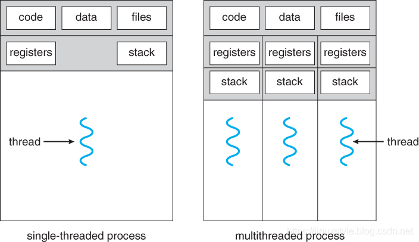
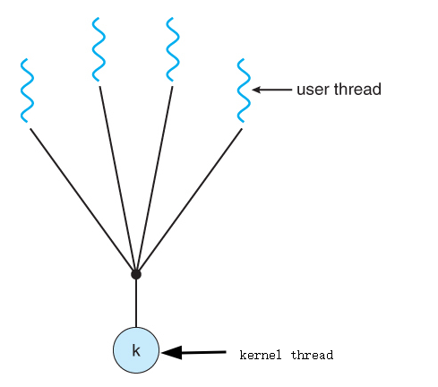
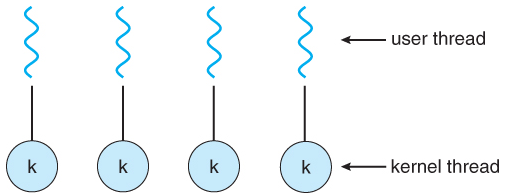
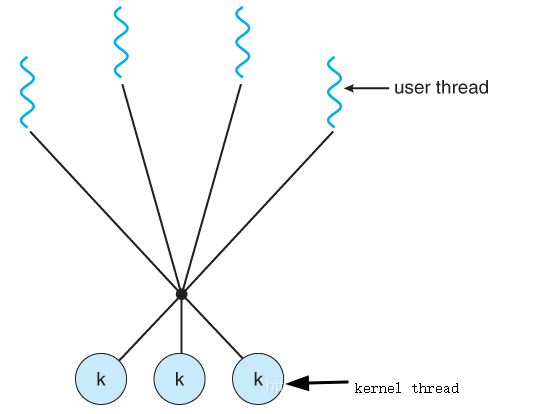
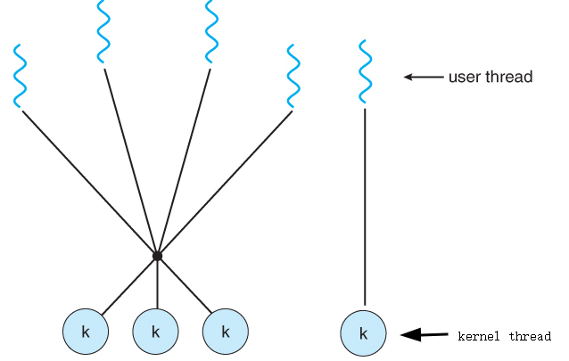
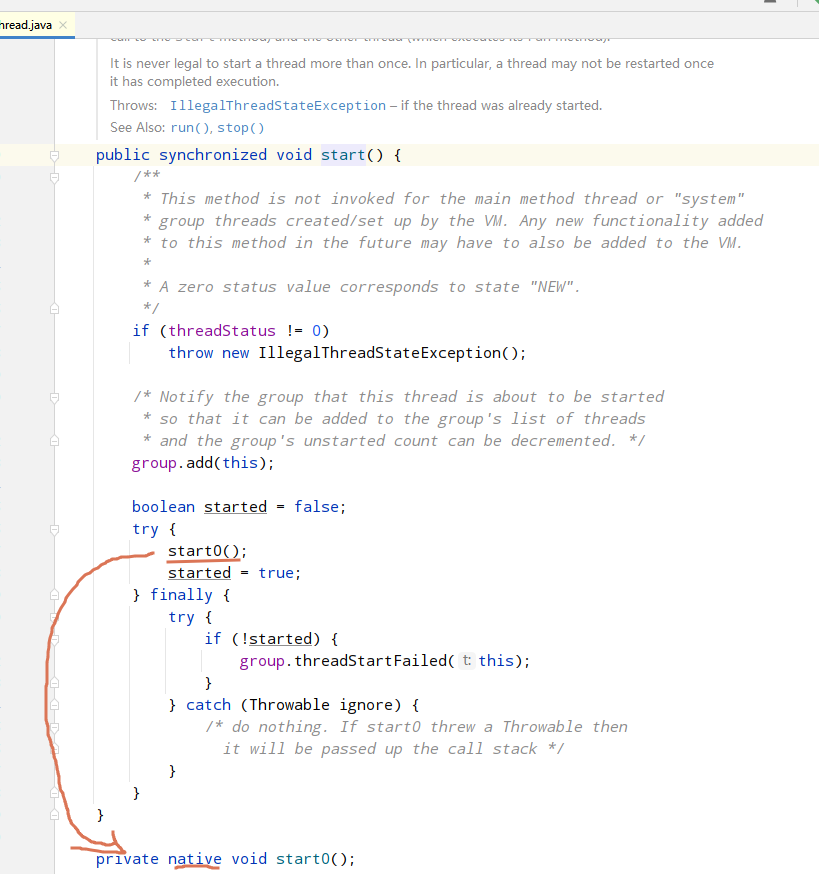
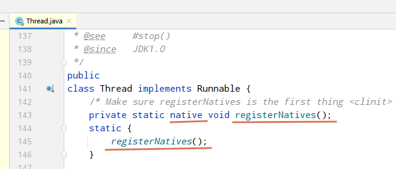
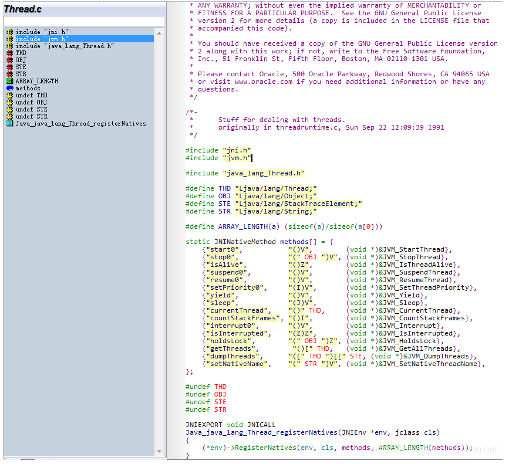
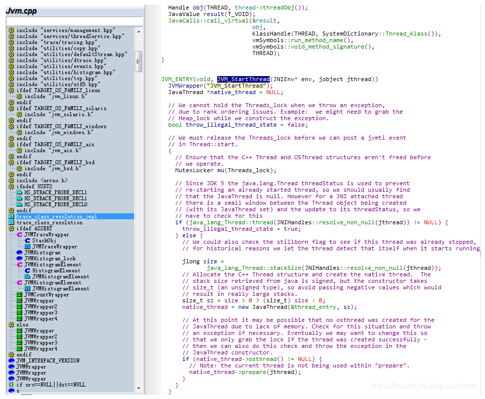
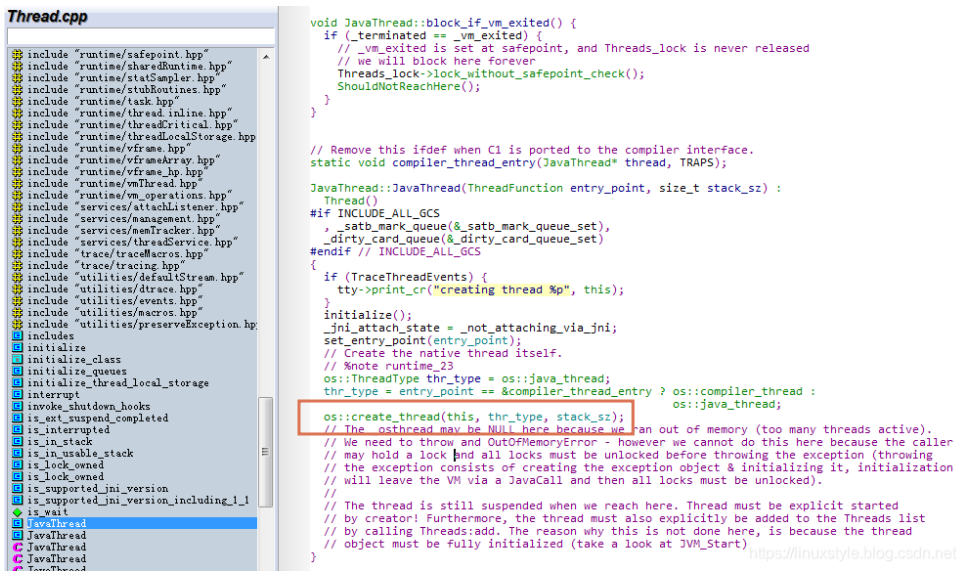

# 深入理解线程原理

​    一个`线程`是CPU利用率的基本单元，包括一个`程序计数器`，堆栈，一组寄存器和线程ID。

​    传统（重量级）进程只有单个控制的主线程，有一个程序计数器，以及可在任何给定时间执行的一系列指令。

​    多线程应用程序单个进程中具有多个线程，每个线程都有自己的程序计数器，堆栈和寄存器集，但共享公共代码，数据和某些结构（如打开文件）。

参考书籍[《操作系统概念，第9版》](https://www.cs.uic.edu/~jbell/CourseNotes/OperatingSystems/4_Threads.html)



​    单线程进程只能在一个CPU上运行，无论有多少可用，而多线程应用程序的执行可能在可用处理器之间分配。（请注意，当有多个进程争用CPU时，即当负载平均值高于某个特定阈值时，单线程进程仍然可以从多处理器体系结构中受益。）

计算机体系结构的最新趋势是在单个芯片上生产具有多个***核心***或CPU的芯片。

在传统的单核芯片上运行的多线程应用程序必须交错线程，在多核芯片上，线程可以分布在可用内核上，从而实现真正的并行处理。


对于操作系统，多核芯片需要新的调度算法以更好地利用可用的多个核。


## 多线程模型

在现代系统中有两种类型的线程需要管理：用户线程和内核线程。

用户线程由内核支持，而不需要内核管理。这些是应用程序员将在其程序中添加的线程。

内核线程由操作系统本身支持和管理。所有现代操作系统都支持内核级线程，允许内核同时执行多个同时任务或服务多个内核系统调用。

在特定实现中，必须使用以下策略之一将用户线程映射到内核线程。

### 多对一模型

在多对一模型中，许多用户级线程都映射到单个内核线程。

线程管理由用户空间中的线程库处理，这非常有效，但是，如果进行了阻塞系统调用，那么即使其他用户线程能够继续，整个进程也会阻塞。由于单个内核线程只能在单个CPU上运行，因此多对一模型不允许在多个CPU之间拆分单个进程。

Solaris和GNU可移植线程的绿色线程在`过去实现了`多对一模型，但`现在很少有系统继续这样做`。



### 一对一模型

一对一模型创建一个单独的内核线程来处理每个用户线程。

一对一模型克服了上面列出的问题，涉及阻止系统调用和跨多个CPU分离进程，但是，管理一对一模型的开销更大，涉及更多开销和减慢系统速度。

此模型的大多数实现都限制了可以创建的线程数，Windows(从Win95开始)和Linux都实现了线程的一对一模型。



### 多对多模型

多对多模型将任意数量的用户线程复用到相同或更少数量的内核线程上，结合了一对一和多对一模型的最佳特性。

用户对创建的线程数没有限制，阻止内核系统调用不会阻止整个进程，进程可以分布在多个处理器上。

可以为各个进程分配可变数量的内核线程，具体取决于存在的CPU数量和其他因素。



多对多模型的一个流行变体是双层模型，它允许多对多或一对一操作。IRIX，HP-UX和Tru64 UNIX使用双层模型，Solaris 9之前的Solaris也是如此。



## 线程库

线程库为程序员提供了用于创建和管理线程的API。

线程库可以在用户空间或内核空间中实现。前者涉及仅在用户空间内实现的API函数，没有内核支持。后者涉及系统调用，并且需要具有线程库支持的内核。

**三个主要的线程库：**

1. **POSIX Pthreads** - 可以作为用户或内核库提供，作为POSIX标准的扩展。
2. **Win32线程** - 在Windows系统上作为内核级库提供。
3. **Java线程** - 由于Java通常在Java虚拟机上运行，因此线程的实现基于JVM运行的任何操作系统和硬件，即`Pthreads`或`Win32`线程，具体取决于系统。

**请注意**，JVM在本机操作系统之上运行，并且`JVM规范`未指定用于将Java线程映射到内核线程的模型。此决定取决于JVM实现，可能是**一对一**，**多对多**或**多对一**..（在UNIX系统上，JVM通常使用PThreads，而在Windows系统上，它通常使用Windows线程。）

## 线程池

每次需要创建新线程然后在完成时删除它可能效率低下，并且还可能导致创建非常大（无限）的线程数。

另一种解决方案是在进程首次启动时创建多个线程，并将这些线程放入线程池中。根据需要从池中分配线程，并在不再需要时返回池。如果池中没有可用的线程，则该进程可能必须等到一个可用。

线程池中可用的（最大）线程数可以由可调参数确定，可能动态地响应于改变的系统负载。

Win32通过“PoolFunction”函数提供线程池。Java还通过java.util.concurrent包为线程池提供支持，Apple支持Grand Central Dispatch架构下的线程池。

## 信号处理

问：当多线程进程收到信号时，该信号应传递到哪个线程？
答：有四个主要选择：
将信号传递给信号所适用的线程。
将信号传递给过程中的每个线程。
将信号传递给过程中的某些线程。
分配特定线程以接收进程中的所有信号。
最佳选择可能取决于涉及哪个特定信号。

UNIX允许各个线程指示它们接受哪些信号以及它们忽略哪些信号。但是，信号只能传递给一个线程，这通常是接受该特定信号的第一个线程。
UNIX提供了两个独立的系统调用：kill（pid，signal）和pthread_kill（tid，signal），分别用于向进程或特定线程传递信号。
Windows不支持信号，但可以使用异步过程调用（APC）模拟它们。APC被传递到特定线程，而不是进程。

## 线程取消

不再需要的线程可能会被另一个线程以两种方式之一取消：
异步取消立即取消线程。
延迟取消设置一个标志，指示线程在方便时应自行取消。然后由取消的线程定期检查此标志，并在看到标志设置时很好地退出。
异步取消（共享）资源分配和线程间数据传输可能会有问题。

## 线程局部存储

大多数数据在线程之间共享，这是首先使用线程的主要好处之一。
但是，有时线程也需要特定于线程的数据。
大多数主要线程库（pThreads，Win32，Java）都支持特定于线程的数据，称为线程本地存储或TLS。请注意，这更像是静态数据而不是局部变量，因为它在函数结束时不会停止存在。

## JDK8看线程

通过new java.lang.Thread.start()来启动一个线程，只需要将业务逻辑放在run()方法里即可，启动一个Java线程，调用`start()`方法：



在启动一个线程时会调用`start0()`这个native方法，关于本地方法的注册请参照[【JVM源码探秘】深入registerNatives()底层实现](https://hunterzhao.io/post/2018/04/06/hotspot-explore-register-natives/)

在Java的系统包下如：

java.lang.System

java.lang.Object

java.lang.Class

都有一个静态块用来执行一个叫做`registerNatives()`的native方法：



\openjdk-8u40-src-b25-10_feb_2015\openjdk\jdk\src\share\native\java\lang\Thread.c 

start0对应`JVM_StartThread`



VM_StartThread方法位于`\openjdk-8u40-src-b25-10_feb_2015\openjdk\hotspot\src\share\vm\prims\jvm.cpp` 



//分配C ++ Thread结构并创建本机线程。该
//从java检索的堆栈大小已签名，但构造函数需要
// size_t（无符号类型），因此请避免传递负值
//导致非常大的堆栈。

代码native_thread = new JavaThread(&thread_entry, sz);用于创建JavaThread实例，位于

\openjdk-8u40-src-b25-10_feb_2015\openjdk\hotspot\src\share\vm\runtime\thread.cpp


//这里的_osthread可能为NULL，因为我们的内存不足（活动的线程太多）。
   //我们需要抛出OutOfMemoryError  - 但是我们不能这样做，因为调用者
   //可能会持有一个锁，并且在抛出异常之前必须解锁所有锁（抛出
   //异常包括创建异常对象并初始化它，初始化
   //将通过JavaCall离开VM，然后必须解锁所有锁。
   //当我们到达这里时，线程仍然被暂停 线程必须显式启动
   //由创作者！ 此外，线程还必须显式添加到“线程”列表中
   //通过调用Threads：add。 之所以没有这样做，是因为线程
   //对象必须完全初始化（看看JVM_Start） 

通过OS创建线程，位于\openjdk-8u40-src-b25-10_feb_2015\openjdk\hotspot\src\os\linux\vm\os_linux.cpp

```c++
bool os::create_thread(Thread* thread, ThreadType thr_type, size_t stack_size) {
  assert(thread->osthread() == NULL, "caller responsible");
 
  // Allocate the OSThread object
  OSThread* osthread = new OSThread(NULL, NULL);
  if (osthread == NULL) {
    return false;
  }
 
  // set the correct thread state
  osthread->set_thread_type(thr_type);
 
  // Initial state is ALLOCATED but not INITIALIZED
  osthread->set_state(ALLOCATED);
 
  thread->set_osthread(osthread);
 
  // init thread attributes
  pthread_attr_t attr;
  pthread_attr_init(&attr);
  pthread_attr_setdetachstate(&attr, PTHREAD_CREATE_DETACHED);
 
  // stack size
  if (os::Linux::supports_variable_stack_size()) {
    // calculate stack size if it's not specified by caller
    if (stack_size == 0) {
      stack_size = os::Linux::default_stack_size(thr_type);
 
      switch (thr_type) {
      case os::java_thread:
        // Java threads use ThreadStackSize which default value can be
        // changed with the flag -Xss
        assert (JavaThread::stack_size_at_create() > 0, "this should be set");
        stack_size = JavaThread::stack_size_at_create();
        break;
      case os::compiler_thread:
        if (CompilerThreadStackSize > 0) {
          stack_size = (size_t)(CompilerThreadStackSize * K);
          break;
        } // else fall through:
          // use VMThreadStackSize if CompilerThreadStackSize is not defined
      case os::vm_thread:
      case os::pgc_thread:
      case os::cgc_thread:
      case os::watcher_thread:
        if (VMThreadStackSize > 0) stack_size = (size_t)(VMThreadStackSize * K);
        break;
      }
    }
 
    stack_size = MAX2(stack_size, os::Linux::min_stack_allowed);
    pthread_attr_setstacksize(&attr, stack_size);
  } else {
    // let pthread_create() pick the default value.
  }
 
  // glibc guard page
  pthread_attr_setguardsize(&attr, os::Linux::default_guard_size(thr_type));
 
  ThreadState state;
 
  {
    // Serialize thread creation if we are running with fixed stack LinuxThreads
    bool lock = os::Linux::is_LinuxThreads() && !os::Linux::is_floating_stack();
    if (lock) {
      os::Linux::createThread_lock()->lock_without_safepoint_check();
    }
 
    pthread_t tid;
    int ret = pthread_create(&tid, &attr, (void* (*)(void*)) java_start, thread);
 
    pthread_attr_destroy(&attr);
 
    if (ret != 0) {
      if (PrintMiscellaneous && (Verbose || WizardMode)) {
        perror("pthread_create()");
      }
      // Need to clean up stuff we've allocated so far
      thread->set_osthread(NULL);
      delete osthread;
      if (lock) os::Linux::createThread_lock()->unlock();
      return false;
    }
 
    // Store pthread info into the OSThread
    osthread->set_pthread_id(tid);
 
    // Wait until child thread is either initialized or aborted
    {
      Monitor* sync_with_child = osthread->startThread_lock();
      MutexLockerEx ml(sync_with_child, Mutex::_no_safepoint_check_flag);
      while ((state = osthread->get_state()) == ALLOCATED) {
        sync_with_child->wait(Mutex::_no_safepoint_check_flag);
      }
    }
 
    if (lock) {
      os::Linux::createThread_lock()->unlock();
    }
  }
 
  // Aborted due to thread limit being reached
  if (state == ZOMBIE) {
      thread->set_osthread(NULL);
      delete osthread;
      return false;
  }
 
  // The thread is returned suspended (in state INITIALIZED),
  // and is started higher up in the call chain
  assert(state == INITIALIZED, "race condition");
  return true;
}
```

主要是

// 调用系统库创建线程，thread_native_entry为本地Java线程执行入口

// int ret = [pthread_create](https://baike.baidu.com/item/pthread_create/5139072?fr=aladdin)(&tid, &attr, (void* (*)(void*)) thread_native_entry, thread);

这个方法是C++创建线程的库方法，通过调用这个方法，会创建一个C++ 线程并使线程进入就绪状态，即可以开始运行

**扩展阅读：**

[Pthread：POSIX 多线程程序设计](https://www.cnblogs.com/mywolrd/archive/2009/02/05/1930707.html)
[pthread_attr_setdetachstate](https://blog.csdn.net/21aspnet/article/details/89061134)
[pthread_attr_setdetachstate](https://blog.csdn.net/u010144805/article/details/79449672)
[pthread_attr_setdetachstate](https://blog.csdn.net/wushuomin/article/details/80051295)


