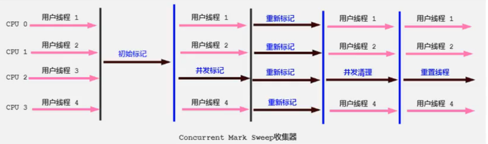
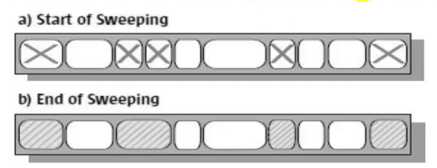

# CMS 回收器：递延迟

## 概述

- 在JDK1.5时期， Hotspot推出了一款在强交互应用中，乎可认为有划时代意义的垃圾收集器:CMS( Concurrent-Mark-Sweep)收集器，这款收集器是 Hotspot虚拟机中**第一款真正意义上的并发收集器**，它第一次实现了让垃圾收集线程与用户线程同时工作。
- CMS收集器的关注点是尽可能缩短垃圾收集时用户线程的停顿时间。停顿时间越短(低延迟)就越适合与用户交互的程序，良好的响应速度能提升用户体验。
  - 目前很大一部分的Java应用集中在互联网站或者B/S系统的服务端上，这类应用尤其重视服务的响应速度，希望系统停顿时间最短，以给用户带来较好的体验。CMS收集器就非常符合这类应用的需求。
- CMS的垃圾收集算法采用**标记-清除算法**，并且也会"stop-the- world"

不幸的是，CMS作为老年代的收集器， 却无法与JDK1.4.0中已经存在的新生代收集器Parallel Scavenge配合工作，所以在JDK1.5中使用CMS来收集老年代的时候，新生代只能选择 ParNew或者 Serrial收集器中的一个。

在G1出现之前，CMS使用还是非常广泛的。一直到今天，仍然有很多系统使用 CMS GC 。

## 工作原理

CMS整个过程比之前的收集器要复杂，整个过程分为4个主要阶段，即初始标记阶段、并发标记阶段、重新标记阶段和并发清除阶段。

- 初始标记( Initial-Mark)阶段:在这个阶段中，程序中所有的工作线程都将会因为stop-the-world”机制而出现短暂的暂停，这个阶段的主要任务**仅仅只是标记出GC Roots能直接关联到的对象**。一旦标记完成之后就会恢复之前被暂停的所有应用线程。由于直接关联对象比较小，所以这里的b。
- 并发标记( Concurrent-Mark)阶段:从 GC Roots的**直接关联对象开始遍历整个对象图的过程**，这个过程**耗时较长**但是**不需要停顿用户线程**，可以与垃圾收集线程一起并发运行。
- 重新标记( Remark)阶段：由于在并发标记阶段中，程序的工作线程会和垃圾收集线程同时运行或者交叉运行，因此为了修正并发标记期间，因用户程序继续运作而导致标记产生变动的那一部分对象的标记记剥，这个阶段的停顿时间通常会比初始标记阶段稍长一些，但也远比并发标记阶段的时间短。
- 并发清除( Concurrent- Sweep)阶段：此阶段清理删除掉标记阶段判断的已经死亡的对象，释放内存空间。由于不需要移动存活对象，所以这个阶段也是可以与用户线程同时并发的 

尽管CMS收集器采用的是并发回收(非独占式)，但是在其初始化标记和再次标记这两个阶段中仍然需要执行“stop-the-world”机制暂停程序中的工作线程，不过暂停时间并不会太长，因此可以说明目前所有的垃圾收集器都做不到完全不需要“stop-the-world”，只是尽可能地缩短暂停时间。

由于最耗费时间的并发标记与并发清除阶段都不需要暂停工作，所以整体的回收是低停顿的。

另外，由于在垃圾收集阶段用户线程没有中断，所以在CMS回收过程中，还应该确保应用程序用户线程有足够的内存可用。因此，cMs收集器不能像其他收集器那样等到老年代几乎完全被填满了再进行收集，而是当堆内存使用率达到某一阈值时，便开始进行回收，以确保应用程序在CMS工作过程中依然有足够的空间支持应用程序运行。要是CMS运行期间预留的内存无法满足程序需要，就会出现一次“Concurrent Mode Failure”失败，这时虚拟机将启动后备预案:临时启用 Serial Old收集器来重新进行老年代的垃圾收集，这样停顿时间就很长了。

CMS收集器的垃圾收集算法采用的是标记清除算法，这意味着每次执行完内存回收后，由于被执行内存回收的无用对象所占用的内存空间极有可能是不连续的一些内存块，不可避免地将会产生一些内存碎片。那么CMS在为新对象分配内存空间时，将无法使用指针碰撞( Bump the Pointer)技术，而只能够选择空闲列表(Free list)执行内存分配。

## 优缺点分析

- CMS的优点
  - 并发收集
  - 低延迟
- CMS的弊端：
  1. **会产生内存碎片**，导致并发清除后，用户线程可用的空间不足。在无法分配大对象的情况下，不得不提前触发Full GC。
  2. **CMS收集器对CPU资源非常敏感**。在并发阶段，它虽然不会导致用户停顿，但是会因为占用了一部分线程而导致应用程序变慢，总吞吐量会降低。
  3. **CMS收集器无法处理浮动垃圾**。可能出现“ Concurrent Mode Failure"失败而导致另一次 Full GC的产生。在并发标记阶段由于程序的工作线程和垃圾收集线程是同时运行或者交叉运行的，那么在并发标记阶段如果产生新的垃圾对象，CMS将无法对这些垃圾对象进行标记，最终会导致这些新产生的垃圾对象没有被及时回收，从而只能在下一次执行GC时释放这些之前未被回收的内存空间。

## 参数配置

- -XX:+UseConcMarkSweepGC手动指定使用cMs收集器执行内存回收任务。
  - 开启该参数后会自动将-XX:+UseParNewGC打开。即: ParNew(Young区用)+CMS(old区用)+ Serial Old的组合。
- -XX:+CMSlnitiatingOccupanyFraction 设置堆内存使用率的阈值，旦达到该阈值，便开始进行回收。
  - JDK5及以前版本的默认值为68，即当老年代的空间使用率达到68%时，会执行次CMS回收。JDK6及以上版本默认值为92%.
  - 如果内存增长缓慢，则可以设置一个稍大的值，大的阈值可以有效降低CMS的触发频率，减少老年代回收的次数可以较为明显地改善应用程序性能。反之，如果应用程序内存使用率增长很快，则应该降低这个阈值，以避免频繁触发老年代串行收集器。因此通过该选项便可以有效降低Full GC的执行次数。

- -XX:+UseCMSCompactAtFullCollection 用于指定在执行完Full GC后对内存空间进行压缩整理，以此避免内存碎片的产生。不过由于内存压缩整理过程无法并发执行，所带来的问题就是停顿时间变得更长了。
- -XX:+CMSFullGCsBeforeCompaction 设置在执行多少次Full GC后对内存空间进行压缩整理。
- -XX:+ParallelCMSThreads 设置CMS的线程数量。
  - CMS默认启动的线程数是(ParallelGCThreads + 3 ) / 4，ParallelGCThreads是年轻代并行收集器的线程数。当CPU资源比较紧张时，受到CMS收集器线程的影响，应用程序的性能在垃圾回收阶段可能会非常糟糕

## 小结

Hotspot有这么多的垃圾回收器，那么如果有人问，SerialGC、Parallel GC、 Concurrent Mark Sweep GC这三个GC有什么不同呢？

请记住以下口令：

- 如果你想要最小化地使用内存和并行开销，请选 Serial GC + Serial Old;
- 如果你想要最大化应用程序的吞吐量，请选Parallel GC + Parrallel Old;
- 如果你想要最小化GC的中断或停顿时间，请选 CMS GC + ParNew GC。

## JDK后续版本中CMS的变化

- JDK9新特性：CMS被标记为 Deprecate了（JEP291）
  - 如果对JDK9及以上版本的 Hotspot虚拟机使用参数-UseConcMarkSweepGC，来开启CMS收集器的话，用户会收到一个警告信息，提示CMS未来将会被废弃。
- JDK14新特性：删除CMS垃圾回收器(JEP363)
  - 移除了CMS垃圾收集器，如果在JDK14中使用-XX:+UseConcMarkSweepGC的话，JVM不会报错，只是给出一个Warning信息，但是不会exit。JVM会自动回退以默认GC方式启动JVM。

`OpenJDK 64-Bit Server VM warning: Ignoring option UseConcMarkSweepGC;support was removed in 14.0 and the VM will continue execution using the default collector.`

 