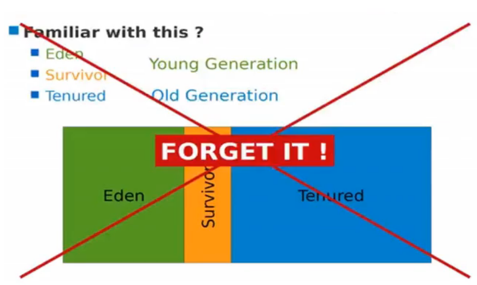
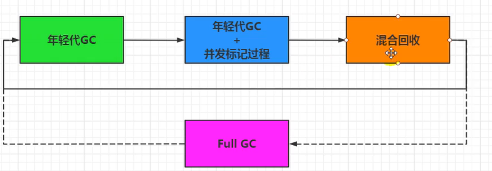
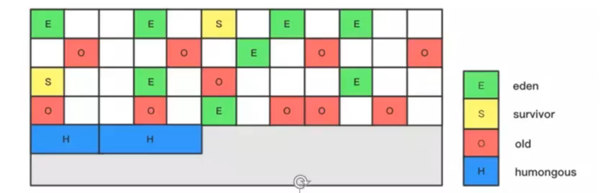
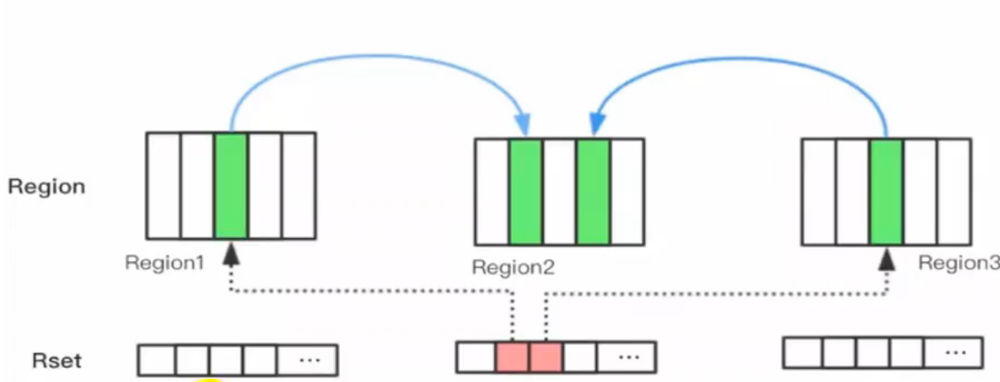
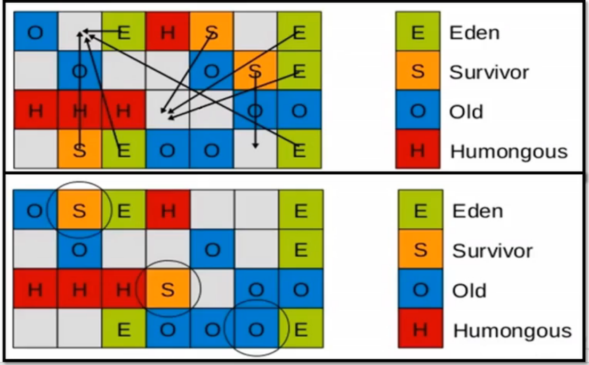
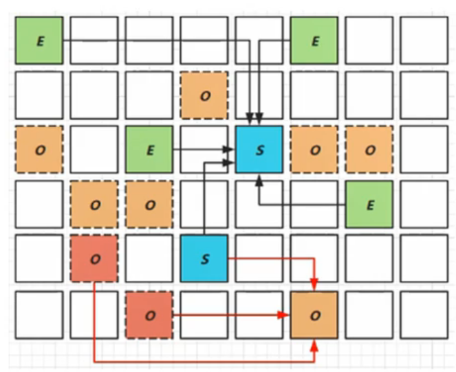

# G1回收器：区域化分代式

## 概述

**既然我们已经有了前面几个强大的GC，为什么还要发布 Garbage First(G1)GC?**

原因就在于应用程序所应对的**业务越来越庞大、复杂，用户越来越多**，没有GC就不能保证应用程序正常进行，而经常造成STW的GC又跟不上实际的需求，所以才会不断地尝试对GC进行优化。G1( Garbage- First)垃圾回收器是在Java7 update 4之后引入的一个新的垃圾回收器，是，今收集器技术发展的最前沿成果之一。

与此同时，为了适应**现在不断扩大的内存和不断增加的处理器数量**，进一步降低暂停时间( pause time)，同时兼顾良好的吞吐量。

**官方给G1设定的目标是在延迟可控的情况下获得尽可能高的吞吐量，所以才担，起“全功能收集器”的重任与期望。**

**为什么名字叫做Garbage First(G1)呢？**

- 因为G1是一个并行回收器，它把堆内存分割为很多不相关的区域( Region)(物理上不连续的)。使用不同的 Region来表示Eden、幸存者0区，幸存者1区，老年代等。
- G1 GC有计划地避免在整个Java堆中进行全区域的垃圾收集。G1跟踪各个 Region里面的垃圾堆积的价值大小(回收所获得的空间大小以及回收所需时间的经验值)，在后台维护一个优先列表，**每次根据允许的收集时间，优先回收价值最大的 Region。**
- 由于这种方式的侧重点在于回收垃圾最大量的区间(Region)，所以我们给G1一个名字：垃圾优先(Garbage First)

G1( Garbage-First)是一款面向服务端应用的垃圾收集器，**主要针对配备多核CPU及大容量内存的机器**，以极高概率满足GC停顿时间的同时，还兼具高吞吐量的性能特征。

在JDK1.7版本正式启用，移除了 Experimenta1的标识，**是JDK9以后的默认垃圾回收器**，取代了CMS回收器以及Parallel + Parallel Old组合。被Orac1e官方称为“**全功能的垃圾收集器**”。

与此同时，CMS已经在JDK9中被标记为废弃( deprecated)。在jdk8中还不是默认的垃圾回收器，需要使用-XX：+UseG1GC来启用。

## G1回收器的特点（优势）

与其他GC收集器相比，G1使用了全新的分区算法，其特点如下所示：

- **并行与并发**

  - 并行性：G1在回收期间，可以有多个GC线程同时工作，有效利用多核计算能力。此时用户线程STW。
  - 并发性：G1拥有与应用程序交替执行的能力，部分工作可以和应用程序同时执行，因此，一般来说，不会在整个回收阶段发生完全阻塞应用程序的情况。

- **分代收集**

  - 从分代上看，**G1依然属于分代型垃圾回收**器，它会区分年轻代和老年代，年轻代依然有Eden区和 Survivor区。但从堆的结构上看，它不要求整个Eden区、年轻代或者老年代都是连续的，也不再坚持固定大小和固定数量。

  - 将**堆空间分为若干个区域( Region)，这些区域中包含了逻辑上的年轻代和老年代**。

  - 和之前的各类回收器不同，它同时**兼顾年轻代和老年代**。对比其他回收器，或者工作在年轻代，或者工作在老年代。

    

    通过region分布，各区域不连续：

    

- **空间整合**

  - CMS“标记-清除”算法、内存碎片、若干次GC后进行一次碎片整理
  - G1将内存划分为一个个的 region。内存的回收是以 region作为基本单位的。**Region之间是复制算法**，但整体上实际可看作是**标记-压缩(Mark- Compact)算法**，两种算法都可以避免内存碎片。这种特性有利于程序长时间运行，分配大对象时不会因为无法找到连续内存空间而提前触发下一次GC。尤其是，Java堆非常大的时候，G1的优势更加明显。

- **可预测的停顿时间模型**（即：软实时soft real-time）

  这是G1相对于CMS的另一大优势，G1除了追求低停顿外，还能建立可预测的停顿时间模型，能让使用者明确指定在一个长度为M毫秒的时间片段内，消耗在垃圾收集上的时间不得超过N毫秒。

  - 由于分区的原因，G1可以只选取部分区域进行内存回收，这样缩小了回收的范围，因此对于全局停顿情况的发生也能得到较好的控制。
  - G1跟踪各个 Region里面的垃圾堆积的价值大小(回收所获得的空间大小以及回收所需时间的经验值)，在后台维护一个优先列表，**每次根据允许的收集时间，优先回收价值最大的 Region**。保证了G1收集器在有限的时间内可以**获取尽可能高的收集效率。**
  - 相比于 CMS GO，G1未必能做到cMs在最好情况下的延时停顿，但是最差情况要好很多

## G1回收器的缺点

相较于CMS，G1还不具备全方位、压倒性优势。比如在用户程序运行过程中，G1无论是为了垃圾收集产生的内存占用( Footprint)还是程序运行时的额外执行负载( Overload)都要比CMS要高。

从经验上来说，在小内存应用上CMS的表现大概率会优于G1，而G1在大内存应用上则发挥其优势。平衡点在6-8GB之间。

## 参数设置

- -XX：+UseG1GC 手动指定使用G1收集器执行内存回收任务。
- -XX：G1HeapRegionSize 设置每个 Region的大小。值是2的幂，范围是1MB到32MB之间，目标是根据最小的Java堆大小划分出约2048个区域。默认是堆内存的1/2000。
- -XX：MaxGCPauseMillis 设置期望达到的最大GC停顿时间指标（JVM会尽力实现，但不保证达到)。默认值是200ms
- -XX：ParallelGCThread 设置STW时GC线程数的值。最多设置为8。
- -XX： ConcGCThreads设置并发标记的线程数。将n设置为并行垃圾回收线程数(ParallelGCThreads)的1/4左右。
- -XX： InitiatingHeapOccupancyPercent 设置触发并发Gc周期的Java堆占用率阈值。超过此值，就触发GC。默认值是45。

## G1回收器的常见操作步骤

G1的设计原则就是简化JW性能调优，开发人员只需要简单的三步即可完成调优：

第一步：开启G1垃圾收集器

第二步：设置堆的最大内存

第三步：设置最大的停顿时间

G1中提供了三种垃圾回收模式： Younggc、 Mixed GC和Full GC，在不同的条件下被触发。

## 适用场景

- 面向服务端应用，针对具有大内存、多处理器的机器。(在普通大小的堆里表现并不惊喜)
- 最主要的应用是需要低GC延迟，并具有大堆的应用程序提供解决方案
- 如：在堆大小约6GB或更大时，可预测的暂停时间可以低于0.5秒;(G1通过每次只清理一部分而不是全部的 Region的增量式清理来保证每次GC停顿时间不会过长)。
- 用来替换掉]DK1.5中的CMS收集器，在下面的情况时，使用G1可能比CMS好：
  - ① 超过58%的Java堆被活动数据占用;
  - ② 对象分配频率或年代提升频率变化很大;
  - ③ GC停顿时间过长(长于0.5至1秒)
- Hotspot垃圾收集器里，除了G1以外，其他的垃圾收集器使用内置的JVM线程执行GC的多线程操作，而G1 GC可以采用应用线程承担后台运行的GC工作，即，JVM的GC线程处理速度慢时，系统会调用应用程序线程帮助加速垃圾回收过程。

## region使用介绍

使用G1收集器时，它将整个Java堆划分成约2048个大小相同的独立 Region块，每个 Region块大小根据堆空间的实际大小而定，整体被控制在1MB到32MB之间，且为2的N次幂，即1MB，2MB，4MB，8MB，16MB，32MB。可以通过-XX：G1HeapRegionSize设定。**所有的 Region大小相同，且在JV生命周期内不会被改变**。

虽然还保留有新生代和老年代的概念，但新生代和老年代不再是物理隔离的了，它们都是一部分 Region(不需要连续)的集合。通过 Region的动态分配方式实现逻辑上的连续

- 一个 region有可能属于Eden， Survivor或者old/ Tenured内存区域。但是个 region只可能属于一个角色。图中的E表示该 region属于Eden内存区域，s表示属于 Survivor内存区域，O表示属于o1d内存区域。图中空白的表示未使用的内存空间。
- G1垃圾收集器还增加了一种新的内存区域，叫做 Humongous内存区域，如图中的H块。主要用于存储大对象，如果超过1.5个 region，就放到H。

设置H的原因：

对于堆中的大对象，默认直接会被分配到老年代，但是如果它是一个短期存在的大对象，就会对垃圾收集器造成负面影响。为了解决这个问题，G1划分了一个 Humongous区，它用来专门存放大对象。**如果一个H区装不下一个大对象，那么G1会寻找连续的H区来存储**。为了能找到连续的H区，有时候不得不启动Full GC。G1的大多数行为都把H区作为老年代的一部分来看待。

## G1垃圾回收过程

G1 GC的垃圾回收过程主要包括如下三个环节：

- 年轻代GC( Young GC)
- 老年代并发标记过程( Concurrent Marking)
- 混合回收( Mixed GC)
- (如果需要，单线程、独占式、高强度的Full GC还是继续存在的。它针对GC的评估失败提供了一种失败保护机制，即强力回收。)

顺时针，young gc -> young gc + concurrent mark -> Mixed GC顺序，进行垃圾回收。

应用程序分配内存，**当年轻代的Eden区用尽时开始年轻代回收过程**：G1的年轻代收集阶段是一个**并行**的**独占式**收集器。在年轻代回收期，G1 GC暂停所有应用程序线程，启动多线程执行年轻代回收。**然后从年轻代区间移动存活对象到 Survivor区间或者老年区间，也有可能是两个区间都会涉及**。

当堆内存使用达到一定值(默认45%)时，开始老年代并发标记过程。

标记完成马上开始混合回收过程。对于一个混合回收期，G1 GC从老年区间移动存活对象到空闲区间，这些空闲区间也就成为了老年代的一部分。和年轻代不同，老年代的G1回收器和其他GC不同，**G1的老年代回收器不需要整个老年代被回收，一次只需要扫描/回收小部分老年代的 Region就可以了**。同时，这个老年代 Region是和年轻代一起被回收的。

举个例子：一个Web服务器，Java进程最大堆内存为4G，每分钟响应1500个请求，每45秒钟会新分配大约2G的内存。G1会每45秒钟进行一次年轻代回收，每31个小时整个堆的使用率会达到45号，会开始老年代并发标记过程，标记完成后开始四到五次的混合回收。

### Rememberred Set

- 一个对象被不同区域引用的问题。

- 一个 Region不可能是孤立的，一个 Region中的对象可能被其他任意 Region中对象引用，判断对象存活时，是否需要扫描整个JAVA堆才能保证准确？

- 在其他的分代收集器，也存在这样的问题(而G1更突出)。

- 回收新生代也不得不同时扫描老年代。

- 这样的话会降低 Minor GC的效率

解决方法：

- 无论G1还是其他分代收集器，**JVM**都是使用 **Remembered Set**来避免全局扫描;

- **每个 Region都有一个对应的 Remembered set;**

- 每次 Reference类型数据写操作时，都会产生一个 **Write Barrie**r暂时中断操作;

- 然后检查将要写入的引用指向的对象是否和该 **Reference**类型数据在不同的 **Region**(其他收集器：检查老年代对象是否引用了新生代对象);

- 如果不同，通过 CardTable把相关引用信息记录到引用指向对象的所在 **Region**对应的**Remembered Set**中;

- 当进行垃圾收集时，在GC根节点的枚举范围加入 **Remembered set**，就可以保证不进行全局扫描，也不会有遗漏。

  

### 回收过程一：年轻代GC

 JVM启动时，G1先准备好Eden区，程序在运行过程中不断创建对象到Eden区，当Eden空间耗尽时，G1会启动一次年轻代垃圾回收过程。

**年轻代垃圾回收只会回收Eden区和 Survivor区。**

YGC时，首先G1停止应用程序的执行(Stop-The- World)，G1创建回收集(collection set)，回收集是指需要被回收的内存分段的集合，年轻代回收过程的回收集包含年轻代Eden区和 Survivor区所有的内存分段。

然后开始如下回收过程：

**第一阶段，扫描根。**

根是指 static变量指向的对象，正在执行的方法调用链条上的局部变量等。根引用连同Rset记录的外部引用作为扫描存活对象的入口.

**第二阶段，更新Rset。**

处理 dirty card queue(见备注)中的card，更新Rset。此阶段完成后，**Rset可以准确的反映老年代对所在的内存分段中对象的引用**。

> dirty card queue： 对于应用程序的引用赋值语句 object field=object，JVM会在之前和之后执行特殊的操作以在 dirty card queue中入队一个保存了对象引用信息的card.在年轻代回收的时候，G1会对 Dirty Card Queue中所有的ard进行处理，以更新Rset，保证RSe实时准确的反映引用关系。那为什么不在引用赋值语句处直接更新RSet呢?这是为了性能的需要，RSe的处理需要线程同步，开销会很大，使用队列性能会好很多。

**第三阶段，处理Rset。**

识别被老年代对象指向的Eden中的对象，这些被指向的Eden中的对象被认为是存活的对象。

**第四阶段，复制对象。**

此阶段，对象树被遍历，Eden区内存段中存活的对象会被复制到 Survivor区中空的内存分段Survivor区内存段中存活的对象如果年龄未达阈值，年龄会加1，达到阀值会被会被复制到old区中空的内存分段。如果 Survivor空间不够，Eden空间的部分数据会直接晋升到老年代空间。

**第五阶段，处理引用。**

处理Soft，Weak， Phantom，Final， JNI Weak等引用。最终Eden空间的数据为空，GC停止工作，而目标内存中的对象都是连续存储的，没有碎片，所以复制过程可以达到内存整理的效果，减少碎片。

### 回收过程二：并发标记过程

1.**初始标记阶段：**标记从根节点直接可达的对象。这个阶段是STw的，并且会触发一次年轻代GC。

2.**根区域扫描( Root Region Scanning)**：G1 GC扫描 Survivor区直接可达的老年代区域对象，并标记被引用的对象。这一过程必须在 young GC之前完成

3.并**发标记( Concurrent Marking)：**在整个堆中进行并发标记(和应用程序并发执行)，此过程可能被 young Gc中断。在并发标记阶段，若发现区域对象中的所有对象都是垃圾，那这个区域会被立即回收。同时，并发标记过程中，会计算每个区域的对象活性(区域中存活对象的比例)。

4.**再次标记( Remark)：**由于应用程序持续进行，需要修正上一次的标记结果。是sTw的。G1中采用了比CMs更快的初始快照算法： snapshot-at-the-beginning(SATB)。

5.**独占清理( cleanup，STw)：**计算各个区域的存活对象和Gc回收比例，并进行排序，识别可以混合回收的区域。为下阶段做铺垫。是STW的。

​	》这个阶段并不会实际上去做垃圾的收集

6.**并发清理阶段：**识别并清理完全空闲的区域。

### 回收过程三：混合回收

当越来越多的对象晋升到老年代old region时，为了避免堆内存被耗尽，虚拟机会触发一个混合的垃圾收集器，即 Mixed GC，该算法并不是一个old GC，除了回收整个 Young Region，还会回收一部分的Old region。这里需要注意：是一部分老年代，而不是全部老年代。可以选择哪些old Region进行收集，从而可以对垃圾回收的耗时时间进行控制。也要注意的是 Mixed GC并不是Full GC

- 并发标记结束以后，老年代中面分百为垃圾的内存分段被回收了，部分为垃圾的内存分段被计算了出来。默认情况下，这些老年代的内存分段会分8次(可以通过-XX:G1MixedGCCountTarget设置)被回收。
- 混合回收的回收集(Collection set)包括八分之一的老年代内存分段，Eden区内存分段， Survivor区内存分段。混合回收的算法和年轻代回收的算法完全一样，只是回收集多了老年代的内存分段。具体过程请参考上面的年轻代回收过程。
- 由于老年代中的内存分段默认分8次回收，G1会优先回收垃圾多的内存分段。垃圾占内存分段比例越高的，越会被先回收。并且有一个阈值会决定内存分段是否被回收，XX:G1MixedGCLiveThresholdPercent，默认为65%，意思是垃圾占内存分段比例要达到65%才会被回收。如果垃圾占比太低，意味着存活的对象占比高，在复制的时候会花费更多的时间。
- 混合回收并不一定要进行8次。有一个阈值-XX:g1HeapWastePercent，默认值为10%，意思是允许整个堆内存中有16%的空间被浪费，意味着如果发现可以回收的垃圾占堆内存的比例低于10%，则不再进行混合回收。因为GC会花费很多的时间但是回收到的内存却很少。

### 回收过程四：Full GC

G1的初衷就是要避免Full GC的出现。但是如果上述方式不能正常工作，G1会**停止应用程序的执**行(Stop-The-World)，使用单线程的内存回收算法进行垃圾回收，性能会非常差，应用程序停顿时间会很长。

要避免Full GC的发生，一旦发生需要进行调整。什么时候会发生Fu1GC呢?比如**堆内存太小**，当G1在复制存活对象的时候没有空的内存分段可用，则会回退到full GC，这种情况可以通过增大内存解决。

导致G1 Full GC的原因可能有两个:

1. Evacuation的时候没有足够的to- space来存放晋升的对象
2. 并发处理过程完成之前空间耗尽

### 补充

从 Oracle官方透露出来的信息可获知，回收阶段( Evacuation)其实本也有想过设计成与用户程序一起并发执行，但这件事情做起来比较复杂，考虑到G1只是回收一部分 Region，停顿时间是用户可控制的，所以并不迫切去实现，而**选择把这个特性放到了G1之后出现的低延迟垃圾收集器(即zGC)中**。另外，还考虑到G1不是仅仅面向低延迟，停顿用户线程能够最大幅度提高垃圾收集效率，为了保证吞吐量所以才选择了完全暂停用户线程的实现方案。

## G1优化建议

- 年轻代大小
  - 避免使用-Xm或-XX: Newratlo等相关选项显式设置年轻代大小。
  - 固定年轻代的大小会覆盖。
- 暂停时间目标暂停时间目标不要太过严苛
  - G1GC的吞吐量目标是98%的应用程序时间和10%的垃圾回收时间。
  - 评估G1 GC的吞吐量时，暂停时间目标不要太严苛。目标太过严苛表示你愿意承受更多的垃圾回收开销，而这些会直接影响到吞吐量。

