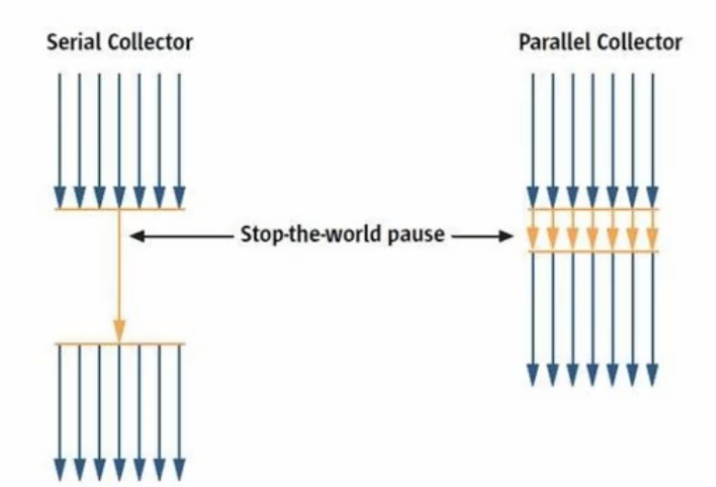
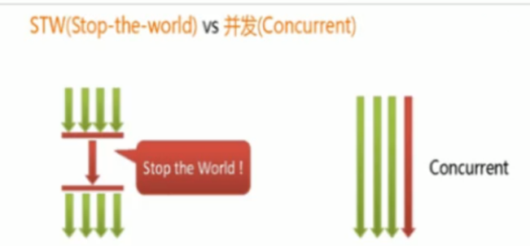
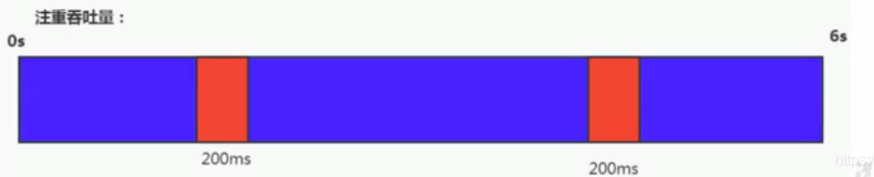
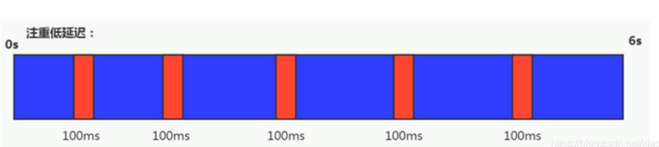

# 垃圾收集器

## GC分类与性能指标

### 1.概述

- 垃圾收集器没有在规范中进行过多的规定,可以由不同的厂商、不同版本的JVM来实现。
- 由于JDK的版本处于高速迭代过程中,因此Java发展至今已经衍生了众多的GC版本。
- 从不同角度分析垃圾收集器,可以将GC分为不同的类型。

### 2.垃圾回收器分类

- 按线程数分，可以分为串行垃圾回收器和并行垃圾回收器。

 

- 串行回收指的是在同一时间段内只允许有一个CPU用于执行垃圾回收操作,此时工作线程被暂停,直至垃圾收集工作结束。
  - 在诸如单CPU处理器或者较小的应用内存等硬件平台不是特别优越的场合,串行回收器的性能表现可以超过并行回收器和并发回收器。所以，串行回收默认被应用在客户端的Client模式下的JVM中。
  - 在并发能力比较强的CPU上,并行回收器产生的停顿时间要短于串行回收器。
  
- 和串行回收相反,并行收集可以运用多CPU同时执行垃圾回收,因此提升了应用的吞吐量,不过并行回收仍然与串行回收一样,采用独占式,使用了“Stop-the- world”机制。

- 按照工作模式分,可以分为**并发式垃圾回收器和独占式垃圾回收器**。

  - 并发式垃圾回收器与应用程序线程交替工作,以尽可能减少应用程序的停顿时间。

  - 独占式垃圾回收器( Stop the world)一旦运行,就停止应用程序中的所有用户线程,直到垃圾回收过程完全结束。

    

- 按**碎片处理方式**分,可分为压缩式垃圾回收器和非压缩式垃圾回收器。

  - 压缩式垃圾回收器会在回收完成后,对存活对象进行压缩整理,消除回收后的碎片再分配对象空间使用:指针碰撞
  - 非压缩式的垃圾回收器不进行这步操作。再分配对象空间使用:空闲列表

- 按工作的内存区间分,又可分为年轻代垃圾回收器和老年代垃圾回收器。

  

### 3.评估GC的性能指标

- 吞吐量:运行用户代码的时间占总运行时间的比例

  - (总运行时间:程序的运行时间+内存回收的时间)

- 垃圾收集开销:吞吐量的补数,垃圾收集所用时间与总运行时间的比例。

- 暂停时间:执行垃圾收集时,程序的工作线程被暂停的时间。

- 收集频率:相对于应用程序的执行,收集操作发生的频率。

- 内存占用:Java堆区所占的内存大小。

- 快速:一个对象从诞生到被回收所经历的时间。

- 这三者共同构成一个“不可能三角”。三者总体的表现会随着技术进步而越来越好。一款优秀的收集器通常最多同时满足其中的两项。

- 这三项里,暂停时间的重要性日益凸显。因为随着硬件发展,内存占用多些越来越能容忍,硬件性能的提升也有助于降低收集器运行时对应用程序的影响,即提高了吞吐量。而内存的扩大,对延迟反而带来负面效果。

- 简单来说,主要抓住两点吞吐量暂停时间

### 4.吞吐量 

- 吞吐量就是CPU用于运行用户代码的时间与CPU总消耗时间的比值,即 吞吐量 = 运行用户代码时间/(运行用户代码时间+垃圾收集时间)。
  - 比如:虚拟机总共运行了100分钟,其中垃圾收集花掉1分钟,那吞吐量就是99%。
- 这种情况下,应用程序能容忍较高的暂停时间,因此,高吞吐量的应用程序有更长的时间基准,快速响应是不必考虑的。
- 吞吐量优先，意味着在单位时间内，STW的时间最短：0.2 + 0.2 = 0.4

###  5.暂停时间

- “暂停时间”是指一个时间段内应用程序线程暂停,让GC线程执行的状态

  - 例如,Gc期间188毫秒的暂停时间意味着在这100毫秒期间内没有应用程序线程是活动的。

  - 暂停时间优先,意味着尽可能让单次STW的时间最短： 0.1+0.1+0.1+0.1+0.1=0.5

    

 6.吞吐量和暂停时间对比

- 高吞吐量较好因为这会让应用程序的最终用户感觉只有应用程序线程在做“生产性”工作。直觉上,吞吐量越高程序运行越快。
- 低暂停时间(低延迟)较好因为从最终用户的角度来看不管是GC还是其他原因导致一个应用被挂起始终是不好的。这取决于应用程序的类型,有时候甚至短暂的200毫秒暂停都可能打断终端用户体验。因此,具有低的较大暂停时间是非常重要的,特别是对于一个交互式应用程序
- 不幸的是”高吞吐量”和”低暂停时间”是一对相互竞争的目标(矛盾)
  - 因为如果选择以吞吐量优先,那么必然需要降低内存回收的执行频率,但是这样会导致GC需要更长的暂停时间来执行内存回收。
  - 相反的,如果选择以低延迟优先为原则,那么为了降低每次执行内存回收时的暂停时间,也只能频繁地执行内存回收,但这又引起了年轻代内存的缩减和导致程序吞吐量的下降。

​       在设计(或使用)GC算法时,我们必须确定我们的目标:一个GC算法只可能针对两个目标之一(即只专注于较大吞吐量或最小暂停时间),或尝试找到一个二者的折中。

​        现在标准：在最大吞吐量优先的情况下，降低停顿时间。