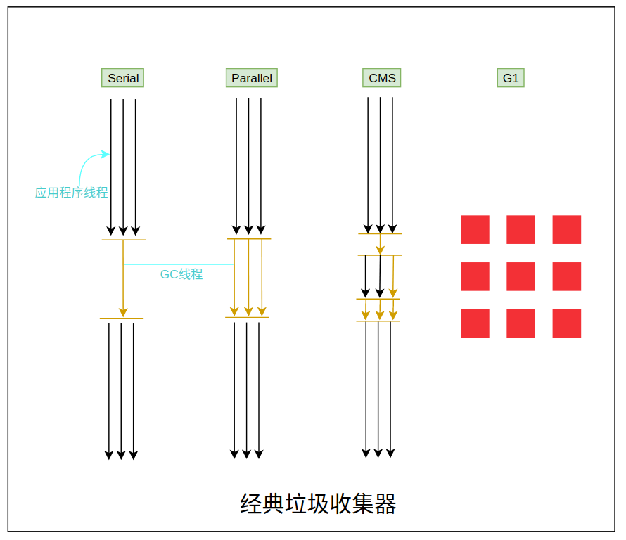
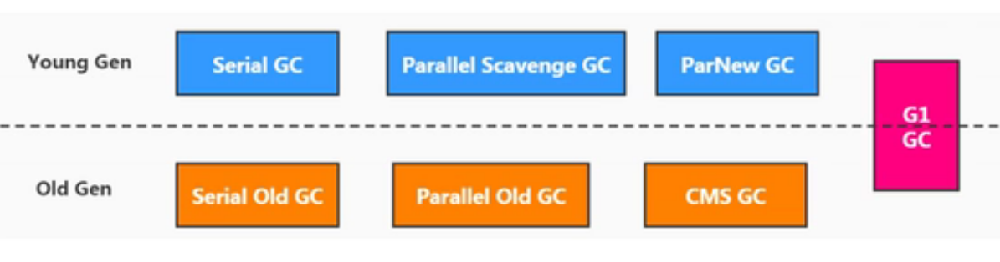
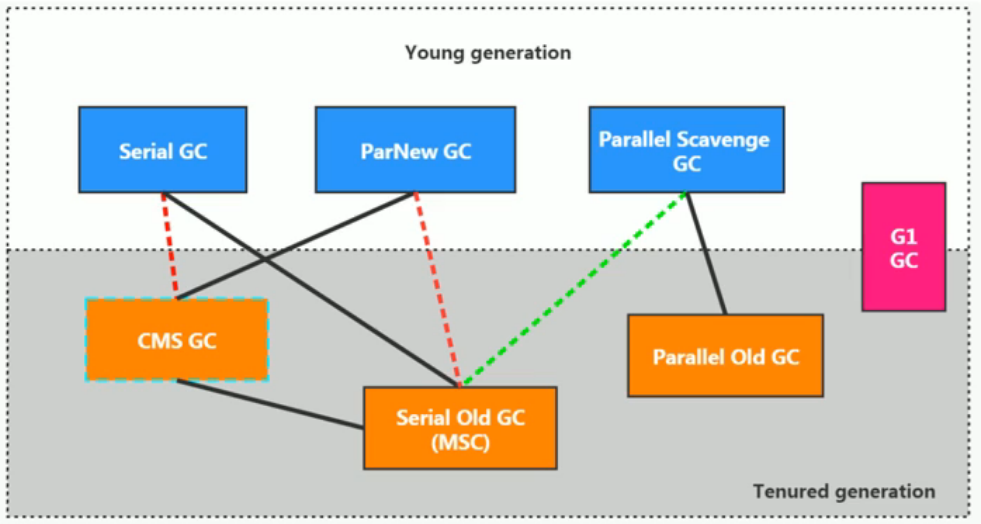

# 不同的垃圾回收器概述

​		垃圾收集机制是Java的招牌能力，极大地提高了开发效率。这当然也是面试的热点。		问：Java常见的垃圾收集器有哪些?

## 垃圾收集器发展史

有了虚拟机，就一定需要收集垃圾的机制，这就是 Garbage Collection，对应的产品我们称为 Garbage Collector。

- 1999年随JDK1.3.1一起来的是串行方式的 Serial GC，它是第一款GC。 ParNew垃圾收集器是 Serial收集器的多线程版本。
- 2002年2月26日，Parallel GC和 Concurrent Mark Sweep GC(CMS)跟随JDK1.4.2起发布Parallel GC在JDK6之后成为 Hotspot默认GC。
- 2012年，在JDK1.7u4版本中，G1可用。
- 2017年，JDK9中G1变成默认的垃圾收集器，以替代CMS。
- 2018年3月，JDK10中G1垃圾回收器的并行完整垃圾回收，实现并行性来改善最坏情况下的延迟。
- 2018年9月，JDK11发布。引入Epsilon垃圾回收器，又被称为"No-Op(无操作)回收器。同时，引入ZGC:可伸缩的低延迟垃圾回收器( Experimental)。
- 2019年3月，JDK12发布。增强G1，自动返回未用堆内存给操作系统。同时，引入Shenandoah GC:低停顿时间的GC( Experimental)。
- 2019年9月，JDK13发布。增强ZGC，自动返回未用堆内存给操作系统。
- 2020年3月，JDK14发布。删除CMS垃圾回收器。扩展ZGC在 macOS和 windows上的应用。

### 7款经典的垃圾收集器

- 串行回收器：Serial、Serial Old
- 并行回收器：ParNew、Parallel Scavenge、Parallel Old
- 并发回收器：CMS、G1

## 7款经典收集器与垃圾分代之间的关系

- 新生代收集器：Serial、ParNew、Parllel scavenge
- 老年代收集器：Serial Old、Parallel Old、CMS
- 整堆收集器：G1

### 垃圾收集器的组合关系

  

1. 两个收集器间有连线，表明他们可以搭配使用：

   Serial/Serial Old、Serial/CMS、ParNew/Serial Old、ParNew/CMS、Parallel Scavenge/Serial Old、Parallel Scavenge/Parallel Old、G1；

2. 其中Serial Old作为CMS出现“Concurrent Mode Failure”失败后的后备方案。

3. （红色虚线）由于维护和兼容性测试的成本，在JDK8时将Serial+CMS、ParNew+Serial Old这两个组合声明为废弃（JEP 173），并在JDK 9中完全取消了这些组合的支持（JEP214），即：移出。

4. （绿色虚线）JDK14中：弃用Parallel Scavenge和Serial Old GC组合（JEP366）

5. （青色虚线）JDK14中：删除CMS垃圾回收器（JEP363）

​     为什么要有很多收集器，一个不够吗?因为Java的使用场景很多，移动端，服务器等。所以就需要针对不同的场景，提供不同的垃圾收集器，提高垃圾收集的性能。

​     虽然我们会对各个收集器进行比较，但并非为了挑选一个最好的收集器出来。没有一种放之四海皆准、任何场景下都适用的完美收集器存在，更加没有万能的收集器。所以我们选择的只是对具体应用最合适的收集器

### 如何查看默认的垃圾收集器

- **-XX:+PrintCommandLineFlags** 查看命令行相关参数（包含使用的垃圾收集器）
- 使用命令行指令：**jinfo -flag 相关垃圾回收器参数  进程ID**
  - eg：jinfo -flag UseParallelGC 924    结果：-XX:+UseParallelGC
  - eg：jinfo -flag UseParallelOldGC 924 结果：-XX:+UseParallelOldGC
  - eg:  jinfo -flag UseG1GC 924  结果：-XX:+UseG1GC