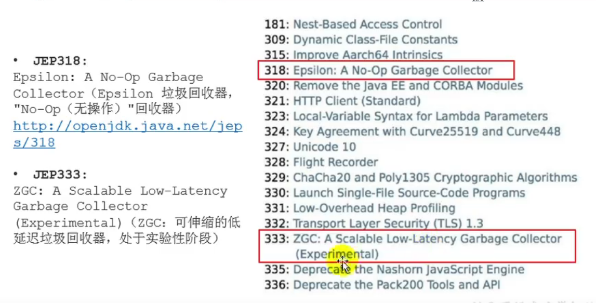
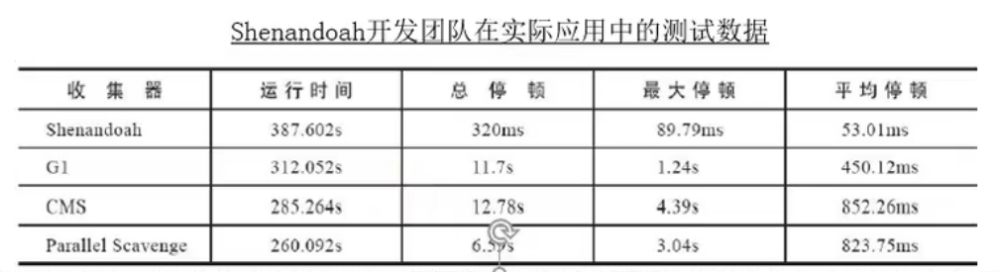
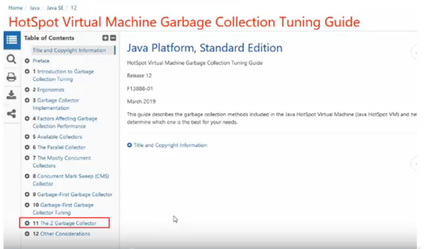
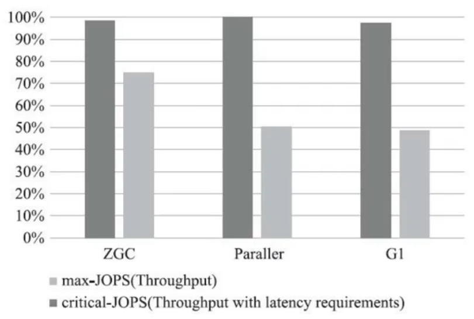
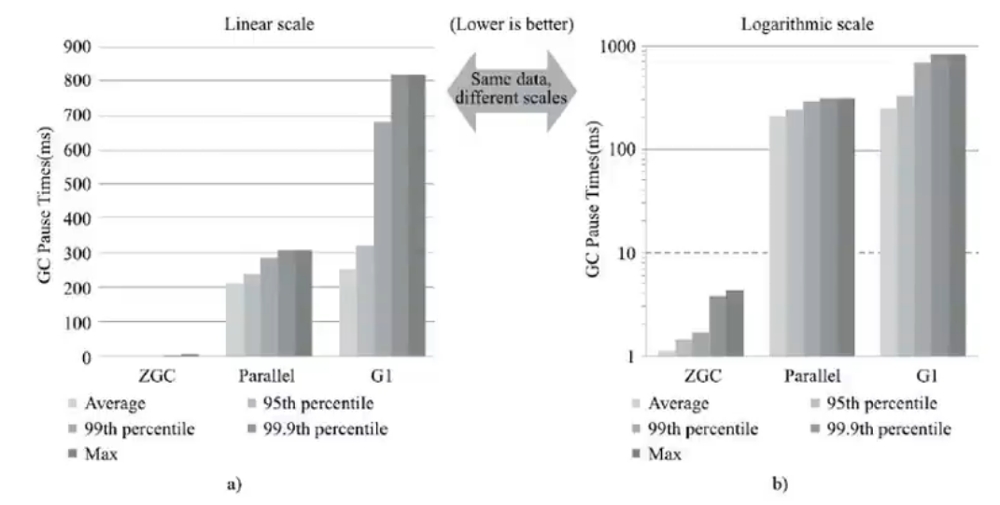
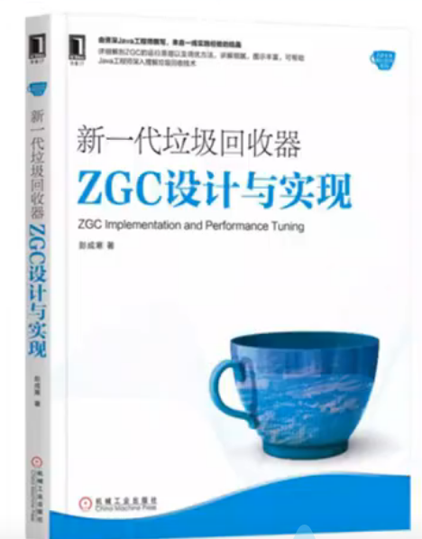

# GC的新发展

## 概述

GC仍然处于飞速发展之中，目前的默认选项G1 GC在不断的进行改进，很多我们原来认为的缺点，例如串行的Full GC、 Card Table扫描的低效等，都已经被大幅改进，例如，JDK10以后，Full GC已经是并行运行，在很多场景下，其表现还略优于Parallel GC的并行Full GC实现。

即使是 Serial GC，虽然比较古老，但是简单的设计和实现未必就是过时的，它本身的开销，不管是GC相关数据结构的开销，还是线程的开销，都是非常小的，所以随着云计算的兴起，**在 Serverless等新的应用场景下， Seria1Gc找到了新的舞台。**

比较不幸的是 CMS GC，因为其算法的理论缺陷的原因，虽然现在还有非常大的用户群体，但在JDK9中已经被标记为废弃，并在JDK14版本中移除。

## JDK11新特性

## Open JDK12的Shenandoah GC

- 现在G1回收器已经成为默认回收器好几年了。
- 我们还看到引入了两个新的收集器：ZGC（JDK11出现）和Shenandoash（Open JDK12）
  - 主打特点：低停顿时间。

> Open JDK12的Shenandoah GC：低停顿时间的GC（实验性）

**Shenandoah，无疑是众多GC中最孤独的一个**。是第一款不由 Oracle公司团队领导开发的 Hotspot垃圾收集器。不可避免的**受到官方的排挤**。比如号称 openjdk和Oracle]DK没有区别的 Oracle公司仍拒绝在orac1eJDK12中支持 shenandoah。

Shenandoah垃圾回收器最初由 Redhat进行的一项垃圾收集器研究项目 Pauseless GC的实现，**旨在针对JwM上的内存回收实现低停顿的需求**。在2014年贡献给OpenJDK。

Red Hat研发 Shenandoah团队对外宣称， **Shenandoah垃圾回收器的暂停时间与堆大小无关，这意味着无论将堆设置为288MB还是288GB，99.9%的目标都可以把垃圾收集的停顿时间限制在十毫秒以内**。不过实际使用性能将取决于实际工作堆的大小和工作负载。

这是 Redhat在2016年发表的论文数据，测试内容是使用ES对200GB的维基百科数据进行索引。从结果看:

- 停顿时间比其他几款收集器确实有了质的飞跃，但也未实现最大停顿时间控制在十毫秒以内的目标。
- 而吞吐量方面出现了明显的下降，总运行时间是所有测试收集器里最长的。

总结：

Shenandoah GC的弱项：高运行负担下的吞吐量下降。

Shenandoah GC的强项：低延迟时间。

Shenandoah GC的工作过程大致分为九个阶段，这里不再赘述。在之前Java12新特性视频里有过介绍。

Java12新特性地址：

http://www.atguigu.com/download_details.shtml?v=222

或

https://www.bilibili.com/video/BV1jJ411M7kQ?from=seach&seid=12339069673726242866

## 令人震惊、革命性的ZGC

https://docs.oracle.com/en/java/javase/12/gctuning/

ZGC与 Shenandoah目标高度相似，**在尽可能对吞吐量影响不大的前提下实现在任意堆内存为小下都可以把垃圾收集的停顿时间限制在十毫秒以内的低延迟**。

《深入理解Java虚拟机》一书中这样定义ZGC：ZGC收集器是一款基于Region内存布局的，(暂时)不设分代的，使用了读屏障、染色指针和内存多重映射等技术来实现可**并发的标记-压缩算法**的，以**低延迟为首要目标**的一款垃圾收集器。

ZGC的工作过程可以分为4个阶段：**并发标记-并发预备重分配-并发重分配并发重映射等**。

ZGC几乎在所有地方并发执行的，除了初始标记的是STW的。所以停顿时间几乎就耗费在初始标记上，这部分的实际时间是非常少的。

测试数据：

  

在ZGC的强项停顿时间测试上，它毫不留情的将Parallel、G1拉开了两个数量级的差距。无论平均停顿、95号停顿、99停顿、99.9号停顿，还是最大停顿时间，ZGC都能毫不费劲控制在10毫秒以内。

虽然GC还在试验状态,没有完成所有特性但此时性能已经相当亮眼,用“令人震惊革命性”来形容,不为过。

**未来将在服务端、大内存、低延迟应用的首选垃圾收集器。**

JEP 364：ZGC应用在macOS上

JEP 365：ZGC应用在Windows上

- JDK14之前,ZGC仅 Linux.才支持。

- 尽管许多使用ZGC的用户都使用类linux的环境,但在 Windows和 macos上,人们也需要ZGC进行开发部署和测试。许多桌面应用也可以从ZGC中受益。因此,ZGC特性被移植到了 Windows和 macOS上。

- 现在mac或 Windows上也能使用ZGC了,示例如下:

  ​	**-XX：+UnlockExperimentalVMOptions -XX:UseZGC**

