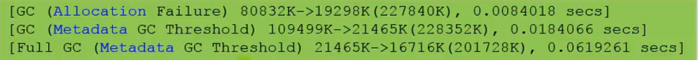
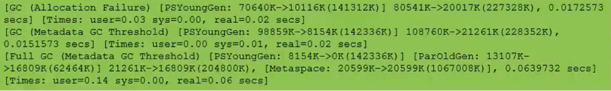
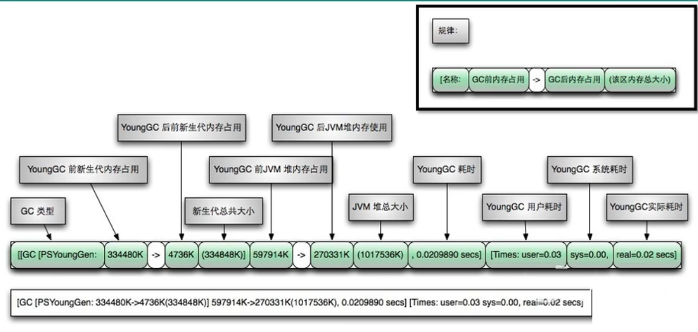
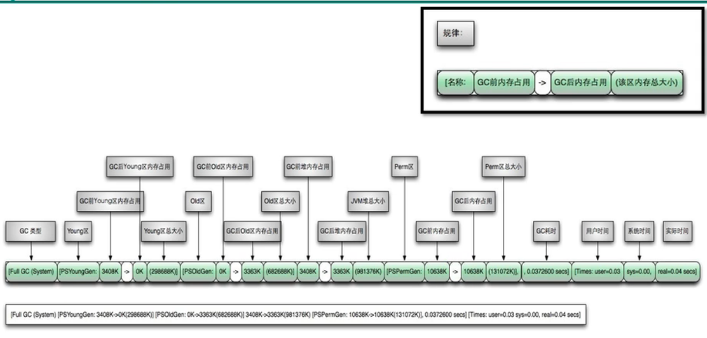
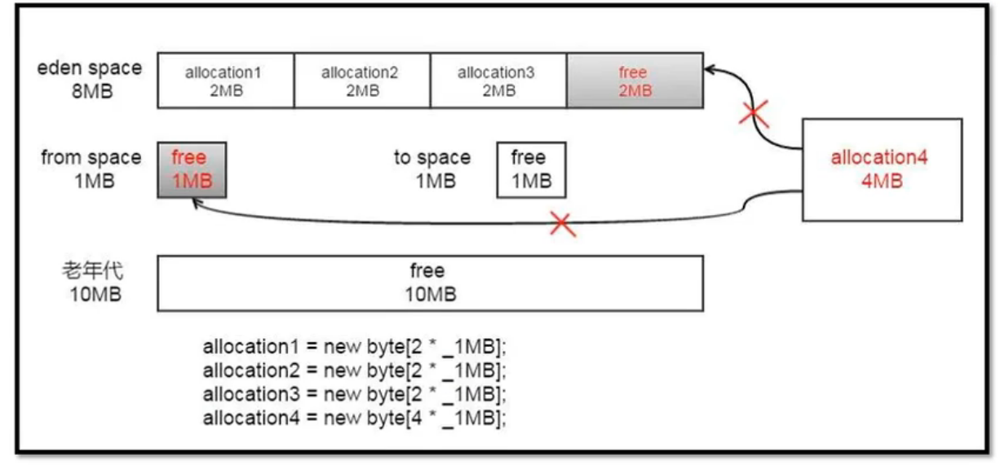
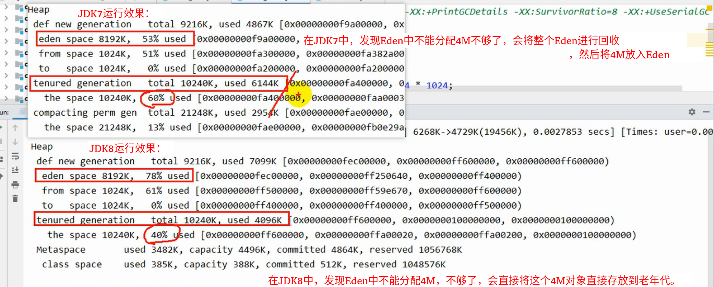

# GC日志分析

## 打卡GC日志参数

```java
/**
 *
 * vm args: -xms60m -xmx60m -XX:SurvivorRatio=8 -XX:+PrintGCDetails -Xloggc:./logs/gc.log
 *
 */
public class GCLogTest {
    public static void main(String[] args) {
        ArrayList<byte[]> list = new ArrayList<>();
        
        for(int i=0; i<500; i++) {
            byte[] arr = new byte[1024*100];//100kb
            list.add(arr);
//            try {
//                Thread.sleep(50);
//            } catch (InterruptedException e) {
//                e.printStackTrace();
//            }
        }
    }
}
```

通过阅读GC日志，我们可以了解Java虚拟机内存分配与回收策略。

**内存分配与垃圾回收的参数列表：**

-XX:+PrintGC							输出GC日志。类似: -verbose:gc

-XX:+PrintGCDetails				输出GC的详细日志

-XX:+PrintGCTimeStamps		输出GC的时间戳（以基准时间的形式）

-XX:+PrintGCDateStamps		输出GC的时间戳（以日期的形式，如2013-05-04T21:53:59.234+0800）

-XX:+PrintHeapAtGC				在进行GC的前后打印出堆的信息。

-Xloggc:./logs/gc.log  			日志文件的输出路径


## 分析1

打开GC日志：

-verbose:gc

这个只会显示总的GC堆的变化，如下：



参数解析：

GC、Full GC：GC的类型，GC只在新生代进行，Full GC包括永生代、新生代、老年代。

Allocation failure：GC发生的原因。

80832K->19298K：堆在GC前的大小和GC后的大小。

228840K：现在的堆的大小。

0.0084018 secs：GC持续的时间。


## 分析2

打开GC日志：

-verbose:gc -XX:+PrintGCDetails

输出信息如下：



参数解析：

GC、Full GC：GC的类型，GC只在新生代进行，Full GC包括永生代、新生代、老年代。

Allocation failure：GC发生的原因。

PSYoungGen：使用了Parralel Scavenge并行垃圾收集器的新时代GC前后大小的变化。

ParOldGen：使用了Parallel Old并行垃圾收集器的老年代GC前后大小的变化。

Metaspace：元数据区GC前后大小的变化，JDK1.8中引入了元数据区以替代永久代。

XXX secs：指GC花费的时间。

Times：user：指的是垃圾收集器花费的所有CPU时间，sys：花费在等待系统调用或系统事件的时间，real ：GC从开始到结束的时间，包括其他进程占用时间片的实际时间。


## 日志补充说明

- "[GC"和"[Full GC"说明了这次垃圾收集的停顿类型，如果有"Full"则说明GC发生了"Stop-The-World。
- 使用 Serial收集器在新生代的名字是 Default New Generation，因此显示的是"[DefNew"。
- 使用 ParNew收集器在新生代的名字会变成"[ParNew"，意思是"Parallel New Generation。
- 使用Parallel Scavenge收集器在新生代的名字是"[PSYoungGen"。
- 老年代的收集和新生代道理一样，名字也是收集器决定的使用G1收集器的话，会显示为" garbage-first heap"。
- Allocation Failure表明本次引起GC的原因是因为在年轻代中没有足够的空间能够存储新的数据了。
- [PSYoungGen:5986K->696K(8704K)] 5986K->704K(9216K)中括号内:GC回收前年轻代大小，回收后大小，(年轻代总大小)括号外:GC回收前年轻代和老年代大小，回收后大小，(年轻代和老年代总大小)
- user代表用户态回收耗时，sys内核态回收耗时，real实际耗时。由于多核的原因，时间总和可能会超过rea1时间






## 分析3

```java
// -verbose:gc -Xms20M -Xmx20M -Xmn10M -XX:+PrintGCDetails -XX:SurvivorRatio=8 -XX:+UseSerialGC
public class GCLogTest1 {
    private static final int _1MB = 1024*1024;
    
    public static void testAllocation() {
        byte[] allocation1, allocation2, allocation3, allocation4;
        allocation1 = new byte[2 * _1MB];
        allocation2 = new byte[2 * _1MB];
        allocation3 = new byte[2 * _1MB];
        allocation4 = new byte[4 * _1MB];
    }
    
    public static void main(String[] args) {
        testAllocation();
    }
}
```

堆分配情况：



运行效果：




## GC日志到文件

> +Xloggc:/path/to/gc.log

## GC日志分析工具

可以使用一些工具去分析这些GC日志。

常用的日志分析工具有：GCViewer、GCEasy、GCHisto、GCLogViewer、Hpjmeter、garbagecat等。

### GCEasy

​	[GCeasy 在线日志解析](https://gceasy.io/)

   [GC日志可视化分析工具GCeasy和GCViewer](https://blog.csdn.net/u012988901/article/details/102791020)

### GCViewer

[GCViewer官网](https://www.tagtraum.com/gcviewer.html)

[用gcviewer分析gc日志](https://blog.csdn.net/u013213157/article/details/74687028)

