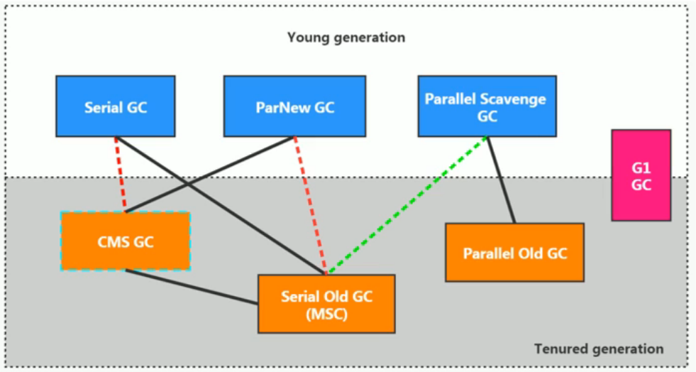

# 7种经典垃圾回收器总结

## 7中垃圾回收器

截止JDK1.8，一共有7款不同的垃圾收集器。每一款不同的垃圾收集器都有不同的特点，在具体使用的时候，需要根据具体的情况选用不同的垃圾收集器。

GC发展阶段：

​	Serial => Parallel（并行） => CMS（并发）=》G1 => ZGC

不同厂商、不同版本的虚拟机实现差别很大。HotSpot虚拟机在JDK7/8后所有收集器及组合（连线），如下图：(更新到了JDK14)

## 怎么选择垃圾回收期

Java垃圾收集器的配置对于JVM优化来说是一个很重要的选择，选择合适的垃圾收集器可以让JVM的性能有一个很大的提升。

怎么选择垃圾收集器?

1.优先调整堆的大小让JVM自适应完成。

2.如果内存小于108M，使用串行收集器。

3.如果是单核、单机程序，并且没有停顿时间的要求，串行收集器。

4.如果是多CPU、需要高吞吐量、允许停顿时间超过1秒，选择并行或者JVM自己选择

5.如果是多CPU、追求低停顿时间，需快速响应(比如延迟不能超过1秒，如互联网应用)，使用并发收集器。

官方推荐G1，性能高。**现在互联网的项目，基本都是使用G1。**

**最后需要明确一个观点:**

1.没有最好的收集器，更没有万能的收集;

2.调优永远是针对特定场景、特定需求，不存在一劳永逸的收集器。

## 各版本jdk默认垃圾收集器

jdk1.7 默认垃圾收集器Parallel Scavenge（新生代）+Parallel Old（老年代）。

jdk1.8 默认垃圾收集器Parallel Scavenge（新生代）+Parallel Old（老年代）。

jdk1.9 默认垃圾收集器G1。

-XX:+PrintCommandLineFlags  jvm参数可查看默认设置收集器类型

-XX:+PrintGCDetails亦可通过打印的GC日志的新生代、老年代名称判断

## 面试

- 对于垃圾收集，面试官可以循序渐进从理论、实践各种角度深入，也未必是要求面试者什么都懂。但如果你懂得原理，一定会成为面试中的加分项。这里较通用、基础性的部分如下:
  - 垃圾收集的算法有哪些?如何判断一个对象是否可以回收?
  - 垃圾收集器工作的基本流程。
- 另外，大家需要多关注垃圾回收器这一章的各种常用的参数。