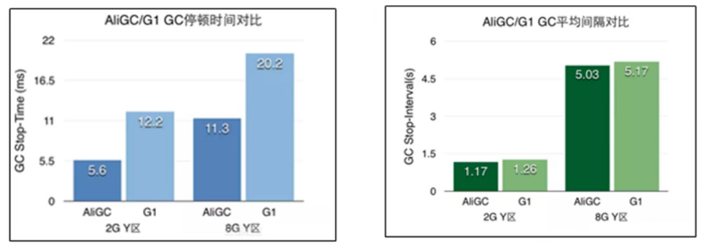
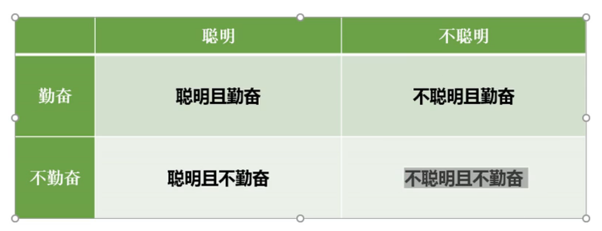

# 其它垃圾回收器

## ZGC

## Shenandoah

## AliGC

​	AliGC是阿里巴巴JVM团队基于G1算法，面向大堆（LargeHeap）应用场景。指定场景下的对比：

## Zing

当然，其他厂商也提供了各种独具一格的GC实现，例如比较有名的低延迟GC，Zing（https://www.infoq.com/articles/azul_gc_in_detail），有兴趣可以参考提供的链接。

## 其它

## 最后寄语

# 选择大于努力！

​		人工智能、AI、大数据、5G、物联网、云计算。