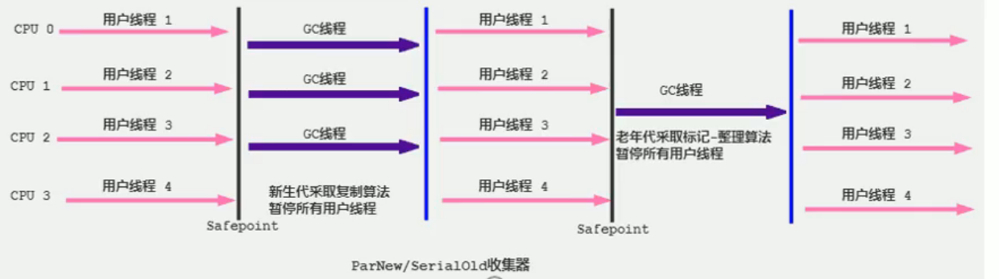

# ParNew回收器：并行回收

## 概述

- 如果说 Serial GC是年轻代中的单线程垃圾收集器，那么 ParNew收集器则是 Serial收集器的多线程版本。
  - Par是Parallel的缩写，New:只能处理的是新生代。
- ParNew收集器除了采用并行回收的方式执行内存回收外，两款垃圾收集器之间几乎没有任何区别。 ParNew收集器在年轻代中同样也是采用复制算法、"stop-the- World"机制。
- ParNew是很多JVM运行在 Server模式下新生代的默认垃圾收集器。



- 对于新生代，回收次数频繁，使用并行方式高效。

- 对于老年代，回收次数少，使用串行方式节省资源。(CPU并行需要切换线程，串行可以省去切换线程的资源)
- 由于 ParNew收集器是基于并行回收，那么是否可以断定 ParNew收集器的回收效率在任何场景下都会比 Serial收集器更高效?
  - ParNew收集器运行在多CPU的环境下，由于可以充分利用多CPU、多核心等物理硬件资源优势，可以更快速地完成垃圾收集，提升程序的吞吐量。
  - 但是在单个CPU的环境下， ParNew收集器不比 Serial收集器更高效。虽然 Serial收集器是基于串行回收，但是由于CPU不需要频繁地做任务切换，因此可以有效避免多线程交互过程中产生的一些额外开销
- 因为除 Serial外，目前只有 ParNew GC能与CMS收集器配合工作
- 在程序中,开发人员可以通过选项"-XX:+UseParNewGC"手动指定使用Parnew收集器执行内存回收任务。它表示年轻代使用并行收集器,不影响老年代
- -XX:ParallelGCThreads限制线程数量,默认开启和CPU数据相同的线程数

```java
/**
* vm args: -XX:+PrintCommandLineFlags  可以看到 +XX:+UsexxxxxGC是使用的上面GC
* hotspot中，使用-XX:+UseParNewGC参数，新时代使用并行垃圾收集器。
* -XX:+UseConcMarkSweepGC 老年代使用CMS GC。
*/
public class GCUseTest{
    public static void main(String[] args) {
        ArrayList<byte[]> list = new ArrayList();
        
        while(true){
            byte[] arr = new byte[100];
            list.add(arr);
            try {
                Thread.sleep(10);
            } catch (InterruptedException e) {
                e.printStacktrace();
            }
        }
    }
}
```

