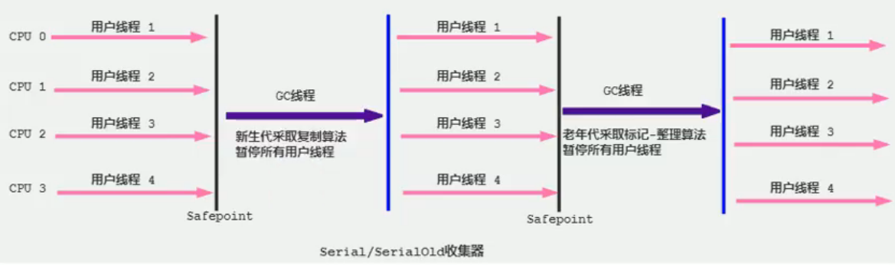

# serial回收器：串行回收

## 概述

- Serial收集器是最基本、历史最悠久的垃圾收集器了。JDK1.3之前回收新生代唯一的选择。
- Serial收集器作为 Hot spot中 client模式下的默认新生代垃圾收集器
- Seria1收集器采用复制算法、串行回收和"stop-the- World"机制的方式执行内存回收。
- 除了年轻代之外， Serial收集器还提供用于执行老年代垃圾收集的Serial old收集器。 Serial old收集器同样也采用了串行回收和" Stop the wor1d"机制，只不过内存回收算法使用的是**标记-压缩算法**
  - Serial Old是运行在C1ient模式下默认的老年代的垃圾回收器
  - Serial Old在 Server模式下主要有两个用途：①与新生代的Parallel Scavenge配合使用 ②作为老年代CMS收集器的后备垃圾收集方案



这个收集器是一个单线程的收集器，但它的“单线程”的意义并不仅仅说明它只会**使用一个CPU或一条收集线程去完成垃圾收集工作**，更重要的是在它进行垃圾收集时，**必须暂停其他所有的工作线程**，直到它收集结束( Stop The World)。

- 优势: 简单而高效(与其他收集器的单线程比)，对于限定单个CPU的环境来说， Seria1收集器由于没有线程交互的开销，专心做垃圾收集自然可以获得最高的单线程收集效率。
  - 运行在 Client模式下的虚拟机是个不错的选择。
- 在用户的桌面应用场景中，可用内存一般不大(几十MB至一两百MB)，可以在较短时间内完成垃圾收集(几十ms至一百多ms)，只要不频繁发生，使用串行回收器是可以接受的。
- 在 Hotspot虚拟机中，使用-XX:+UseSerialGC参数可以指定年轻代和老年代都使用串行收集器。等价于新生代用 Serial GC，且老年代用 Serial Old GC

```java
/**
* vm args: -XX:+PrintCommandLineFlags  可以看到 +XX:+UsexxxxxGC是使用的上面GC
* hotspot中，使用-XX:+UseSerialGC参数，新时代和老年代都使用串行收集器。
*/
public class GCUseTest{
    public static void main(String[] args) {
        ArrayList<byte[]> list = new ArrayList();
        
        while(true){
            byte[] arr = new byte[100];
            list.add(arr);
            try {
                Thread.sleep(10);
            } catch (InterruptedException e) {
                e.printStacktrace();
            }
        }
    }
}
```

## 总结：

   这种垃圾收集器大家了解，现在已经不用串行的了。而且在限定单核cpu才可以用。现在都不是单核的了。

   对于交互较强的应用而言，这种垃圾收集器是不能接受的。一般在Java web应用程序中是不会采用串行垃圾收集器的。